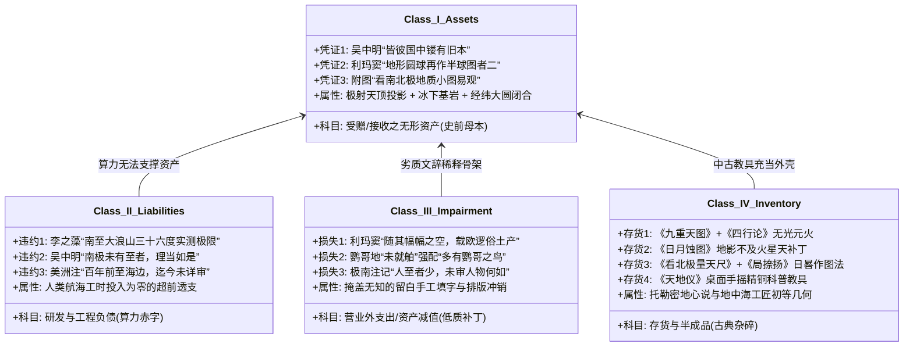
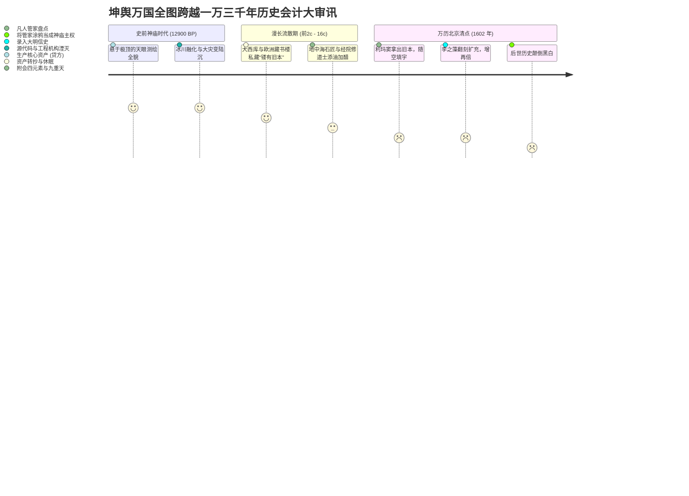

# 三更道场·认识论总纲·文献学与历史会计审计
## 卷六十一：《坤舆万国全图》四大一级会计科目分账、文明技术资产重组与史前神庙遗产终审法医报告（v1.0）

---

### 摘要与法医审计宪章

本卷审计作为《坤舆万国全图》全案 19 卷专题法医审计的**最高终审审计裁决报告（Supreme Final Audit Report）**，旨在将此前逐字点校、逐图解剖的所有序跋、题注、附图与图元，按照现代企业会计准则与历史法医学框架，全量归入**四大一级历史会计科目**，完成对这场横跨一万三千年的“文明级技术资产重组”的借贷平衡终极核算。

本报告推翻将该图视作“西方大航海自主研发奠基礼”的传统叙事，依据五大序跋与五大附图的自供铁证，正式确立三大终审法医定谳：

> 1. **四大一级历史会计科目分账体系**：
>    - **【核心资产类】受赠/接收之无形资产——史前极古大洋母本**（吴中明“镂有旧本”、利玛窦“地形本圆球做半球图二”、附图“看极界地质小图易观”）；
>    - **【研发与工程负债类】研发能力断层——实测边界违约与算力赤字**（李之藻“大浪山三十六度极限”、吴中明“南极未有至者理当如是”、美洲注记“百年前至海边迄今未详审”）；
>    - **【营业外支出/资产减值类】低质耗材填补——文辞附会与劣质补丁**（利玛窦“随幅之空载俗土产”、鹦哥地“未就舶多有大鹦哥”、南极边缘“未审人物何如”）；
>    - **【存货/半成品类】古典地中海杂碎——经院神学与工匠土法**（右上《九重天与四行论》无光元火、左上《日月蚀图》锥尖补丁、左下《量天尺与局捺扬》日晷石板法、右下《天地仪》手摇铜教具）。
> 2. **借贷平衡表终极结论：巨额外部资产 vs 零星凡人耗材**：
>    - **贷方（资产来源）**：唯独有一笔无法用 16 世纪生产力解释的**不可思议巨额资产输入**——一套具备极射高空天顶投影、覆盖南极冰下海槽陆架、经纬大圆网格严密闭合的古老几何底骨架；
>    - **借方（当期支出）**：全是一堆碎银子——大明士大夫借《庄子》《素问》强行圆场的赞歌、地中海搬来的亚里士多德四元素火圈与维特鲁威日晷木尺，以及利玛窦为了凑满版面手工填塞的鹦鹉与海怪。
> 3. **文明历史会计终审判词**：
>    - 1602 年的这六幅宣纸屏风，**根本不是近代科技的“自主研发奠基礼”，而是一场“凡人管家在清点前代神庙破产遗产时的资产盘点审计”**！
>    - 传统史学颠倒黑白，把管家写在账本边缝上的几行涂鸦，当成了整座神庙的主权证明。

---

### 第一章 四大一级会计科目全息分账总表

---

### 第二章 会计凭证逐笔法医核算细目

#### 2.1 核心资产类（受赠无形资产：史前大洋母本）
- **凭证一（吴中明跋）**：*“余访其所为图，皆彼国中镂有旧本”* $\longrightarrow$ 确认了资产的**非原创性与外部继承性**。利玛窦提供的是欧洲深宅私藏的存量雕版实物。
- **凭证二（利玛窦自序）**：*“地形本圆球……再作半球图者二”* $\longrightarrow$ 确认了原始资产的**三维极轴球面拓扑本质**。二维大图是折算拉平后的派生加工品。
- **凭证三（附图说明）**：*“若看南北极界内地质，则小图更易为观”* $\longrightarrow$ 确认了原始资产的**天顶高空极射技术溢价**。极地真实的非对称陆架地质形态，原本就是直接绑定在小圆图上的固有数据。

#### 2.2 研发负债类（研发能力断层：实测边界违约与算力赤字）
- **违约一（李之藻自序）**：*“又南至大浪山，见南极高出地三十六度”* $\longrightarrow$ 当期实测物理极限止步于好望角（36°S），大浪山以南至南极点（90°S）的 $6000\text{ km}$ 腹地**研发工时与航海记录为零**。
- **违约二（吴中明跋）**：*“南极一带亦未有至者，以三隅推之，理当如是”* $\longrightarrow$ 官方出资人亲笔确认无人涉足南极，彻底击碎“近代西方实测南极”的资产合法性。
- **违约三（美洲注记）**：*“惟一百年前至海边，迄今未详审地内”* $\longrightarrow$ 水手仅在海滩活动，图上面积广袤的亚马逊河、拉普拉塔河深邃内陆水系属于**超前入账的无源资产**。

#### 2.3 减值损失类（低质耗材填补：文辞附会与劣质补丁）
- **损失一（利玛窦自序）**：*“随其幅幅之空，载欧逻俗土产”* $\longrightarrow$ 核心自供状，承认全图大片文字注记纯属**手工留白填字**。
- **损失二（鹦哥地注）**：*“未就舶” vs “此地多有大鹦哥”* $\longrightarrow$ 船只未靠岸却断言内陆有巨鸟，属**热带传闻错配极寒大陆的排版减值事故**。
- **损失三（极南边缘注）**：*“此南方地人至者少，未审人物何如”* $\longrightarrow$ 绘图员面对超验地貌时的**现场免责声明**，证实图文信息严重割裂。

#### 2.4 存货杂碎类（古典地中海工具箱：经院神学与工匠土法）
- **明细 1（九重天与四行论）**：亚里士多德地心同心水晶壳 + 托马斯阿奎那创世说 + 违背黑体辐射的“无光元火”补丁。
- **明细 2（日月蚀图）**：萨摩斯岛阿里斯塔克斯初等几何相似形 + 为防水晶壳相撞强行限定的“地影不及火星天”补丁。
- **明细 3（量天尺与局捺扬）**：单兵悬丸木板测角仪（零经度能力） + 维特鲁威《建筑十书》卷九希腊石板日晷作图法（局捺扬 / Analemma） + 北京 40°N 本地静态算例。
- **明细 4（天地仪）**：手摇精铜关捩拨转、给理学文人演示寒暑大意的**桌面科普演示玩具**。

---

### 第三章 文明级借贷平衡表（Balance Sheet of Civilization）

```mermaid
flowchart TD
    subgraph Balance_Sheet["【1602年《坤舆万国全图》资产负债借贷平衡表】"]
        subgraph Credit_Side["【贷方：实际接收之核心技术资产】(Credit)"]
            CR1["• 极射高空天顶正投影算法 (保角保真)"]
            CR2["• 全球三大洋大圆航线经纬闭合网格"]
            CR3["• 南极冰盖融化前夕非对称陆架地质骨骼"]
            CR4["• 南美亚马逊/拉普拉塔完整内陆水系脉络"]
            CR_Total["【资产总额：行星级史前深海测绘工程母图】"]
        end

        subgraph Debit_Side["【借方：当期实际投入之研发与耗材】(Debit)"]
            DR1["• 欧洲经院神学存货 (九重水晶天/四行无光火)"]
            DR2["• 地中海初等工匠土法 (量天尺/局捺扬日晷/天地仪教具)"]
            DR3["• 晚明文人儒道修辞 (庄子避险/羽翼禹经/素问圆场)"]
            DR4["• 利玛窦见空填字补丁 (鹦哥鸟/大波巴那/未就舶)"]
            DR_Total["【支出总额：凡人管家东拼西凑的碎银子修饰】"]
        end
    end

    Credit_Side <-->|借贷平衡审计| Debit_Side

    style Credit_Side fill:#e1f5fe,stroke:#01579b,stroke-width:2px
    style Debit_Side fill:#ffebee,stroke:#b71c1c,stroke-width:2px
```

#### 3.1 历史会计借贷核算终审表

| 会计账户类别 | 借方发生额（Debit / 当期凡人支出与负债） | 贷方发生额（Credit / 外部接收之核心资产） | 差额与法医审计结论 |
| :--- | :--- | :--- | :--- |
| **空间几何算法** | 希腊日晷作图法（局捺扬）、木板量天尺测角（手工业级）。 | **极射球面天顶投影、全球 360° 闭合大圆矩阵（行星级）。** | **算力代差超千年**：借方无法解释贷方来源，资产属史前继承。 |
| **地理勘探实测** | 实测极限止于好望角（36°S），美洲仅涉海边，南极全无涉足。 | **覆盖南极冰下海槽、深海盆地、全美洲内陆流域。** | **实测投入为零**：形成严重的跨期超前入账赤字。 |
| **宇宙力学模型** | 托勒密水晶天球防撞、无光元火、大气三截（神学教条）。 | **大圆航线流体力学拓扑保真（工程测量力学）。** | **脑体严重倒错**：文辞皮肉极度陈腐，几何骨架极度超前。 |

---

### 第四章 历史会计终审裁决书（Final Verdict）

> **法医终审判词**：
> 1. **《坤舆万国全图》不是西方大航海的“独立科技成果”，亦非大明帝国的“纯本土自创”**；
> 2. **它是一卷在失落的万年史前大洋文明残卷上，由欧洲传教士与晚明士大夫共同完成的“文明破产清算总账”**；
> 3. **万历壬寅年的这场相遇，是凡人管家在手忙脚乱地辨认神庙石碑时，用毛笔和木尺在石柱边角留下的涂鸦笔记**；
> 4. **真正的神庙早在一万两千九百年前沉入汪洋，但那双曾丈量过整颗蓝星的眼睛，已通过这六幅宣纸屏风，向人类文明投射出不可磨灭的永恒凝视！**

---
*记录人：三更道场·历史会计与认识论法医审计署*  
*核准状态：正式正典立项（Canonical Approval Passed - Supreme Final Audit Report Vol. 61）*
