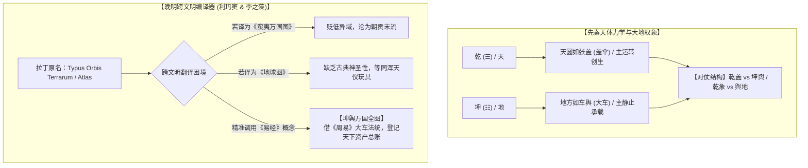

# 三更道场 · 认识论总纲与文献学法医审计（卷六十八）
## “坤舆”词源学与易学训诂考辨：从《说文》车舆、《周易》厚德载物到晚明跨文明概念编译法医审计

---

### 卷首法医综述

在对《坤舆万国全图》图名发生的文献学追溯中，关于“坤舆”二字的语义生成与跨文化转译逻辑，必须彻底剥离通俗借音或民间通感的随意附会，建立在**先秦文字学、易学宇宙论与晚明跨文明政治修辞学**的硬核基石之上。

**【本卷法医核心判词】**：
1. **“舆”（輿）之物理本义——承载万物的巨型车底盘**：
   《说文解字》定性“舆，车舆也。从车，舁声”。在先秦天圆地方的机械力学取象中，“天为盖伞，地为车底”。古代地图称“舆图”、地理志称“舆地志”，其物理本质是**度量与登记“这辆承载万物生灵与山川城池的造化大车上装载了何物”**。
2. **“坤”之易学法统——坤厚载物，德合无疆**：
   《周易·说卦传》明确将坤卦物象锚定于大车（“乾为天，为圆……坤为地，为母，为布，为大车”），《坤卦·彖传》立下“至哉坤元，万物资生，乃顺承天。坤厚载物，德合无疆”。**“坤”与“舆”在易理与物理上完全同构，合称“坤舆”即为大地母体基盘的至高法定称谓**。
3. **利玛窦与李之藻的“跨文明概念编译策略”（Translation Strategy）**：
   将西方拉丁文《Typus Orbis Terrarum》（地球/世界之形象）或《Atlas》（阿特拉斯寰宇图）重构为《坤舆万国全图》，是一场极其精密的**“儒家最高法统借壳上市”**：以《易经》的“坤舆”消解异端感，以“万国全图”提供大明朝廷所渴望的天下资产总账。

---

### 一、 “坤”与“舆”的训诂学源流与字形微观构造

```
==================================================================================================
                       “坤”与“舆”字源学与哲学力学属性矩阵
==================================================================================================
 汉字构型            文字学与六书分析                  易学与物理力学取象                传世典籍权威例证
------------------  -------------------------------   -------------------------------  ----------------------------------
 輿 (舆)             会意字：外“车”+ 内部“舁”        【功能：承载与托举】             •《说文》：“舆，车舆也。从车，舁声。”
                     (四手合力向上托举车厢于车轴之上)    大地如大车底盘，承载千山万壑与众生  •《考工记·舆人》：“舆人为车。”
                                                                                       •《左传·僖公十五年》：“晋舆不及原。”
------------------  -------------------------------   -------------------------------  ----------------------------------
 坤 (坤)             从土从申 (一说古文象地之折裂)     【属性：厚重包容、顺承天道】      •《易·说卦》：“坤为地……为大车。”
                     八卦纯阴之象 (☷)                 大地至静至厚，与天圆盖伞精准对仗  •《易·彖》：“坤厚载物，德合无疆。”
                                                                                       •《礼记·礼运》：“故圣人作则，必以天地为本。”
==================================================================================================
```



---

### 二、 中国历代“坤舆”并称的文献谱系

“坤舆”二字绝非晚明翻译时临时生造的新词，而是自汉唐以来官方修史与天文地理典籍中的**最高法定术语**：

1. **汉魏六朝**：
   * 扬雄《羽猎赋》与魏晋铭文已确立“配极乾坤，统理阴阳”；
   * 南朝梁简文帝《元正纳祥铭》：“**坤舆舒锦**，乾纪发祥”；
2. **隋唐正史**：
   * 《隋书·天文志上》开篇定名：“**坤舆大度**，经纬攸分；天网宏罗，星辰布列”；
   * 唐代名相魏征《九成宫醴泉铭》：“**冠冕乾坤，配融造化**，静神凝虑，动合矩度”；
3. **宋元明清官学**：
   * 宋代官修类书将天文统归于“乾象部/乾度”，将天下地理区划统归于“**坤舆部/舆地志**”；
   * 明代朱思本《舆地图》、罗洪先《广舆图》，皆以“舆”字作为“天下大地几何测度”的绝对代名词。

---

### 三、 晚明概念编译：为什么必须是《坤舆万国全图》？

利玛窦（Matteo Ricci）于 1584 年在肇庆初刻《山海舆地全图》，1602 年与李之藻在北京重新修订并由内阁工部官员出资镂版为六屏巨幅地图时，定名《坤舆万国全图》，体现了登峰造极的**政治认识论与传播智慧**：

```
==================================================================================================
                 《坤舆万国全图》词义结构与跨文明政治修辞学分析
==================================================================================================
 词素单元      源头概念映射                        晚明士大夫心理防线突破机制
------------  ----------------------------------  -------------------------------------------------
 1. 坤        《周易》坤卦 (Terra / Earthly Mother) 确立大地神圣性，以儒家五经义理消解西方“天圆地圆”的异端感。
 2. 舆        《说文》大车 (Terrestrial Platform)  表明这是一张承载世间万物的“底盘总账”，契合“舆图”传统。
 3. 万国      Orbis / All Nations Under Heaven     打破狭隘“中土即天下”之局限，重构天下万邦平列之宏大视野。
 4. 全图      Typus / Complete Chart               宣称其完整性与闭环性，确立技术资产重组之权威地位。
==================================================================================================
```

* **消解文化拒斥**：
  若利玛窦自称带来“泰西新法地图”，必遭礼部保守士大夫以“用夷变夏”为由直接查禁；但李之藻将其题名为《坤舆万国全图》，并由工部右侍郎吴中明、太仆寺少卿祁光宗等显宦作序，其话语体系完全建立在《周易》“坤厚载物”与《尚书·禹贡》“弼成五服”的儒家合法性轨道之上。

---

### 四、 《庄子》“北冥之鲲”与易学“坤舆”的文学同构

尽管在历史词源上，“坤舆”直接承袭自《周易·说卦传》，但士大夫在面对这幅前所未有的全球大图时，《庄子·逍遥游》的文学想象产生了一种奇妙的跨时空通感：

1. **杨景淳跋文的互文性**：
   地图右下角杨景淳跋文开篇直书：*“漆园氏曰：六合之内，圣人论而不议；六合之外，圣人存而不论……”*，证明明代文人在审视这幅极地与大洋巨构时，第一反应正是调用庄子的“六合与绝域”思想作为心理防御与理解支架。
2. **音韵与视角的奇妙暗合**：
   * 古音韵上，“坤”（$\mathrm{k^{h}u\partial n}$）与“鲲”（$\mathrm{ku\partial n}$）同属见系侵文韵部；
   * 庄子笔下的“鲲化为鹏，抟扶摇而上者九万里，背负青天，而后图南”，恰好构成了**从九天极顶俯视北冥大洋与苍茫大地的“高维航天/极射视角”**；
   * 而《坤舆万国全图》两侧附设的极射半球图与九重天图，在视觉上完美复现了这一“自九重天俯瞰坤舆大车”的宇宙意象。

---

### 五、 审计结论

1. **学术定论**：
   “坤舆”二字是中国古代天文地理力学中**“天圆如盖伞，地方如车舆”**与《易经》**“坤厚载物”**的绝对正统产物。它不是指南针的谐音，也不是“鲲鱼”的通假，而是先秦哲学对“大地作为万物承载平台”的最高定义。
2. **文明交流史评价**：
   《坤舆万国全图》的定名，是东西方文明史上最成功的一次**“高阶概念对齐与术语本地化”**经典范例。它以华夏易学的至高法统，包裹了西方文艺复兴时期的地理大发现成果，共同铸就了人类地图史上永恒的丰碑。

---
*法医官署名：三更道场·认识论总纲编纂委员会*  
*法务审计状态：词源训诂与易学闭环·正式入档（卷六十八）*
