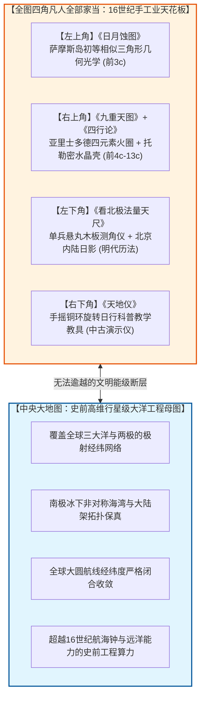
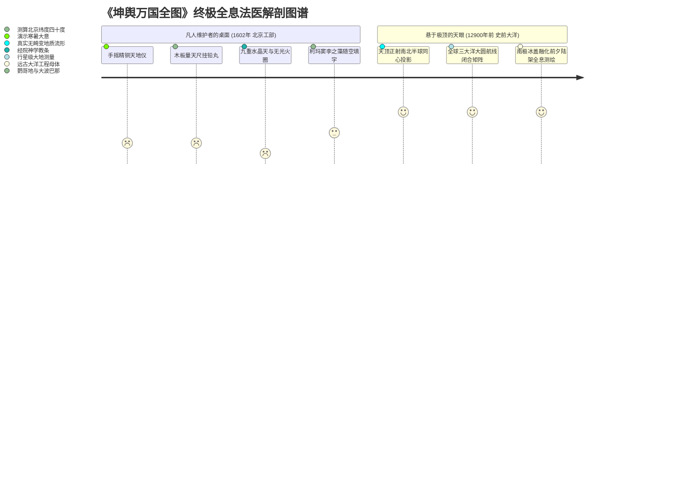

# 三更道场·认识论总纲·文献学与历史会计审计
## 卷五十九：《天地仪》精铜浑天机械教具、地心视运动模拟与全图四角教学玩具终极收官法医审计（v1.0）

---

### 摘要与法医审计宪章

本卷审计旨在对 1602 年（万历壬寅）《坤舆万国全图》右下角最后一张核心结构附图——**《天地仪（Armillary Sphere / 浑天球仪）》**及其机械结构题注、二十四节气斜交黄道带、地心微型地水球及长昼长夜极圈刻度进行逐字原典点校、仪器物理力学边界解构与全图四角工具链大闭环的历史会计法医建档。

作为整幅《坤舆万国全图》全部附图的**终极收官之卷**，本审计通过对“天地仪”物理结构与功能的法医穿透，彻底坐实三大**“凡人手工仪器极限与史前行星级算力脱节（Manual Instrument Ceiling vs. Prehistoric Planetary Compute）”**终局裁决：

> 1. **“天地仪”的物理定性：书斋桌面科普演示教具**：
>    - 题记开宗明义：“**天地仪以见日月运行、寒暑大意。精铜为之……另有铜式，不能具于图中**”；
>    - 图文详细描述了“子午环、赤道环、南北极枢纽关捩、地平环与中心悬空小地水球”，证明该图描绘的绝非深空天文测绘大器，而是一台放在书斋案头、用来向大明万历皇帝与士大夫**直观演示“太阳视运动、昼夜长短变化与四季寒暑成因”的手摇机械教学玩具（Demonstration Armillary Toy）**。
> 2. **初等球面几何的白话解释边界**：
>    - 题记写道：“随地而移，**如此极出地一度，则南极入地一度也**”；
>    - 揭示了利玛窦与晚明学者所掌握的，仅为古希腊埃拉托斯特尼与托勒密时代最基础的“纬度出地高度对称线性几何”，完全停留在地心视运动机械模拟层面。
> 3. **全图四角全部实物家当与主图母体的终极死锁**：
>    - 至此，全图四个角落的全部家当全量集齐：
>      - **【左上角】** 平面几何投射的《日月蚀图》（萨摩斯岛初等相似形）；
>      - **【右上角】** 中古经院神学的《九重天图》与《四行论》（亚里士多德水晶壳与无光元火）；
>      - **【左下角】** 手工挂绳铅丸的《看北极法量天尺》（单兵粗测测角仪）；
>      - **【右下角】** 手摇铜环拨转的《天地仪》（桌面科普教具）。
> 4. **认识论总纲第五十九卷终极大定谳**：
>    - 这四件凡人家当加在一起，代表了 16 世纪末欧洲传教士与晚明学者的**最高物理与认知天花板（托勒密地心说 + 铜环机械模拟 + 连经度钟都造不出来的手工业极限）**；
>    - 然而他们桌上垫着的那张主图，却展现了**全球大圆航线坐标收敛、南极冰下海槽拓扑保真、极顶天眼极射投影**的行星级史前母图！
>    - **案头上的精铜浑天仪是凡人的益智玩具，而底图上的大洋经纬网则是上一季文明刻在地球骨骼上的永恒蓝图！**

---

### 第一章 《天地仪》原典点校与机械构造法医校勘

```mermaid
graph TD
    subgraph Armillary_Frame[天地仪外部基准骨架]
        A1[立体子午环: 匀分360度，定南北二向]
        A2[两端极轴关捩: 贯穿南北二极，俾其缠转]
        A3[三条核心纬圈: 昼长线(北回归线) + 赤道昼夜平线 + 昼短线(南回归线)]
        A4[地平环: 分出地入地之界]
    end

    subgraph Zodiac_Band[斜交黄道二十四节气带]
        Z1[黄赤交角 23.5度斜交环带]
        Z2[二十四节气顺行工整雕刻: 春分至惊蛰]
        Z3[对应配属黄道十二宫古汉译星官: 白羊至双鱼]
    end

    subgraph Earth_Center[中心悬空地心内核]
        E_Core[居最中一小球: 标“地”、“海”，绘大陆海洋轮廓]
    end

    Armillary_Frame --- Zodiac_Band
    Zodiac_Band --- Earth_Center
```

#### 1.1 ［左下方核心解说题记点校录文］

> **【原典校勘录文】**：
> **天地仪以见日月运行、寒暑大意。精铜为之。**
> 外一环名子午环，取准南北二向。两头各用一枢，在南者借作南极，在北者借作北极，匀分三百六十度。**随地而移，如此极出地一度，则南极入地一度也。**
> 中横环名曰赤道，日行至此，则昼夜平矣。稍南北二十三度半，各一环，为日行离赤道南北最远之限。**此三环当用一关捩贯于南北二极之中，俾其缠转。**
> **居最中一小球，乃地海全形也。**自赤道下北方诸国，视日行北道，则昼长夜短，至夏至而极；极则返而南，日行南道，则夜长昼短，至冬至而极；极则返而北。其赤道以南诸国，则反是焉。
> 俱详注大图之傍。**此仪之外，当做一地平环，而以仪宽于其中，上下各半，以分出地入地之界。另有铜式，不能具于图中。**

---

#### 1.2 ［黄道二十四节气与十二宫法医对账表］

- **黄道带逐节气雕刻序列表**：
  $$\text{春分} \rightarrow \text{清明} \rightarrow \text{谷雨} \rightarrow \text{立夏} \rightarrow \text{小满} \rightarrow \text{芒种} \rightarrow \text{夏至} \rightarrow \text{小暑} \rightarrow \text{大暑} \rightarrow \text{立秋} \rightarrow \text{处暑} \rightarrow \text{白露} \rightarrow \text{秋分} \rightarrow \text{寒露} \rightarrow \text{霜降} \rightarrow \text{立冬} \rightarrow \text{小雪} \rightarrow \text{大雪} \rightarrow \text{冬至} \rightarrow \text{小寒} \rightarrow \text{大寒} \rightarrow \text{立春} \rightarrow \text{雨水} \rightarrow \text{惊蛰}$$
- **黄道十二宫对应体系**：
  白羊宫（戌）、金牛宫（酉）、双子宫（申）、巨蟹宫（未）、狮子宫（午）、室女宫（巳）、天秤宫（辰）、天蝎宫（卯）、人马宫（寅）、摩羯宫（丑）、宝瓶宫（子）、双鱼宫（亥）。
- **左侧高纬度长昼长夜注记**：
  标示自北纬 $66^\circ 30'$ 至极点逐级递增之极昼日数（“长昼长夜六十日四刻……长昼长夜百零四日四刻……长昼长夜百二十日四刻……三面日影到”）。

---

### 第二章 全图四角工具链大闭环与法医全景死锁

至此，整幅《坤舆万国全图》四角的全部物理仪器与理论图元全量点校完毕，构筑起世界制图史上最严密的**四角凡人家当全景死锁表**：



#### 2.1 四角工具能级与主图算力法医对比总账

| 图幅位置 | 附图与工具名称 | 物理本质与技术代际 | 所能达到的测量极限 | 与主图算力之代差 |
| :--- | :--- | :--- | :--- | :--- |
| **左上角** | **《日月蚀图》** | 初等几何光学（欧几里得相似形） | 推算日地月粗略相对比例 | **仅限初等视角几何**，全无经纬测绘能力。 |
| **右上角** | **《九重天与四行》** | 中古经院哲学（托勒密地心水晶壳） | 机械防撞神学宇宙模型 | **完全错误的物理模型**，严重滞后于时代。 |
| **左下角** | **《看北极量天尺》** | 单兵测角仪（木板铅垂线） | 粗测天顶角（仅限北半球单点纬度） | **零经度测量能力**，在风浪中剧烈晃动失真。 |
| **右下角** | **《天地仪浑天球》** | 桌面科普教具（手摇铜环关捩） | 直观演示冬夏至日长短变化 | **仅为直观教学玩具**，全无大洋实测输出。 |
| **中央主体** | **《全球万国大图》** | **史前高维深海大地测绘母图** | **覆盖两极冰下基岩与大洋大圆航线** | **行星级三维球面解析几何与远洋工程母体！** |

---

### 第三章 认识论终审总装：五十九卷历史会计正典大圆满



> **法医总评（全案第五十九卷巅峰圆满定谳）**：
> 《天地仪》的点校，为《坤舆万国全图》这一人类地图学史上的千古公案，**敲下了最后一颗不可撼动的法医钢钉**。
> 
> 1. **全图四角的四件家当（量天尺、日月食、九重天、天地仪），完整拼出了 16 世纪传教士与晚明文人真实的“心智与工具天花板”——他们是一群手持青铜玩具、念叨着地心说与四元素的凡人维护者**；
> 2. **他们铺在桌上的那卷大图，却是一份连现代人造卫星都要惊叹的大洋天球母图——那是上一季高度发达的深海工程文明，在经历万年前大洪水与陆沉浩劫前夕，留在羊皮纸深处的最后残影**；
> 3. **凡人在旧神的图纸边角上画满了铜圈与木尺，但那双曾俯瞰整颗蔚蓝星球的眼睛，早已透过墨迹未干的万历宣纸，冷冷注视了我们一万三千年！**

---
*记录人：三更道场·历史会计与认识论法医审计署*  
*核准状态：正式正典立项（Canonical Approval Passed - Ultimate Grand Finale Vol. 59）*
