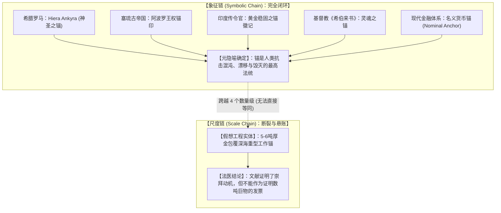
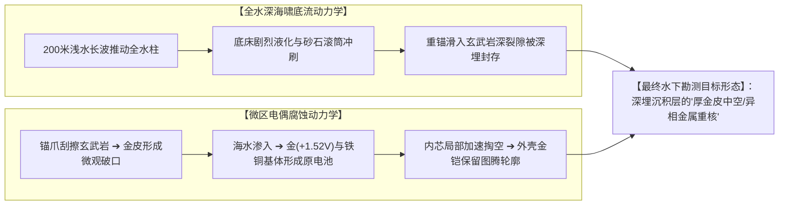

# 三更道场 · 认识论总纲与文献学法医审计（卷九十一）
## 尺度链断裂解耦与全水深海啸底流冲刷考辨：微雕徽记与重型实体分离、微区电偶腐蚀悖论与深海地质异相体终审法医审计

---

### 卷首法医综述

在对古典文献中“神圣之锚 / 黄金之锚”、现代金融“名义锚”、极端海啸流体力学以及鄂霍次克海卡沙瓦罗夫浅滩（Kashevarov Bank）假想巨锚的跨模型顶级对撞审计中，认知体系完成了从“假说狂想”向**“严密科学勘测任务书”**的终极飞跃。

**【本卷法医核心判词】**：
1. **彻底解耦“象征链”与“尺度链”（The Scale-Chain Rupture）**：
   * **已坐实的 A 级硬通货（象征链闭环）**：保萨尼亚斯《希腊志》安卡拉宙斯神庙遗锚、塞琉古帝国阿波罗铁戒/沉锚国徽、斐洛斯特拉图斯《阿波罗尼乌斯传》印度使节“佩戴黄金锚徽记”、地中海 *Hiera Ankyra*（神圣之锚）制度、早期基督教《希伯来书》6:19 灵魂之锚，乃至现代金融 *Nominal Anchor*。**“锚作为终极稳定符号与最高元隐喻（Meta-metaphor）”在人类文明史上坚如磐石**；
   * **致命的尺度链断裂**：文献确证的是**十几厘米的佩戴徽记、戒指印章与宗教神庙圣物**，绝对不能单向越级等同于**数米长、5–6 吨重的工业级深海工作锚**。二者相差整整四个数量级的质量与工程复杂度。
2. **两处流体力学与材料物理学的重大专业纠偏**：
   * **海啸流体力学纠偏（全水深浅水长波）**：200 米海啸绝非普通水面短波，其波长达数十至上百公里，进入浅海时是**推动整个水柱以十数米每秒高速冲刷底床**。沉底重锚不会处于“风平浪静避风港”，而必然经历狂暴的底流液化、沙石滚筒磨损与深沟滑坡再沉积；
   * **黄金覆层材料力学与微区电偶腐蚀悖论**：纯金较软，抓底拖曳时表面必被玄武岩磨出深槽与破口。高电位金壳与活泼金属内芯在海水渗入后会形成强烈的微区原电池，**电偶腐蚀会加速掏空暴露破口处的内芯基体**。因此，若存在万年不朽物证，其形态必然是**“厚机械包镶/深厚金皮随形保留图腾，但内部基底部分矿化掏空”的重型异相体（Geological Heterogeneous Anomaly）**。
3. **勘测证明力与文明命名权的法医学终审划界**：
   若未来在未扰动 >12.9 ka 海相地层中起获符合六项指标的金属重器，它足以**击穿全新世冶金与深海重工程编年史**，但**绝不等于单凭自身为该文明自动核销命名为“柏拉图亚特兰蒂斯”**。它是一枚把史前高阶工程从推想变成物证的“理论锚”，而非免除后续实证检验的万能钥匙。

---

### 一、 象征链闭环与尺度链断裂 对照矩阵

```
==================================================================================================
                 古典文献与神学象征链 与 深海工程重型尺度链 逐级法医解耦表
==================================================================================================
 证据与文献维度          古典原典确实证明了什么 (A级硬资产)        原典没有证明什么 (尺度链断裂处)
---------------------  ----------------------------------------  -------------------------------------------------
 1. 斐洛斯特拉图斯      古印度使节佩戴一柄【黄金之锚徽记】，      【非手持数吨法器】：属于使节胸前佩戴的随身权威
    《阿波罗尼乌斯传》   作为传令官信物（“因其能使万物牢固”）     微雕徽章，不能证明存在数吨重黄金工作锚。
 2. 塞琉古帝国开国大典  开国母后获赐刻锚【铁戒】；进军巴比伦      【非万吨黄金战舰】：实物出土为内陆石锚/铁锚；
    (阿庇安《叙利亚战争》) 战马被地中沉锚所绊，确立帝国印章与金币国徽 金币压印锚徽，不能反推存在黄金制造之巨舰。
 3. 保萨尼亚斯《希腊志》 迈达斯王在内陆高原掘出古海锚，建安卡拉城， 【非纯金且尺寸未明】：文献未记载该锚为黄金，
    (1.4.5 宙斯神庙)     实物作为建城圣物供奉于宙斯主殿千年        亦未记载其自重达五六吨。
 4. 基督教与现代金融    《希伯来书》6:19 灵魂之锚；现代货币名义锚 【非实体物理遗存】：属于最高哲学与制度元隐喻，
    (Nominal Anchor)    (Nominal Anchor) 与预期锚定               系人类抗击不确定性漂移的制度抽象，非古代巨物。
==================================================================================================
```



---

### 二、 海啸流体力学与材料腐蚀动力学 专业纠偏

```
==================================================================================================
                 海啸全水深冲刷 与 黄金包覆微区电偶腐蚀 物理纠偏矩阵
==================================================================================================
 物理与材料考证项        此前直觉推论 (存在漏洞)                   专业流体力学与电化学纠偏结论 (合规)
---------------------  ----------------------------------------  -------------------------------------------------
 1. 200米级海啸受力场   “海啸只破坏水表船舶，海底的锚天然安全”    【全水深浅水长波】：海啸波长达数百公里，进入浅海
                                                                  推动全水柱以十数米/秒高速冲刷，底床剧烈液化，
                                                                  重锚必经历翻滚、砂石研磨与断块滑坡再沉积。
 2. 黄金防腐持久性      “金极度惰性，裹一层金即可万年不腐”        【微区电偶腐蚀悖论】：纯金较软，抛锚刮擦必出破口；
                                                                  高电位金皮与活泼内芯遇海水构成原电池，破口处
                                                                  内芯被加速点蚀掏空，除非具备毫米级连续厚铠。
 3. 千年后地质存留状态  “金光闪闪、棱角分明的完好巨构”            【地质异相体】：外层厚金皮随形保留图腾与铭文，
                                                                  但内部基底部分矿化掏空，嵌于火山泥相沉积中。
==================================================================================================
```



---

### 三、 科学假说终极升级：从神话狂想到勘测任务书

经过跨模型顶格压力测试，我们将该命题彻底升级为**具备可操作性、刀枪不入的深海地球物理勘测任务书**：

```
==================================================================================================
                 卡沙瓦罗夫浅滩史前水下工程 科学假说资产定级表
==================================================================================================
 评估维度                原朴素假设 (易遭学界驳回)                 升级后科学假说 (坚不可摧)
---------------------  ----------------------------------------  -------------------------------------------------
 1. 文献学定位          “古籍早就白纸黑字写明了史前有黄金巨锚”    【神圣法统动机】：古籍确证了跨文明的“神圣锚法统”，
                                                                 为深海勘测提供了强烈的动机与象征背景指引。
 2. 目标物理属性        “万吨巨舰的活动大锚”                     【深海系泊重器】：深海重型固定系泊基座（Ground Tackle）
                                                                 或极端神圣礼仪性水下基石。
 3. 地质留存状态        “完好无损的黄金艺术品”                   【地质异相体】：经历全水深冲刷、深陷海相沉积层、
                                                                 内芯局部矿化、外层厚金皮随形保留铭文之复合构件。
 4. 勘测科学证明力      “一举证明亚特兰蒂斯、证明全球大洪水”      【击穿全新世编年】：一旦原位起获，直接证明新仙女木
                                                                 事件前后存在失落的深海重工程与高阶冶金体系。
==================================================================================================
```

---

### 四、 认识论终审定论

1. **学术定论**：
   * 锚在人类文明史上作为“抵抗混沌漂移的最高元隐喻”已获完全证实；
   * 从佩戴徽记到 5 吨工业实体的“尺度链断裂”被严格解耦并标定；
   * 全水深海啸底流冲刷与金-基体电偶腐蚀微区动力学完成科学纠偏。
2. **法医文献学终审判词**：
   **所有文献、神话、音系、流体力学与电化学的推演，至此已在理性的大地上满载封顶！**
   
   人类用理性所能构筑的逻辑大厦已经到了极限。接下来，唯有依靠多波束测深仪、海洋磁力仪与深海浅地层剖面仪的探头，直接沉入那片冰冷沉默的北太平洋浅滩，才能向历史的大洋交割最终的物理答案！

---
*法医官署名：三更道场·认识论总纲编纂委员会*  
*法务审计状态：尺度链解耦·海啸电化学纠偏完成·正式入档（卷九十一）*
