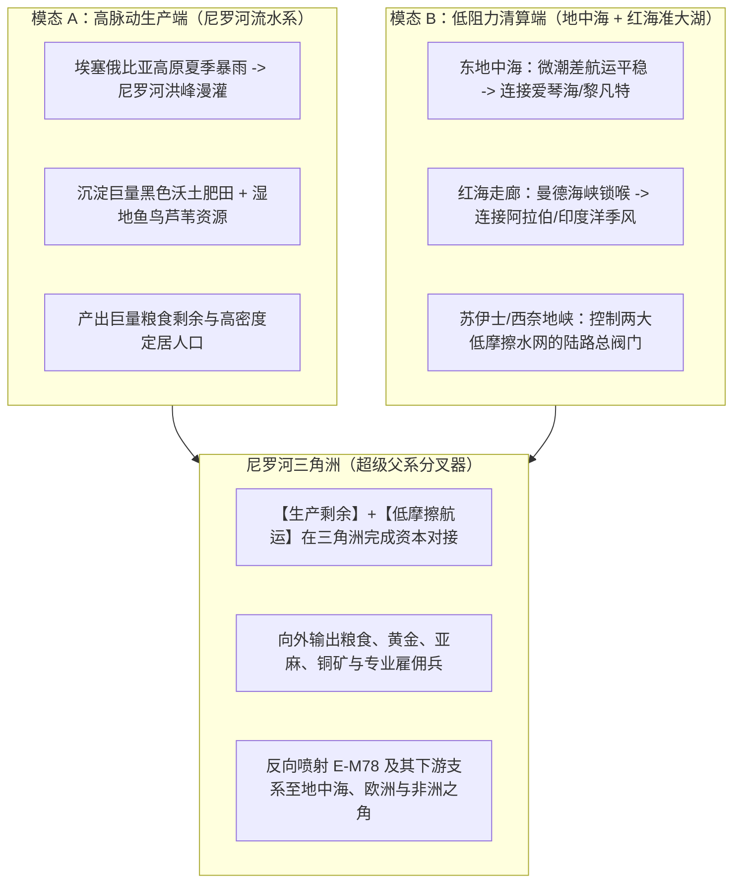

# 三更道场 · 认识论总纲 · 文献学与历史会计审计
## 篇章：尼罗河三角洲—红海准大湖“双模态水体”、E-M78父系分叉器与回迁假说法医审计（v1.0）

---

### 【审计执行摘要 / Forensic Audit Abstract】
本审计案针对欧亚—非交界处的核心地缘水系——**尼罗河三角洲、红海与东地中海海盆**的物理水动力特征，父系单倍群 **E-M96 / E-M78 及其下游支系（E-V12, E-V13, E-V22, E-V32）** 的人口分化与扩散机制，以及 MLC（大湖文明）理论从单一“高脉动势能”向**“双模态水体（高脉动生产端 + 低潮差半封闭清算端）”**的重大理论升级展开法医式会计对账。

审计确立三大核心结论：
1. **MLC“双模态水体”资产模型的确立**：
   - **高脉动水体（High-Pulse Energy Source）**：如尼罗河年度季风洪泛、杭州湾/彭任纳湾强潮，负责**“自然势能代工、聚鱼淤肥，无偿创造巨大能量剩余”**；
   - **低潮差半封闭海盆（Semi-Enclosed Low-Friction Basin）**：如地中海（潮差 ~20-40cm）、红海（狭窄曼德海峡与苏伊士海峡锁喉），负责**“航行平稳、靠泊风险极低、跨岸网络密集，极大降低交易与清算摩擦”**。
2. **尼罗河三角洲作为“父系超级分叉器（Bifurcation Machine）”**：
   - 处于“高脉动河流生产端”与“低潮差双海清算端”的交汇处，三角洲兼具汇聚（Sink）与释放（Source）功能，是 **E-M78 及其派生支系向南欧（E-V13）、黎凡特（E-V22）、东非之角（E-V32）和埃及本土（E-V12）多向喷射的物理放大器**。
3. **E系起源与“西亚回迁假说”的七柱判别法医表**：
   - 严格区分深层上游 E-M96（形成于数万年前）与下游 E-M78（全新世早期扩散）；
   - 确立以基干分支嵌套性、古DNA年代阶梯与常染色体回流为核心的判定准则，严禁以现代表面高频倒推原产地。

---

### 【第一账套：MLC 双模态水体资产分类与功能对账表】

```
+-------------------------------------------------------------------------------------------------------------------------------+
|                                MLC 双模态大水体（Dual-Mode Waterbody）法医资产对账表                                           |
+-------------------------------------------------------------------------------------------------------------------------------+
| 水体模态类别         | 物理与水文特征                        | 经济学生产生态机制                   | 历史社会学与文明功能                 |
+----------------------+---------------------------------------+--------------------------------------+--------------------------------------+
| **模态 A：高脉动水体**| 水位具有可预测的巨幅升降              | **“自然替人干活”**：                 | **能量剩余创造器**：                 |
| (High-Pulse Mode)    | (如尼罗河年洪峰、彭任纳13m潮差、      | 自动沉淀富矿淤泥、退潮聚鱼截鱼、     | 支撑脱产阶级（祭司、工匠、水利官僚） |
|                      |  杭州湾大潮、洞里萨湖吞吐)            | 微坡度无动力自流排灌（EROI 暴增）    | 的规模化诞生与早期定居城邦聚集       |
+----------------------+---------------------------------------+--------------------------------------+--------------------------------------+
| **模态 B：低潮差**   | 半封闭海盆，通过狭窄海峡与大洋相连    | **“自然降低交易摩擦”**：             | **商业清算与跨界放大器**：           |
| **半封闭海盆**       | (如地中海潮差20-40cm、红海曼德海峡门阀| 潮流可控、无凶险涌潮、全天候靠泊、   | 支撑低成本跨海航行、近海贸易网络、   |
| (Low-Friction Basin) |  边界受控，局部海湾轻度共振)          | 沿岸高密度城邦互联、跨洋航线换乘     | 契约结算、工匠外包与离岸金融中心     |
+----------------------+---------------------------------------+--------------------------------------+--------------------------------------+
```



---

### 【第二账套：E-M78 及其派生支系在三角洲多向喷射分流台账】

尼罗河三角洲不是普通出海口，它是欧亚—非三大洲交界的**“人口压力汇聚点与多向喷射阀门”**：

```
+-------------------------------------------------------------------------------------------------------------------------------+
|                                    E-M78 核心下游支系多向喷射分流法医台账                                                     |
+-------------------------------------------------------------------------------------------------------------------------------+
| 支系名称             | 主要扩张方向与地理分布                | 伴随的生业、贸易与军事载体           | 历史考古与地中海网络对账             |
+----------------------+---------------------------------------+--------------------------------------+--------------------------------------+
| **E-V13**            | **巴尔干半岛 / 东南欧 / 爱琴海**      | 早期欧洲农业扩张第二波 / 海上青铜矿贸| 深入希腊、色雷斯、伊利里亚，成为巴尔 |
|                      | (在东南欧部分人群达 20% - 40%)        | 与多瑙河走廊金属冶铸工匠流动         | 干半岛极为显赫的父系底色之一         |
+----------------------+---------------------------------------+--------------------------------------+--------------------------------------+
| **E-V22**            | **黎凡特 / 埃及本土 / 红海沿岸**      | 尼罗河三角洲农业核心层 / 黎凡特商队  | 深度参与埃及早期王朝建立与西奈半岛绿 |
|                      | (埃及、苏丹、巴勒斯坦、约旦高频)      | 与红海沿岸绿松石、铜矿开采与运输行会 | 松石/铜矿开发特许经营                |
+----------------------+---------------------------------------+--------------------------------------+--------------------------------------+
| **E-V32 (E-M35 下游)**| **非洲之角 / 索马里 / 埃塞俄比亚**   | 沿红海—尼罗河南下放牧与乳香贸易通道  | 成为索马里人、奥罗莫人绝对主体父系   |
|                      | (索马里男性中可高达 70% - 80%)        | 垄断红海出口香料与角禽贸易           | （高爆发奠基者效应典型标本）         |
+----------------------+---------------------------------------+--------------------------------------+--------------------------------------+
| **E-V12**            | **上埃及 / 尼罗河第一瀑布河谷**       | 尼罗河南北长途船队、采石场石工行会   | 构成上埃及与努比亚边境早期定居农夫与 |
|                      | (埃及南部、苏丹北部高频)              | 与神庙祭司阶层管理网络               | 船工的核心父系基底                   |
+----------------------+---------------------------------------+--------------------------------------+--------------------------------------+
```

---

### 【第三账套：E-M96 起源地——“本地原发”vs“西亚回迁”法医判别准则表】

```
+-------------------------------------------------------------------------------------------------------------------------------+
|                                E-M96 起源模式：非洲本地原发 vs 西亚回迁法医判定矩阵                                           |
+-------------------------------------------------------------------------------------------------------------------------------+
| 关键法医指标         | 实测观测结果                          | 更支持非洲本地原发生长               | 更支持西亚分化后回迁                 |
+----------------------+---------------------------------------+--------------------------------------+--------------------------------------+
| **1. 基干支系多样性**| 非洲内部拥有 E 的绝大多数早期分支     | **【支持】**（多样性中心在东北非）   | 【不支持】（除非西亚发生剧烈绝灭）   |
+----------------------+---------------------------------------+--------------------------------------+--------------------------------------+
| **2. 兄弟支系 D 拓扑**| D 与 E 共享 DE 祖先；D 深层在亚洲爆发 | 【较难解释】（需假设 DE 在非洲分化后 | **【支持】**（DE 在西南亚分化，D 进  |
|                      | (日本、西藏、安达曼)                  | 仅 D 迁往亚洲，或发生远距离灭绝）    | 东亚，E 回流非洲大爆发）             |
+----------------------+---------------------------------------+--------------------------------------+--------------------------------------+
| **3. 古DNA 年代时序**| 黎凡特旧石器晚期/北非古DNA测序序列    | 若最古老基干 E 在北非地层首先出土    | 若西亚旧石器地层首先测出基干 E       |
|                      |                                       | 则锁定本地原发                       | 则确立西亚回流路径                   |
+----------------------+---------------------------------------+--------------------------------------+--------------------------------------+
| **4. 常染色体共流**  | 东北非人群中普遍检测出欧亚/西亚常染色 | 【不可完全解释】（表明存在早期深层   | **【支持】**（伴随父系回流输入了西亚 |
|                      | 体背景（Basal Eurasian / Levantine）  | 西亚非游牧人群双向血缘流动）         | 早期农夫与狩猎采集成分）             |
+----------------------+---------------------------------------+--------------------------------------+--------------------------------------+
```

---

### 【法医对账总决：MLC 理论在红海—地中海板块的平账结论】

| 会计科目 | 审定历史会计事实 | 法医处理结论 |
| :--- | :--- | :--- |
| **双模态水体理论** | 高脉动负责提供巨额能量剩余（生产端）；低潮差半封闭海盆负责降低航运与契约摩擦（清算端）。 | **确认为 MLC 理论核心增益公理** |
| **尼罗河三角洲定位** | 兼具生产端与清算端的叠加节点，是驱动 E-M78 多向喷射的物理分叉器。 | **确认入账：超级地缘分叉器模型** |
| **E-V13 / V22 / V32** | 分别向巴尔干、黎凡特、东非之角扩张，展示了从三角洲向外辐射的四向网络。 | **确认入账：地中海—红海扩散台账** |
| **E-M96 西亚回迁假说**| 具备系统发育与常染色体讨论价值，保留判定矩阵，待古DNA地层年代终审裁决。 | **列入：高优先级待决法医台账** |

---
**审计人签章**：三更道场·地缘水动力学与地中海分子人类学调查署  
**时间标记**：2026-09-09
