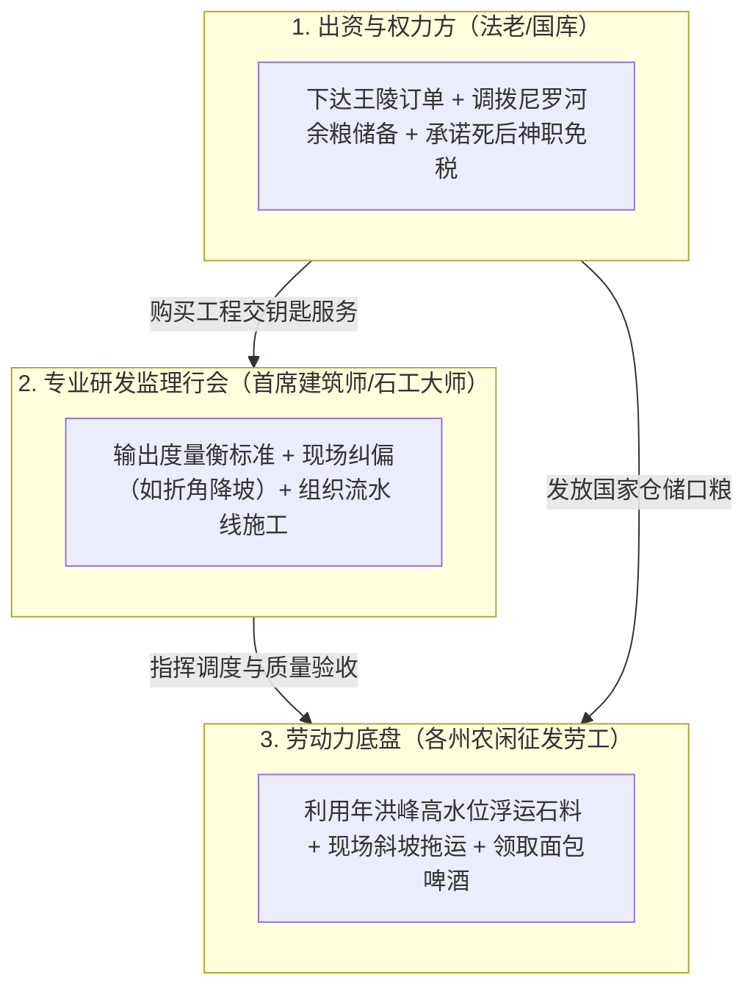

# 三更道场 · 认识论总纲 · 文献学与历史会计审计
## 篇章：尼罗河工程走廊（阿拜多斯 $\rightarrow$ 萨卡拉 $\rightarrow$ 达舒尔 $\rightarrow$ 吉萨）空间迁移与“研发团队/法老金主/劳工底盘”三权分立结构法医审计（v1.0）

---

### 【审计执行摘要 / Forensic Audit Abstract】
本审计案针对古埃及金字塔与大型石构工程在空间地理上的动态转移特性、建筑技术的跨代连续性，以及长期被“埃及人世世代代原地施工”伪常识所遮蔽的**“法老权力金主、核心研发/测绘工匠行会、本地农闲劳工底盘”三权分立组织模型**展开法医级会计对账。

审计确立三大核心平账公理与空间定性：
1. **尼罗河空间工程走廊（Nile Engineering Corridor）**：
   - 迭代不是在同一个地方重复发生，而是在数百公里的尼罗河走廊上发生**长距离地理迁移**：
     $$\text{上埃及阿拜多斯王墓（早王朝）} \longrightarrow \text{萨卡拉（第三王朝阶梯金字塔）} \longrightarrow \text{美杜姆/达舒尔（斯尼夫鲁试错区）} \longrightarrow \text{吉萨高地（胡夫旗舰版）} \longrightarrow \text{阿布西尔（第五王朝轻型版）}$$
   - **地理是迁移跳跃的，而项目管理、度量衡与建筑几何知识是高度连续的**。
2. **工程组织的三维解耦模型（Three-Layer Decoupling Model）**：
   - **① 权力与出资方（Capital & Client）**：法老王廷与神庙祭司（提供财政粮饷、下达工期、不断换代换股）；
   - **② 核心研发与测绘监理行会（R&D / Master Mason Guild）**：无固定血缘绑定的流动专业工程行会（掌握水平水槽测绘、真北对齐、叠涩拱顶、卸压舱力学设计与标准件采石规范）；
   - **③ 基础劳动力底盘（Labor Pool）**：尼罗河沿岸各州（诺姆）农闲征发的农民与船夫（提供纯物理搬运做功，换取啤酒、面包与免役特权）。
3. **“外部输入 vs 本地迭代”的法医判定边界**：
   - **实物事实**：目前全球最密集、最连续、有据可查的工业级试错实物（从塌陷到改坡）完整保留在尼罗河走廊；
   - **法医边界**：建筑序列证明了“产品研发与测试发生在尼罗河”，但**不证明研发团队是封闭的本土单一血统**。完全兼容“外部流动工匠行会受雇于富裕法老金主，在尼罗河走廊这一高资本、高物料、高水力测试场中完成工程 OS 暴力迭代”的通用历史会计模型。

---

### 【第一账套：尼罗河工程走廊空间地理迁移与技术跳跃台账】

```
+-------------------------------------------------------------------------------------------------------------------------------+
|                                尼罗河工程走廊空间迁移与技术迭代跳跃法医台账                                                   |
+-------------------------------------------------------------------------------------------------------------------------------+
| 工程地理节点         | 地理区位与地貌特征                    | 核心工程迭代与功能突破               | 组织与权力中心迁移背景               |
+----------------------+---------------------------------------+--------------------------------------+--------------------------------------+
| **1. 阿拜多斯**      | 上埃及深腹地，靠近前王朝发祥地        | **v0.1**：大型泥砖马斯塔巴群，       | 早王朝（第一、二王朝）南方发祥地，   |
| (Abydos)             | 干燥沙漠边缘，纯地下与半地下泥砖结构  | 地下木构墓室 + 地面围墙祭祀场        | 权力中心尚未完全北移，主要为王族祖茔 |
+----------------------+---------------------------------------+--------------------------------------+--------------------------------------+
| **2. 萨卡拉**        | 下埃及孟菲斯首都西侧高地              | **v1.0**：左塞尔阶梯金字塔，         | 第三王朝统一国家机器建立，迁都孟菲斯 |
| (Saqqara)            | 俯瞰尼罗河三角洲咽喉                  | 首次实现全石构化，伊姆霍特普首创天梯 | 确立“首都—对岸金字塔”的国家标准范式  |
+----------------------+---------------------------------------+--------------------------------------+--------------------------------------+
| **3. 美杜姆 / 达舒尔**| 孟菲斯以南 40-50 公里开阔沙漠台地     | **v2.0-v3.0**：美杜姆坍塌、达舒尔折角| 第四王朝斯尼夫鲁开辟全新“工程试验场” |
| (Meidum / Dahshur)   | 空间开阔，临近优质图拉石灰石采石场    | 现场降坡热修复、红金字塔平滑成功     | 避开萨卡拉拥挤墓区，暴力试错迭代 OS  |
+----------------------+---------------------------------------+--------------------------------------+--------------------------------------+
| **4. 吉萨高地**      | 尼罗河西岸坚硬天然石灰石基岩台地      | **v4.0**：胡夫大金字塔，五重花岗岩   | 胡夫将首都与工程基地锁定在最坚硬基岩 |
| (Giza Plateau)       | 地基承载力极强，靠近尼罗河引水主干道  | 卸压舱，规模与测量公差达到人类顶峰   | 能够承受数百万吨巨型石料的绝对载荷   |
+----------------------+---------------------------------------+--------------------------------------+--------------------------------------+
| **5. 阿布西尔**      | 吉萨与萨卡拉之间的过渡台地            | **v4.3**：第五王朝轻型泥砖/碎石核心  | 第五王朝财政降本，太阳神庙与金字塔分 |
| (Abusir)             | 空间受限，临近阿布西尔湖泊运河网络    | 外部包石，体量大幅缩减，转向太阳神庙 | 立，国家资本开支转向神庙祭司集团     |
+----------------------+---------------------------------------+--------------------------------------+--------------------------------------+
```


---

### 【第二账套：金字塔工程组织“三权分立”法医解耦模型】

严禁将“埃及金字塔工程”含混地归结为单一的“埃及人”。在历史会计学上，必须严格拆解为三个独立运营的利益与技术实体：

```
+-------------------------------------------------------------------------------------------------------------------------------+
|                                    金字塔超级工程三大实体解耦与契约关系表                                                     |
+-------------------------------------------------------------------------------------------------------------------------------+
| 实体类别             | 实体代表与阶级属性                    | 在工程中的输入与权利                 | 历史会计与遗传学定性                 |
+----------------------+---------------------------------------+--------------------------------------+--------------------------------------+
| **1. 权力与出资方**  | 法老王室、宰相、神庙阿蒙/拉祭司集团   | **提供项目融资**：调拨国库粮食、麦酒、| **董事会（可换届/可篡位）**：        |
| (Capital & Client)   | (如斯尼夫鲁、胡夫、赫米昂 Hemiunu)    | 铜器工具，下达施工限期，享受政治法统 | 不懂具体力学与测绘，只负责验收与买单 |
+----------------------+---------------------------------------+--------------------------------------+--------------------------------------+
| **2. 研发与监理行会**| 皇家首席建筑师、石工大师、测绘几何官  | **交付技术图纸与质量公差**：掌握水槽 | **专业工程承包商（EPC 行会）**：      |
| (R&D & Engineering)  | (如伊姆霍特普、兼通天文与测量的工匠)  | 找平、北极星定向、力学拱顶与重力导流 | 知识跨地域流动传承，不与王室血缘绑定 |
+----------------------+---------------------------------------+--------------------------------------+--------------------------------------+
| **3. 基础劳工底盘**  | 尼罗河各州（诺姆）农闲征发农民与船夫  | **提供纯物理人力做功**：采石、拉运、 | **本地人口生产力基底**：             |
| (Labor & Workforce)  | (每年洪泛季 3-4 个月脱产劳役)         | 泥浆浇筑，换取口粮配给与免除农税特权 | 长期保持本地稳定遗传连续性与民俗连续 |
+----------------------+---------------------------------------+--------------------------------------+----------------------------------------+
```



---

### 【第三账套：“外部输入 vs 本地迭代”的法医判别准则】

```
+-------------------------------------------------------------------------------------------------------------------------------+
|                                外部流动工匠假说 vs 本地自生演化假说法医对账表                                                 |
+-------------------------------------------------------------------------------------------------------------------------------+
| 审计维度             | 现有硬事实证据                        | 本地自生演化说支持项                 | 外部流动工匠输入说支持项             |
+----------------------+---------------------------------------+--------------------------------------+--------------------------------------+
| **1. 试错遗迹分布**  | 最完整、最连续的失败与修正遗迹全部位  | **【强支持】**：产品研发和破坏性测试 | 【需解释】：为何外部源头未发现比萨卡 |
|                      | 于尼罗河沿线（美杜姆坍塌、达舒尔折角）| 确实发生在尼罗河走廊                 | 拉更早的大型成型石构金字塔？         |
+----------------------+---------------------------------------+--------------------------------------+--------------------------------------+
| **2. 资本与资源聚集**| 唯有统一后的埃及中央集权与尼罗河洪峰  | 说明尼罗河提供了**唯一的超级工业测试 | **【强支持】**：流动工匠永远向“全球出|
|                      | 水力，能支撑数十年连续百万吨级石构试错| 场与资本池**                         | 价最高、资源最富集的金主”聚集        |
+----------------------+---------------------------------------+--------------------------------------+--------------------------------------+
| **3. 跨地域技术指纹**| 测量法、高水头引水、大型石工与青铜工具| 埃及境内发展出独特的图拉白石灰岩与   | 与黎凡特、安纳托利亚及美索不达米亚的 |
|                      | 在近东与地中海东岸展现相似几何原理    | 阿斯旺红花岗岩开采运输技术           | 早期巨石、神庙与重力流工程共享底层OS |
+----------------------+---------------------------------------+--------------------------------------+--------------------------------------+
```

#### 会计审计判定 2：
- **尼罗河是人类文明早期最顶级的“超级工程风洞（Wind Tunnel）与风险投资基金”**；
- 无论研发团队最初源自何处，他们唯有在尼罗河这一拥有**“无限粮食剩余 + 尼罗河洪峰无偿重力浮运 + 极权法老无上限预算”**的超级应用场景下，才能把一套粗糙的石构图纸，暴力迭代为登峰造极的吉萨 4.0 系统。

---

### 【法医对账总决：尼罗河工程走廊平账结论】

| 会计科目 | 审定历史会计事实 | 法医处理结论 |
| :--- | :--- | :--- |
| **工程地理空间** | 从阿拜多斯到萨卡拉、达舒尔、吉萨，属于数百公里走廊的长距离空间迁移。 | **确认为“尼罗河空间工程走廊模型”** |
| **三权分立组织** | 法老金主出资、流动工匠行会研发监理、本地农夫出力的三元解耦。 | **确立为三更道场古代大型工程公理** |
| **试错链条归属** | 最密集、最连续的工业级试错与修复实物无可辩驳地落在尼罗河走廊。 | **确认入账：产品迭代发生在尼罗河** |
| **研发团队血缘** | 建筑学序列证明的是“知识体系的继承”，严禁等同于“单一血缘原地繁衍”。 | **红字纠偏：知识连续不等于血缘封闭** |

---
**审计人签章**：三更道场·空间工程学与建筑历史会计法医调查署  
**时间标记**：2026-09-09
