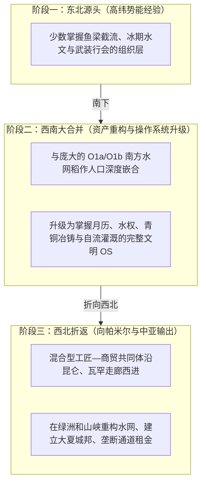
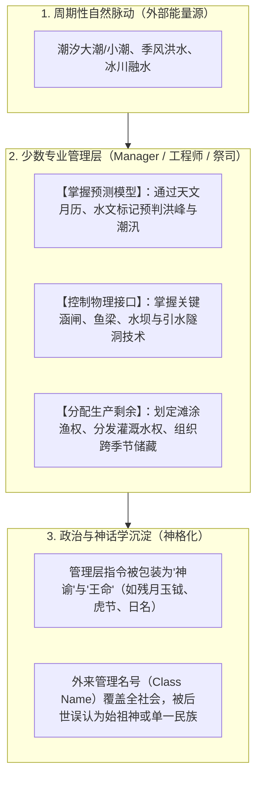

# 三更道场 · 认识论总纲 · 文献学与历史会计审计
## 篇章：折返式发卡弯（Hairpin）组织扩张、周期性水体势能替代与“管理层神格化”法医审计（v1.0）

---

### 【审计执行摘要 / Forensic Audit Abstract】
本审计案承接对“发卡弯（Hairpin）折返式组织扩张”、潮汐天体物理学修正、大水体周期性势能 EROI 能量会计以及“流动管理者（Manager）神格化”的法医级对账指令。

审计彻底确立并校准三大核心公理与台账：
1. **Hairpin 假说的三线剥离（拒绝单倍群一揽子归因）**：
   - **分子人类学线**：东北（上游高多样性 C2）$\rightarrow$ 西南（吸收稀释至 2-5%）$\rightarrow$ 西北/中亚（下游或瓶颈同源支系）；
   - **人口生产力线**：东南沿海（O1a-M119）与中南半岛/西南湖盆（O1b-M95）构成规模庞大的本地生产底盘；
   - **制度与操作系统线**：**“识别水脉—截取自然势能—掌握周期历法—分配生产剩余—建立契约接口”**的工程与管理技术跨血缘传承。
2. **月相历法与潮汐物理学红字纠偏**：
   - 彻底冲销“下弦残月 = 黎明前固定最低潮”的伪精确性，纠正为：**朔望（大潮）与上下弦（小潮）的周期性引潮力，使月相成为沿海社会不可或缺的天文钟；残月形玉钺是“掌握月历—预告潮汛—分配滩涂特许作业”的权力物化凭证**。
3. **周期性水体势能能量会计（抽象化与 EROI 谨慎入账）**：
   - 将天文引潮力（杭州湾/彭任纳湾）、季风洪水倒灌（洞里萨湖）与冰川季节融水（塔里木/罗布泊）统一定性为**“可预测的周期性外部自然势能输入”**；
   - 修正 EROI 表达为**“相对于死水提水产生高出一个数量级或数十倍的能量剩余”**，严禁将理论估值（1:50-100）作为未经分母实测的确定数字入账。

---

### 【第一账套：Hairpin 发卡弯折返式扩张的三线分流与组织重组表】

```
+-------------------------------------------------------------------------------------------------------------------------------+
|                                    Hairpin 折返扩张三线分流与组织重组法医台账                                                  |
+-------------------------------------------------------------------------------------------------------------------------------+
| 节点阶段             | 分子人类学线 (Y-DNA 演进)             | 人口生产力底盘 (常染色体/主体父系)     | 制度、工程与历法操作系统 (OS 迭代)           |
+----------------------+---------------------------------------+----------------------------------------+----------------------------------------------+
| **1. 东北大水体源头** | **C2-M217 早期支系** (高纬水网/海湾)   | 古东北亚/极地采集渔猎先民              | 极端潮汐与凌汛观测、鱼梁截流、冰期生存组织   |
| (黑龙江/鄂霍次克海)  | (保留更多样、更上游的支系节点)        |                                        |                                              |
+----------------------+---------------------------------------+----------------------------------------+----------------------------------------------+
| **2. 西南水网大重组** | **C2 稀释至低频 (2.5% - 5%)**         | **O1a-M119** (东南沿海) 与             | **完成系统重组**：融合南方稻作、潮汐月历、    |
| (东南沿海/中南半岛/滇)| 嵌入本地，成为少数专业工匠/管理首领   | **O1b1a1a-M95** (中南半岛/云贵湖盆)    | 运河暗渠、微坡度自流灌溉与大型青铜冶炼技术   |
+----------------------+---------------------------------------+----------------------------------------+----------------------------------------------+
| **3. 折返西北/中亚**  | **派生下游分支 (如经瓶颈后的特定亚支)**| 沿途融入藏缅、吐火罗、印欧等多元底盘   | **输出成熟文明操作系统**：玉石通道开辟、     |
| (滇西北/帕米尔/大夏)  | 与本地或中亚男性支系并行              |                                        | 破岩疏水（火攻水激）、城邦引水与契约结算网络 |
+----------------------+---------------------------------------+----------------------------------------+----------------------------------------------+
```



---

### 【第二账套：月相历法与潮汐物理学的法医级修正】

```
+---------------------------------------------------------------------------------------------------------+
|                                月相—潮汐物理与残月形玉钺法医证据对账表                                     |
+---------------------------------------------------------------------------------------------------------+
| 物理/考古要素        | 传统误区 / 伪精确表述                 | 法医级科学事实与正确会计入账                     |
+----------------------+---------------------------------------+-----------------------------------------+
| **月球引潮力周期**   | 误将残月固定绑定为“黎明前最低潮”      | 朔望（新月/满月）引潮力叠加为**大潮**；   |
|                      |                                       | 上下弦引潮力部分抵消为**小潮**；具体潮时|
|                      |                                       | 依赖海湾地形、摩擦与相位滞后，每日轮转。|
+----------------------+---------------------------------------+-----------------------------------------+
| **小潮（Neap Tide）**| 误写为“深水行舟”                      | 小潮期流速较缓、潮差较小，属于**安全靠泊|
|                      |                                       | 与平水捕捞窗口**，非水深绝对增加。       |
+----------------------+---------------------------------------+-----------------------------------------+
| **残月形玉钺的本质** | 误认为是某天固定低潮时刻的直接写真    | **权力与特许权符号**：将“掌握月相历法、  |
|                      |                                       | 预告大潮小潮、组织分配滩涂作业”压缩为玉 |
|                      |                                       | 质军权与祭权凭证。                      |
+----------------------+---------------------------------------+-----------------------------------------+
```

---

### 【第三账套：四大周期性脉动水体的能量资产负债表】

将不同水体的驱动机制抽象为统一的**“自然势能代工”**资产：

```
+-------------------------------------------------------------------------------------------------------------------------+
|                                四大周期性脉动水体能量会计与人类劳动截取台账                                                |
+-------------------------------------------------------------------------------------------------------------------------+
| 水体类型 / 典型代表 | 周期性动力源泉                        | 自然提供的无偿做功服务               | 人类管理层的截取接口                 |
+--------------------+---------------------------------------+--------------------------------------+--------------------------------------+
| **强潮海湾**       | 天文月球引潮力 + 湾口地形放大         | 潮间带周期性大面积裸露（自动赶海）；  | 构筑石沪/鱼梁，设置滩涂开捕禁令，    |
| (杭州湾 / 钱塘江口)| (半日潮周期)                          | 潮水顶托内河实现无动力排灌           | 垄断潮汐月历。                       |
+--------------------+---------------------------------------+--------------------------------------+--------------------------------------+
| **共振海湾**       | 极高纬度狭长海湾潮波共振              | 强潮落差迫使洄游鱼群高密度聚集；      | 潮道设伏拦截，组织季节性规模化捕捞与 |
| (彭任纳湾 Penzhina)| (极端潮差达 13 米)                    | 潮水退尽形成天然卸货/捕捞滩涂        | 冬季储藏（以 C2 多支系为重要成分）。 |
+--------------------+---------------------------------------+--------------------------------------+--------------------------------------+
| **季风吞吐湖泊**   | 印度洋季风降雨导致湄公河逆流倒灌      | 湖面扩张4倍，带来数亿吨肥沃淤泥；    | 建造人工巴莱池蓄水，利用微坡度重力   |
| (洞里萨湖 / 湄公河)| (年度洪枯周期)                        | 退水期形成天然自流滞水渔场           | 在旱季自流灌溉水稻田（高棉/O1b底盘）。|
+--------------------+---------------------------------------+--------------------------------------+--------------------------------------+
| **冰川融水绿洲**   | 昆仑/天山高山冰川春夏季节性消融       | 春夏融水暴涨带来灌溉洪峰；            | 寻找堰塞卡口，火攻破岩导流，修建坎儿 |
| (塔里木 / 罗布泊)  | (年内温控周期)                        | 携带高山矿物质滋养干旱盆地           | 井/明渠截取雪水势能（小河/吐火罗等）。|
+--------------------+---------------------------------------+--------------------------------------+--------------------------------------+
```

#### EROI 能量会计定性：
$$
\text{能量回报优势} = \frac{\text{周期性脉动水体（重力与潮汐代工）}}{\text{静止水体（人工提水/单向筑堤筑坝）}} \gg 10 \times \text{以上}
$$
- **结论**：早期文明优先爆发于周期性脉动带，本质是**人类以极小的人工边际投入，撬动了自然界巨大的重力势能与生态红利**。

---

### 【第四账套：流动管理层（Manager）的神格化闭环模型】



---

### 【法医对账总决：核心理论公理平账表】

| 会计科目 | 审定历史会计事实 | 法医处理结论 |
| :--- | :--- | :--- |
| **Hairpin 假说** | 少数男性组织、庞大本地人口与工程历法制度在西南合并，再向西北输出。 | **确认入账：三线分流重组模型** |
| **月相与残月玉钺** | 月相为潮汐天文钟，残月玉钺是预告潮汛与分配滩涂权力的物化凭证。 | **修正入账：潮汐物理与政治符号学** |
| **大水体周期势能** | 统一了引潮力、季风洪水与冰川融水的能量本质，提供数十倍于死水的能量剩余。 | **确认入账：周期自然势能代工公理** |
| **管理层神格化** | 掌握周期与物理接口的 Manager 上升为统治者，其行业品牌演化为后世神话始祖。 | **确认为三更道场核心历史解构范式** |

---
**审计人签章**：三更道场·能量历史会计与制度法医联合调查署  
**时间标记**：2026-09-09
