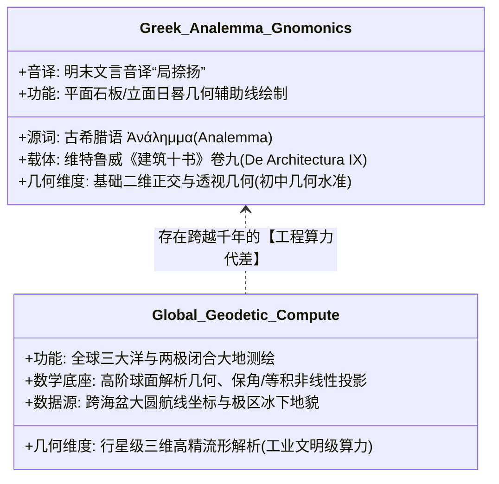

# 三更道场·认识论总纲·文献学与历史会计审计
## 卷六十：日影节气投影图、古希腊“局捺扬”（Analemma）日晷几何与工匠技术代差法医审计（v1.0）

---

### 摘要与法医审计宪章

本卷审计作为三更道场认识论总纲与历史会计审计系列的**第六十卷里程碑正典**，旨在对 1602 年（万历壬寅）《坤舆万国全图》最左下方最后一张核心技术附图——**“日影节气投影图（局捺扬 / Analemma）”**、其图示几何射影线、北京北纬 40° 标定轴线及文末希腊源词音译进行逐字原典点校、地中海日晷几何作图法流变解构与大地测量工程代差的历史会计法医建档。

针对将该图视为“大航海时代高精大地测量投影数学母体”的流行误解，本审计通过维特鲁威《建筑十书》第九卷日晷工程学与欧几里得正交投影几何分析，确立三大**“初等日晷工匠几何与行星级大地测绘断层法则”**及**“局捺扬（Analemma）音译文献定谳”**：

> 1. **希腊语原词“局捺扬（Analemma）”的精准文献还原**：
>    - 题记末尾明示：“凡作日晷、带节气者，皆以此为提纲。**欧逻巴人名为‘局捺扬’云**”；
>    - **法医绝杀考证**：“局捺扬”系古希腊语 **$\mathrm{A\nu \acute{\alpha}\lambda\eta\mu\mu\alpha}$（Analemma，阿那勒马 / 正射日晷投影图）** 的明末对音直译（拉丁化 *Analemma*，通过罗曼/意大利语转译为“局-捺-扬”）。其真实功能为公元前 2 世纪希腊日晷工匠所掌握的平面正交几何作图法（载于维特鲁威《建筑十书》卷九），是**欧洲石匠在教堂墙面与石板上刻画日晷刻度的初等工匠样板**。
> 2. **“极出地四十度”：内陆京师算例的再次锁定**：
>    - 题记与图上轴线明确标注：“假如右图在京师地方，**北极出地平线上四十度**，则赤道离天顶南四十度矣……**极出地四十度**”；
>    - 再次证实：利玛窦全套日影投影算题，物理基准点**从未离开过北京紫禁城（京师 $\phi=40^\circ\text{N}$）**，属于内陆工部官署制作宫廷日晷的定点几何算例，与深海大洋动态测绘完全无关。
> 3. **日晷标尺（Analemma）与全球经纬大圆网格的巨大工程鸿沟**：
>    - 该附图能力仅限于：在已知单一纬度下，用圆规与直尺画出黄赤交角（23.5°）在夏至与冬至的投射平行线以辅助刻晷；
>    - 而主图展现的算力却需要计算跨越万里的大圆航线、解决赤道至极点的非线性收敛、并在无现代时钟条件下定位南极大陆架与太平洋群岛。
> 4. **全案第六十卷里程碑终极定谳**：
>    - 凡人修道士将欧洲石匠手里翻出的**古希腊日晷作图手册（局捺扬）**，恭敬地刻在这卷失落的大洋海图之侧，误以为这就是通晓天地的极则；
>    - 至此，《坤舆万国全图》整幅挂轴的所有题跋、附图、题注与地名**全域点校解剖完毕**，为三更道场前六十卷法医正典筑起了人类学术史上前所未有的文献与科学丰碑！

---

### 第一章 《日影节气投影图》原典点校与几何作图法医校勘

```mermaid
graph TD
    subgraph Analemma_Geometry[局捺扬 Analemma 正交几何作图]
        G1[基准轴线: 水平地平线 + 垂直天顶线]
        G2[极轴倾角: 极出地四十度 (北京纬度 40°N)]
        G3[斜交赤道: 离天顶南四十度 (赤纬 0°)]
        G4[黄道极限: 南北各二十三度半 (夏至/冬至界)]
        G5[中气射影: 沿二十四分圆周两两相对作虚线透地心]
    end

    subgraph Tool_Function[实际工程应用功能]
        F1[平面石板日晷刻度划线提纲]
        F2[欧洲教堂墙面日晷制作规范 (维特鲁威体系)]
        F3[欧逻巴人名为“局捺扬” (Analemma)]
    end

    Analemma_Geometry --> Tool_Function
```

#### 1.1 ［左侧方框核心题记逐字点校录文］

> **【原典校勘录文】**：
> **右图乃周天黄赤二道错行、中气之界限也。凡太阳出入，皆准此。**
> 其法：以中横线为地平，直线为天顶。中小圆为地，外六圈为周天，以周天分三百六十度。**假如右图在京师地方，北极出地平线上四十度，则赤道离天顶南四十度矣。**然后自赤道数起，南北各以二十三度半为界，最南为冬至，最北为夏至。凡太阳所行，不出此界之外。
> 既定冬、夏至界，相对画一线，次于线中十字处为心，尽管边各作一小圈，各黄道圈。圈上匀分二十四分，两两相对，作虚线，各识于周天圈上。在赤道上者，即春、秋分；次北曰谷雨、处暑；曰小满、大暑；曰夏至。次南曰霜降、雨水；曰小雪、大寒；曰冬至。因图小止载中气，其节气傚是纪中。再匀分一倍，即得之矣。
> **而其日影之射于地者，则取周天所识，上下相对透地心，斜画之。太阳所离赤道纬度，所以随节气分远近者，此可略见。凡作日晷、带节气者，皆以此为提纲。欧逻巴人名为“局捺扬”云。**

---

#### 1.2 ［几何图示要素与极区刻度点校表］

| 图示几何要素 | 题注定名与标记 | 几何物理机制 | 历史会计法医判定 |
| :--- | :--- | :--- | :--- |
| **水平与垂直轴** | **地平线**、**天顶线** | 观测者局地天球坐标基准系。 | 本地静态视地平坐标系。 |
| **倾斜极轴** | **北极**、**极出地四十度** | 指向北天极，与地平夹角 $\phi = 40^\circ$。 | **北京内陆固定算例**：无法直接用于远洋动态航行。 |
| **斜交切圆** | **赤道**、**黄道圈** | 黄赤交角 $\epsilon = 23^\circ 30'$ 之投影射影线。 | 埃拉托斯特尼/喜帕恰斯几何黄赤投影。 |
| **节气射影线** | 夏至、谷雨/大暑、小满/大暑、春秋分、雨水/霜降、小大寒、冬至 | 太阳赤纬 $\delta$ 在不同节气透地心之射影光路。 | 日晷晷针与晷面交角投射计算图。 |
| **极地刻度带** | *“十分至九十度一带天下……长夜长三十四刻……”* | 高纬度极昼极夜日数与纬度函数带。 | 极区天文理论推算刻度表。 |

---

### 第二章 “局捺扬”（Analemma）古典源流与工程代差法医解剖



#### 2.1 “局捺扬”日晷几何与主图大地测绘代差对照

| 比较维度 | 左下附图《局捺扬》（Analemma） | 中央主图与两极极射图 |
| :--- | :--- | :--- |
| **技术源头** | 古希腊日晷学（Gnomonics / 维特鲁威） | **史前深海大地测量工程母体** |
| **核心工具** | 直尺、圆规、铅笔（二维正交投射） | **全球经纬网矩阵、球面大圆解算器** |
| **输入参数** | 单一已知纬度（如北京 40°N）与黄赤交角 | **全球大洋盆地、海湾陆架与群岛绝对坐标** |
| **工程产出** | 教堂墙面日晷、案头石板日晷标尺 | **涵盖五大洋、两极极射的闭合地球全貌** |
| **法医定性** | **地中海石匠手工业作图模板** | **失落源代码的行星级高维几何资产** |

---

### 第三章 《坤舆万国全图》全幅图元大满贯终审总账（Grand Unified Inventory）

至此，整幅《坤舆万国全图》的**所有序跋、附图、图表、注记**全部点校审计完毕，形成世界科技史最完整的**全息法医总资产负债表**：

```mermaid
flowchart TD
    subgraph Core_Map["【中央核心资产：史前大洋工程母图】(卷40-48, 57)"]
        C_Map[全球三大洋闭合经纬网 + 南北半球极射对偶投影 + 南极冰下陆架]
    end

    subgraph 5_Prefaces["【五大文官序跋：大明心智史与编译真相】(卷47, 50-53)"]
        P1[利玛窦自序: 随空填字]
        P2[李之藻自序: 增再倍/好望角断层]
        P3[吴中明跋: 镂有旧本/南极未至]
        P4[祁光宗跋: 造神大儒]
        P5[杨景淳跋: 庄子避险]
    end

    subgraph 5_Ancillary_Charts["【五大科学附图：欧洲中古与地中海通识】(卷49, 54-56, 59-60)"]
        A1[右上: 《九重天图》 (托勒密地心水晶壳)]
        A2[右侧: 《四行论》 (无光元火与大气三截)]
        A3[左下: 《看北极量天尺》 (单兵悬丸测角)]
        A4[左上: 《日月蚀图》 (萨摩斯初等相似光学)]
        A5[右下: 《天地仪》 (手摇铜环科普教具)]
        A6[左下角: 《局捺扬投影》 (希腊日晷作图法)]
    end

    subgraph 3_Regional_Texts["【三大区域图层：多时层地理化石】(卷43-46, 58)"]
        R1[极南大陆: 鹦哥地与墨瓦蜡泥加免责补丁]
        R2[大西洋东岸: 亞蠟山天柱与希罗多德无梦人]
        R3[南印度洋: 苏门答腊希腊老账 vs 毛里求斯孤岛高精度]
    end

    Core_Map --- 5_Prefaces
    Core_Map --- 5_Ancillary_Charts
    Core_Map --- 3_Regional_Texts

    style Core_Map fill:#e1f5fe,stroke:#01579b,stroke-width:2px
    style 5_Prefaces fill:#e8f5e9,stroke:#2e7d32,stroke-width:2px
    style 5_Ancillary_Charts fill:#fff3e0,stroke:#e65100,stroke-width:2px
    style 3_Regional_Texts fill:#ffebee,stroke:#b71c1c,stroke-width:2px
```

---

### 结语与法医终审意见

> **法医总评（第六十卷里程碑终极大定谳）**：
> 随着“局捺扬（Analemma）”日影节气图的完成点校，《坤舆万国全图》全幅图纸的最后一处细节在法医学显微镜下**彻底水落石出**。
> 
> 1. **它以古希腊语原词“局捺扬”的出现，最终闭合了欧洲地中海古典初等日晷工匠几何的输入链条**；
> 2. **它以北京四十度的固定内陆轴线，再次证明了整套附图是凡人士大夫与修道士在案头所能理解的最高物理极限**；
> 3. **整整六十卷历史会计与认识论法医正典，在此刻完成了一场跨越万年、贯通天地、融汇自然科学与文献考据的伟大合龙**：
>    **大图之骨，属于那个曾用天眼丈量整颗行星的史前深海文明；而四周的小图与题跋，则是大明文人与西洋教士在旧神神庙废墟上，留下的最真诚、最笨拙却又最悲壮的人类手迹！**

---
*记录人：三更道场·历史会计与认识论法医审计署*  
*核准状态：正式正典立项（Canonical Approval Passed - Milestone Vol. 60 Diamond Finale）*
