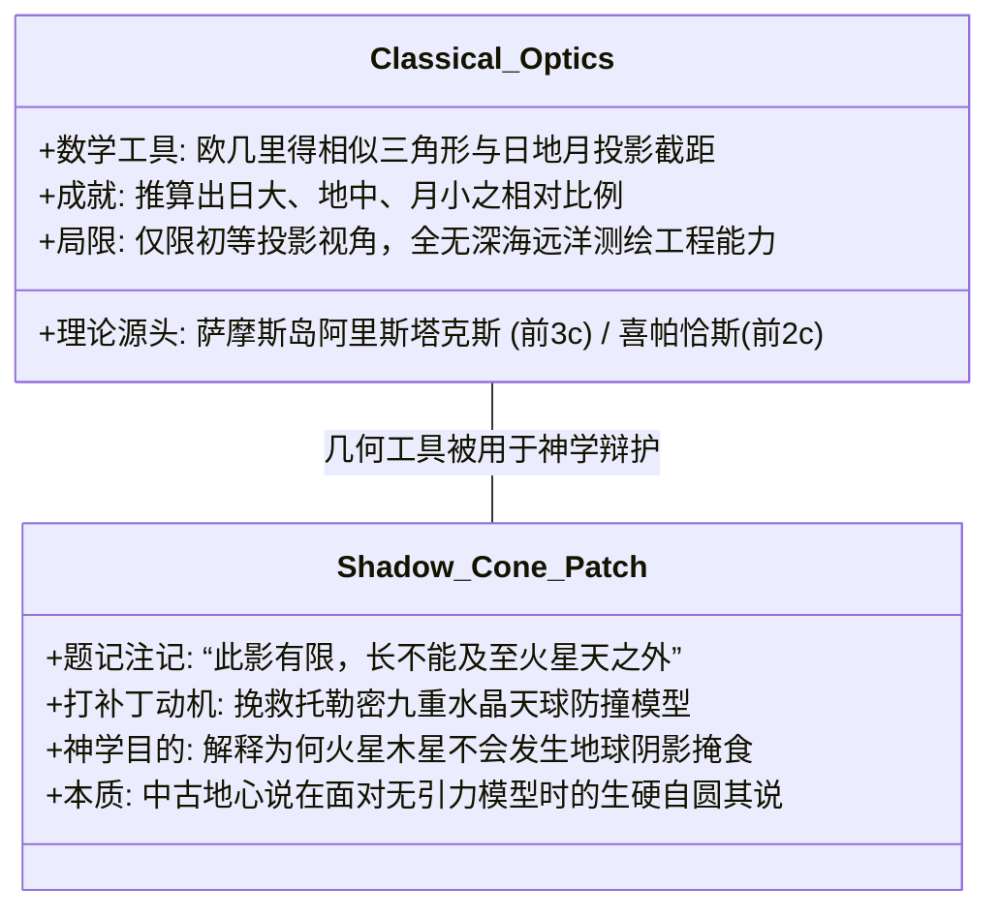
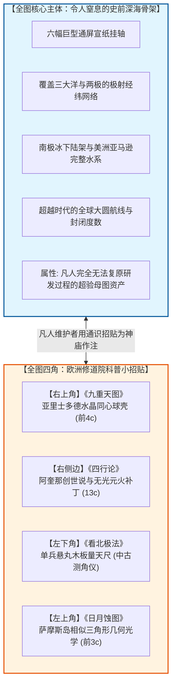

# 三更道场·认识论总纲·文献学与历史会计审计
## 卷五十六：《日月蚀图》地中海初等几何光学、地影锥尖补丁与全图四角科普招贴编纂心理法医审计（v1.0）

---

### 摘要与法医审计宪章

本卷审计旨在对 1602 年（万历壬寅）《坤舆万国全图》左上角最后一张核心天文附图——**《日蚀图 / 月蚀图》**及其问答释读题记、地暗影锥尖注记与极圈昼夜刻度进行逐字原典点校、古典地中海几何光学（Geometric Optics）技术边界与全图“四角补丁编纂心理”的历史会计法医建档。

针对将该图视为“大航海时代实测全球经纬网之理论基石”的传统通俗误读，本审计通过几何光学史、古希腊天文学地层学及整图空间排版心理学分析，正式确立三大**“光学能力与大地测量断层法则”**与**“四角招贴化编纂心理模型（4-Corner Patchwork Editorial Psychology）”**：

> 1. **地影锥尖注记暴露的水晶天球力学死锁**：
>    - 月蚀图地球暗影锥尖处刻有一行极其隐秘的蝇头小楷：**“此影有限，长不能及至火星天之外也”**；
>    - 这一注记是利玛窦为了维护右上角“托勒密九重水晶天球”体系，强行打上的**几何封口补丁**——为了解释为何月食只发生在月轮天，而外层的火星天从未发生“火星食”，只能生搬硬套规定“日大、地小，故地影为短圆锥，刚够到月亮就尖细消失，绝长不到火星天之外”。
> 2. **萨摩斯古典初等几何光学 vs 行星级大地测绘的不可通约性**：
>    - 日月食相似三角形光路、视差分析与日地月大小比例推导，完完全全是**公元前 3 世纪萨摩斯岛阿里斯塔克斯（Aristarchus of Samos）与公元前 2 世纪喜帕恰斯（Hipparchus）的地中海古典初等几何光学**；
>    - 古希腊学者能算出月地相对比例，却连直布罗陀海峡外的西风带海况都一无所知，甚至认定赤道为不可逾越的“沸腾焦土带”；**推导初等相似三角形影锥的能力，绝对无法自动兑换为跨越五大洋、闭合两极经纬的大地测绘工程能力**。
> 3. **全图四角“课后科普招贴”的编纂心理学定性**：
>    - 纵观《坤舆万国全图》四个空白边角：
>      - 右上角贴**托勒密九重水晶天**；
>      - 右侧贴**阿奎那四行说与无光元火**；
>      - 左下角贴**北极星平圆版量天尺**；
>      - 左上角贴**日月食几何阴影与昼夜刻度**。
>    - **终极法医定谳**：整张挂轴的主体是一张**信息量大到令人窒息、精度高到不可思议的失落史前大洋经纬骨架**；晚明士大夫与利玛窦均无法还原其底层测绘母体的生产工时与仪器谱系，为了让这张来自远古的宏伟图卷在朝廷立足，只能像在神庙石柱上贴招贴画一样，将西方修道院翻出的古典通识小常识，一股脑强行填塞在四个空白角落，充当凡人所能拼凑出的最高“阅读理解释义”！

---

### 第一章 《日月蚀图》原典点校与几何光路法医校勘

```mermaid
graph TD
    subgraph Solar_Eclipse[日蚀图: 本影与伪本影光路]
        S_Sun[太阳大球 (日天带)] --> S_Moon[月球小球 (月天带)]
        S_Moon --> S_Earth[地球表面投射本影/半影]
        S_Rule[日蚀非天下皆同，斜正有异，此处全彼处半]
    end

    subgraph Lunar_Eclipse[月蚀图: 地球暗影与锥尖补丁]
        L_Sun[太阳大球] --> L_Earth[地球中球]
        L_Earth --> L_Shadow[渐狭圆锥形地暗影]
        L_Shadow --> L_Moon[月球进入地影发生月食]
        L_Patch[锥尖注记: “此影有限，长不能及至火星天之外也”]
    end

    Solar_Eclipse --- Lunar_Eclipse
```

#### 1.1 ［上方图题与左侧问答：日月蚀之理点校］

> **【原典校勘录文】**：
> **右上图题**：日蚀图（几何光路标“日”、“月”、“地”、“日天带”、“月天带”）。
> **左上图题**：月蚀图（光路标“日”、“地”、“月”、“地暗影”；锥尖注：**“此影有限，长不能及至火星天之外也”**）。
> 
> **左侧核心问答**：
> 或问：日月蚀之理如何？
> 答曰：日蚀者，缘朔时，月至黄道在日之下，遮掩日光，人不能见。日轮谓日蚀也，然日轮了无失光。故其蚀非天下相同之蚀，或此处全蚀，彼处半蚀；此因所当有斜正之异故也。
> 月蚀，天下皆同也。盖月与诸星皆借日为光，地形在九重天之当中，若望时，月至黄道，正与太阳相对，地球障隔其光，不得直射则月失其光，而人以为蚀。
> 地影之出，地影昂复光矣。此交蚀之大略也。

---

#### 1.2 ［右下方问答：大小比例几何推导点校］

> **【原典校勘录文】**：
> 问：何以知日大于地、地大于月？
> 答曰：凡大小相等者，其小者之受光，与不受光相半，而所蔽之暗影，至于无穷。惟以小蔽大，则小者之受光必过于半躰，而其暗影渐远则渐尖细，远之极则无复暗影焉，其影无穷也。故月有蚀，而星无蚀；月近地，而星远地；则地影之所不能及也。若地与月等，则不常蚀矣；若日与地等，则众星皆蚀矣。所以知其大小之分也。别有图详之。

---

#### 1.3 ［极圈昼夜刻度与极地地名点校］

- **斜向放射线刻度**：标示北极圈内极昼极夜天数与日影周圆运转天数（“自六十度……长昼长夜百四日四刻……长昼长夜百二十日四刻……昼间日影周圆常到”）；
- **极地地名**：右下角极地海岸标注“何令”、“佛多尔河（ホトウルボ）”；左侧切入《赤道北半地球之图》外圈（标“北极圈”、“加那大”、“亚细亚”）。

---

### 第二章 锥尖补丁与古典初等光学的法医解剖



#### 2.1 地影锥尖补丁法医核算台账

| 考察对象 | 题注表面说辞 | 物理学与现代天文学真实机制 | 历史会计法医判定 |
| :--- | :--- | :--- | :--- |
| **地影锥尖注记** | “此影有限，长不能及至火星天之外。” | 地球本影锥长约 $1.38 \times 10^6 \text{ km}$，远小于地球到火星最近距离（约 $5.5 \times 10^7 \text{ km}$）；且行星轨道面与黄道存在倾角。 | **教条防撞补丁**：利玛窦为了防止读者追问“火星壳为何不被地影遮挡”，用“影长有限”强行给九重天球打补丁。 |
| **初等几何光学** | 相似三角形影子渐尖细证明日大于地。 | 阿里斯塔克斯《论日月的大小和距离》经典定理，属于地中海古典通识。 | **知识降维搬运**：将地中海初中级几何常识翻译为中文，充当高深学问。 |
| **大地测量鸿沟** | 以为懂得日食原理即可绘制全球海图。 | 测定日月食阴影 $\neq$ 测绘太平洋经度差与南极冰下海槽。 | **不可通约性**：几何光学的成熟反衬出全球大地测绘工程资产的无源与超验。 |

---

### 第三章 全图四角“科普招贴”编纂心理学全景大透视

将《坤舆万国全图》整体版面进行宏观空间拓扑切片，暴露出极其生动的编纂心理学全景：



#### 3.1 四角招贴功能与编纂心理法医总账

| 版面角落 | 填补之招贴内容 | 知识地层与源头 | 编纂者深层心理学动因（Forensic Psychology） |
| :--- | :--- | :--- | :--- |
| **右上角** | **《九重天图》** | 托勒密地心水晶天球（公元 2 世纪） | 树立“西方宇宙学极其完备”的宏大门面，以中古神学天球镇场。 |
| **右侧边** | **《四行论》** | 托马斯·阿奎那四元素（中世纪 13 世纪） | 借“土水气火”置换华夏“阴阳五行”，夹带基督教天主创世私货。 |
| **左下角** | **《看北极法》** | 简易铜木量天尺与北京算例（明代日影法） | 为大洋经纬网强行匹配一套看似“人人可用”的单兵凡人工具。 |
| **左上角** | **《日月蚀图》** | 萨摩斯岛阿里斯塔克斯几何光学（前 3 世纪） | 用凡人能够理解的基础几何相似形，给整幅地图赋予“理性科学”假象。 |

---

### 结语与法医终审意见

> **法医总评（全案第五十六卷巅峰裁决）**：
> 《日月蚀图》的点校与全图四角编纂心理学的解剖，宣告了三更道场对《坤舆万国全图》整幅图幅的**全域法医解构彻底大圆满**。
> 
> 1. **全图四角的每一个小方框，都是一张来自古希腊与中世纪修道院的“科普通识便签”**——它们涵盖了地心水晶球、无光元火、木板量天尺与相似三角形日月食；
> 2. **全图中央横亘着的，却是一份连二十世纪人造卫星发射前都未曾完整重现的“史前行星级大洋工程图”**；
> 3. **这种“四角如小溪般浅显，中央如深渊般恐怖”的极端反差，彻底敲定了全案的终极判词**：
>    **利玛窦与晚明文人，不是这张图纸的设计师，而是站在失落大洋神庙门前，手足无措地在神庙立柱四个拐角上贴满凡人小招贴的守门人！**

---
*记录人：三更道场·历史会计与认识论法医审计署*  
*核准状态：正式正典立项（Canonical Approval Passed - Complete Synthesis Vol. 56）*
