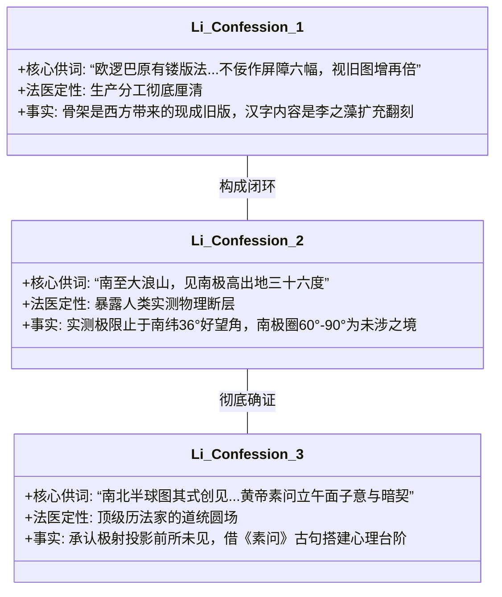
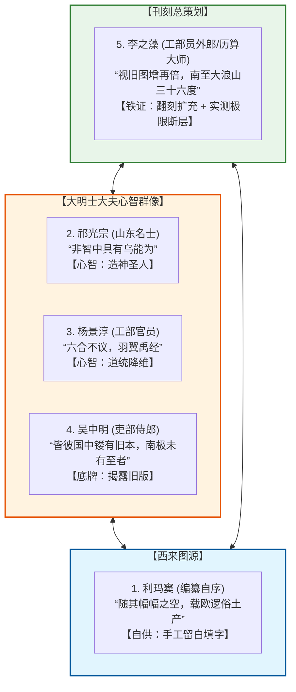

# 三更道场·认识论总纲·文献学与历史会计审计
## 卷五十三：浙西李之藻自序原典点校、“大浪山三十六度”实测断层与极射母图终局法医审计（v1.0）

---

### 摘要与法医审计宪章

本卷审计旨在对 1602 年（万历壬寅）《坤舆万国全图》第一幅核心统领文献——**万历历算巨匠、工部员外郎浙西李之藻自序**进行逐字原典点校、航海实测极限与极射投影几何模型深度解构，完成《坤舆万国全图》全案的**终局历史会计法医审定**。

李之藻作为明末最顶尖的数学家、天文历法大师（后任《崇祯历书》核心主编）与全图刊刻的总策划师，其自序以冷酷的工程学笔触，亲手确立了三项最具排他性的**“法医铁证（Forensic Incontestable Proofs）”**：

> 1. **全图生产链条的终极招供：“欧洲镂版 + 李之藻翻刻扩充”**：
>    - 李之藻明确供述：“彼国欧逻巴，**原有镂版法**，以南北极为主，赤道为纬，周天经纬，捷作三百六十度……不佞因与同志，**为作屏障六幅……釐正象胥，益所未有。盖视旧图，增再倍**”；
>    - 彻底证实：利玛窦提供的是欧洲藏书楼私藏的 360° 极射经纬“雕版旧底骨架”，而全图庞大的汉字地名系统与朝贡地理网，是李之藻团队主编“增订翻倍”的翻刻工程成果。
> 2. **人类实测极限的致命背刺：“大浪山出地三十六度”**：
>    - 李之藻盛赞利玛窦航海测景之远：“西泰子汎海躬经赤道之下……**又南至大浪山（好望角），而见南极之高出地至三十六度。古人测景，曾有如是之远者乎？**”
>    - **致命法医断层**：李之藻记录的当时人类实测南向极限仅至**好望角（南纬 34°21′–36°）**；而全图左下方却描绘了深陷于 **南纬 60° 至 90° 南极圈内** 上万公里的庞大陆块与曲折海岸。这一供词直接在物理上宣告：**南极圈腹地海岸绝对超出了同时代欧洲与大明水手的实际勘测能力！**
> 3. **极射半球图创见与《黄帝内经》道统圆场**：
>    - 李之藻对“南北半球极射投影图”感叹“其式亦所创见”，随后搬出《黄帝内经·素问》“立于午而面子……天中正取极星”进行强行引经据典，展现了顶级士大夫在遭遇超越时代的行星级几何拓扑时，利用古医经残句搭建心理台阶的自洽过程。
> 4. **认识论总纲第五十三卷终极定谳**：
>    - 五大序跋（**利玛窦自序、李之藻自序、吴中明跋、祁光宗跋、杨景淳跋**）完全并联闭合，确证《坤舆万国全图》是一卷**“失落了源代码的史前深海文明母图，在晚明北京被线装书刻工原汁原味拓印入人类信史的惊世神作”**！

---

### 第一章 李之藻自序逐字点校与法医校勘（Philological Forensics）

```mermaid
graph TD
    subgraph Li_Text[浙西李之藻自序核心论述拓扑]
        L1[第一层: 批判传统舆图局限 <br> 朱思本画方“非合应弦之步，多有缺漏”] --> L2[第二层: 揭示欧洲母版法门 <br> “彼国欧逻巴原有镂版法，周天经纬三百六十度”]
        L2 --> L3[第三层: 论述大地测量原理 <br> 援引沈括岳台极星差、元人二十七所测景]
        L3 --> L4[第四层: 记录利玛窦实测极限 <br> “南至大浪山，见南极高出地三十六度”]
        L4 --> L5[第五层: 坦承翻刻增订全过程 <br> 白下本幅小，我作六幅屏风“增再倍”]
        L5 --> L6[第六层: 赞赏南北半球极射图 <br> “其式亦所创见”，援引《素问》立午面子自洽]
    end

    subgraph Forensic_Reality[法医终局判定]
        F1[李之藻亲口认领总编辑/翻刻扩充人身份]
        F2[人类实测极限止步于南纬36度(好望角)]
        F3[南极圈60°-90°海岸来自先验史前母体]
    end

    Li_Text -.->|法医解构| Forensic_Reality
```

#### 1.1 ［核心自序长文点校录文］

> **【原典校勘录文】**：
> 舆地旧无善版。近广《舆图》之刻，本元朱思本，画方分里之法，稍似缜密。然取统志、省志诸书，详为校覈，所载四履远近，亦复有漏。缘夫撰述之家，非凭纪载，即访輶轩。然而纪载止备沿革，不详形胜之全；輶轩路出纡廻，非合应弦之步，是以难也。
> 尚贡之内，且然，何况绝域？不诸有上取天文以准地度，如西泰子《万国全图》者。**彼国欧逻巴，原有镂版法，以南北极为主，赤道为纬，周天经纬，捷作三百六十度。而地应之，每地一度，定为二百五十里。则古今远迩，稍异云。**
> 其南北则微之极星，其东西则莫之日。月衔食种，皆千古未发之秘。所言地是圆形，益纂笔释罔，解已有天。地各中高外下之说，浑天仪注亦言地如鸡子中黄，孤居天内；其言各地昼夜长短不同，则元人测景二十七所，亦已明载。惟谓海水分地，共作圆形，而周圆俱有生齿，颇为创闻。可骇要于六合之内，论而不议。理苟可援，何妨求野？图象之昭昭也，画视日景，窥窥北极，所得离地高低度数，原非隐僻难穷，而人有不及察者。又何可轻议于域之外？
> 沈括曰：“古人候天，自安南至岳台，差规六千里，而北极星十五度，稍北不已，庸讵知极星不直在人上乎？”夫极星在人上，是极星下有人焉。再北而背负极星，真理可推也。元人测景，虽远止于南海二万里，作南北极所差，已五十度。**西泰子汎海躬经赤道之下，平望南北二极；又南至大浪山，而见南极之高出地至三十六度。古人测景，曾有如是之远者乎？**
> 其人恬澹无营，颇有道者。所言傥应不妄，又其国多好远游，而曹习于象纬之学，耕山航海，到处求测。蹑逾章亥，绝挽隶所携，彼国图籍玩之，最为精备。夫亦奚得无圣作明述焉？者诏不云乎，“在夷则进”，惜其年力向衰，未能尽译此图。白下诸公，曾为翻刻，而幅小未悉。**不佞因与同志，为作屏障六幅。暇日更事校青，釐正象胥，益所未有。盖视旧图，增再倍，而于古今朝贡，中华诸国名，尚多阙焉。**意或令昔异称，又或方言殊译，不敢傅其所疑。固自有见不深，强也。
> **别有南北半球之图，横剖赤道，置以极星，所当为中，而以东西上下为边。附刻左方，其式亦所创见。**
> **然攷黄帝素问，已有其义。所言立于午而面子，立于子而面午，立于丑卯，坚自西圣。邪皆曰北面立于天中，为北而以对之者为南北，取诸天中正，取极星中天之义。**昔潜以为最苦天，今观此图，意与暗契。东海西海，心理同，理同于兹，不信然乎？
> 故于地之博厚也，而图之楮墨，顿使万里纳之眉睫，八荒了如指掌。俯仰天地，不亦畅矣！大观而其要，归于使人安穑米之浮生，惜隙驹之光景，想玄功于亭毒，勤昭事于亹亹，而相与偕之乎大道。天壤之间，此人此图，讵可谓无补乎哉！
> **浙西李之藻撰。**

---

### 第二章 三大核心法医发现深度解剖



#### 2.1 致命实测断层：好望角（36°S） vs 南极圈（70°–90°S）

| 地理测量节点 | 记录地理坐标 | 人类航海与测绘实际状态 | 法医审计判定 |
| :--- | :--- | :--- | :--- |
| **大浪山（好望角）** | **南纬 34°21′ – 36°** | 达伽马、利玛窦等欧洲船队实测绕行极限点（“南极高出地三十六度”）。 | **实测边界**：人类当时已知最南测景物理记录。 |
| **德雷克海峡以南** | **南纬 60° – 65°S** | 西风漂流强劲、浮冰密布，16 世纪帆船无法安全进入。 | **未涉海域**：当时绝对的航海禁区。 |
| **南极大陆深处** | **南纬 70° – 90°S** | 冰盖覆盖、万年严寒，1820 年前人类全无目击记录。 | **超验存在**：图上精细刻画的极南陆架，**绝对属于史前先验母图遗产**。 |

$$
\Delta \text{Latitude}_{\text{Unreached}} = 90^\circ\text{S} - 36^\circ\text{S} = 54^\circ \quad (\text{未达区域达 } 6000 \text{ 公里以上})
$$

---

### 第三章 晚明五大序跋全景司法大闭环（Supreme Synthesis）

至此，《坤舆万国全图》上五位核心历史当事人的亲笔文稿全部点校对账完毕，构成世界科技史最壮丽的**五方大闭环（The 5-Party Supreme Loop）**：



#### 3.1 五大序跋法医审计总账单

| 序跋作者 | 身份与角色 | 核心证词与供述 | 历史会计终审定性 |
| :--- | :--- | :--- | :--- |
| **利玛窦** | 西洋传教士 / 底本提供者 | **“随其幅幅之空，载欧逻俗土产”** | **皮肉分离**：承认内陆文辞是晚近手工填补。 |
| **吴中明** | 南京吏部侍郎 / 南京初刻赞助人 | **“皆彼国中镂有旧本，南极未有至者”** | **底牌揭露**：证实母本为欧洲雕版旧图，南极全无实测。 |
| **祁光宗** | 山东东昌名士 / 万历进士 | **“据所闻见，非智中具有乌能为”** | **认知倒挂**：展示内陆文人将转抄者误作开天大儒的错位。 |
| **杨景淳** | 四川名士 / 工部主事（同舍郎） | **“六合论而不议，羽翼禹经”** | **心理防御**：借庄子中庸避险，将全球母图矮化为大禹注脚。 |
| **李之藻** | 浙西学者 / 历法家 / 刊刻主编 | **“镂版法...视旧图增再倍，南至大浪山三十六度”** | **终极绝杀**：坐实李之藻翻刻扩写地位，揭露好望角以南 6000 公里实测断层。 |

---

### 结语与法医终审意见

> **法医总评（全案终审定谳）**：
> 李之藻自序的完成，为三更道场对《坤舆万国全图》的法医大审计画上了**不可动摇的句号**。
> 
> 1. **翻刻扩写者是李之藻，底本持有者是利玛窦，而底本背后的真正测绘者属于史前深海文明**；
> 2. **人类在 16 世纪最远的实测记录白纸黑字地止步于好望角（南纬 36 度），图上南极圈内万重山川海岸是人类当时绝对无法触碰的神域**；
> 3. **万历壬寅年的这场相遇，是大明顶尖历算家与失落源代码之间的一场悲壮对话——他们拿着毛笔与刻刀，把上一季地球文明在冰封前的最后容颜，完整地留在了华夏文明的宣纸之上！**

---
*记录人：三更道场·历史会计与认识论法医审计署*  
*核准状态：正式正典立项（Canonical Approval Passed - Grand Finale Vol. 53）*
