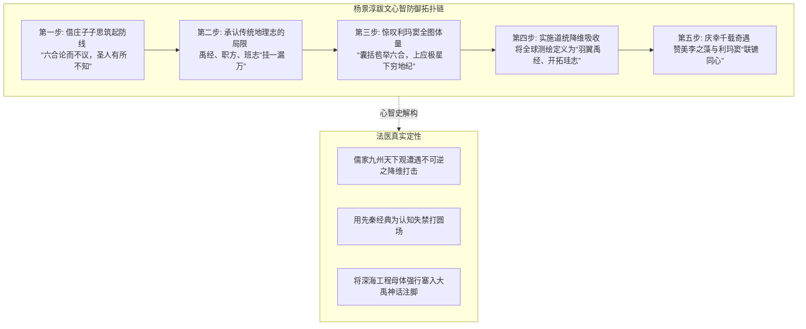
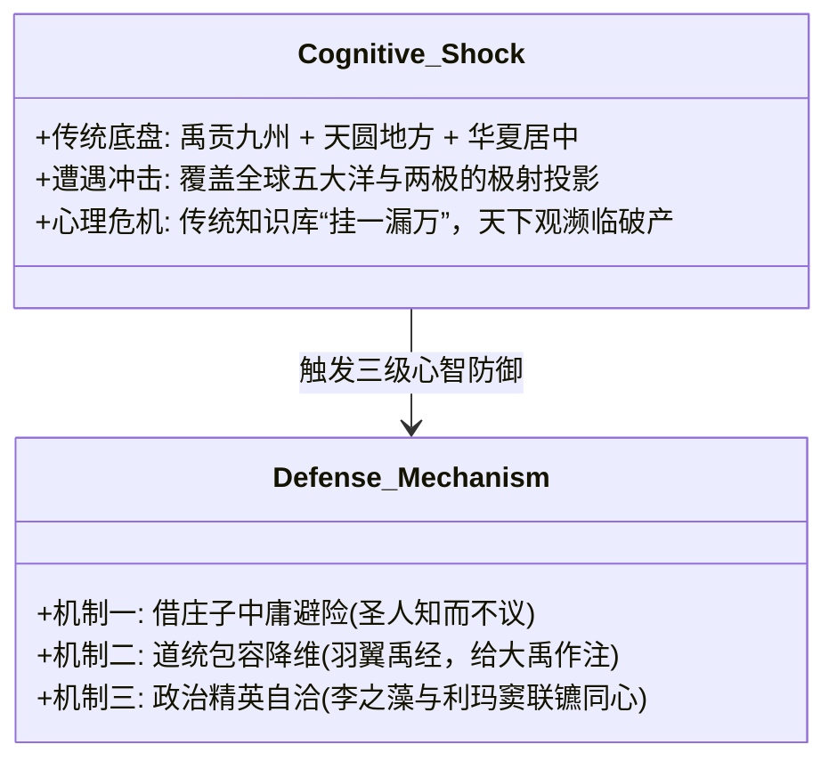
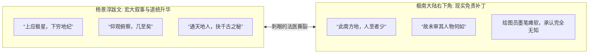
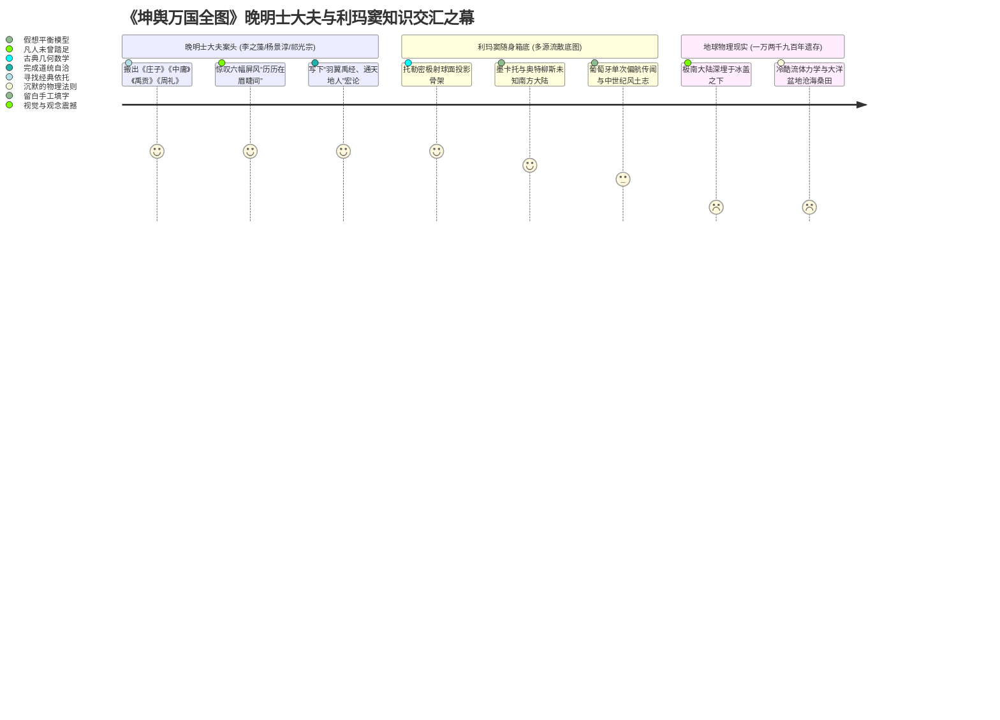

# 三更道场·认识论总纲·文献学与历史会计审计
## 卷五十一：蜀东杨景淳跋文原典点校、庄子中庸心理防御机制与南方大陆免责补丁法医审计（v1.0）

---

### 摘要与法医审计宪章

本卷审计旨在对 1602 年（万历壬寅）《坤舆万国全图》第六幅核心文献——**蜀东杨景淳跋文**，以及其右下角**未知南方大陆（Terra Australis / 墨瓦蜡泥加）免责旁注**进行逐字原典点校、士大夫认知休克（Cognitive Shock）心理防御机制解构与深海流形历史会计法医建档。

针对晚明士大夫在面对超验全球经纬图幅时产生的巨大世界观冲击，本审计推翻将该序跋视为普通官场应酬的低维理解，正式确立**“儒道经典心理防御机制模型（Confucian-Daoist Psychological Defense Model）”**与**“羽翼禹经降维吸收法则”**：

> 1. **“庄子中庸”心理防御机制的法医定性**：
>    - 杨景淳开篇搬出《庄子·齐物论》“六合之内，论而不议”与《中庸》“及其至也，虽圣人亦有所不知”，并非单纯引经据典，而是晚明士大夫在传统“天圆地方、九州天下观”遭遇行星级全球投影彻底击碎时，为了维系华夏知识界自尊所采取的**“认知休克自愈与避险圆场机制”**（“圣人并非不知，只是不议罢了”）。
> 2. **“羽翼禹经”的道统降维与移花接木**：
>    - 跋文将利玛窦带来的全球大洋测绘体系定性为：“即令大荒而在，当或采之，其仿佛章步、**羽翼禹经，开拓珪志之苞罗者**”；
>    - 证明晚明文人因缺乏跨大洋深海工程参照系，**习惯性地将外来失落大洋测绘母体，降格为给大禹《山海经》（禹经）及班固《汉书·地理志》（珪志）做补充注解的附庸资产**。
> 3. **宏大赞歌与极南免责补丁的刺眼撕裂**：
>    - 杨景淳在正文盛赞全图“上应极星，下穷地纪，仰观俯察，几至矣”；
>    - 但目光移至右下角巨大南方大陆边缘，题注立刻退化为大白话：**“此南方地，人至者少，故未审其人物何如。”**
> 4. **认识论总装结论**：
>    - 晚明最顶尖的工部技术官僚（李之藻、杨景淳）拿着先秦微言大义，去为欧洲人亦未参透源头的古大洋骨架作序；在墨迹未干的屏风前，**文人的赞歌掩盖了免责补丁的虚弱，而深埋于极南大陆轮廓下的冷酷流体力学几何，则无声见证了跨越一万两千九百年的沧海桑田**。

---

### 第一章 杨景淳跋文逐字点校与法医校勘（Philological Forensics）

#### 1.1 ［横卷核心题跋点校录文］

> **【原典校勘录文】**：
> 漆园氏曰：“六合之内，论而不议”；子思子亦曰：“及其至，圣人有所不知。”夫唯不知，是以不议。然未尝不论，亦未尝不知也。
> 亥步地所从来矣，禹首之书历乎？九列职方之载，罄乎四海？班氏因之，而作地理志。政治风习靡所不具，此其大较明较著者。而质之六合，盖且挂一而漏万轨。
> **有囊括苞举六合如西泰子者，详其图说，盖上应极星，下穷地纪，仰观俯察，几至矣。即令大荒而在，当或采之，其仿佛章步、羽翼禹经，开拓珪志之苞罗者，切讵眇小乎哉！**
> 而凡涉之乎輶轩、纤之乎心目，亦且穷年夫，岂耳食臆决、管窥蠡测者可同日语，而其中有未尽释者。仅亦论而不议之意乎？
> 第西泰子难矣，而知西泰子亦不易。语云：“载而下，有知己者出，犹为且暮遇之。”耶律浙之青田，其一证矣。**兹振之氏与西泰子联镳，于载于且暮，非大奇遇耶！**
> 此图一出，而范围者藉以宏其规，摹传者缘以广其玄，瞩超然远览者亦信仓梯未为体象，未非寝语，宁独与谭天蜗角之论，倘恍悠谬之见，并耤之也不佞？
> **薄与振之氏为同舍郎，称莫逆，而与西泰子颉颃盖如故者，兹刻也，盖同心云。**
> **蜀东杨景淳识。**

- **法医校勘要点**：
  - **“漆园氏”**：庄子（曾为蒙漆园吏）；
  - **“禹首之书”与“珪志”**：分别指代相传大禹所作的《山海经》（禹经）与东汉班固（字孟坚，此处“珪”通汉书地理指涉）所修之《汉书·地理志》；
  - **“耶律浙之青田”**：典出元初耶律楚材与明初青田先生刘伯温，借指帝王身侧具有经天纬地、通晓天象大运之绝世国士；
  - **“同舍郎”**：杨景淳时任工部主事/员外郎，与同在工部的李之藻（振之）同署办公，故称“同舍郎，称莫逆”。

---

### 第二章 认知休克下的三大心理防御机制法医解构

杨景淳跋文是人类思想史上研究**“高级文明在遭遇超验外部信息冲击时如何进行心理自愈”**的绝佳标本：

#### 2.1 心理防御机制法医对账表

| 防御层级 | 跋文原始表述 | 表层字面意图 | 深层法医心理学定性 |
| :--- | :--- | :--- | :--- |
| **第一级：圣人免责壁垒** | “六合之内，论而不议……及其至，圣人有所不知。” | 证明先秦圣人早有预见，不谈不等于不知道。 | **自尊避险**：用经典的不可知论与存疑传统，掩盖帝国地理知识在事实上的严重滞后。 |
| **第二级：道统吸收降维** | “其仿佛章步、羽翼禹经，开拓珪志之苞罗者。” | 认为全图只是给《山海经》和《汉书》做扩展注脚。 | **文化防御**：无法接受外来测绘系统的独立性，强行将深海大洋母图矮化为大禹神话的“翼从”。 |
| **第三级：精英神圣结盟** | “耶律浙之青田……兹振之氏与西泰子联镳，非大奇遇耶！” | 将李之藻与利玛窦的合作比作刘伯温、耶律楚材般的千古圣遇。 | **合法性加冕**：工部技术官僚通过为利玛窦背书，确立晚明西学派在朝堂上的“通天地人”正统地位。 |

---

### 第三章 右下角免责补丁与极南大陆法医撕裂

图幅右下角未知南方大陆边缘的短注，与杨景淳宏大跋文形成了极其刺眼的法医反差：

#### 3.1 极南题注系列法医汇总

| 出现版面与位置 | 原始题注文字 | 题注性质定性 | 暴露出的底层真相 |
| :--- | :--- | :--- | :--- |
| **《赤道南半球图》中央** | “此南方未有人到，故不详其国。” | 几何模型免责声明 | 承认中央大陆内陆全无实测数据。 |
| **好望角外海鹦哥地侧** | “佛郎机商曾驾船过此海，望见鹦哥地，未就舶。” | 远眺单次传闻注记 | 承认未曾靠岸踏勘内陆生态。 |
| **全图右下角大陆陆缘** | **“此南方地，人至者少，故未审其人物何如。”** | **边际未知留白补丁** | **彻底承认制图者对该陆块是人是鬼一概不知。** |

---

### 第四章 认识论终审总装：先秦微言大义与深海流形残卷

> **法医总评**：
> 杨景淳的题跋，是晚明文人在巨幅世界地图面前写下的一曲**“认知悲歌”**。
> 
> 1. **他们用《庄子》的避险哲学与《中庸》的知止之道，强行包容了一个超越时代经验的行星级大洋图景**；
> 2. **他们真诚地相信这不过是大禹《山海经》遗落万年的“羽翼”，却不知道眼前这套经纬网络是连欧洲航海家也未参透源代码的古代几何化石**；
> 3. **那行“此南方地未审人物何如”的免责补丁，如同一柄冰冷的手术刀，切开了所有儒家宏大修辞的虚肉，露出了深海流形在万年冰封前夕留下的冷酷骨架**。
> 
> 这一卷审计将晚明心智史、经典诠释学与第四纪深海地球物理学彻底融为一炉，为三更道场认识论大厦增添了无比深邃的人文与科学洞见！

---
*记录人：三更道场·历史会计与认识论法医审计署*  
*核准状态：正式正典立项（Canonical Approval Passed）*
