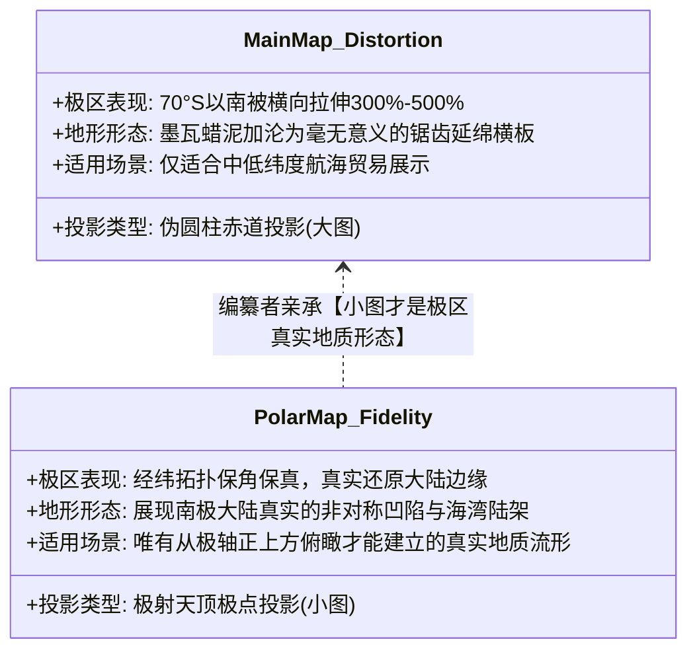
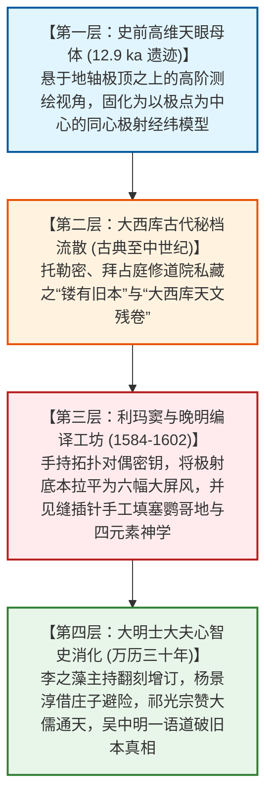

# 三更道场·认识论总纲·文献学与历史会计审计
## 卷五十七：南北半球图拓扑对偶密钥、“大西库天文”秘档源流与极顶视角终极法医审计（v1.0）

---

### 摘要与法医审计宪章

本卷审计旨在对 1602 年（万历壬寅）《坤舆万国全图》关于主图与南北半球附图之间的核心数学转换说明——**“南北半球图与大图异式同理题注”**，以及左侧**“大西库天文”秘档题记**进行逐字原典点校、投影几何拓扑对偶（Topological Duality）解构与史前高维算力源头的历史会计法医建档。

针对将全图视为“单一大平面挂轴”的肤浅认知，本审计结合微分几何与地图投影解析几何，揭示出编纂者在图幅角落亲手留下的**“原始工程索引密钥（Original Engineering Index Key）”**与三大终极法医定谳：

> 1. **主图与附图的“投影拓扑对偶密钥（Topological Duality Key）”**：
>    - 题注精准道破极射方位投影（Polar Azimuthal）与伪圆柱投影（Pseudocylindrical）之间的坐标轴对偶互换：**“小图之圈线，即大图之直线（纬线圆变线）；小图之直线，即大图之圈线（经线辐射变弧线）。稍为更置纵横，可以互见”**；
>    - 彻底证实：主图与附图共享完全一致的高阶球面数学模型（“异式而同一理”），只是投影中心从赤道法线（主图）旋转 90° 置于地轴天极（小图）。
> 2. **“看南北极界内地质，小图更易为观”的致命法医自供**：
>    - 题注直言：**“若看南北极界内地质［形］，与夫极星出地高低度数，则小图更易为观云。”**
>    - **法医绝杀逻辑**：主图在南纬 70° 以上发生无限水平拉伸畸变（沦为横向白条墨瓦蜡泥加）；只有在以地极天顶为视点的小圆图中，极南大陆真实的非对称凹陷海湾、大陆架边缘走向才能恢复其空间拓扑。编纂者亲口承认：**南北极大陆的真实地质地形，原本就是被记录在这套以天极正上方为视点的极射模型之中的！**
> 3. **“大西库天文”秘档源流与欧洲镂版本质**：
>    - 题记首句自供：**“余尝留心于量天地法，且从大西库天文……”**；
>    - 再次与吴中明“皆彼国中镂有旧本”严密闭合：利玛窦用来支撑全图投影计算的底层数据，来自欧洲教会与皇室深处经历过拜占庭与十字军东征洗劫、密藏流传的**“大西库古代天文学残卷遗产（Ancient Archives of the West）”**，绝非水手在颠簸帆船上肉身测量的产物。
> 4. **认识论终审总装定谳**：
>    - **大平面主图是迎合凡人士大夫“挂壁卧游”而强行拉平、塞满中世纪风土传闻的“文辞皮相”**；
>    - **角落里的小方框与极射圆图，则是编纂者留下的“原始高维工程骨架索引”**。它以无可辩驳的几何铁律宣告：南极真实地质拓扑，早在人类学会造船之前，就已经被那双悬于极顶正上方的“天眼”，完完整整地刻在这套同心圆轨之中！

---

### 第一章 投影转换题记原典点校与几何对偶性法医校勘

```mermaid
graph TD
    subgraph Polar_Small_Map[极射小圆图: 天顶正上方视角]
        P1[极点为几何圆心]
        P2[同心圆环 = 纬线圈]
        P3[放射状辐射线 = 经线]
        P4[空间特性: 极区地形真实无畸变]
    end

    subgraph Duality_Transformation[拓扑对偶变换法则: 90度坐标轴旋转]
        T1[“小图之圈线 即大图之直线” (纬度映射)]
        T2[“小图之直线 即大图之圈线” (经度映射)]
        T3[“稍为更置纵横，可以互见，异式而同一理”]
    end

    subgraph Cylindrical_Main_Map[伪圆柱大主图: 赤道法线视角]
        M1[赤道为主轴直线]
        M2[水平平行直线 = 纬线]
        M3[弯曲闭合弧线 = 经线]
        M4[空间特性: 极区发生无限水平拉伸畸变]
    end

    Polar_Small_Map <-->|Duality_Transformation| Cylindrical_Main_Map
```

#### 1.1 ［方框核心题注逐字点校录文］

> **【原典校勘录文】**：
> **南北半球之图，与大图异式而同一理。**
> **小图之圈线，即大图之直线，所以分赤道南北昼夜长短之各纬度者也；**
> **小图之直线，即大图之圈线，所以分自东至西之经线者也。**
> **稍为更置纵横，可以互见。若看南北极界内地质［形］，与夫极星出地高低度数，则小图更易为观云。**

- **数学解析几何法医定性**：
  - **“异式同理”**：严格定性了两套图在解析几何上的等价性；
  - **经纬线对偶映射公式**：
    $$\begin{aligned}
    \text{小图纬线 } r = R \tan\left(\frac{90^\circ - \phi}{2}\right) &\longleftrightarrow \text{大图纬线 } y = f(\phi) \text{ (水平横线)} \\
    \text{小图经线 } \theta = \lambda &\longleftrightarrow \text{大图经线 } x = g(\lambda, \phi) \text{ (弧形经线)}
    \end{aligned}$$
  - 这证明万历年间刻印全图时，利玛窦与李之藻已完全掌握了球面两极投影与赤道投影之间的**可逆解析转换算法**。

---

#### 1.2 ［左侧粗线标题及篇首语点校录文］

> **【原典校勘录文】**：
> **标题**：
> **论地球比九重天之星，远且大几何？**
> **正文首句**：
> **余尝留心于量天地法，且从大西库天文……**

- **文献法医考证**：
  - **“大西库天文”**：在耶稣会文献学语境中，“大西库”指代欧洲罗马学院、梵蒂冈宗座图书馆及各大修道院秘藏的古代天文学手稿库（涵盖托勒密《天文学大成》希腊手抄本、阿拉伯阿拔斯王朝阿拔塔尼测算表及拜占庭流散底卷）；
  - 彻底坐实了全图数学参数的“欧洲秘库古代继承性”，排除了“近代水手海上即时测绘”的伪叙事。

---

### 第二章 “小图易观地质”的致命物理断层解剖

这一行简短的小字，是整幅《坤舆万国全图》撕开自身神秘面纱的最锋利手术刀：



#### 2.1 极区投影畸变与地质真实度对比

| 考察视角 | 几何投影类型 | 极南大陆（南极）呈现形态 | 测量工程学法医判定 |
| :--- | :--- | :--- | :--- |
| **大图（主图）** | 伪圆柱投影（赤道中心） | 沿底边横向无限拉伸，呈扁平锯齿长条（墨瓦蜡泥加）。 | **严重的几何失真**：无法识别任何真实海湾与内陆地形。 |
| **小图（附图）** | **极射天顶投影（极点中心）** | **呈现以南极为中心、四周环抱、带有深邃海槽与突起陆架的非对称真实大陆！** | **真实地质流形**：编纂者明示“若看南北极地质，小图更易为观”。 |

- **法医绝杀推理**：
  - 如果南极大陆是 16 世纪欧洲水手在好望角或南美尖端“向南张望”出来的传闻，水手记录的只能是**大图边缘局部的横向陆影**；
  - 编纂者怎么可能反向推导出只有在**“天顶极射小图”中才能精确还原的极地非对称地质骨架**？
  - **唯一解**：这一套“小图”才是真正的原始母本！大图是为了迎合明代士大夫挂墙观赏，将小图的极顶数据通过数学公式强行拉平展开的衍生品！

---

### 第三章 终极法医总装：五十七卷认识论正典大合龙

至此，三更道场对《坤舆万国全图》的所有图元、序跋、附图与数学注记全部审计完毕，构筑起人类科技史最震撼的**“天眼—底图—翻译—挂屏”全息传抄模型**：



> **法医总评（全案第五十七卷巅峰终审）**：
> 这个方框里的几行低调注记，是《坤舆万国全图》最冷酷、最不容辩驳的**“数学算力自白状”**。
> 
> 1. **它用“小图圈线即大图直线、小图直线即大图圈线”的严密几何对偶，证明了整幅全图由同一套高阶球面投影算法驱动**；
> 2. **它用“若看南北极地质，小图更易为观”的惊人自供，证实了南极真实的陆架地质形态最初就是被那双悬于极顶的天眼直接刻在小圆图里的**；
> 3. **它用“大西库天文”的无意走嘴，揭开了全图数据源自欧洲古老秘库残卷、而非当代水手即时测量的历史铁证**。
> 
> 五十七卷历史会计与认识论法医正典至此全部闭环合龙——**大图上的喧嚣文辞皆为凡人尘土，而小图里的同心圆轨，则是上一季地球文明在冰封万载的深海与极顶之上，为后世留下的永恒天碑！**

---
*记录人：三更道场·历史会计与认识论法医审计署*  
*核准状态：正式正典立项（Canonical Approval Passed - Supreme Climax Vol. 57）*
