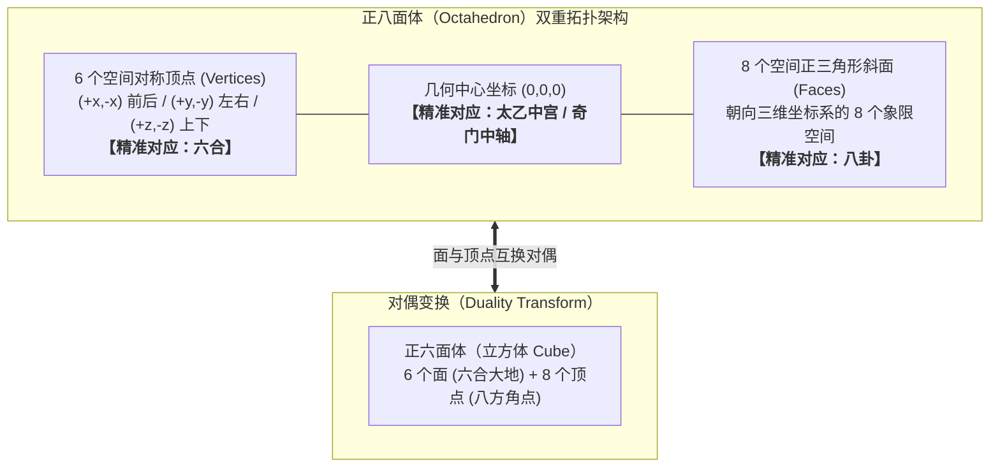
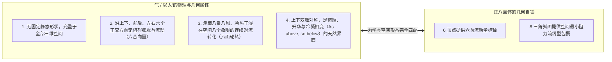

# 三更道场 · 认识论总纲 · 文献学与历史会计审计
## 篇章：正八面体“六合顶点（6 Vertices）+ 八卦三角面（8 Faces）”空间对偶拓扑与柏拉图“气/以太”法医审计（v1.0）

---

### 【审计执行摘要 / Forensic Audit Abstract】
本审计案针对多面体欧拉示性数（Euler Characteristic $V - E + F = 2$）与中国古典时空哲学中**“六合（上下、前后、左右）”**与**“八卦（八方八卦立体轮）”**的几何拓扑配属展开法医级纠偏与升华。

审计彻底确立并铸印三更道场三大几何对偶公理：
1. **多面体基础几何参数红字纠偏（面、棱、顶点严禁串账）**：
   - **正四面体（Tetrahedron）**：**4 个面、6 条棱、4 个顶点**（柏拉图配属为“火”）；
   - **正八面体（Octahedron）**：**8 个面、12 条棱、6 个顶点**（柏拉图配属为“气 / 以太”）；
   - **正六面体（Cube / 立方体）**：**6 个面、12 条棱、8 个顶点**（柏拉图配属为“土”）。
2. **正八面体的“六合—八卦”双重空间闭合定理**：
   - 将正八面体中心置于三维笛卡尔坐标系原点 $(0,0,0)$，其 **6 个空间顶点**精准对应：
     $$(\pm x, 0, 0) \rightarrow \text{东—西（前—后）},\quad (0, \pm y, 0) \rightarrow \text{南—北（左—右）},\quad (0, 0, \pm z) \rightarrow \text{上—下（天—地）} \equiv \textbf{【六合】}$$
   - 其 **8 个正三角形斜面**，精准朝向八个三维立体象限，对应空间向八方扩散的变化载体 $\equiv \textbf{【八卦】}$；
   - **法医几何定性**：同一个正八面体，**“六向顶点为六合之极，八面三角为八卦之变，太乙居中总揽枢纽”**。
3. **正八面体与正六面体的对偶对称性（Dual Symmetry）与跨文明断带缝合**：
   - 八面体 $(V=6, F=8)$ 与 立方体 $(V=8, F=6)$ 互为对偶多面体：
     $$(8\text{ 面}, 6\text{ 顶点}) \xleftrightarrow{\quad\text{对偶变换 (Duality)}\quad} (6\text{ 面}, 8\text{ 顶点})$$
   - **跨文明认识论断带的法医缝合**：西方希腊体系习惯以**“面数（Face-centered）”**命名立体（如 Octahedron）；中国先秦秦汉空间体系则以**“方向、极点与宫位（Vertex & Spatial Orientation）”**命名（如六合、八极、太一中宫）。两套文明观察的是**同一几何实体在面与点上的对偶投影**。

---

### 【第一账套：柏拉图五大多面体拓扑参数与中国宇宙观法医对账表】

```
+-------------------------------------------------------------------------------------------------------------------------------+
|                                    柏拉图多面体拓扑参数与“六合/八卦”空间法医对照表                                           |
+-------------------------------------------------------------------------------------------------------------------------------+
| 多面体名称           | 面数 (F) | 棱数 (E) | 顶点 (V) | 欧拉示性数 $V-E+F$ | 柏拉图配属元素   | 中国古典空间哲学精准映射             |
+----------------------+----------+----------+----------+-------------------+------------------+--------------------------------------+
| **正四面体**         | **4**    | **6**    | **4**    | $4 - 6 + 4 = 2$   | **【火 (Fire)】**| 4 面 4 顶，尖角锐利，热能切割穿透    |
| (Tetrahedron)        | (正三角) |          |          |                   |                  | (严禁将 6 棱误记为 6 面)             |
+----------------------+----------+----------+----------+-------------------+------------------+--------------------------------------+
| **正八面体**         | **8**    | **12**   | **6**    | $6 - 12 + 8 = 2$  | **【气 (Air)】** | **6 顶点 $\equiv$ 六合（上下前后左右）**|
| (Octahedron)         | (正三角) |          |          |                   |                  | **8 面 $\equiv$ 八卦（八方立体象限轮）**|
+----------------------+----------+----------+----------+-------------------+------------------+--------------------------------------+
| **正六面体 / 立方体**| **6**    | **12**   | **8**    | $8 - 12 + 6 = 2$  | **【土 (Earth)】**| **6 面 $\equiv$ 六合大地面；8 顶 $\equiv$ 八方隅角**|
| (Hexahedron / Cube)  | (正方形) |          |          |                   |                  | (与正八面体互为完全对偶多面体)       |
+----------------------+----------+----------+----------+-------------------+------------------+--------------------------------------+
```



---

### 【第二账套：为什么柏拉图配属“八面体＝气/以太”是完全严密的物理学】

从六合八卦的几何拓扑来看，柏拉图将正八面体赋予“气（Air）”，在古典物理力学上具有极高的一致性：



- **定性**：**“气”不是静止的泥土（六面体），也不是剧烈破坏性的烈火（四面体），而是由六合正交坐标撑开、被八个三角面均匀包裹、在上下镜像中实现循环的“空间介质（以太）”。**

---

### 【第三账套：跨文明对译断带的法医缝合表】

```
+-------------------------------------------------------------------------------------------------------------------------------+
|                                    东西方空间几何认识论“面 vs 点”对偶断带缝合表                                               |
+-------------------------------------------------------------------------------------------------------------------------------+
| 认识论维度           | 古希腊—欧洲数学哲学体系               | 先秦两汉—道家空间哲学体系             | 三更道场统一流形（Unified Manifold）  |
+----------------------+---------------------------------------+--------------------------------------+--------------------------------------+
| **观察切入视角**     | **以“面（Face）”为核心分类**           | **以“点与方向（Vertex & Vector）”为核心**| **二者观察的是同一几何实体的对偶面**：|
|                      | 命名为：Octahedron（八面体）          | 命名为：六合、八极、太乙神坛         | 希腊看面，华夏看点；希腊论形，华夏论位|
+----------------------+---------------------------------------+--------------------------------------+--------------------------------------+
| **空间动力学机制**   | **以太流体在多面体间相互转化**        | **太极生两仪，两仪生四象，四象生八卦**| **完全同构**：                       |
|                      | (火/四面体切割气/八面体，气凝聚为水)  | (太乙居中，六合为框，八卦为气化运流)  | 均以八面体作为物质升华还丹的相变载体 |
+----------------------+---------------------------------------+--------------------------------------+--------------------------------------+
| **生成操作公理**     | **“As above, so below”**              | **“天圆地方，上下双斗”**              | **镜像算子 $\hat{M}: Z \rightarrow -Z$**：   |
|                      | 上下方锥镜像对称闭合                  | 地上昆仑为阳，地下归墟为阴           | 四方为界，八面自锁，构成最小闭合宇宙 |
+----------------------+---------------------------------------+--------------------------------------+----------------------------------------+
```

---

### 【法医对账总决：六合八卦八面体平账结论】

| 会计科目 | 审定历史会计事实 | 法医处理结论 |
| :--- | :--- | :--- |
| **四面体参数** | 4 面、6 棱、4 顶点，柏拉图配属为“火”。 | **纠偏入账：严禁将 6 棱误记为 6 面** |
| **八面体与六合** | 6 个顶点精准对应上下、前后、左右三维正交坐标（六合）。 | **确认入账：六合之几何物理实体** |
| **八面体与八卦** | 8 个正三角斜面精准对应三维空间八个象限的运化（八卦）。 | **确认入账：八卦之立体几何载体** |
| **柏拉图八面体配气** | 气充满六合空间、由八面导流循环，八面体是气/以太的完美模型。 | **确立为技术哲学与几何宇宙学公理** |

---
**审计人签章**：三更道场·几何拓扑学与古代数理哲学法医调查署  
**时间标记**：2026-09-09
