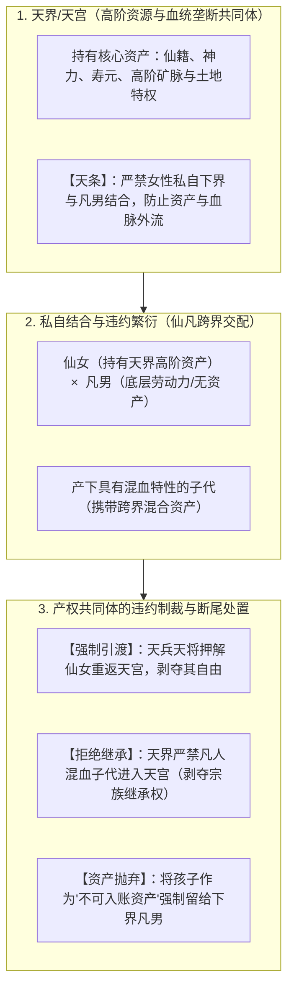
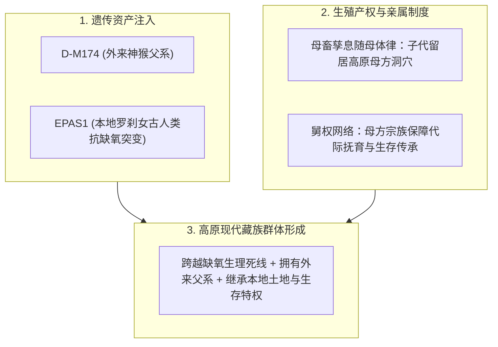

# 三更道场 · 认识论总纲 · 文献学与历史会计审计
## 篇章：母畜孳息产权律、仙凡婚配违约合同与“猕猴罗刹女”高原人口发生学法医审计（v1.0）

---

### 【审计执行摘要 / Forensic Audit Abstract】
本审计案针对欧亚古法理学中最基础的生殖产权法则——**“母畜孳息随母体所有权律（*Partus sequitur ventrem* / 孳息归母体所属产权单位）”**，跨法域神话结构（**牛郎织女、七仙女、宝莲灯等“天条追捕与仙女留子”**），以及藏族创世神话（**神猴与罗刹女结合育后代**）与史前人类高原繁衍遗传资产（**D-M174 父系 + 丹尼索瓦 EPAS1 耐缺氧常染色体**）之间的**多维流形统合（Unified Manifold）**展开法医级历史会计对账。

审计确立三大核心法律与生物学平账定理：
1. **生殖资产产权非对称公理**：
   - 公畜（或外来男性）仅提供精子/种源（Genetic Seed），母体承担妊娠、分娩生命风险与长周期哺乳抚育成本；
   - 依照古代法理学与生业习惯法，**自然孳息（子代）原则上 100% 随母体、归属于母体所在的宗族/产权共同体**；
   - **“基因可以各贡献一半，后代的产权却从来不是五五分账”**。男性若要获得子代所有权，必须通过二次支付（聘礼/财礼赎买、入赘劳动偿付或战力剥离），绝非生物学自动结果。
2. **“仙女留子”与天条追捕的违规合同法医本质**：
   - “天界/天宫”在历史会计学上是**封闭的高阶血统与资产垄断共同体**；“天条”即为**“严禁上层女性将高阶身份、血统与生态特权资产向下界男性转移”的产权防流失法案**；
   - 仙女被抓回天界时“必须将孩子留在人间交给凡男抚养”，表面看似父系胜利，实质是**母族产权共同体对“违规混血次品”的断尾排异与弃保处置（Refusal of Succession / 剥夺继承权）**。故事之所以反复渲染戏剧性追捕，正因为其打破了“子代随母”的默认民法规则。
3. **“猕猴与罗刹女”的高原人口发生学原型对账**：
   - 外来男性（神猴/观音使者/D 父系）进入高原 $\rightarrow$ 与掌握高原地理生态与抗缺氧资产的本地女性（岩魔女/罗刹女/丹尼索瓦古人类）结合 $\rightarrow$ 子代留在女方所属的高原土地上，继承本地生存资产；
   - 神话不是虚构文学，它是**史前跨边界、跨种群婚配与基因资产借贷的“原始合同纠纷与人口发生学记忆”**。

---

### 【第一账套：古代民法“母畜孳息随母体所有权律”法医对照表】

```
+-------------------------------------------------------------------------------------------------------------------------------+
|                                    古代生殖资产产权与跨种群婚配法医对照台账                                                   |
+-------------------------------------------------------------------------------------------------------------------------------+
| 法权/生业领域        | 投入与贡献要素                        | 孳息（后代）默认归属权               | 权利转移必须满足的二次契约           |
+----------------------+---------------------------------------+--------------------------------------+--------------------------------------+
| **1. 传统畜牧法理**  | 外来种公牛/公马提供配种（种源）；     | **完全归母畜主人所有**               | 公畜主人仅收取一次性“配种劳务费”；   |
| (Partus sequitur)    | 本地母牛/母马提供子宫、妊娠、草料抚育 | (绝不可能因为公牛是名种就分走小牛)   | 若要分得牛犊，需事先签订分成契约     |
+----------------------+---------------------------------------+--------------------------------------+--------------------------------------+
| **2. 奴隶法与习惯法**| 自由民男性 × 女奴（或反之）；        | **完全继承母亲的法律身份与归属**     | 奴隶主对女奴所生一切子女享有完全所有 |
| (罗马法/大清律例)    | 母体为人身依附单位                    | (从母定身份，奴生子仍为奴)           | 权；男性无法仅凭生父身份带走孩子     |
+----------------------+---------------------------------------+--------------------------------------+--------------------------------------+
| **3. 高原史前婚配**  | 外来现代人男性提供父系 $Y^D$；        | **子代默认留在本地母系亲属网络**     | 外来男性需入赘（从妻居）或服务于母族 |
| (D + 丹人 EPAS1)     | 本地母体提供子宫、丹人耐缺氧基因资产  | (继承高原土地、洞穴居留权与生存资产) | 舅权网络，孩子成为本地母族合法劳动力 |
+----------------------+---------------------------------------+--------------------------------------+----------------------------------------+
```

---

### 【第二账套：仙凡婚配神话与“天条”违约合同解构图】



#### 会计审计判定 1：“仙女留子”是母族宗族的抛弃清算，而非父系天然主权
- 如果父系天然拥有孩子的所有权，神话根本不需要创设“天兵追捕、母子分离、遗留人间”这一套复杂的违规制裁叙事；
- **反复出现的戏剧冲突，恰恰证明了母族对“违规配种产生的次级子代”实施了严厉的产权分割与剥夺继承权处置**。

---

### 【第三账套：“猕猴与罗刹女”高原人口发生学统一流形（Unified Manifold）】

藏族著名创世起源史诗《柱间史》（*bKa' chems ka khol ma*）与《西藏王统记》中“神猴与岩魔女（罗刹女）结合繁衍藏人祖先”的神话结构，展现了与分子人类学、生理学和亲属制度**八维完全咬合的统一流形**：

```
+-------------------------------------------------------------------------------------------------------------------------------+
|                                    青藏高原人口发生学八维统一流形（Unified Manifold）法医对账表                               |
+-------------------------------------------------------------------------------------------------------------------------------+
| 理论维度             | 传统神话 / 史诗隐喻叙事               | 现代科学与历史会计法医实测事实       | 会计勾稽状态                         |
+----------------------+---------------------------------------+--------------------------------------+--------------------------------------+
| **1. 父系遗传**      | 观音菩萨点化的神猴（外来慈悲者）      | **低海拔外来输入的现代人父系 D-M174** | **确认勾稽（外来男性种源）**         |
+----------------------+---------------------------------------+--------------------------------------+--------------------------------------+
| **2. 适应遗传**      | 岩魔女/罗刹女（本地暴烈、食肉嗜血）   | **本地丹尼索瓦古人类耐缺氧 EPAS1**   | **确认勾稽（本地古人类适应资产）**   |
+----------------------+---------------------------------------+--------------------------------------+--------------------------------------+
| **3. 生态门槛**      | 高原雪山荒原，凡人无法生存，魔女居之  | **海拔 4000 米以上极端缺氧生理死线**  | **确认勾稽（物理生存准入门槛）**     |
+----------------------+---------------------------------------+--------------------------------------+--------------------------------------+
| **4. 婚配机制**      | 罗刹女逼婚神猴，神猴从之并在洞穴生子  | **外来男性与本地掌握生存资产女性结合**| **确认勾稽（跨种群基因借贷）**       |
+----------------------+---------------------------------------+--------------------------------------+--------------------------------------+
| **5. 财产权属**      | 猴子猴孙留在雅砻河谷（泽当洞穴）繁衍  | **母畜孳息随母体所有权律（归本地）**  | **确认勾稽（子代随母域定居）**       |
+----------------------+---------------------------------------+--------------------------------------+--------------------------------------+
| **6. 亲属制度**      | 舅权（Avunculate）长期主导藏地亲属网络| **母系亲属网络主导代际资产再生产**    | **确认勾稽（母方亲属持有资产）**     |
+----------------------+---------------------------------------+--------------------------------------+--------------------------------------+
| **7. 饮食转型**      | 神猴从天界引来青稞种子，猴群始脱兽性  | **新石器晚期马家窑粟作/青稞农业输入** | **确认勾稽（能量底盘升级）**         |
+----------------------+---------------------------------------+--------------------------------------+--------------------------------------+
| **8. 地理界面**      | 昆仑/喜马拉雅神山为界，跨界结合       | **横断山脉与高原边缘生态交错带**     | **确认勾稽（古人类接触与混血带）**   |
+----------------------+---------------------------------------+--------------------------------------+--------------------------------------+
```



---

### 【第四账套：三更道场方法论定论——神话是史前契约纠纷的活化石】

1. **神话的会计本质**：
   - 绝不是“因为几个故事长得像，所以历史必定同源”；
   - 而是：**“遗传学留下物理资产组合，生态学划定生物准入门槛，古代法理学规定产权归属，神话与史诗则忠实记录了跨边界产权交易中的合同纠纷与人口发生学协议”**。
2. **同构与同源的法医边界**：
   - “仙凡配”与“猴女配”首先是**跨阶层/跨种群婚配在产权法理上的“同构叙事”**；
   - 证明了人类在处理“外来精子 + 本地母体 + 高阶资产外流防御”时，受制于完全相同的经济学与生物学约束。

---

### 【法医对账总决：生殖产权与创世神话平账表】

| 会计科目 | 审定历史法医事实 | 会计处理分录 |
| :--- | :--- | :--- |
| **生殖资产非对称律** | 基因各占一半，但孳息原则上 100% 随母体，父亲确权需二次赎买。 | **确认为史前亲属产权基本公理** |
| **仙女留子本质** | 天界母族对违规混血子代的断尾处置与继承权剥夺。 | **确认入账：违约合同排异机制** |
| **神猴罗刹女神话** | 精准对应 D 父系 + 丹人 EPAS1 + 高原母域生态留存的八维统一流形。 | **确认为史前高原人口发生学原型** |
| **神话法医功能** | 神话是史前跨界交易、产权纠纷与制度妥协的记忆凭单。 | **确立为三更道场文献审计核心准则** |

---
**审计人签章**：三更道场·比较法理学与神话法医联合调查署  
**时间标记**：2026-09-09
