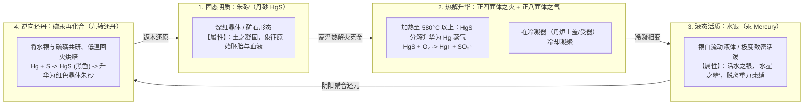
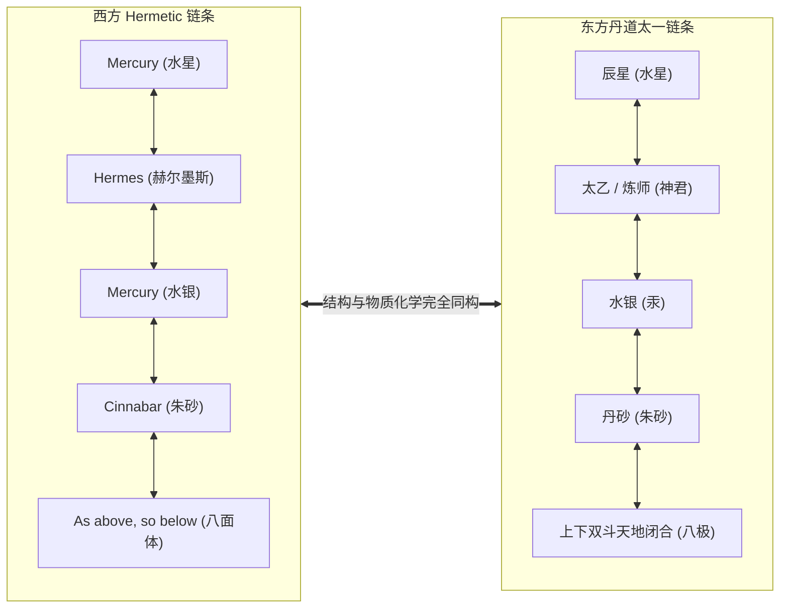

# 三更道场 · 认识论总纲 · 文献学与历史会计审计
## 篇章：硫化汞（HgS）可逆相变物理化学、赫尔墨斯-水星（Mercury）与“太一/以太”正八面体炼丹术统一流形法医审计（v1.0）

---

### 【审计执行摘要 / Forensic Audit Abstract】
本审计案针对欧亚大陆东西两端（希腊-亚历山大里亚赫尔墨斯秘契主义与中国战国秦汉魏晋道家炼丹术）在**水星天体物理（Mercury / 辰星）、水银金属（Mercury / 液态汞）、朱砂（Cinnabar / HgS 硫化汞）可逆相变反应**，以及**正八面体几何、以太（Ether）与“太一/太乙”最高神格**之间的“多重符号与物理化学统一流形（Unified Manifold）”展开法医级历史会计对账。

审计确立三大核心平账公理与文献/物理化学定性：
1. **柏拉图《蒂迈欧篇》（Timaeus）多面体标准元素配属红字纠偏**：
   - **正四面体（Tetrahedron） $\equiv$ 火（Fire）**（尖角锐利、体积最小、穿透与切割力最强）；
   - **正八面体（Octahedron） $\equiv$ 气（Air）**（形态轻盈灵活，介于火与水之间）；
   - **正二十面体（Icosahedron） $\equiv$ 水（Water）**；
   - **正六面体（Hexahedron / 立方体） $\equiv$ 土（Earth）**；
   - **正十二面体（Dodecahedron） $\equiv$ 宇宙整体 / 以太容器**。
   - **定性**：八面体在古典物理学中对应“气/以太介质”，严禁直接记入柏拉图“火”之名下；后世炼金术中将“八面体/双锥”作为可逆反应与蒸馏升华的相变容器。
2. **硫化汞（HgS）闭环可逆相变的宗教神圣化物理机制**：
   $$\text{红色固体朱砂（HgS）} \xrightarrow[\Delta]{\text{高温焙烧分解}} \text{银色液态水银（Hg）} + \text{二氧化硫（SO}_2\text{）}$$
   $$\text{银色液态水银（Hg）} + \text{黄色固体硫磺（S）} \xrightarrow[\text{研磨/低温化合}]{\text{九转还丹}} \text{红色固体朱砂（HgS）}$$
   - **神圣化学的视觉冲击**：**“红色固体 $\rightarrow$ 银白活泼液体 $\rightarrow$ 红色固体”**，在古人眼中展现了物质“死而复生、固液互换、阴阳合德、返本还原”的不可思议循环，成为东西方长生不死、点石成金与九转还丹的最高物质图腾。
3. **东西方炼金/炼丹六维对偶流形（Unified Manifold）**：
   - 证明了东西方并非巧合，而是**人类面对同一种具备极端可逆物理相变特性的物质（硫化汞），将其与天体运行最快之行星（水星/Mercury/辰星）、空间镜像算子（As above, so below）与最高形而上中介（以太/太乙）进行结构性同构封装**。

---

### 【第一账套：柏拉图多面体与相变几何元素标准配属表】

```
+-------------------------------------------------------------------------------------------------------------------------------+
|                                    柏拉图《蒂迈欧篇》五大多面体与元素物理力学配属表                                           |
+-------------------------------------------------------------------------------------------------------------------------------+
| 柏拉图正多面体       | 面数与几何形态                        | 柏拉图分配元素与物理力学特性         | 炼金术与三更道场法医定性             |
+----------------------+---------------------------------------+--------------------------------------+--------------------------------------+
| **1. 正四面体**      | 4 个正三角形 (Tetrahedron)            | **【火（Fire）】**                   | 极度锐利，热能切割，促使物质分解；   |
|                      | 面数最少、尖角最锐利、流动性最强      | 体积最小，能穿透并切割其他多面体     | 充当朱砂受热分解的热力学第一推动力   |
+----------------------+---------------------------------------+--------------------------------------+--------------------------------------+
| **2. 正八面体**      | 8 个正三角形 (Octahedron)             | **【气（Air / 以太）】**             | **镜像升华介质**：上下方双锥自锁，   |
|                      | 具备中央四方赤道面，上下顶点对称      | 介于火与水之间，具备轻盈膨胀与循环性 | 对应“As above, so below”与升华冷凝器 |
+----------------------+---------------------------------------+--------------------------------------+--------------------------------------+
| **3. 正二十面体**    | 20 个正三角形 (Icosahedron)           | **【水（Water）】**                 | 面数最多、最接近球体，代表水之流动   |
|                      | 钝角多、平滑滚动、结合力温和          | 容易流动、能够溶解并包容矿物         | 对应金属汞（水银）的液态流体形态     |
+----------------------+---------------------------------------+--------------------------------------+--------------------------------------+
| **4. 正六面体**      | 6 个正方形 (Hexahedron / 立方体)      | **【土（Earth）】**                  | 稳定性最高，底面坚实，不易翻滚       |
|                      | 90度直角，接触面积最大，稳定性最强    | 代表固体、矿物基底与大地的凝固状态   | 对应红色固态朱砂矿石的基底形态       |
+----------------------+---------------------------------------+--------------------------------------+--------------------------------------+
| **5. 正十二面体**    | 12 个正五边形 (Dodecahedron)          | **【宇宙总体 / 苍穹容器】**          | 对应黄道十二宫，容纳整个宇宙的以太池 |
+----------------------+---------------------------------------+--------------------------------------+--------------------------------------+
```

---

### 【第二账套：硫化汞（HgS）可逆相变与“九转还丹”物理化学循环台账】



#### 会计审计判定 1：可逆相变是史前人类见证的“唯一非衰变循环”
- 普通木柴燃烧化为灰烬，不可逆；铁器生锈腐蚀，不可逆；肉体腐烂死亡，不可逆；
- **唯独水银与朱砂，能够在红与白、固与液之间反复横跳、永不磨灭**；
- 这一化学物理特性，成为秦始皇在地宫灌注巨量水银、汉代方士炼制还丹、西方炼金术士追求哲人石（Philosopher's Stone）的**核心科学基座**。

---

### 【第三账套：东西方“天体—金属—神术—哲学”六维对偶流形表】

```
+-------------------------------------------------------------------------------------------------------------------------------+
|                                    东西方秘契哲学与物理材料六维对偶流形法医对账表                                             |
+-------------------------------------------------------------------------------------------------------------------------------+
| 理论对偶维度         | 西方：赫尔墨斯秘契系统 (Hermeticism)  | 东方：先秦两汉道家丹道系统 (Taoist Alchemy)  | 物理化学与空间几何底层本质           |
+----------------------+---------------------------------------+----------------------------------------------+--------------------------------------+
| **1. 天文天体**      | **水星 (Mercury)**                    | **辰星 (水星 / 水德之精)**                   | 离太阳最近、公转周期最短(88天)、运行 |
|                      | (最敏捷、变化最迅速的行星)            | (主北方玄武、主水、主生与死之界)             | 轨迹最难捉摸的极端活泼天体           |
+----------------------+---------------------------------------+----------------------------------------------+--------------------------------------+
| **2. 金属材料**      | **水银 (Mercury / Quicksilver)**      | **水银 (汞 / 流金 / 白虎之精)**              | 常温下唯一的液态金属，表面张力极大， |
|                      | (西方炼金术三大原质之一：流动与灵性)  | (中国外丹核心原料：能化万物、死体不腐)       | 极具流动性与不可附着性               |
+----------------------+---------------------------------------+----------------------------------------------+--------------------------------------+
| **3. 矿物原料**      | **朱砂 (Cinnabar / 硫化汞)**          | **丹砂 (朱砂 / 辰砂 / 赤龙之血)**            | 颜色鲜红如血，为汞之母体，也是返还之 |
|                      | (点石成金红药之母，哲人石初始态)      | (“丹”字本义即为采砂之井，仙丹核心)          | 终极目标（硫化汞晶体）               |
+----------------------+---------------------------------------+----------------------------------------------+--------------------------------------+
| **4. 核心相变操作**  | **Transmutation & Coagulation**       | **九转还丹 / 抽铅添汞 / 炼汞还丹**           | 利用封闭容器（丹炉/蒸馏瓶）进行      |
|                      | (Solve et Coagula：分解再凝结)        | (九次反复热解与化合，完成升华还元)           | 升华、冷凝与化合的可逆操作           |
+----------------------+---------------------------------------+----------------------------------------------+--------------------------------------+
| **5. 空间几何载体**  | **“As above, so below” 正八面体**     | **太一 / 太乙神坛（天圆地方双斗闭合）**      | 上下镜像对偶，四方平衡自锁，         |
|                      | (八面体为气与蒸馏升华的相变界面)      | (地上昆仑为鼎，地下归墟为炉，八方通极)       | 充当能量不向外界泄露的完美闭合系统   |
+----------------------+---------------------------------------+--------------------------------------+--------------------------------------+
| **6. 终极哲学目标**  | **大杰作 (Great Work / 永生与纯化)**  | **白日飞升 / 肉身不朽 / 返本还虚**           | 将人体的生物脆弱性，通过物理相变同化 |
|                      | (物质与灵魂摆脱死亡腐朽定律)          | (借金石不朽之质，夺天地造化之机)             | 为永不腐朽的硫化汞闭环晶体结构       |
+----------------------+---------------------------------------+--------------------------------------+----------------------------------------+
```



---

### 【第四账套：三更道场方法论——同构事实 vs 词源假说的法医边界】

1. **已坐实的硬资产（Confirmed Forensic Fact）**：
   - 东西方在**天文（水星）、材料（水银/朱砂）、可逆相变反应（解离与还丹）、空间对偶语法（上下镜像/双斗八面）**上的结构性同构，是建立在真实的无机化学物理性质（Hg-S 反应）与重力几何之上的硬核事实。
2. **待证的线索假说（Pending Etymological Hypothesis）**：
   - “Hermes / Mercury” 与 “太乙 / 以太（Ether）” 在语音发生学上是否存在直接跨大陆借贷传播，**目前尚缺中间出土文献与逐代音系演变凭证**；
   - **法医处理**：确认其**“高阶知识体系的物理同构性”**，将“直接同源词假说”列入待查备查簿，严禁混淆证明等级。

---

### 【法医对账总决：水银炼丹术与八面体平账结论】

| 会计科目 | 审定历史会计事实 | 法医处理结论 |
| :--- | :--- | :--- |
| **柏拉图八面体配属** | 《蒂迈欧篇》标准配属为**八面体＝气**，四面体＝火。 | **全额红字纠偏：归位八面体为气/以太介质** |
| **水银—朱砂可逆相变** | $\text{HgS} \leftrightarrow \text{Hg} + \text{S}$ 是古代人类见证的唯一可逆死而复生相变。 | **确认为东西方炼丹术共同物理基座** |
| **六维对偶流形** | 水星、水银、朱砂、还丹、八面体与永生，在东西方呈现完全咬合的符号同构。 | **确认为三更道场古代技术哲学正典** |
| **词源传播边界** | 结构同构已坐实，直接词源借贷需保留证据阶梯。 | **严谨入账：分清结构同构与词源同源** |

---
**审计人签章**：三更道场·物理化学史与古代秘契哲学法医调查署  
**时间标记**：2026-09-09
