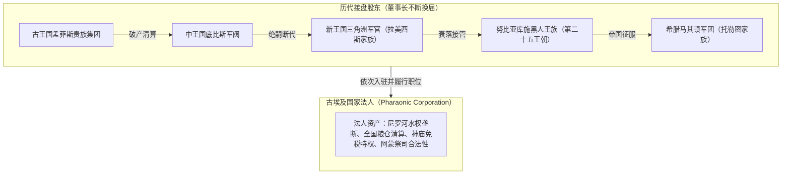
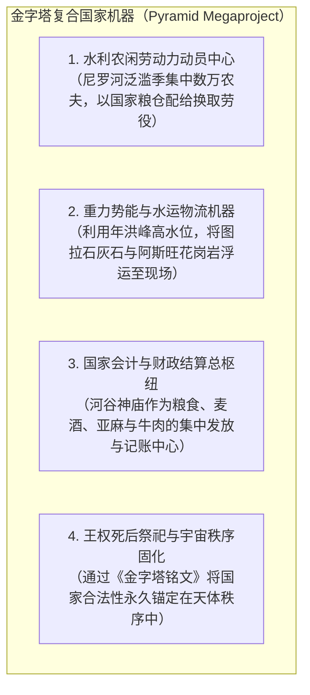

# 三更道场 · 认识论总纲 · 文献学与历史会计审计
## 篇章：法老王权“法人董事长”模型、金字塔国家机器与王朝编年血缘解耦法医审计（v1.0）

---

### 【审计执行摘要 / Forensic Audit Abstract】
本审计案针对古埃及文明史中长期存在的“神圣法老血脉连续性神话”、近代埃及学将**编年制度单位（Dynasty）偷换为生物血缘单位（Biological Lineage）**的做假账行为，以及金字塔作为**“国家动员、重力工程、宇宙秩序与祖先祭祀”复合资产**的真实功能展开法医级会计对账。

审计确立三大核心平账公理与制度定性：
1. **法老王权的“法人董事长（Chairman of Pharaonic Corporation）”模型**：
   - 核心定论：**“不存在单一连续的法老生物学血脉（There is no single continuous pharaonic lineage）”**；
   - 法老首先是一项**可跨家族转移的最高国家权力与特许法人职位**，其次才被某个具体家族阶段性占有；
   - 当继承危机爆发时，职位通过姐妹婚、女婿接盘、外戚政变、神庙阿蒙祭司集团认证、乃至外来军阀（如利比亚人、努比亚第二十五王朝、波斯人、希腊托勒密家族）另立旁支继续运转——**“法人制度长期延续，执掌股东不断换股”**。
2. **王室近交负荷与血统垄断的制度悖论**：
   $$\text{血统神圣纯洁度要求} \uparrow \Longrightarrow \text{近交有害纯合衰退} \uparrow \Longrightarrow \text{合格男性继承人供给} \downarrow$$
   - 纯血王朝必然遭遇生物学繁衍瓶颈，导致王廷必须通过引入外部配偶、兄终弟及或女婿入赘完成股权转让，所谓“数千年纯血王朝”纯属王权意识形态宣传。
3. **金字塔建筑群的复合国家机器属性与年代时序**：
   - **硬时序定谳**：吉萨大金字塔群（约 2600 BCE，第四王朝）在年代上比现存库施—努比亚金字塔群（纳帕塔/麦罗埃时期，约 800 BCE 以后）**早约 1800 年**；
   - **复合资产定性**：金字塔绝非单纯的孤立石棺，而是包含**河谷神庙、祭殿甬道、贵族陪葬区、太阳船坑、农闲劳工动员与尼罗河水动力粮饷清算**的超大型综合国家工程机器。

---

### 【第一账套：法老“法人董事长”模型与王朝换股对账表】

```
+-------------------------------------------------------------------------------------------------------------------------------+
|                                    古埃及王权法人属性与王朝更迭换股法医台账                                                   |
+-------------------------------------------------------------------------------------------------------------------------------+
| 王朝阶段 / 事件      | 表面神圣叙事（曼涅托/王朝编年）      | 历史会计法医真相（股权与法人变更）   | 权力交接与法统合法化技术             |
+----------------------+---------------------------------------+--------------------------------------+--------------------------------------+
| **第一至第六王朝**   | 古王国“荷鲁斯神圣化身”纯血延续        | 地方诺姆（州长）与神庙祭司集团博弈， | 通过大兴金字塔土木工程绑定全国劳动力，|
| (古王国时期)         |                                       | 频繁发生绝嗣、旁支入继与权臣篡位     | 将各州粮仓剩余集中于中央法王法人账户 |
+----------------------+---------------------------------------+--------------------------------------+--------------------------------------+
| **第十八王朝**       | 阿玛纳革命与图坦卡蒙家族“神裔”        | 经历了严重的近亲繁衍衰退（骨骼畸形、 | 图坦卡蒙死后无嗣，军政权臣（阿伊 Ay、|
| (新王国极盛期)       |                                       | 幼年夭折），生物学血脉彻底断绝       | 哈伦海姆 Horemheb）通过娶王族女性接盘|
+----------------------+---------------------------------------+--------------------------------------+--------------------------------------+
| **第十九至二十王朝** | 拉美西斯家族“太阳神之子”万世一系      | 纯粹的尼罗河三角洲北方军官集团篡位   | 彻底更换底层父系血缘，但沿用法老神号 |
| (拉美西斯时代)       |                                       | （拉美西斯一世原为塞提一世之军官父辈）| 与阿蒙神庙祭司认证，维持法人外壳不变 |
+----------------------+---------------------------------------+--------------------------------------+--------------------------------------+
| **第二十五王朝**     | 库施/努比亚黑人法老“征服埃及”         | 南方努比亚军事实体接管破产的埃及中央 | 宣称“恢复阿蒙纯正信仰”，直接继承法老 |
| (第三中间期末)       |                                       | 法人，入主底比斯与孟菲斯             | 董事长职位与冠冕，执行标准法老仪式   |
+----------------------+---------------------------------------+--------------------------------------+--------------------------------------+
| **托勒密王朝**       | 希腊马其顿“托勒密埃及帝国”            | 亚历山大部将托勒密家族以希腊军事殖民 | 剃光头、穿法老服饰、实行兄妹通婚，   |
| (希腊化时代)         |                                       | 集团身份，全面换牌接管埃及国家法人   | 对内作为法老统治，对外作为希腊国王   |
+----------------------+---------------------------------------+--------------------------------------+--------------------------------------+
```



---

### 【第二账套：近亲繁殖衰退与王室血统垄断悖论】

```
+-------------------------------------------------------------------------------------------------------------------------+
|                                    王室近交负荷与合法性稀释法医悖论表                                                   |
+-------------------------------------------------------------------------------------------------------------------------+
| 繁衍策略             | 预期政治收益                          | 带来的生物学/遗传学致命负荷          | 最终制度妥协与解决手段               |
+----------------------+---------------------------------------+--------------------------------------+--------------------------------------+
| **极度近交通婚**     | 垄断神圣神性，防止外戚瓜分国家土地    | **近交衰退（Inbreeding Depression）**：| 偷偷引入外戚女性、收养旁支子嗣，     |
| (兄妹婚 / 叔侄婚)    | 与神庙祭司资产（维持股权高度集中）    | 隐性有害突变纯合、不育、婴儿极高夭折 | 或在绝嗣后由手握兵权的异姓将领通过强 |
|                      |                                       | 率（如阿玛纳王室图坦卡蒙死胎与骨疾） | 娶寡后完成“合法股权转让”             |
+----------------------+---------------------------------------+--------------------------------------+--------------------------------------+
```

---

### 【第三账套：金字塔建筑群的“四大功能资产”法医审计】

批判将金字塔扁平化为“单纯私人土坟”或“天外来客神迹”的两极化叙事，确立其四维国家机器资产：



#### 年代学法医定谳：
- **吉萨金字塔群（Giza）**：胡夫、哈夫拉、孟卡拉金字塔确立于 **公元前 2600—2500 年（第四王朝）**；
- **努比亚金字塔群（Nubia / Meroë）**：苏丹境内金字塔始建于 **公元前 8 世纪至公元 4 世纪（晚于吉萨 1800 年以上）**；
- **结论**：努比亚金字塔属于**古埃及古王国金字塔成熟形制在晚期向南苏丹流域的技术与礼仪反哺辐射**，绝非“吉萨复刻努比亚”。

---

### 【第四账套：近代埃及学“Dynasty”编年与血缘偷换的法医穿透】

```
+-------------------------------------------------------------------------------------------------------------------------+
|                                近代埃及学概念偷换与三更道场法医纠偏对照表                                               |
+-------------------------------------------------------------------------------------------------------------------------+
| 流行偷换表述         | 潜藏的虚假叙事                        | 历史会计法医真相与科学分录           | 纠偏定论                             |
+----------------------+---------------------------------------+--------------------------------------+--------------------------------------+
| **“第某王朝”**       | 暗示这是一个连续三百年、父子相传的单一| 实质为**政治分期与统治集团编年标签** | **严禁等同于单一 Y-DNA 谱系！**       |
| (Dynasty)            | 生物学生理血统宗族                   | (源自曼涅托王表，常因迁都/篡位换代)  | 王朝更替往往伴随父系血脉的彻底重组   |
+----------------------+---------------------------------------+--------------------------------------+--------------------------------------+
| **“纯血法老万世一系”**| 虚构出一种贯穿三千年的神圣纯血人群    | 实际上是**国家机器法人资格的不断转让**| **法老是董事长职位，非永恒家族！**   |
|                      |                                       | 希腊人、利比亚人、努比亚人均曾执掌   | 只要履行祭祀与水利职能，即可入主     |
+----------------------+---------------------------------------+--------------------------------------+--------------------------------------+
```

---

### 【法医对账总决：法老法人与金字塔平账结论】

| 会计科目 | 审定历史会计事实 | 法医处理结论 |
| :--- | :--- | :--- |
| **法老王统本质** | 是一项长期存在的国家权力与神职法人接口，非单一连续生物父系。 | **确立为“法老法人董事长模型”** |
| **近亲繁殖上限** | 纯血近交必然遭遇隐性遗传病与绝嗣危机，迫使王室频繁换股。 | **确认为王室繁衍制度性悖论** |
| **金字塔时序** | 吉萨金字塔（前2600年）早于苏丹努比亚金字塔（前800年）1800年。 | **确立年代学硬时序：北向南辐射** |
| **Dynasty 定性** | 是政治编年与税收集团分期标签，严禁偷偷替换为遗传学谱系单位。 | **红字纠偏：制度编年与血缘彻底解耦** |

---
**审计人签章**：三更道场·埃及学与制度历史会计法医调查署  
**时间标记**：2026-09-09
