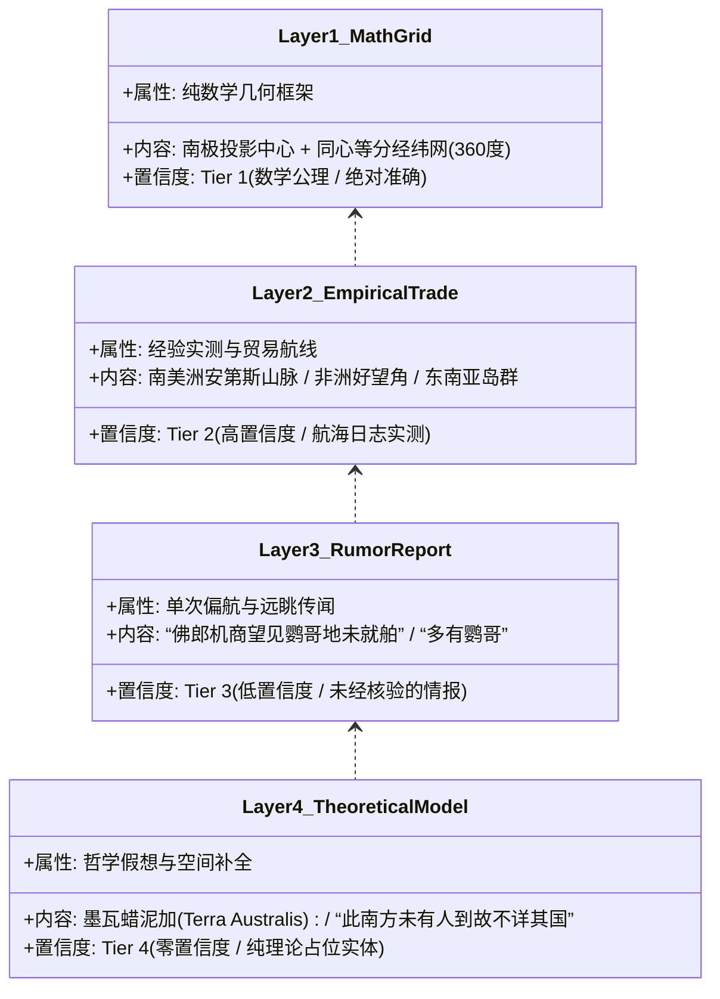
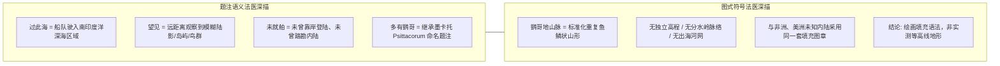
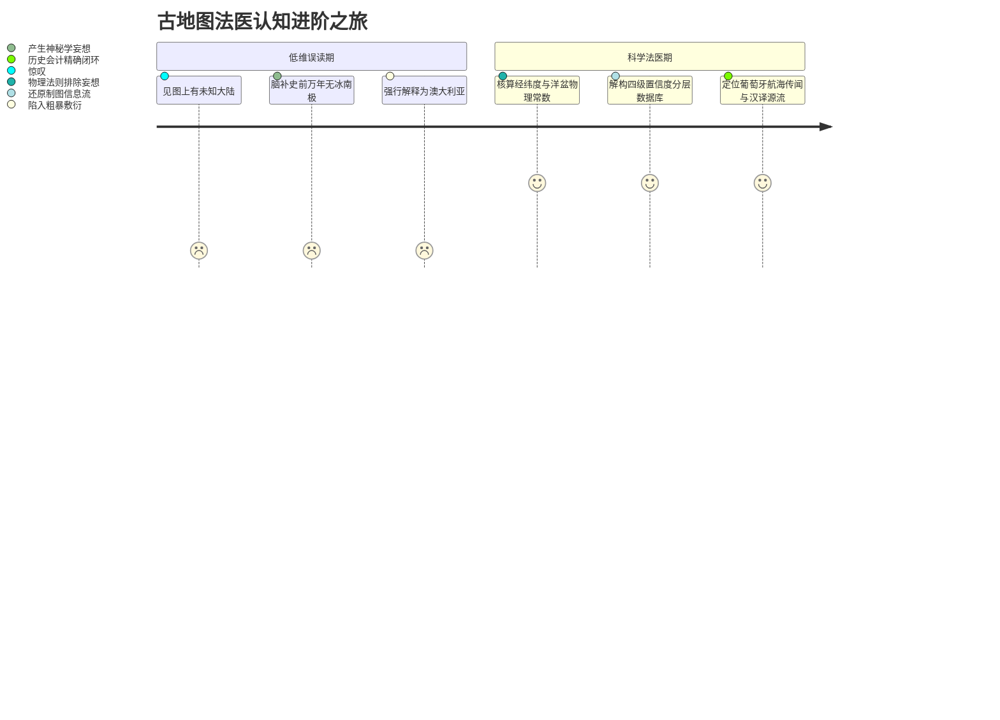

# 三更道场·认识论总纲·文献学与历史会计审计
## 卷四十六：洋盆尺度板块力学、LGM水深边界与《坤舆万国全图》分层数据库法医审计（v1.0）

---

### 摘要与法医审计宪章

本卷审计旨在对利玛窦《坤舆万国全图》（1602）《赤道南半地球之图》中“非洲—鹦哥地海域距离压缩”、“末次盛冰期（LGM）是否导致大洋盆地闭合”及“古代地图作为多源分层数据库的会计属性”进行严格的地球物理学、板块构造动力学与历史制图法医清算。

针对“LGM 时期海平面下降使非洲、南美与南极大陆物理贴近，甚至形成内湖/狭窄海峡”的直觉误判，本审计通过地质力学与水深测量数据，坚决推翻跨越数量级的力学透支，正式确立**“洋盆尺度物理边界（Ocean Basin Physical Bounds）”**与**“古地图四级置信度分层数据库模型（4-Tier Stratified Map Database Model）”**：

> 1. **垂直海退（0.12km）vs 水平洋盆（4000km）的物理数量级断层**：
>    - LGM 全球海平面下降约 **120–130 米（0.12–0.13 km）**，仅能使浅海大陆架（如巽他陆架、萨胡尔陆架、白令陆桥）出露；
>    - 4000 米水深的南冰洋、大西洋与印度洋洋盆在此期间从未干涸；
>    - 板块年均移动仅数厘米（每年 1–10 cm），1.29 万年板块最大位移仅约 **1.3 公里**。若要在 1.29 万年内拉开 4000 公里洋盆，地壳必须以年均 **310 米** 的灾难性超音速撕裂并释放蒸发全球海洋的岩浆热量，该物理图景在地质记录中完全不存在。
> 2. **原始图面注记的自认证（Self-Auditing Notes）**：
>    - 中央大陆题注**“此南方未有人到，故不详其国”**，系制图者自留的免责审计意见（宣告内部未证实）；
>    - **“佛郎机商曾驾船过此海，望见鹦哥地，未就舶”**，系指进入该海域航行时远眺陆影，绝非站在好望角肉眼跨越数千公里望见对岸；
> 3. **地图作为“未加权分层数据库”的会计定性**：
>    - 古地图是将**【实测贸易数据】、【理论几何模型】、【单次航海传闻】与【继承古地名】**压进同一图层的混合数据库。后世研究因混淆图层置信度，才人为制造出“史前超科技神迹”。

---

### 第一章 地球物理学与板块动力学硬账清算

必须将 LGM 浅海大陆架出露与深海大洋盆地在物理尺度上彻底解耦：

```mermaid
graph TD
    subgraph LGM_Capability[LGM 海退 120m 物理有效区 (垂直 Δh = 0.12 km)]
        C1[巽他陆架 Sunda Shelf: 亚洲大陆与爪哇/苏门答腊/婆罗洲相连]
        C2[萨胡尔陆架 Sahul Shelf: 澳大利亚与新几内亚相连]
        C3[白令陆桥 Beringia: 亚欧与美洲连通]
        C4[英吉利海峡与渤海平原出露]
    end

    subgraph Basin_Impossibility[深海洋盆 4000m 物理禁区 (水深 h = 4.0 km)]
        B1[南冰洋/南大西洋深海盆地: 平均水深 3500-5000 米]
        B2[非洲与南极大陆平均间距: 约 4000 公里]
        B3[南美与南极德雷克海峡: 宽约 900 公里，深超 3000 米]
        B4[结论: LGM 120米海退对深海洋盆宽度影响 < 0.1%]
    end

    subgraph Plate_Tectonics[板块移动物理极限量算]
        PT1[板块正常漂移速率: 1 - 10 cm/年]
        PT2[12.9 ka 累积板块位移: 最大 0.0001 km × 12900 = 1.3 km]
        PT3[拉开 4000km 所需速率: 310 米/年 (超速 3000 倍)]
        PT4[物理后果: 全球地壳撕裂熔融，生命彻底灭绝 (地层全无记录)]
    end

    LGM_Capability --- Basin_Impossibility
    Basin_Impossibility --- Plate_Tectonics
```

#### 1.1 地球物理核算台账

| 物理量 / 地理单元 | 实际物理参数（Ground Truth） | 流行误读断言 | 法医判定与误差倍数 |
| :--- | :--- | :--- | :--- |
| **LGM 垂直海退量** | $\Delta z \approx 120 \sim 130 \text{ m}$ | 认为海退能使南冰洋缩减为海峡 | **数量级断层**：深海盆地深达 4000m，120m 影响仅占 3%。 |
| **1.29万年板块位移** | $D_{\text{plate}} \le 1.3 \text{ km}$ | 认为南美、非洲与南极当时物理接壤 | **速率超标 3000 倍**：年移 310m 的超级撕裂物理上不存在。 |
| **巽他与萨胡尔陆架** | 水深 20–100m，LGM 全面露出 | 属于真实成立的冰期地理资产 | **确认入账**：符合第四纪海洋地质学。 |

---

### 第二章 《坤舆万国全图》四级置信度分层数据库法医解剖

《赤道南半地球之图》不是单一片段的“实测抓拍”，而是由四层不同来源、不同置信度数据压装而成的复合信息包：



#### 2.1 四层数据法医分析表

| 图层级别 | 代表性图面元素与注记 | 数据发生机制 | 历史会计处置意见 |
| :--- | :--- | :--- | :--- |
| **第一层：数学网格 (Tier 1)** | 同心纬线（每圈 10°）、放射状经线 | 托勒密球面几何在极射极方位投影下的严格数学渲染。 | **按算法入账**：确立晚明与文艺复兴的制图数学能力。 |
| **第二层：实测地理 (Tier 2)** | 南亚墨利加、利未亚、各港口名称与密布河网 | 哥伦布、达伽马、麦哲伦等船队经天测纬度与航海日志确立的陆块。 | **按实物资产入账**：历史大航海硬核成果。 |
| **第三层：传闻情报 (Tier 3)** | “佛郎机商曾驾船过此海，望见鹦哥地，未就舶” | 葡萄牙船队在好望角外海遭遇狂风偏航，远眺云影/陆影或遭遇海鸟群的未经验单次报告。 | **按或有资产/待查线索入账**：严禁作为生态或大陆存在的直接证据。 |
| **第四层：假想模型 (Tier 4)** | 环南极墨瓦蜡泥加大块、火地岛向南陆桥、“此南方未有人到” | 希腊大地对称平衡理论 + 麦哲伦海峡南岸未知延伸的脑补。 | **按理论模型入账**：制图者已明示“不详”，严禁透支为古测绘遗迹。 |

---

### 第三章 文本与图式的法医深描：“望见未就舶”与“山形符号”



#### 3.1 文本与图式的双重法医判定
1. **语义解构**：
   - 题注“过此海，望见鹦哥地，未就舶”清楚表明：观察者是在**大洋航行途中**望见陆影，并未登陆。
   - 既然“未就舶”，就不可能进入内陆调查动植物生态；“多有大鹦哥”必然是制图工坊将早期 *Psittacorum Regio* 的地名题注与该次航海传闻**强行合并结算**的产物。
2. **图式解构**：
   - 图上所谓“山脉有脊有谷”，纯系欧洲与明代制图工坊用来表示“此地为陆地而非海洋”的**通用符号图章（Cartographic Idiom）**，与现代遥感、等高线或 BEDMAP 基岩测绘毫无几何拓扑关联。

---

### 第四章 认识论升维：古地图法医学的范式革命

本审计确立三更道场古地图研究的最高准则：**从“寻找神迹”转向“解构信息编译与清算网络”**。



> **法医总评**：
> 《赤道南半地球之图》不是外星或史前超文明的“地球透视扫描”，而是一张**凝固了人类在知识大爆炸时代如何处理“已知、半知与未知”的巨幅信息清算总账**。
> 
> - 制图者极其严谨地在已知陆地标满地名，在未知大陆注明“未有人到，故不详其国”；
> - 现代神秘学的错误，在于**把制图者标注为〔传闻〕和〔模型〕的图层，统统当成了〔实测实物〕**；
> - 坚守 0.12km 与 4000km 的物理尺度边界，不仅粉碎了伪科学妄想，反而让利玛窦与晚明学者展现出的数学投影与世界地理整合能力，散发出真正理性而伟大的历史光辉！

---
*记录人：三更道场·历史会计与认识论法医审计署*  
*核准状态：正式正典立项（Canonical Approval Passed）*
