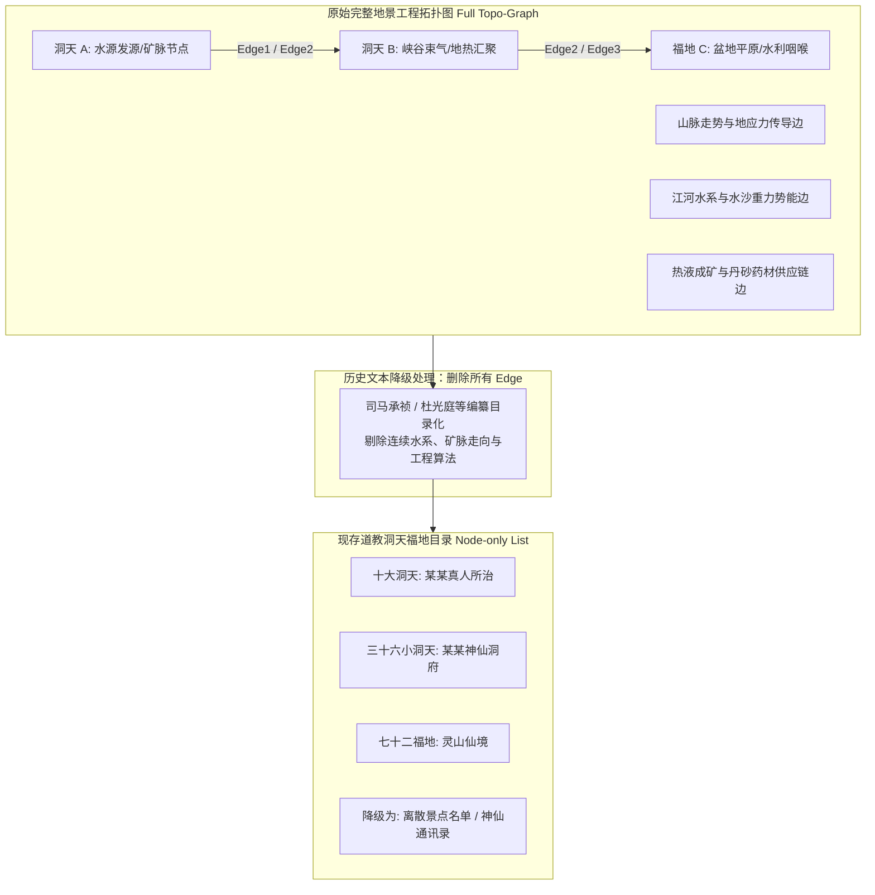
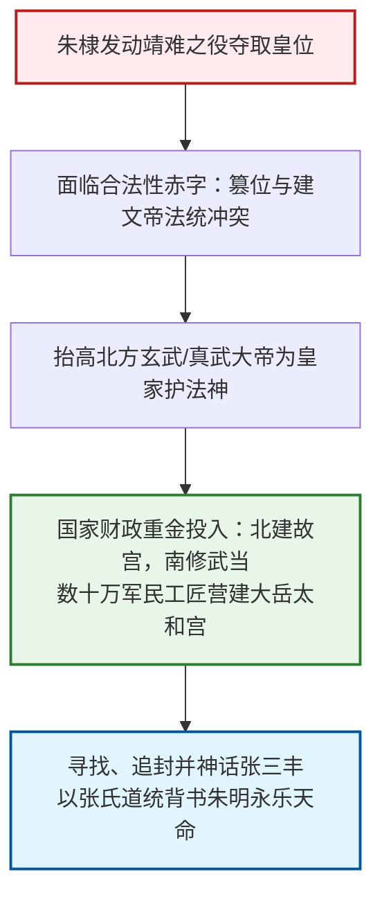
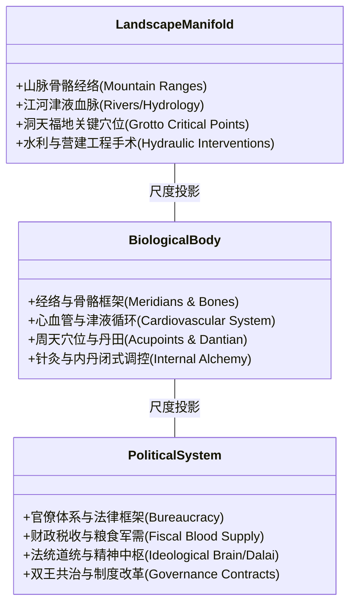

# 三更道场·认识论总纲·文献学与历史会计审计
## 卷三十五：洞天福地拓扑缺边图与政教心脑共治系统法医审计（v1.0）

---

### 摘要与法医审计宪章

本卷审计旨在对中国传统地景知识库中的**“洞天福地缺边图（Missing-Edge Graph of Grotto-Heavens）”**以及青藏与欧亚政治身体学中的**“心脑共治双王模型（Heart-Brain Co-Governance Model）”**进行历史会计与系统工程法医清算。

长期以来，道教洞天福地被简化为“神仙名录或游览名胜”，西藏政教关系被简化为“单一神权政治”。本审计推翻此种平面化解读，确立两大核心法医结论：

> 1. **洞天福地是一份被裁剪了“拓扑边（Edges）”的地景勘察与水热矿脉工程图**：
>    现存文本（十大洞天、三十六小洞天、七十二福地）仅保存了离散节点（Node List），删除了连接山脉、发源水系、矿热循环与势能路径的连续边（Edge List），将原初的国家级地景工程控制图降级为神仙通讯录。
> 2. **政教双王体制是“心—脑”功能分工的政治身体系统工程**：
>    “精神王（上师/法王/达赖）”承担大脑功能（定方向、赋予意义、意识记忆中枢与法统合法性确认）；“世俗王（赞普/汗王/皇帝）”承担心脏功能（供血供粮、军事执行、维持系统动能与物质循环）。

---

### 第一章 洞天福地：从工程控制拓扑图到神仙通讯录的降级

十大洞天、三十六小洞天、七十二福地的形成绝非书斋文人虚构，而是历代实地巡行、水热矿脉勘察与国家地理选址汇总的产物。



#### 1.1 永乐朝武当山资本化与张三丰法统塑造的法医对账

明代武当山跃升为天下道教第一名山，绝非“偶然诞生了张三丰”，而是国家资本与政治合法性重建的精密工程：



- **水热地景与丹江枢纽**：
  武当山绝非孤山，它是汉水—丹江水系的关键枢纽。丹江作为水运、矿物、药材与气候调控带，为武当山提供了连接中原与汉江平原的物理支撑。“丹”在历史会计中直接挂钩地热、矿冶、水运与炼丹技术接口。
- **张三丰的品牌功能定位**：
  历史上的张三丰身份真伪属于微观考据；在制度层面上，明廷需要一个“姓张、通真武、具备神仙声望”的法人接口，以接续正一/天师道统，完成对新政权天命合法性的确认。

---

### 第二章 政教双王体制：政治身体的心脑功能分工

西藏及欧亚双王共治（Dyarchy / Co-governance）体系，是政治身体学（Political Somatics）在国家组织维度的精准投影。

```mermaid
flowchart LR
    subgraph Brain[精神王: 大脑与意识中枢 / Brain & Consciousness]
        B1[职位: 达赖喇嘛 / 萨迦法王 / 大宝法王]
        B2[功能: 意识容器 / 教法中枢 / 道德定义 / 法统确认]
        B3[对应概念: 脑髓海 (Brain-Ocean / Dalai)]
        B4[行动: 赋予世俗王统治合法性]
    end

    subgraph Heart[世俗王: 心脏与供血循环 / Heart & Blood Supply]
        H1[职位: 赞普 / 蒙古汗王(俺答汗/固始汗) / 驻藏大臣]
        H2[功能: 物理供血 / 粮食调配 / 军队征伐 / 秩序维持]
        H3[对应概念: 心脏跳动与物质循环]
        H4[行动: 为寺院与精神中枢提供资源与武力保护]
    end

    Brain <-->|施主与福田关系 (Cho-yon) / 统治合同| Heart
```

#### 2.1 编年序列与功能比喻的法医界定

| 概念/人物 | 历史真实编年（Chronology） | 政治身体学功能比喻（System Function） | 混淆与伪命题纠偏 |
| :--- | :--- | :--- | :--- |
| **松赞干布** | 7 世纪吐蕃赞普 | 统一高原各部的强力军事心脏与领土供血者。 | **纠偏**：松赞干布与达赖非同一时代，不可在编年上直接作为双王对手戏。 |
| **达赖喇嘛** | 16 世纪（1578 年俺答汗授予索南嘉措称号），17 世纪五世达赖掌权。 | 政治身体的精神大脑容器（“达赖”蒙语意为“大海”，在功能上对应汇聚意识的脑髓海）。 | **纠偏**：“达赖”非汉语“道家”词源，而是蒙藏语大海；是功能同构，非直接字面词源。 |
| **双王共治合同** | 贯穿蒙元萨迦—八思巴、明代俺答汗—三世达赖、清初固始汗—五世达赖。 | 心脑分工：心脏不可擅自代行意识思考，大脑脱离心血供应则立即脑死亡。 | **本质**：法统授权与物理暴力维持的长期产权与治理合同。 |

#### 2.2 藏传教派演进：多中心神经竞争到中央大脑确立

藏传佛教各派的发展不是从“叫花子”到高级喇嘛的阶级升级，而是教法与世俗资本市场的演进竞争：

```mermaid
flowchart TD
    N1[宁玛派 红教 (8-9世纪)<br>早期隐修密法/地方根基] --> K1[噶举派 白教 (11世纪)<br>苦修密宗/帕竹政权支持]
    N1 --> S1[萨迦派 花教 (11-13世纪)<br>贵族世袭/联合忽必烈建立萨迦政权]
    K1 --> G1[格鲁派 黄教 (14-15世纪宗喀巴创立)<br>严守戒律/转世制度创新]
    S1 --> G1
    G1 --> G2[联合和硕特蒙古固始汗军事力量 (17世纪)<br>五世达赖建立甘丹颇章政权，确立中央大脑地位]

    style N1 fill:#ffebee,stroke:#b71c1c,stroke-width:1px
    style S1 fill:#fff3e0,stroke:#e65100,stroke-width:1px
    style G1 fill:#fffde7,stroke:#fbc02d,stroke-width:2px
    style G2 fill:#e8f5e9,stroke:#2e7d32,stroke-width:2px
```

- **萨迦派（花教）**：得名自萨迦寺（意为白灰土），因寺墙涂红、白、黑三色被称为花教，绝非“叫花子”。
- **多脑到单脑的集中**：各派竞争证明“精神中枢”起初是多中心神经网络；格鲁派最终通过严格的戒律（降低边际运营腐化）、活佛转世制度（杜绝家族血缘继承断裂）以及与蒙古军事资本（固始汗）结算，完成了向全域“中央大脑”的制度跃升。

---

### 第三章 地理、身体与政治的三尺度统一控制论

本审计将洞天福地与政教系统彻底收敛为一套在三个尺度上完全重合的控制论算法：



#### 3.1 三尺度控制论对照总账

| 运行要素 | 地理流形尺度（地景） | 生物身体尺度（人身） | 政治社会尺度（国家） |
| :--- | :--- | :--- | :--- |
| **流动介质** | 水流、泥沙、地热与风气 | 血液、体温、津液与真气 | 货币、赋税、粮食与人口 |
| **通道架构** | 山川大脉、断裂带、古河道 | 经络、血管、消化道与脊髓 | 驿道、运河、官僚链路与贸易线 |
| **关键穴位** | **洞天福地、丹江武当、都江堰** | **下丹田、会阴、百会、心脑** | **宗教圣地、首都宗庙、法统领袖** |
| **大脑中枢** | 高原水塔、群山之祖（昆仑） | 脑髓海、泥丸宫、神明之舍 | **精神王（达赖/上师/天师/教皇）** |
| **心脏中枢** | 盆地枢纽、大江交汇之泽 | 心脏泵血、命门之火 | **世俗王（赞普/汗王/皇帝/宰相）** |
| **工程干预** | 寻龙点穴、筑堰分流、立宫建庙 | 闭关修炼、通周天、针石调理 | 册封加冕、官僚考核、财税再分配 |

---

### 结语与法医终审意见

> **法医总评**：
> 无论是地景中被删掉边的“洞天福地”，还是政治史上被神秘化的“达赖—赞普双王共治”，其底层全部遵循同一条**“复杂系统流形控制律”**：
> 
> 1. **山河必须定位关键穴位，以调控地气水运**；
> 2. **身体必须建立闭式循环，以实现热力学收敛**；
> 3. **国家必须缔结心脑合同，以平衡精神合法性与物质动能**。
> 
> 一旦掌握了这套在地理、身体与政治间无缝映射的三尺度编译器，所有零散的神仙传说、地名志与宗教教派冲突，都将彻底回归为清晰明了的系统工程会计分录。

---
*记录人：三更道场·历史会计与认识论法医审计署*  
*核准状态：正式正典立项（Canonical Approval Passed）*
