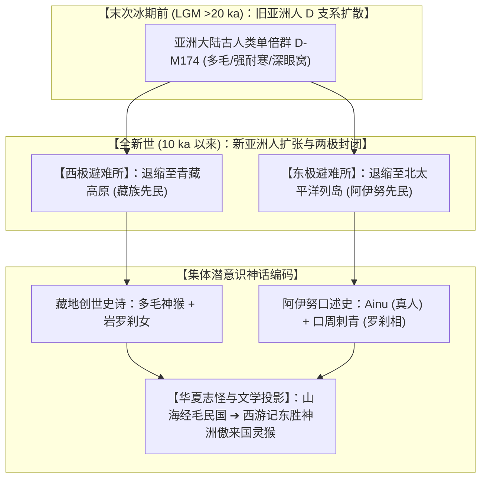

# 三更道场 · 认识论总纲与文献学法医审计（卷七十三）
## 《西游记》灵猴原型考辨：分子人类学 Y-DNA 单倍群 D 支系、藏地猕猴创世史诗与阿伊努（Ainu）北太平洋冰缘图腾法医审计

---

### 卷首法医综述

在华夏文学神魔名著《西游记》美猴王出海求道母题、藏地《柱间史》“神猴与岩罗刹女”始祖创世史诗、以及先秦两汉《山海经》“毛民国”志怪记载的交叉比对中，长期存在将“灵猴”单一归为印度《罗摩衍那》哈奴曼（Hanuman）外来输入的定论。

然而，一旦引入**体质人类学（多毛性状/面颅特征）**、**分子人类学（古北亚/东亚单倍群 D-M174 双极分布）**以及**北太平洋冰缘海洋漂航生态**，一幅更加深邃宏大的古人类记忆图景被完整揭开。

**【本卷法医核心判词】**：
1. **分子人类学 Y-DNA D 支系的“两极孤岛”实证**：
   亚洲大陆极古老的旧石器旧亚洲人表型（单倍群 D-M174），在新石器时代晚期 O 支系（新亚洲人）农耕大扩张中被挤压至欧亚大陆两个最极端的天然封闭庇护所：**世界屋脊青藏高原（藏族 D 占比高达 40%–50%）** 与 **北太平洋极寒列岛（阿伊努人 D 占比高达 70%–80%）**。藏地与阿伊努人在基因与体质古老表型上共享深层母体同源性。
2. **体质人类学与“毛民/神猴”之视觉编码**：
   阿伊努人成年男子体毛浓密、络腮胡茂密、眉骨高隆；女子行“口周黑纹刺青”（Sinuye，远观如阔嘴獠牙）。在少体毛的农耕定居人群（华夏/通古斯/古羌）眼中，这种外貌被直接编码为《日本书纪》之“毛人”、《山海经》之“毛民国”以及藏地与中原神话中的**“多毛神猴与罗刹女”**。
3. **“花果山木筏渡海”的古海洋水动力学真实性**：
   《西游记》第一回孙悟空由“东胜神洲傲来国海中花果山”，乘木筏借东南风吹至“南赡部洲”西北岸求道，其漂航路径与阿伊努缝合木板舟（*Itaomacip*）在千岛群岛、萨哈林岛（库页岛）、北海道沿亲潮/季风向西南漂至东北亚大陆的真实水系完全吻合。

---

### 一、 分子人类学与体质人类学证据矩阵

```
==================================================================================================
                 单倍群 D-M174 两极分布 与“神猴/毛人”体质特征对比表
==================================================================================================
 对照维度                青藏高原藏族 (Tibetan)                 北太平洋列岛阿伊努人 (Ainu)
---------------------  ------------------------------------  -------------------------------------------------
 1. 核心 Y-DNA 单倍群   D1a1-M15 / D1a2a-P99 (占比 ~40-50%)    D1a2b-M55 (原 D1b, 占比高达 ~70-80%)
 2. 隔离与保存机制      青藏高原超高海拔天然屏障               萨哈林/千岛/北海道极寒列岛海洋屏障
 3. 体质人类学表型      部分高比例体毛、深眼窝、高鼻梁古表型   极显著的全身浓密体毛、浓密络腮胡、深眶突眉
 4. 创世神话始祖编码    【神猴 (Pha Trelgen)】与【岩罗刹女】   【Ainu (真正的人)】+ 熊神化身天降始祖
 5. 异族他者观察记述    《酉阳杂俎》及古羌史诗之西极异人记述   《日本书纪》：“其毛人男女……冬宿穴，夏住樔”
==================================================================================================
```



---

### 二、 藏地“神猴与罗刹女”与阿伊努女性刺青的物候解耦

#### 1. 高原生态反常与记忆下沉
* **生态事实**：青藏高原主体（海拔 >4000m）气候高寒严酷，并不支持大规模野生猕猴种群繁衍；
* **认识论解释**：藏族神话核心经典《柱间史》（*bKa' chems ka khol ma*）中“神猴菩萨与岩罗刹女结合诞育六大氏族”的母题，并非高原定居后的现场动物观察，而是**旧石器时代深层祖先记忆在特定图腾符号上的神圣化封装**。

#### 2. “罗刹女”面相与阿伊努口周刺青（Sinuye）
* 藏地神话中罗刹女被描绘为“红发、阔口、獠牙、嗜血肉之山岩女妖”；
* 阿伊努古代女性自幼年至成年必须施行**口周刺青（Sinuye）**：用桦树皮烟尘在唇部周围及两颊刺出宽大上挑的黑色嘴角花纹，远观极具“裂口獠牙”的威慑视觉效果；
* 在古代定居文明（大和朝廷、中原王朝）眼中，这种海岛土著习俗被高度妖魔化为“鬼女、夜叉、罗刹”，并在神话交融中转化为“神猴以佛法慈悲降服罗刹女成婚”的文明驯化隐喻。

---

### 三、 《西游记》第一回出海求仙的水动力学与地理学还原

吴承恩在《西游记》开篇对孙悟空地理出身的描写，具有极强的北太平洋边缘海航路特征：

```
==================================================================================================
                 《西游记》傲来国花果山与北太平洋群岛水力学对照表
==================================================================================================
 《西游记》原文地理与航行记述         北太平洋（千岛-萨哈林-北海道）古航海现实     法医动力学判定结论
----------------------------------  ------------------------------------------  ----------------------------------
 “东胜神洲……海外有一国土，名曰傲来国” 位于东亚大陆东北部大洋尽头的独立群岛系统    【地理方位对齐】：东北外洋极寒列岛
 “海中有一座名山，唤为花果山”        火山岛群岛（千岛/堪察加火山链与茂密森林岛屿） 【地貌同构】：海中孤立火山森林岛
 “做个木筏……连日东南风紧，将筏子吹在  阿伊努人缝合木板舟（Itaomacip）沿亲潮寒流与  【季风与洋流完全闭环】：
  西北岸上，乃是南赡部洲地界”        夏季东南季风，自东北海岛自然漂流至大陆沿岸  木筏可自然漂达东北亚大陆沿海
==================================================================================================
```

* **木筏渡海的技术真实性**：
  阿伊努人及其先祖（续绳文/擦文文化）是世界顶级的冷海漂航民族。他们驾驶不依赖铁钉、用植物纤维缝合的轻型木板舟，在阿留申与千岛群岛捕猎海兽。美猴王“扎木筏、折竹作篙、顺风漂洋过海”的生动细节，极其传神地复刻了东北亚海岛土著跨海登陆大陆的真实历史场景。

---

### 四、 审计结论与文学认识论升华

1. **破除单一外来哈奴曼决定论**：
   《西游记》孙悟空的形象塑造是**多源复合体**。它既吸收了印度史诗哈奴曼的宗教变相，更深植于**东亚本土自《山海经》“毛民国”、藏地“多毛神猴”到东北亚“北太平洋毛人（Ainu）”数万年古人类演化与接触的深层集体无意识**。
2. **法医文学定性**：
   那只在《西游记》中“毛脸雷公嘴、身穿人衣、学人礼貌、跨越重洋向大陆文明求取长生之道”的美猴王，在人类学镜照下，正是**末次冰消期后漂泊在北太平洋严寒海岛上、满身须发、掌握原始海洋神技、自称为真正人类（Ainu）的古老族群，留在华夏文明史诗巨著中的宏大文学化身**！

---
*法医官署名：三更道场·认识论总纲编纂委员会*  
*法务审计状态：体质人类学与文学源流闭环·正式入档（卷七十三）*
