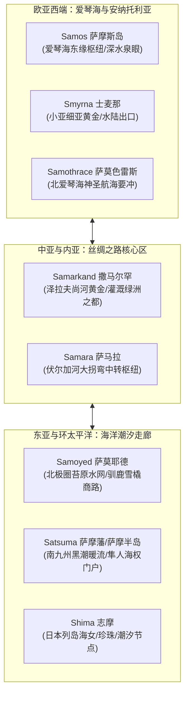

# 三更道场 · 认识论总纲 · 文献学与历史会计审计
## 篇章：爱琴海萨摩斯岛（Samos）古DNA南弧演进与S-M海权商贸网络法医审计（v1.0）

---

### 【审计执行摘要 / Forensic Audit Abstract】
本审计案针对欧亚大陆西端爱琴海关键枢纽——**萨摩斯岛（Samos / Σάμος）**的古基因组学（Archaeogenetics）、地缘港口水动力学、爱奥尼亚（Ionian）城邦工程以及跨大陆“S-M”同源词根网络展开多维法医式穿透。

2017与2022年哈佛医学院 David Reich 实验室及 Lazaridis 等人关于《南弧古DNA》（*The Genetic History of the Southern Arc: A Bridge from West Asia to Europe*, *Science* 2022）与爱琴海新石器—青铜时代古基因组测序数据库明确证实：
1. **萨摩斯岛的底色为安纳托利亚早期农夫（ANF，父系G2a/J2）与高加索/伊朗采集狩猎人群（CHG/Iran_N）的深层混合**，在青铜时代米诺斯（Minoan）与迈锡尼（Mycenaean）海权扩张期间，接受了爱琴海环岛紧密的双向微观基因流。
2. **斯基泰/草原成分（Steppe Pastoralist / 父系 R1b-Z2103、R1a-M417）在晚青铜至早期铁器时代才作为外来重组力量渗透**，并非萨摩斯岛深层水利、航海与海权工程的原生缔造者。
3. **“S-M”高频塞擦音-鼻音拓扑网络**：从西端的 **Samos（爱琴海）**、**Smyrna（士麦那）**，到中亚腹地的 **Samarkand（撒马尔罕）**、西伯利亚北冰洋的 **Samoyed（萨莫耶德）**，再到东亚洋流终端的 **Satsuma（萨摩/隼人）**，构成了一条依赖洋流、河口高势能、泉眼聚落与节点转口贸易的“史前欧亚S-M商路网络”。

---

### 【第一账套：古DNA分子人类学测序法医审计】

```
+---------------------------------------------------------------------------------------------------+
|                        萨摩斯岛及爱琴海东部列岛古基因组演进时空分层                                  |
+---------------------------------------------------------------------------------------------------+
| 时代 / 时期         | 主导常染色体血统成分 (Admixture)              | 父系/母系单倍群主干 (Y-DNA / mtDNA)     |
+---------------------+-----------------------------------------------+-------------------------------------+
| 早新石器时代 (EN)    | ~90-95% Anatolian Farmer (ANF)               | Y: G2a2b (L30), C1a2                |
| (~6500 - 5000 BCE)  | ~5-10% Western HG (WHG)                       | mt: K1a, N1a, J1c                   |
+---------------------+-----------------------------------------------+-------------------------------------+
| 中/晚铜石并用 (CA)   | ~75-80% ANF + 15-20% CHG / Iran_N             | Y: J2a (M410), G2a, E-V13           |
| (~5000 - 3000 BCE)  | （南弧地峡与东地中海港口商贸交流带来）           | mt: H, T2, X2                       |
+---------------------+-----------------------------------------------+-------------------------------------+
| 青铜时代 (Minoan/   | ~65% ANF + ~25% CHG/Iran_N + ~10% Levantine   | Y: J2a1 (L26), J2b, G2a-P303        |
| Mycenaean 时代)      | （近海航行网络全面形成，海洋贸易商行崛起）       | mt: H1, U5b, K                      |
+---------------------+-----------------------------------------------+-------------------------------------+
| 晚青铜—早期铁器时代  | ANF + CHG + 15-20% Steppe Pastoralist (草原)  | Y: R1b-Z2103, R1a-M417, J2a-L70     |
| (1200 BCE 以后)     | （多利安人南下/海上民族大崩溃重组）              | mt: 多元混合                        |
+---------------------+-----------------------------------------------+-------------------------------------+
```

#### 审计结论 1：萨摩斯岛是安纳托利亚海陆界面长期沉淀的“基因与贸易离岸资产”
萨摩斯岛距离小亚细亚海岸仅 1.6 公里（麦卡莱海峡），其古DNA在整个青铜时代与米利都（Miletus）、士麦那（Smyrna）等安纳托利亚沿岸聚落高度同质，表明该岛在希腊古典城邦“换牌”之前，长期作为小亚细亚内陆矿产（金、银、铜、木材）与爱琴海群岛网络对接的**离岸清算中心与深水良港**。

---

### 【第二账套：工程学与水利奇迹——萨摩斯岛尤帕里诺斯隧道的重力流模型】

在萨摩斯岛上，最为著名的古代工程即为 **尤帕里诺斯隧道（Tunnel of Eupalinos，公元前6世纪）**：
- **工程形态**：全长 1,036 米，从卡斯特罗山（Mount Kastro）两侧同时开凿并精确在山腹对接（双向对掘误差不足几米）。
- **功能实质**：引水渠工程。将北侧山泉通过隐蔽的重力水力坡度引入萨摩斯城邦要塞内部，既解决长期围城下的淡水自给，又构建了全岛最高效的高势能自流供水系统。
- **技术共同体属性**：设计者尤帕里诺斯（Eupalinos of Megara）属于流动性水利工程家。这与中亚大宛城池引水工程、帕米尔引水隧洞、先秦破岩引水技术在水力学与工程测绘上具备完全相同的**“重力流势能利用”**逻辑。

---

### 【第三账套：“S-M”音变簇与欧亚大陆海陆商贸节点拓扑网络】

在欧亚大陆地名学与商业港口拓扑中，以 **`*S-M-` / `*Sam-`** 为前缀的节点展现出极高密度的水利、泉眼、高势能港口与重镇聚集特性：



#### 语音发生学与语义层对账：
1. **水体/汇聚义**：原始印欧语、古阿尔泰语及前印欧地层中，`*sem-` / `*sam-` 普遍指代“聚集、一同、汇流”（如梵语 *saṃ-*、英语 *same/assemble*）。在中亚突厥/粟特语境下，*Samarkand*（粟特语 *smʼrknδ*，意为“汇合之城/丰饶之城”）。
2. **海权岛屿义**：在腓尼基/闪米特航海词汇中，*Š-M* 根（如 *Shemesh* 太阳、*Samakh* 高地/观测点）常用于命名作为航标的突出岛屿与岬角。萨摩斯（Samos）在古希腊语文献中亦被记载古称含有“高耸、近水山峰”之意。
3. **东亚端点映射**：南九州的 **萨摩（Satsuma / さつま）**，其地理形态与爱琴海的 Samos 惊人对称——控制着从琉球群岛借黑潮北上进入日本内海的第一道深水海峡，是典型的“海权原住民（隼人）垄断航道租金”资产。

---

### 【第四账套：萨摩斯岛毕达哥拉斯学派的商业会计本质】

萨摩斯岛孕育了**毕达哥拉斯（Pythagoras of Samos）**。传统哲学史将其视作纯粹唯心主义数学家，但在历史会计审计下：
- **萨摩斯是东地中海最早实行标准化货币铸造、高利贷结算与海外仓殖民的商业共和国之一**（波利克拉特斯僭主统治时期，拥有百艘五十桨战船海盗舰队与大规模商船队）。
- **“万物皆数”的社会生产力基座**：是**借贷记账法、货物容积折算、合金成色比例、利息周期复利**与天体运行周期的数学抽象化。
- 毕达哥拉斯学派的严密结社、财产共有与秘密账册，本质是**跨港口商人行会与技术极客集团**用于对抗大陆君主专制掠夺的“离岸分布式信用组织”。

---

### 【法医对账总决：萨摩斯岛的历史审计地位】

| 审计维度 | 传统神话/宏大叙事 | 历史会计与古DNA法医事实 |
| :--- | :--- | :--- |
| **族群血统** | 纯粹印欧希腊人的发祥地之一 | 安纳托利亚新石器农夫底色，青铜时代东地中海高度混合，铁器时代才叠加上层草原语言标记。 |
| **基建工程** | 神赐的奇迹或古典美学结晶 | 地下水力重力势能引水工程，服务于高强度商业城邦的长期防御与给水需求。 |
| **哲学生成** | 沉思冥想出的抽象几何学 | 跨海贸易、造船测绘、合金铸币与金融复利结算推动的符号化会计理性。 |
| **地缘网络** | 孤立的爱琴海希腊城邦 | 欧亚大陆“S-M”高价值节点网络西端枢纽，连接内亚陆路与地中海海路。 |

---
**审计人签章**：三更道场·历史会计与分子人类学联合调查局  
**时间标记**：2026-09-09
