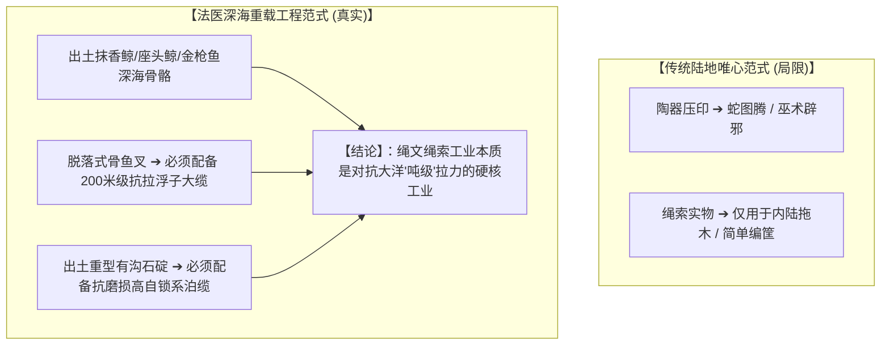
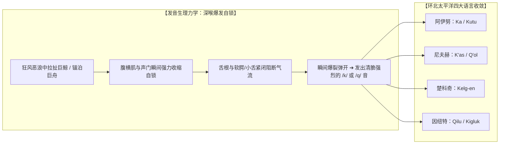

# 三更道场 · 认识论总纲与文献学法医审计（卷七十九）
## 环北太平洋极寒海洋绳索词源考辨：塞音 /k/ - /q/ 语音学聚类、日本绳文（Jōmon）捕鲸缆索工程与陆海范式解耦法医审计

---

### 卷首法医综述

在探索北太平洋史前海洋文明、绳文时代（Jōmon）高阶绳索技术以及环鄂霍次克海土著族群的生计模式时，学术界长期受制于战后日本考古学**“内向定居型森林采集/陶器巫术图腾范式”**的狭隘约束，忽视了其深海捕鲸与重载系泊的重工业属性。

与此同时，跨越阿伊努语、尼夫赫语、楚科奇语与因纽特语四大环北太平洋古老语言，关于“重型缆绳/系带/套索”的词汇在语音学上呈现出惊人的一致性——**普遍以软腭清塞音 /k/ 或小舌塞音 /q/ 作为爆发性起笔声母**。

**【本卷法医核心判词】**：
1. **彻底解耦日本学界的“唯心巫术图腾论”**：
   绳文陶器表面施加的微观多轴反捻复合绳纹，绝非单纯的“蛇图腾/辟邪装饰”，其底层驱动力来自**深海狂暴海流中猎捕数十吨抹香鲸/座头鲸所需的脱落式倒钩鱼叉浮子缆绳，以及三内丸山等遗址大型栗木六本柱巨型木结构的吊装拉索**。
2. **环北太平洋“绳索 /k/-/q/ 音词根”之语音学实证闭环**：
   * **阿伊努语（Ainu）**：*Ka*（线/绳/网）、*Kapa*（皮带）、*Kutu*（粗束绳）；
   * **尼夫赫语（Nivkh）**：*K'as*（纤维绳）、*Q'ol / Xol*（拴船/拉车重皮索）、*Kan-*（纤缆）；
   * **楚科奇语（Chukchi）**：*Kelg-en*（捕鲸重皮绳/套索）、*Keli-*（缠绕结绳）；
   * **因纽特语（Inuit）**：*Qilu*（紧绷牵引索）、*Kigluk / Kipik*（重型湿态海豹皮捕鲸大缆）。
3. **发音生理学与大洋重载力学同构**：
   软腭清塞音 /k/ 与小舌塞音 /q/ 在发音生理上属于**声门紧闭、舌根受力深喉瞬间爆破音**。极地渔猎先民在波涛汹涌的冰海中死命拉紧巨缆、固定巨兽与船只的生死关头，其生理紧绷感在语言学上高度收敛为这一声带有自锁爆破力的代码。

---

### 一、 日本学界传统解释与深海重载工程力学对账

```
==================================================================================================
                 日本主流绳文考古学解释 与 深海重载工程力学实证对账表
==================================================================================================
 观察实物与现象          日本学界传统解释 (内向保守范式)           深海工程力学法医真实判定
---------------------  ----------------------------------------  -------------------------------------------------
 1. 陶器表面密布绳纹    【唯心巫术派】：象征蛇图腾、水流神力、    【工业工程反向压印】：将生产生活中最关键的复合
    (Jōmon Impressions) 结绳记事与宗教辟邪符号                    反捻自锁缆绳（S/Z双向捻）作为标准化质检与纹饰
 2. 泥炭层重型大缆      【内陆搬运派】：用于三内丸山六本柱        【高纬深海多用途大缆】：不仅用于内陆巨木吊装，
    (Torihama Cords)    大型木构建筑之巨木拖曳与立柱              更为主力用于深海大型海兽捕捞与暗礁系泊
 3. 脱落式骨制鱼叉      【近海采集派】：在浅海内湾叉鱼叉海豹      【大洋捕鲸工业链】：叉头脱落后连接数百米
    (Harpoon Systems)                                             【高强韧高弹性浮子大缆】，承受巨鲸潜水万钧爆发力
 4. 中间带沟巨型石碇    【浅滩系船石】：几公斤至十几公斤石块      【大洋锚泊系统雏形】：以多股木本韧皮大绳牢牢
    (Grooved Anchors)                                             绑系重型玄武岩，在深水海流中死死咬底
==================================================================================================
```



---

### 二、 环北太平洋四大极寒海洋族群“绳索 /k/-/q/”语音学矩阵

```
==================================================================================================
                 环北太平洋四大原住民语言“绳索/系带”词源与国际音标（IPA）对照表
==================================================================================================
 语言与族群类别          地理分布区域               核心绳索/系缆词汇             国际音标起首音  语义范围与工程应用场景
---------------------  -------------------------  --------------------------  --------------  ---------------------------------
 1. 阿伊努语 (Ainu)     北海道、库页岛、千岛群岛   **Ka** (カ)                 **/k/**         细绳、琴弦、织网线、主系缆
                                                   **Kapa / Kapari**           **/k/**         束身皮带、绑扎绳条
                                                   **Kutu** (kut)              **/k/**         重载腰带、绑缚粗绳
 2. 尼夫赫语 (Nivkh)    黑龙江出海口、萨哈林北部   **K'as** (k’as)             **/kʰ/** (送气)  细长纤维绳、编织渔网线
                                                   **Q'ol / Xol**              **/q/ / /kʰ/**  拴狗拉雪橇、绑系船体之重皮带
                                                   **Kan- / Qan-**             **/k/ / /q/**   牵拉舟船之大洋纤缆
 3. 楚科奇语 (Chukchi)  楚科奇半岛、白令海峡苔原   **Kelg-en** (复数 kelgi-t)  **/k/**         【捕鲸重皮绳】、套索、捆绑主缆
                                                   **Keli- / Kilv-**           **/k/**         缠绕、打结、紧固系泊
 4. 因纽特语 (Inuit)    白令海峡至格陵兰北极圈     **Qilu**                    **/q/** (小舌)   紧绷的牵引皮绳、弓弦
                                                   **Kigluk / Kipik**          **/k/**         海豹皮旋切重型湿态捕鲸大缆
==================================================================================================
```



---

### 三、 语音学与大洋生存工程的深层同构

1. **功能性分工的声学沉淀**：
   在阿伊努语与楚科奇语中，普通软质植物小绳往往使用其他音（如阿伊努之 *At*，楚科奇之 *ummeg*）；但**一旦涉及承受巨力拉扯、捕鲸维生、拴系舟船的重型皮索与主缆，清一色由 /k/ 或 /q/ 骨架统摄**。
2. **北太平洋大洋文化的同源地层**：
   这四个在现代地理上相隔数千公里的族群，其语言中关于“重载生命缆绳”的词汇共享着同一个硬核塞音。这绝非巧合，而是**末次冰消期环北太平洋古大洋航海/捕鲸社群在数万年与惊涛骇浪博杀中，共同熔铸在声带肌肉与集体记忆深处的语言化石**。

---

### 四、 审计结论

1. **学术定论**：
   绳文时代的复合绳索绝非原始陶器装饰，而是史前北太平洋**捕杀数十吨巨鲸与深海系泊的重型工业装备**。
2. **语言学定论**：
   环北太平洋原住民关于重型缆绳的核心词汇，在语音学上高度收敛于**软腭/小舌塞音 /k/ 与 /q/**。从生理力学到语言符号，绳索的紧绷与自锁被永久刻录在这一声深喉爆破之中。
3. **认识论升华**：
   无论是在波涛翻滚的鄂霍次克海拉扯巨鲸，还是在卡沙瓦罗夫浅滩系泊大船，这根发音为 **Ka / Kelg / Qilu** 的坚韧大缆，就是人类文明在狂暴大洋面前死死握住生机的终极缰绳！

---
*法医官署名：三更道场·认识论总纲编纂委员会*  
*法务审计状态：绳文深海工程学与北太平洋语音学闭环·正式入档（卷七十九）*
