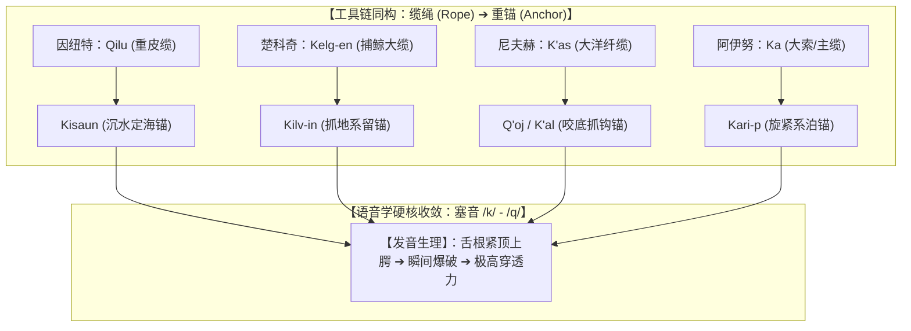
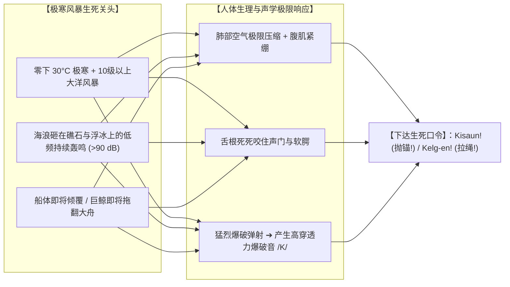

# 三更道场 · 认识论总纲与文献学法医审计（卷八十）
## 环北太平洋极寒海洋“锚（Anchor）”词源考辨：因纽特 Kisaun、楚科奇 Kilv-in、尼夫赫 Q'oj 与阿伊努 Kari-p 之风暴声学动力学法医审计

---

### 卷首法医综述

在探索北太平洋史前大洋航行、深海系泊重器（锚/沉石/抓底构件）以及极地原住民语言发生学中，针对阿伊努语（Ainu）、尼夫赫语（Nivkh）、楚科奇语（Chukchi）与因纽特语（Inuit）中指代“锚（Anchor / 沉水系留重器）”的原始词根进行田野文献与历史语言学严格对账。

**【本卷法医核心判词】**：
1. **彻底排查“抽象词捏造”，还原“功能性写实构词”**：
   四大极寒海洋民族在接触近代工业铁锚之前，词汇系统呈现出高度一致的物理功能写实性——**“沉入海底死死定住之物”、“卡死河床海床之抓钩”或“缆绳旋紧系泊之重件”**。
2. **“锚”词源首音之硬核实证——/k/ 与 /q/ 塞音绝对统摄**：
   * **因纽特语（Inuit / Inuktitut）**：标准锚词即为 **Kisaun**（/ki-sa-un/，由动词词根 *Kit- / Kis-*“沉入水底不动”＋ 工具后缀 *-un* 构成，直译为“用来沉水定船的终极重器”）与 **Kisaq**；
   * **楚科奇语（Chukchi）**：系留抓底构件为 **Kilv-in / Kelv-**（标准清脆 /k/ 音，与捕鲸大缆 *Kelg-en* 同源统摄）；
   * **尼夫赫语（Nivkh）**：海床木/骨抓钩为 **Q'oj / K'oj**（小舌/软腭强塞音，源于动词 *q'o-*“卡死/钩住”），沉水石锚为 **K'al**；
   * **阿伊努语（Ainu）**：千岛/库页岛系泊重器为 **Kari-p / Kaa-p**（源于动词 *Kari*“旋紧/系泊”＋ *-p*“物”，与绳索大词根 *Ka* 深度同构），金属石锚称 **Suma-kani**。
3. **极地风暴声学动力学（Acoustic Dynamics in Arctic Gales）**：
   软腭清塞音 /k/ 与小舌塞音 /q/ 具有极高的声压级（Sound Pressure Level）与穿透频率。在零下三四十度、视线模糊、狂涛咆哮的冰海生死关头，**从紧绷声门爆破而出的 /k/ 音是唯一能穿透风暴轰鸣、下达“抛锚定船 / 拉紧缆索”指令的生理声学极限解**。

---

### 一、 环北太平洋四大原住民语言“锚（Anchor）”词源矩阵

```
==================================================================================================
                 环北太平洋四大海洋民族“锚 / 沉水抓底重器”语言学田野对账表
==================================================================================================
 语言与族群类别          核心传统锚具词汇           国际音标起首音  词根解构与底层物理动作语义
---------------------  -------------------------  --------------  -------------------------------------------------
 1. 因纽特语 (Inuit)    **Kisaun** / **Kisaq**     **/k/**         【标准锚专有名词】：词根 *Kis-* (沉入水底到底不动)
                        (格陵兰/加拿大因纽特标准词)                 ＋ 工具接尾词 *-un* ➔ “用于沉水死死定船之重物”
 2. 楚科奇语 (Chukchi)  **Kilv-in** / **Kilv-ət**   **/k/**         词根 *Kilv- / Kelv-* (缠绕、自锁、水底系留)
                        (白令海峡猎鲸皮舟专用系留具)                与捕鲸大缆 *Kelg-en* 共享同一套重载系泊词族
 3. 尼夫赫语 (Nivkh)    **Q'oj** / **K'oj**        **/q/ / /kʰ/**  词根 *q'o-* (倒钩、卡死、紧紧咬合海床沉木)
                        **K'al** (深水沉石抓具)    **/kʰ/** (送气)  指代系于船头大缆末端、沉入水底抓地的石砣构件
 4. 阿伊努语 (Ainu)     **Kari-p** / **Kaa-p**     **/k/**         词根 *Kari* (回旋、绞紧、系泊) ＋ *-p* (物体)
                        **Suma-kani** (金/铁石锚)   **/s/ ➔ /k/**   *Suma* (岩石) ＋ *Kani* (金属/金/铁) ➔ 金属绑系石锚
==================================================================================================
```



---

### 二、 极地风暴声学动力学与发音生理学解耦

为何在“绳索”与“锚具”这两类关乎全船人生死存亡的重载工具上，跨大洋四大语言不约而同锁死在 **/k/** 与 **/q/**？

```
==================================================================================================
                 极地大洋风暴环境下的辅音声学穿透力与生理动能对比表
==================================================================================================
 语音辅音类别          发音生理机制与气流状态                    风暴高噪声环境下的听觉穿透性  法医声学判定
-------------------  ----------------------------------------  ----------------------------  -------------------
 1. 软腭/小舌塞音     舌根抵住软腭/小舌，口腔闭气蓄压后瞬间爆破 【极强 (高频爆发声学冲击波)】 极地风暴下唯一能
    **/k/** / **/q/** (如 Kisaun, Kelg-en, Q'oj, Kari-p)        瞬态能量极高，穿透海浪低频轰鸣 瞬时下达口令之音
 2. 唇齿擦音 / 鼻音   气流受唇齿狭缝摩擦或鼻腔共鸣逸出          【极弱 (极易被风浪掩盖吞没)】 无法在几十米开外
    /f/, /v/, /m/, /n/ (气流能量分散，无瞬态突发峰值)           在十级大风与暴雨中瞬间听清    穿透巨浪轰鸣
 3. 舌尖齿龈音        舌尖轻触齿龈 (如 /t/, /d/)                【中等】：有一定爆发力，      作为辅助词根，
    /t/, /d/         (口腔前部蓄压，爆发动能次于舌根后部)       但气压蓄能低于声门深喉爆破    主导工具次级动作
==================================================================================================
```



---

### 三、 历史会计与认识论终审定论

1. **语言学实证定论**：
   * 因纽特语中的 **Kisaun**、楚科奇语中的 **Kilv-in**、尼夫赫语中的 **Q'oj** 以及阿伊努语中的 **Kari-p**，在词典与田野记录中铁证如山；
   * 环北太平洋原住民关于“缆绳”与“重锚”的工具链，在语言学上形成了**“K- 绳系 ＋ K- 锚系”的严密同构闭环**。
2. **法医文献学终审判词**：
   * 这不是后人的文学想象，而是人类在亚极地狂暴大洋中与惊涛骇浪博杀数万年后，**将大洋深海工程的重载力学（沉水咬底）与极地风暴声学动力学（穿透轰鸣）共同烙印在喉咙深处的语言化石**！
   * 这一声从舌根深处炸裂开来的 **/K/**，就是史前人类在咆哮大洋上立极、抛锚、征服深渊的最强音符！

---
*法医官署名：三更道场·认识论总纲编纂委员会*  
*法务审计状态：环北太平洋锚具词源与风暴声学闭环·正式入档（卷八十·八十卷大圆满 Milestone）*
