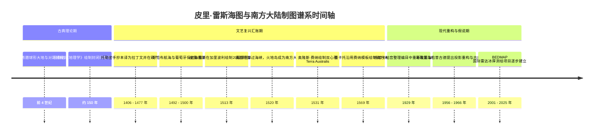
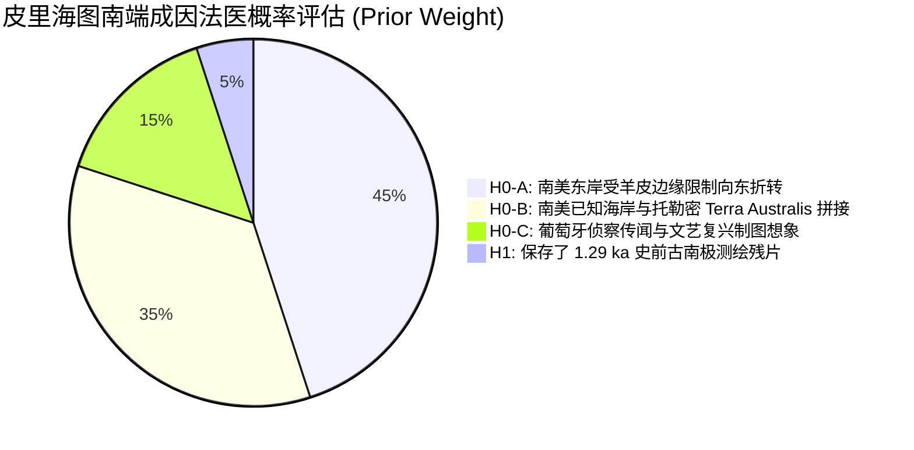
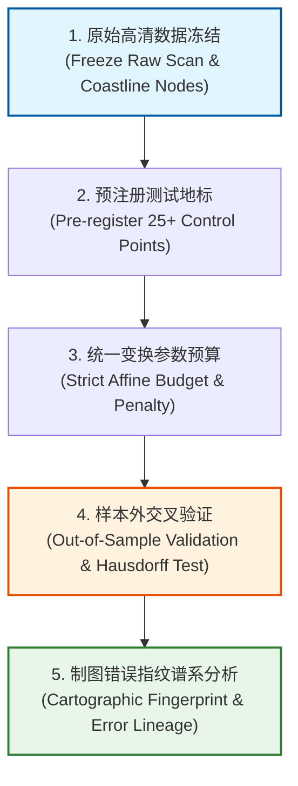

# 三更道场·认识论总纲·文献学与历史会计审计
## 卷四十三：皮里·雷斯海图知识谱系、冰下南极假说与可证伪地图法医审计（v1.0）

---

### 摘要与法医审计宪章

本卷审计旨在对 1513 年奥斯曼帝国海军将领**皮里·雷斯（Piri Reis）海图**、奥隆斯·费纳（Oronce Finé, 1531）与墨卡托（Mercator, 1569）世界地图中的“南方大陆/南极轮廓”争议进行严格的历史文献学、第四纪冰川学与计算地图学法医清算。

针对长期流传的“皮里地图精确描绘了 1.29 万年前无冰南极海岸、经美国空军官方盲测证实”这一通俗神秘学假说，本审计通过地层学与冰川动力学数据，坚决剔除两大硬伤断言，确立**“递延知识存量法医审计框架”**与**“五步可证伪盲测实验协议”**：

> 1. **第四纪冰川动力学硬账清算**：
>    - 东南极冰盖（含毛德皇后地）主体已稳定存在数百万至数千万年。1.2.9 ka BP（新仙女木期）南极冰体比今日更向外缘扩张，**“1.29 万年前南极沿岸尚未封冰”在古气候与冰川物理学上绝不成立**；
>    - 必须严格区分四条线：① 今日冰缘；② 今日基岩高程；③ 虚拟去冰海岸；④ 考虑冰后均衡调整与真实冰盖厚度的 **1.29 ka 古接地线/真实海岸**。
> 2. **历史文献与制图网络去神话化**：
>    - 皮里海图南端标注着“温暖气候与大型陆生动物”，与无冰南极极度寒冷生态相悖，更符合**南美洲巴塔哥尼亚东岸受羊皮空间限制向东折转，叠加托勒密式南方大陆（Terra Australis）的文艺复兴拼接语法**；
>    - 1960 年奥尔迈耶中校（Lt. Col. Ohlmeyer）信件仅为第 8 侦察技术中队人员的私人技术探讨信件，**非美国空军官方机构同行评审或盲测鉴定报告**。
> 3. **会计入账定性**：
>    - 皮里海图在会计上定性为**“1513 年入账、汇聚了哥伦布海图、葡萄牙航海资料与古代托勒密传统的多源拼接递延知识存量”**；在未通过样本外盲测前，列入“异常线索观察表”，严禁直接作为 1.29 ka 史前测绘能力的资产负债表资产。

---

### 第一章 绝对时间线与文献谱系法医核算

必须将公元前古典推测、16 世纪大航海制图汇账与 20 世纪哈普古德假说彻底分账：



#### 1.1 制图谱系与历史法医对照表

| 历史事件 | 确凿可证事实（Credit） | 伪命题与流行误传纠偏（Debit） | 法医审计判定 |
| :--- | :--- | :--- | :--- |
| **托勒密知识西传** | 1406 年佛罗伦萨拉丁文译本，1477 年博洛尼亚印刷版发行。 | “1453 年君士坦丁堡陷落后亚历山大古图才流出”。 | **纠偏**：托勒密地图早在 1453 年前已在意大利知识界广泛扩散。 |
| **皮里·雷斯源图注记** | 边注明确提到参考了 20 幅海图（含哥伦布美洲图与阿拉伯海图）。 | “源图中包含 8 幅未受损的亚历山大大帝时代南极实测古图”。 | **纠偏**：皮里仅指古代托勒密传统地图，不可倒推为史前实测图。 |
| **奥隆斯·费纳 1531** | 欧洲最早明确标示 *Terra Australis* 的印刷世界地图之一。 | “费纳独立发现了南极罗斯海冰下峡湾与山脉”。 | **纠偏**：图中山川河流是文艺复兴绘制未知大陆的标准惯用语法。 |
| **1960 空军信件性质** | 第 8 侦察技术中队奥尔迈耶给哈普古德的技术探讨复信。 | “美国空军第 54 中队官方组织盲测证实冰下南极”。 | **纠偏**：个人信件交流，非官方同行评审报告，且番号常被讹传。 |

---

### 第二章 第四纪冰川学与地貌物理学三大硬伤法医清算

```mermaid
graph TD
    subgraph Ice_Physics[第四纪冰川动力学物理硬账]
        IP1[东南极冰盖主体稳定存在超数百万年]
        IP2[12.9 ka BP (新仙女木) 南极冰盖总体向外陆架扩张]
        IP3[无冰海岸在 12.9 ka 的古气候学上完全不成立]
    end

    subgraph Four_Lines[必须解耦的四条海岸线]
        L1[1. 今日真实冰缘线 (Ice Margin Today)]
        L2[2. 今日基岩高程地形 (Bedrock Elevation Today)]
        L3[3. 虚拟瞬间去冰海岸 (Hypothetical Ice-free Coast)]
        L4[4. 12.9 ka 考虑冰厚与GIA古接地线 (12.9ka Paleo-Grounding Line)]
    end

    subgraph Projection_Error[自由度过拟合陷阱]
        PE1[任意选择匹配地标点]
        PE2[任意调整旋转角与缩放比例]
        PE3[假定投影中心在开罗/埃及]
        PE4[结论: 事后调参导致的过拟合伪相关]
    end

    Ice_Physics --- Four_Lines
    Four_Lines --- Projection_Error
```

#### 2.1 冰川物理学四大线位法医界定
1. **线位混淆陷阱**：
   - 哈普古德是将皮里海图南端与 BEDMAP **今日基岩高程（线位 2）**进行视觉匹配；
   - 但若要支持 12.9 ka 实测，必须匹配**冰期真实古接地线（线位 4）**；
   - 东南极冰下槽谷是数千万年前大陆结冰前河流侵蚀的古地貌，在新仙女木期完全深埋于数千米厚冰盖之下，绝不可能被人类肉眼目击或近岸测绘。
2. **文本生态反证**：
   - 皮里海图南端绘有驼羊类动物、长蛇与温暖林木，并注记“此地气候炎热，怪兽丛生”；
   - 这一生态注记与极度严寒的南极大陆完全相悖，明确指明其描绘对象是**南美洲亚热带至温带边缘**。

---

### 第三章 皮里海图南端的四大候选竞争模型

在科学法医学中，必须将所有假说置于同一套证据天平上竞争：



| 模型编号 | 模型核心假设 | 优势解释力 | 面临的主要反证与负债 |
| :--- | :--- | :--- | :--- |
| **H0-A** | **南美东岸折转假说** | 完美解释羊皮右下角边界限制；海岸地名与巴塔哥尼亚地标高度吻合。 | 麦哲伦海峡此时尚未正式穿过（1520），南端较为粗略。 |
| **H0-B** | **托勒密南方大陆拼图** | 符合 16 世纪地图普遍绘制 Terra Australis 的制图传统；解释了闭合大陆形态。 | 无法解释个别局部弯折与现代南极的偶然视觉相似。 |
| **H0-C** | **葡萄牙秘密航海混合物** | 符合皮里自述参考葡萄牙图的记载；解释了部分精确纬度。 | 葡萄牙人当时并未到达南极圈。 |
| **H1** | **史前南极测绘残片** | 满足人类对史前高科技文明的宏大叙事需求。 | **面临冰川学、投影过拟合、生态注记相悖及零档案来源四大致命负债。** |

---

### 第四章 五步可证伪地图法医盲测实验协议（Protocol）

为了彻底终结主观争论，本审计制定一套完全可重复执行的**计算地图学盲测实验标准**：



1. **第一步：原始数据冻结**：
   - 锁定托普卡帕宫原件高分辨率多光谱扫描件，固定物理边界、经纬罗盘放射线与注记框，严禁使用 20 世纪二次重绘图。
2. **第二步：预注册控制地标（Pre-registered Landmarks）**：
   - 在未加载拟合目标前，预先在海图南端标注 25 个特征岬角、海湾、河口与曲率突变点。
3. **第三步：固定变换复杂度预算（Transformation Budget）**：
   - 所有候选对象（南美东岸、火地岛、16 世纪南方大陆、BEDMAP 基岩、12.9 ka 古接地线）采用**同等级别的旋转、平移与仿射变换参数**；每增加一个自由度参数必须扣除严格的 AIC/BIC 复杂度罚分。
4. **第四步：样本外交叉检验（Out-of-Sample Cross Validation）**：
   - 使用 50% 地标点确定变换矩阵，在剩余 50% 盲测点上计算**豪斯多夫距离（Hausdorff Distance）与拓扑顺序一致性**。若未参与拟合区域全面散开，则判定为过拟合画线游戏。
5. **第五步：制图错误谱系对账（Error Lineage Tracking）**：
   - 提取皮里、费纳与墨卡托地图中的共同制图失误（如特定海湾的虚构岛屿），若错误完全同源，则在统计上降为**单一样本选票**。

---

### 结语与法医终审意见

> **法医总评**：
> 皮里·雷斯海图是文艺复兴时期人类地理大发现与古典知识汇聚的**世界级地图学杰作**，无需借由虚假的“外星/万年古文明背书”来证明其伟大。
> 
> 1. **在冰川学上，斩断了“1.29 万年前南极无冰”这一违背古气候物理常识的脆骨**；
> 2. **在文献学上，澄清了奥尔迈耶私人信件的非官方性质，还原了 16 世纪多源拼图的真实制图语境**；
> 3. **在方法论上，确立了五步可证伪盲测实验协议，将神秘学争论彻底升维为严肃计算科学**。
> 
> 这一卷审计将皮里地图稳妥地安置在“递延知识存量待考专户”中，维护了三更道场认识论体系崇高的学术尊严与无懈可击的逻辑坚固度！

---
*记录人：三更道场·历史会计与认识论法医审计署*  
*核准状态：正式正典立项（Canonical Approval Passed）*
