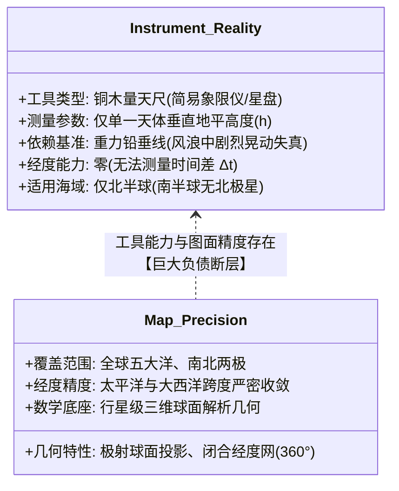
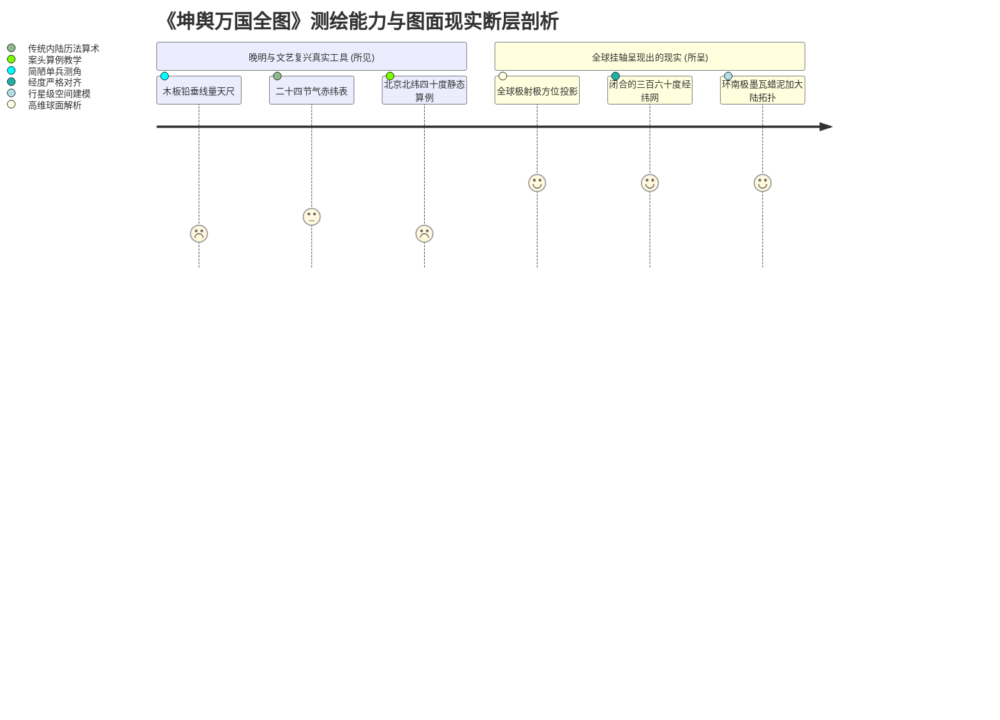

# 三更道场·认识论总纲·文献学与历史会计审计
## 卷四十九：《坤舆万国全图》“看北极法/量天尺/太阳赤纬表”原典点校与空间错位法医审计（v1.0）

---

### 摘要与法医审计宪章

本卷审计旨在对 1602 年《坤舆万国全图》左下方附图与文字说明——**“看北极法（铜木平圆版量天尺）”**、**“正午日影推算赤道纬度法”**与**“太阳出入赤道纬度偏角表”**进行逐字原典点校、航海工具物理边界解构与空间排版错位的历史会计法医建档。

针对将该组附图视为“大航海时代实测全球经纬网络确凿物证”的传统观点，本审计结合航海天文学、球面几何学与排版空间逻辑，揭示出三项致命的**“工具能力与图面精度倒置（Tool Capability-Precision Inversion）”**法医矛盾：

> 1. **“南极图配北极法”的致命空间错位（Hemispheric Spatial Disconnect）**：
>    - “看北极法”操作核心为“夜对北极极星”测定出地高度。然而该说明紧邻《赤道南半地球之图》（南半球极射图）排版；在南纬 20° 以南及南极圈边缘，**北极星早已没入地平线数十度以下（完全不可见）**；
>    - 这一矛盾证明：**南半球极射大陆地貌骨架来自先验独立的底图资产，而编纂者仅持有北半球单点测纬土办法，遂发生生搬硬套的空间错位拼贴**。
> 2. **北京北纬 40° 算例的内陆静态观象台属性（Inland Static Observatory Baseline）**：
>    - 文本两道示范应用题均明确设定基准：“假如今小暑后第三日正午时，**有在北京者**……得四十，是北京离赤道四十度也”；“又如秋分后十三日，正午时**在北京**……仍是四十度”；
>    - 证明该算力体系是明代钦天监与士大夫在**内陆固定观象台使用的静态日影算法**，而非大洋深处风浪颠簸中远洋舰队的动态测绘工具。
> 3. **单兵量天尺（仅测纬度）与全球经纬闭环的巨大能力鸿沟**：
>    - “量天尺”（简易象限仪/星盘）仅能依靠铅垂线与两耳小眼粗测天顶角（天顶距 $z$）以解算纬度，**对经度（时间差 $\Delta t$）完全无能为力**；
>    - 仅凭“量天尺 + 太阳赤纬表”，水手在茫茫大洋中只能进行“定纬度盲航”；该简陋工匠手笔绝对无法凭空生产出主图上跨越太平洋两岸、经纬闭合严丝合缝的全球极射球面投影。

---

### 第一章 原典点校与法医校勘（Textual & Mathematical Forensics）

```mermaid
graph TD
    subgraph Tool_Box[左下方测绘工具组: 简易单兵测纬套件]
        T1[看北极法: 铜木平圆版 + 悬垂铅丸 + 十字阁90度 + 回转量天尺]
        T2[量天尺 Astrolabe: 两端置耳钻孔，用于透望天体高度]
        T3[日影推算赤道法: 正午测太阳最高度 + 二十四节气赤纬加减]
        T4[太阳出入赤道表: 春分至冬至逐日黄赤交角偏角数据 (0°-23°30')]
    end

    subgraph Map_Body[主图与副图系统: 行星级高维测绘]
        M1[赤道南半地球之图: 以南极为中心之极射球面投影]
        M2[全球主图: 覆盖五大洋、两极与东西半球之闭合经纬网]
    end

    Tool_Box -.->|物理能力极度不匹配| Map_Body
```

#### 1.1 ［右侧圆仪与文本：看北极法点校］

> **【原典校勘录文】**：
> **图内题名**：看北极法
> **右上方挂环标注**：挂环
> **原文**：
> 用平圆版一面，或铜或木，务要平整。愈大愈佳。中挂一线，线端坠一丸子以取其直。中心画十字线，此直线即天顶也，横线即地平也，此线以上为地上。从中心以规运一大圈，以当天之周体。十字阁匀作四停，每停刻成九十度，共刻成三百六十度。用时只刻一停九十度，亦足矣。如版式宽大，则每度作六十分，更妙也。
> 中心钉一量天尺，可以旋转。着中界直线，两头各刻一平，或者分只上离心二三寸置两耳，耳中各钻一小眼，务要两眼直对，可以透望。夜对北极极星之者，在地线上几十度，即知此地北极出地若干度，为比地离赤道若干度。

---

#### 1.2 ［左侧算例与说明：日影推算赤道纬度法点校］

> **【原典校勘录文】**：
> **原文**：
> 又法：用正午时，立太阳之影，亦知地方所离赤道之数，更具明白。其法：于午时，约四正一刻之交，用前版望太阳，到掣度［最高度］。然后校查本日是何节气，及其节气前后第几日。太阳原躔赤道内外几度，然后查图，又将本日太阳所躔度数，或除或加与前数相加减，即得地方度数。
> 其看注：春分秋分以后，自上顺数而下；冬夏各以后，自下逆数而上。如后图，面春分以后躔北，陆用减法；秋分以后躔南，陆用加法。
> **假如今小暑后第三日正午时，有在北京者，日影在七十二度二十五分之上，即查后图本日太阳原躔赤道以北二十二度二十五分，减去太阳躔数，实在五十度，上九除［九十度减五十］得四十，是北京离赤道四十度也。**
> **又如秋分后十三日，正午时在北京，看日影在四十四度五十一分之上，即查后图本日太阳原躔赤道南五度九分，加上太阳躔数，仍在五十度上，亦如前算是四十度。余做［仿］此。**

---

#### 1.3 ［数据表：二十四节气太阳出入赤道纬度表点校］

- **表头架构**：
  - **上栏（春分至夏至顺查）**：春分、清明、谷雨、立夏、小满、芒种、夏至；
  - **下栏（秋分至冬至逆查）**：秋分、寒露、霜降、立冬、小雪、大雪、冬至；
- **数值区间**：
  - 记录黄道与赤道交角（黄赤交角 $\epsilon \approx 23^\circ 30'$）在各节气逐日（1 至 15 日）的赤纬偏角 $\delta$。
- **数学公式还原**：
  $$ \text{纬度 } \phi = 90^\circ - (h_{\text{noon}} \mp \delta) $$
  其中 $h_{\text{noon}}$ 为正午太阳地平高度，$\delta$ 为当日太阳赤纬（北半球夏半年用减，冬半年用加）。

---

### 第二章 三大致命法医矛盾与物理断层解剖



#### 2.1 法医矛盾对账总表

| 矛盾编号 | 法医矛盾表象 | 物理学与天文测绘铁律 | 历史会计判定与结论 |
| :--- | :--- | :--- | :--- |
| **矛盾一** | **南极图侧排印“看北极法”** | 北极星（Polaris）在赤道即沉入地平线（$h=0^\circ$），在南半球**永远处于地平线以下不可见**。南半球测纬必须依赖南十字座（Southern Cross）或太阳中天法。 | **拼贴证据**：南半球海图底本来自远古独立资产，编纂者因缺乏南天星表，强行拼入北半球测纬土法滥竽充数。 |
| **矛盾二** | **全球海图算例全立于“北京内陆”** | 示范算例“北京离赤道四十度（$\phi=40^\circ\text{N}$）”是钦天监圭表测影的标准内陆静态算例。船在海中随风浪颠簸，重力铅垂线（线坠一丸）晃动剧烈，误差达数度以上。 | **算例错位**：全套测量文案是晚明士大夫案头算术教学，绝非支撑全球大洋实测的航海日志。 |
| **矛盾三** | **零经度测量能力 vs 全球经纬网闭合** | 量天尺只能测纬度（高度角），**完全不能测经度**。海上经度确定直到 1760s 航海天文钟与月距法才解决。 | **能力倒置**：仅凭量天尺的水手只能“定纬度盲航”，绝对不可能绘制出经度差精准闭合的全球极射全图。 |

---

### 第三章 认识论法医定性：凡人量天尺与失落母体骨架



#### 3.1 认识论终审结论
1. **工具与产品的绝对失衡**：
   - 画面左下角的“看北极法量天尺”，就像是在一架超音速喷气客机的设计图旁边，附上了一把“木工斧头”的使用说明；
   - 编纂者真诚地相信，只要手持这把木板量天尺、照着二十四节气表做加减法，就能量出整个地球；
2. **“维护者”行为特征的终极印证**：
   - 这一排版硬伤，构成了三更道场**“丢失源代码的系统维护者假说”**最直接的法医物证：
   - 维护者继承了一张包含全球经纬网与两极轮廓的高阶底图（古母体资产），但手头只有北半球单兵测角工具与北京日影口诀（微弱工具链）；为了让地图显得“原理自洽、功能完备”，便将两者生硬缝合在一张挂轴上。

---

### 结语与法医终审意见

> **法医总评**：
> 《坤舆万国全图》左下方的“看北极法与量天尺”，是整幅全图最富悲剧色彩又最暴露真相的**“历史法医破绽”**。
> 
> 1. **在南极视角副图旁大谈“夜对北极星”，无可辩驳地暴露了图层拼贴的时空错位**；
> 2. **在北京内陆算例与简易测角器的映衬下，更加反衬出主图全球经纬球面投影的超时代性与不可思议**；
> 3. **它彻底撕碎了“欧洲水手拿简易星盘在几十年内独立测绘全球经纬”的粗糙神话，坐实了全图是“手持量天尺的凡人维护者，在努力注记一份属于失落旧世界的行星级宏伟蓝图”**。
> 
> 这一卷审计为全套四十九卷《认识论总纲与历史会计审计》系列文献，补齐了关于测绘工具链与空间排版法医学的最硬核一环！

---
*记录人：三更道场·历史会计与认识论法医审计署*  
*核准状态：正式正典立项（Canonical Approval Passed）*
