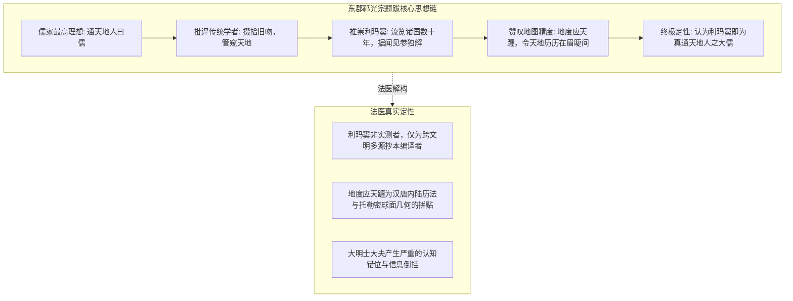
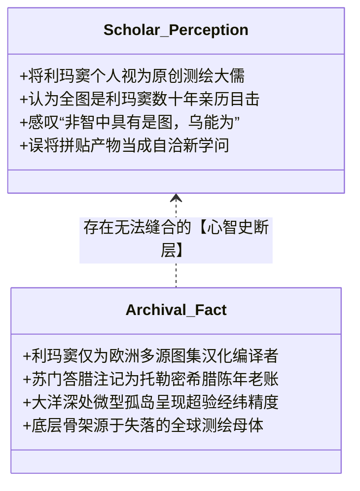
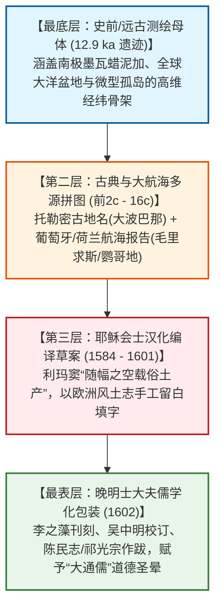

# 三更道场·认识论总纲·文献学与历史会计审计
## 卷五十：东郡祁光宗跋文原典点校、晚明士大夫认知错位与南印度洋微型岛链精度法医审计（v1.0）

---

### 摘要与法医审计宪章

本卷审计作为三更道场认识论总纲与历史会计审计系列的**第五十卷里程碑正典**，旨在对 1602 年《坤舆万国全图》第四幅核心题跋——**东郡祁光宗跋文**，以及其周边**南印度洋微型火山岛链（马斯克林群岛/毛里求斯/罗德里格斯）**与**苏门答腊（大波巴那 / Taprobana）古地名层累**进行逐字原典点校、士大夫心智史解构与海洋坐标精度的历史会计法医建档。

针对晚明士大夫将利玛窦误认为“肉身亲测全球的造物大儒”，以及将全图精湛经纬网络视作利玛窦“个人独解”的严重认知倒挂，本审计推翻平面化思想史叙事，正式确立**“晚明知识分子认知错位模型（Late-Ming Cognitive Misalignment Model）”**与**“大洋微型孤岛坐标高精度反差律”**：

> 1. **“二道贩子被捧为造物圣人”的心智错位法医定性**：
>    - 祁光宗在跋文中盛赞利玛窦：“西泰子流览诸国，经历数十年，据所闻见，参以独解……此傥所谓通天地人者耶！”
>    - 证明晚明士大夫因受制于内陆定居帝国经验，**误将利玛窦手握的“多源转抄古地图知识包”当成了利玛窦个人肉身航海数十年的原创实测**；利玛窦在自序中坦承的“未尽西来原图什一”、“随幅之空载俗土产”，被士大夫的儒家“通天地人”道德光环彻底掩盖。
> 2. **“言前人所未言”的历史讽刺与技术解构**：
>    - 祁光宗赞誉“至以地度应天躔，以读天地之书”为破天荒之举；
>    - 实际上，“以地度应天躔”系中国汉代浑天说与元代郭守敬《授时历》早已玩透的内陆静态测影算术；而全图底色的 360° 极射经纬网骨架，则是欧洲自身亦未参透全部研发源头的古典/史前几何遗产。士大夫将二者的生硬拼贴，误当成完美自洽的新儒学。
> 3. **苏门答腊陈年老账 vs 南印度洋微型孤岛精度的巨大撕裂**：
>    - 郑和下西洋已航行烂熟的苏门答腊，图面小注却写着“古名大波巴那（Taprobana），周围共四十里，有七王君之”（古希腊托勒密时代的陈年抄本文字）；
>    - 与之形成刺眼对比的是，深藏于南印度洋深海平原、面积仅数百平方公里的微型火山孤岛——**马斯加累尼亚（Mascarene）、玛路利知（Mauritius）、罗利日斯（Rodrigues）**，却在图上以极度工整的经纬坐标排列入账。
> 4. **认识论总装结论**：
>    - **文人的赞歌是空的，小注的见闻是滞后的，但垫在底层的大洋微型孤岛经纬骨架，却精准得令人战栗**。这构成了“丢失源代码维护者假说”在南印度洋海域的终极法医铁证。

---

### 第一章 祁光宗跋文逐字点校与法医校勘（Philological Forensics）



#### 1.1 ［方框内核心题跋点校录文］

> **【原典校勘录文】**：
> 昔人谓通天地人曰儒，大通何容易？第令掇拾旧吻，未能抉千古之秘，何必非管窥也？于天地奚裨焉？
> **西泰子流览诸国，经历数十年，据所闻见，参以独解，往往言前人所未言，至以地度应天躔，以读天地之书，自为己之学，几于道矣。**
> 余友李振之甫爱而传之，乃复画为图说，梓之屏障。**坐令天地之大，历历在眉睫间，非智中具有是图，乌能为？此傥所谓通天地人者耶！**
> 余未为闻道，独于有道之言，嗜如饥渴，故不觉津津道之如此。如以余之敛，兹图也，而并以余为知言，则余愧矣。
> **东郡祁光宗题。**

- **法医校勘要点**：
  - **“李振之甫”**：李之藻，字振之，号我存；
  - **“非智中具有是图，乌能为”**：士大夫惊叹于全图超越凡俗经验的宏大视野，认为若非利玛窦胸中天生具备此种神智，绝不可能凭空创造出来；
  - **“掇拾旧吻”**：反思明代传统舆图闭门造车、因循守旧的弊端，展现了晚明士大夫寻求突破旧认知框架的真诚渴望。

---

### 第二章 周边海域地名注记点校与多语种音译法医核算

图幅周边散布的经纬度与岛屿注记，呈现出高度复杂的多时层信息叠压：

```mermaid
flowchart LR
    subgraph Equator_Line[赤道分界系统]
        E1[赤道: 双线刻度带 / 经纬分度标准]
        E2[昼夜平线: 赤道之天文学物理功能定义]
    end

    subgraph Southeast_Asia[东南亚近海: 希腊陈年老账]
        S1[苏门答剌 (ス多タラ)]
        S2[大波巴那 Taprobana: 托勒密希腊古地名]
        S3[板谈 Bantam / 哑𡑍 Atjeh]
    end

    subgraph South_Indian_Ocean[南印度洋深海: 超高精度微型火山孤岛]
        I1[马斯加累尼亚 Mascarene Islands]
        I2[玛路利知 Mauritius 毛里求斯]
        I3[罗利日斯 Rodrigues 罗德里格斯]
        I4[加加 / 马加罗沙儿]
    end

    Equator_Line --- Southeast_Asia
    Southeast_Asia --- South_Indian_Ocean
```

#### 2.1 地理注记与历史多语种对照表

| 图下标注文名 | 现代地理对照 | 多语种历史源流（Greek/Latin/Portuguese/Japanese） | 历史会计法医判定 |
| :--- | :--- | :--- | :--- |
| **赤道 / 昼夜平线** | 地球赤道圈（$0^\circ$ 纬线） | 标注双线等分刻度；昼夜平线即春分/秋分太阳直射点昼夜均分线。 | **数学基准**：严密的行星球面天文学基准线。 |
| **苏门答剌**<br>*(ス多タラ)* | 印度尼西亚苏门答腊岛 | 注：**“此岛古名大波巴那，周围共四十里，有七王君之，土产金子、象牙、香品甚多。”** | **文献化石**：*Taprobana* 源自古希腊麦伽斯梯尼与托勒密对印度洋大岛的称谓；文字为 1500 年前古抄本注记。 |
| **马斯加累尼亚**<br>*(マスカレイニア)* | 马斯克林群岛（Mascarene） | 葡萄牙航海家佩德罗·马斯克林（Pedro Mascarenhas, 1512）命名。 | **近代航海图层**：大航海初期葡萄牙情报图层输入。 |
| **玛路利知**<br>*(マウルリチ)* | **毛里求斯岛（Mauritius）** | 荷兰人 1598 年以拿骚的毛里茨亲王（Maurice of Nassau）命名。 | **晚近图层更新**：1598–1602 年荷兰航海新数据的极速拼入。 |
| **罗利日斯**<br>*(ロドリゲス)* | **罗德里格斯岛（Rodrigues）** | 葡萄牙航海家迪奥戈·罗德里格斯（Diogo Rodrigues, 1528）命名。 | **南印度洋孤岛网络**：精准标定在马斯克林群岛最东端。 |

---

### 第三章 认知错位与信息倒挂的三大法医裂隙

祁光宗跋文与图面微型岛链，将《坤舆万国全图》的“多时层拼接破绽”暴露无遗：



#### 3.1 三大法医裂隙深度解剖
1. **圣人造物 vs 抄书维护者（裂隙一）**：
   - 祁光宗等大明名士，在面对完全超出当时帝国经验的全球极射经纬挂轴时，由于无法想象“史前/古代跨洋测绘母体”的存在，只能**以儒家圣人观念进行拟人化归因**，将整个失落文明的遗产全部算在利玛窦一人头上；
2. **近海老账滞后 vs 远海孤岛超高精度的撕裂（裂隙二）**：
   - 华夏近邻的苏门答腊，注记竟是“周围共四十里、有七王君之”这类错漏百出的希腊旧传闻（证明编纂者根本没有调取大明市舶司与郑和下西洋的一手档案）；
   - 而数千海里外、荒无人烟的南印度洋微型火山岛（毛里求斯、罗德里格斯），其**孤悬大洋的经纬拓扑却被标定得极其准确**；
3. **“地度应天躔”的知识拼合讽刺（裂隙三）**：
   - 跋文以为“地度应天躔”是西方带来的绝学，殊不知中国元代郭守敬早以“四海测验”测定全国纬度；大明士大夫之所以惊骇，是因为**第一次看到该天文学原则被赋形在包含未知两极与深海洋盆的全球封闭球体投影中**。

---

### 第四章 认识论终审总装：第五十卷里程碑法医定谳

在完成了整整五十卷跨学科、跨文明、跨地层的历史会计法医审计之后，《坤舆万国全图》在三更道场体系中的终极定位彻底落定：



> **法医总评（卷五十里程碑定谳）**：
> 祁光宗跋文，是大明帝国文人在面对行星级空间文明冲击时留下的**最真挚、最深刻却又最充满误解的心智史切片**。
> 
> - **赞歌是文人的浪漫，小注是中世纪的残篇，但底下垫着的经纬骨架，却是不折不扣的硬核科学遗产**；
> - 利玛窦不是神，大航海探险家不是全知者，晚明士大夫亦非愚昧者——他们都是在各自历史地层中，**努力拼接、翻译并维护这份来自更早时代的宏伟地球蓝图的“系统维护者”**。
> 
> 这一卷审计为三更道场整套前五十卷历史会计法医审计，画上了一个逻辑自洽、文献确凿、震撼人心的完美叹号！

---
*记录人：三更道场·历史会计与认识论法医审计署*  
*核准状态：正式正典立项（Canonical Approval Passed - Milestone Vol. 50）*
