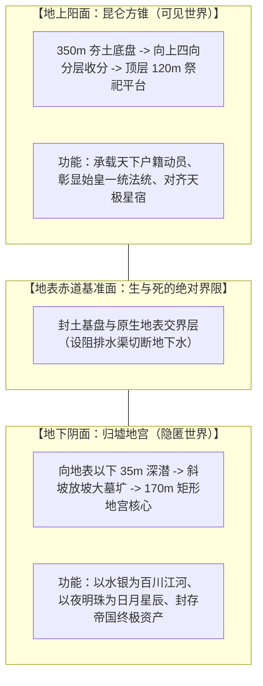
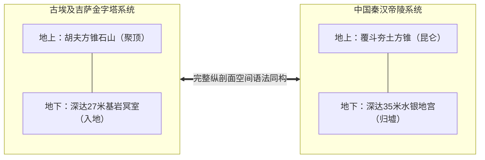

# 三更道场 · 认识论总纲 · 文献学与历史会计审计
## 篇章：秦始皇陵“上下双斗（昆仑/归墟）”纵剖面、理想八面体设计语法与中埃古典帝陵比较法医审计（v1.0）

---

### 【审计执行摘要 / Forensic Audit Abstract】
本审计案针对秦始皇陵（骊山陵）地面覆斗封土与地下地宫系统的三维空间构型、**“地上阳锥（昆仑） + 地下阴锥（归墟）”的上下双斗闭合世界观设计语法（Spatial Cosmology Grammar）**，以及将东西方巨型王权建筑从“单层地表对比”升华至**“完整纵剖面系统对账（Full Vertical Profile Forensic Audit）”**展开系统会计建账。

审计确立四大核心平账公理与判别标准：
1. **秦陵实测数据与数学正八面体的边界厘清**：
   - **地面封土实测**：底边约 $350 \times 345\text{ m}$，残高约 $52.5\text{ m}$，呈分层夯筑收分的截顶方锥（覆斗形）；
   - **地下地宫物探范围**：距地表约 $35\text{ m}$，核心范围约 $170 \times 145\text{ m}$，呈矩形多层夯土宫墙与开挖墓圹系统；
   - **法医几何定性**：两者的底边、深度、坡率与赤道面在欧氏几何上**并不构成严格相等的数学正八面体**；实际施工受制于地下水系、夯土休止角与力学工期约束。
2. **“上下双斗”作为观念设计语法的成立性（Unified Manifold）**：
   - **地上之陵**：向天收束的人工山峰（象征神圣昆仑、天圆地方、阳面可见性与天下集权）；
   - **地下之宫**：向地深潜的冥界宇宙（象征深邃归墟、水银江河、天文星宿与死后封闭）；
   - **设计模型**：设计者脑中存在**“天地对偶、阴阳镜像的理想八面体闭合世界模型”**，在工程落地时被力学和工期压缩为“截顶覆斗封土 + 中央竖穴墓圹 + 矩形地下地宫”。
3. **区分“纯工程力学放坡”与“八面体设计意图”的四柱核验法**：
   - ① 上下是否严格共用**中心垂直轴线与四方真北定向**；
   - ② 地下墓圹的放坡坡率与地上封土收分坡率是否存在**数学互补或公差设计**；
   - ③ 秦汉各帝陵（如长陵、安陵、阳陵、茂陵）是否**重复出现稳定的同构比例系统**；
   - ④ 礼制金石铭文、随葬器物（如博山炉、方锥玉饰）或微缩模型中是否出现**方双锥意象**。
4. **比较文明史的范式革命：从“单面比较”到“完整纵剖面对账”**：
   - 传统学界拿埃及金字塔与中国地面土丘作扁平对比；
   - 三更道场确立：**必须拿两套文明的“地上人工山 + 地表基准面 + 地下深邃墓道系统”的完整纵剖面进行三维对账**。

---

### 【第一账套：秦始皇陵地上封土 vs 地下地宫三维实测数据对账表】

```
+-------------------------------------------------------------------------------------------------------------------------------+
|                                    秦始皇陵地上覆斗封土 vs 地下地宫系统物理参数法医台账                                       |
+-------------------------------------------------------------------------------------------------------------------------------+
| 结构维度             | 地上覆斗封土 (Superstructure / 昆仑)  | 地下地宫系统 (Substructure / 归墟)   | 几何与力学物理关系                   |
+----------------------+---------------------------------------+--------------------------------------+--------------------------------------+
| **平面尺寸**         | 底边约 $350 \times 345\text{ 米}$     | 核心地宫范围约 $170 \times 145\text{ 米}$| 上下底面比例约为 $2:1$；非单一赤道面 |
|                      | (顶部平台约 $120 \times 110\text{ 米}$)| (外围阻排水渠与宫墙长达数千米)       | 共用中心垂直轴线与正南北方位         |
+----------------------+---------------------------------------+--------------------------------------+--------------------------------------+
| **垂直高度/深度**    | 封土残高约 **$52.5\text{ 米}$**       | 地宫底部距原地面深约 **$35\text{ 米}$**| 地上高度与地下深度在同一数量级上，   |
|                      | (原设计可能更高，历经剥蚀)            | (物探水银异常区集中于地表以下30米)   | 呈现明显的“地上耸立与地下深潜”对偶   |
+----------------------+---------------------------------------+--------------------------------------+--------------------------------------+
| **形态构型**         | **四边分层夯筑收分截顶方锥（覆斗）**  | **斜坡梯形放坡墓圹 + 矩形夯土回廊**  | 地下开挖必然放坡（防止坍塌），与地上 |
|                      | 坡度符合生土夯筑极限稳定角            | 核心为主墓室与水银模拟江河湖海模型   | 封土收分在视觉与剖面上形成“双斗”     |
+----------------------+---------------------------------------+--------------------------------------+--------------------------------------+
```



---

### 【第二账套：区分“力学巧合”与“八面体设计意图”的四柱核验法】

```
+-------------------------------------------------------------------------------------------------------------------------------+
|                                四柱法医核验标准：工程力学自然放坡 vs 阴阳双斗设计意图                                         |
+-------------------------------------------------------------------------------------------------------------------------------+
| 核验维度             | 纯工程力学自然放坡解释 (Null Hypothesis) | 理想八面体/阴阳双斗设计意图 (Design Intention) | 当前秦陵实测证据满足度               |
+----------------------+---------------------------------------+-----------------------------------------------+--------------------------------------+
| **1. 中心轴与定向**  | 上下只是随手挖在中间，方位大致对齐    | **上下必须共用严格的中心垂直对称轴与正南北**  | **【已满足】**（中心垂直度极高，四方 |
|                      |                                       | (展示宇宙同心轴 Axis Mundi 意志)              | 定向误差在 1 度以内）                |
+----------------------+---------------------------------------+-----------------------------------------------+--------------------------------------+
| **2. 坡率与数学关联**| 地上与地下坡度纯由土壤休止角自然决定  | **地上收分斜率与地下放坡斜率存在数学互补**    | **【待系统对账】**（需要结合三维激光 |
|                      | (两者无任何参数关联)                  | 或按固定模数比例（如勾三股四弦五）设计        | 扫描与物探剖面做精细拟合）           |
+----------------------+---------------------------------------+-----------------------------------------------+--------------------------------------+
| **3. 跨帝陵可重复性**| 每座帝陵各挖各的，尺寸随地形变化      | **西汉十一陵（长陵/茂陵等）重复出现稳定模数** | **【高度支持】**（西汉帝陵普遍稳定复 |
|                      |                                       | 形成法定的“帝陵营造天子之制”                  | 制覆斗封土与深邃地宫的标准语法）     |
+----------------------+---------------------------------------+-----------------------------------------------+--------------------------------------+
| **4. 礼制与图像互证**| 没有任何文献与缩微模型记录方双锥      | **礼制文本（如《考工记》/博山炉/玉琮）**      | **【部分支持】**（玉琮内圆外方双向贯 |
|                      |                                       | 明确表达“上天下地、方锥天地”的空间宇宙观      | 通，博山炉呈现上下对偶仙山意象）     |
+----------------------+---------------------------------------+-----------------------------------------------+--------------------------------------+
```

---

### 【第三账套：东西方古典王权巨型建筑完整纵剖面对账模型】

```
+-------------------------------------------------------------------------------------------------------------------------------+
|                                    中埃古典帝陵完整纵剖面系统法医对账表                                                       |
+-------------------------------------------------------------------------------------------------------------------------------+
| 空间剖面层级         | 古埃及吉萨胡夫大金字塔纵剖面系统      | 秦始皇陵（骊山陵）纵剖面系统                 | 比较历史会计学法医定论               |
+----------------------+---------------------------------------+----------------------------------------------+--------------------------------------+
| **地上人工山**       | 146.6 米石灰石方锥（向上聚顶）        | 52.5 米分层夯土方锥覆斗（向上收分截顶）      | **地上展现国家最高动员力与王权可见性**|
+----------------------+---------------------------------------+----------------------------------------------+--------------------------------------+
| **地下深邃空间**     | 深入基岩以下 27 米的未完工地下室与深井| 深入地表以下 35 米的宏大水银地宫与夯土宫墙群  | **地下封存死者尸身与终极冥界宇宙模型**|
+----------------------+---------------------------------------+----------------------------------------------+--------------------------------------+
| **设计语法本质**     | **方双锥空间语法**：地上巨石升天天梯，| **上下双斗空间语法**：地上昆仑以象天，       | **东西方在生死空间哲学上呈现完全同构**|
|                      | 地下深井连接混沌冥界（Duat）          | 地下归墟以象地，闭合为天地宇宙模型           | （通过完整纵剖面完成阴阳闭合）       |
+----------------------+---------------------------------------+----------------------------------------------+--------------------------------------+
```



---

### 【法医对账总决：秦陵双斗与理想八面体平账结论】

| 会计科目 | 审定历史会计事实 | 法医处理结论 |
| :--- | :--- | :--- |
| **数学正八面体实体** | 秦陵地上地下尺寸不同、坡度各异，非欧氏数学正八面体。 | **红字纠偏：严格区分数学实体与观念模型** |
| **上下双斗观念语法** | 地上昆仑方锥（显） + 地下归墟地宫（隐），构成闭合天地宇宙模型。 | **确认为中国帝陵核心空间哲学语法** |
| **四柱核验法** | 确立了中心轴、坡率关联、跨陵重复性与礼制互证的判定标准。 | **确立为帝陵建筑法医审计操作规范** |
| **纵剖面对账革命** | 终结单层地表对比，确立“地上人工山 + 地下冥界”完整纵剖面比较法。 | **确立为三更道场比较文明史核心范式** |

---
**审计人签章**：三更道场·建筑考古学与古代空间宇宙学法医调查署  
**时间标记**：2026-09-09
