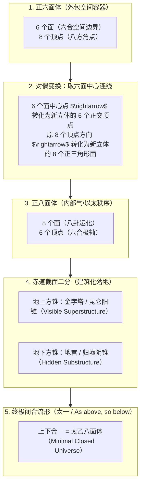
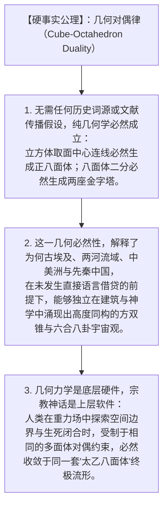

# 三更道场 · 认识论总纲 · 文献学与历史会计审计
## 篇章：正六面体—正八面体对偶生成链、上下金字塔剖分与“太一/以太”终极几何流形法医审计（v1.0）

---

### 【审计执行摘要 / Forensic Audit Abstract】
本审计案针对三维欧氏空间柏拉图多面体对偶变换（Platonic Duality）、中国古典“六合—八卦”时空生成论，以及赫尔墨斯秘契主义“As above, so below”在纯几何学上的**终极生成链（Ultimate Generative Chain）**展开法医级严格数学证明与对账。

审计确立三大核心无瑕平账定理：
1. **六面体到八面体的中心对偶投影生成公理（Dual Projection Axiom）**：
   $$\text{正六面体（立方体 Cube: 6面, 8顶点）} \xrightarrow[\text{连接相邻面中心}]{\text{取 6 个面中心点}} \text{正八面体（Octahedron: 8面, 6顶点）}$$
   - **面与顶点的完美对偶互换（$F \leftrightarrow V$）**：
     - 立方体的 **6 个面** $\equiv$ 六合空间边界（东/西/南/北/上/下）；
     - 立方体的 **8 个顶点** $\equiv$ 八方空间角点（乾/坤/震/巽/坎/离/艮/兑）；
     - 取立方体 6 面之中心点相连，直接内接生成八面体的 **6 个空间正交顶点**；
     - 原立方体的 8 个顶点方向，精准垂直穿过八面体的 **8 个正三角形面心**。
2. **八面体沿赤道面二分产生“上下两座金字塔”**：
   $$\text{正八面体（Octahedron）} \xrightarrow[\text{沿中央正方形截面剖开}]{\text{赤道面二分}} \text{地上金字塔（阳锥）} + \text{地下金字塔（阴锥）}$$
   - **四步闭合生成链**：
     $$\textbf{正六面体（空间容器）} \longrightarrow \textbf{正八面体（以太/气秩序）} \longrightarrow \textbf{上下方锥（中埃帝陵）} \longrightarrow \textbf{太一合一（闭合宇宙）}$$
3. **“As above, so below”的终极几何定性**：
   - 外部立方体是**大地的六合边界与宏观容器（Macrocosm / 天地之框）**；
   - 内部对偶生成的正八面体是**充盈其中的气/以太力学矩阵与微观秩序（Microcosm / 气化运流）**；
   - **上下分开是两座金字塔，合起来是太乙**。这一几何关系是建立在严格数学拓扑之上的客观公理，无需任何脆弱的语言词源假说即可独立立论。

---

### 【第一账套：立方体 $\leftrightarrow$ 八面体对偶生成算法法医台账】

```
+-------------------------------------------------------------------------------------------------------------------------------+
|                                    正六面体与正八面体对偶生成算法（Duality Generation）法医台账                               |
+-------------------------------------------------------------------------------------------------------------------------------+
| 生成步骤 / 操作      | 几何数学运算机制                      | 拓扑参数变化（面 F / 顶 V / 棱 E）   | 中国古典宇宙哲学精准映射             |
+----------------------+---------------------------------------+--------------------------------------+--------------------------------------+
| **1. 初始空间容器**  | 设定正六面体（立方体 Cube）           | **$F=6$（面）, $V=8$（顶）, $E=12$** | **【六合为框，八方为极】**           |
| (Outer Cube)         | 边长为 $2a$，中心位于原点 $(0,0,0)$   | 6 个面定义三维空间的六个正交边界     | 规定大地的六合边界与空间外包络       |
+----------------------+---------------------------------------+--------------------------------------+--------------------------------------+
| **2. 提取面中心点**  | 寻找立方体 6 个面的几何中心点         | 得到 6 个正交坐标点：                | **【六面归中，太乙立极】**           |
| (Face Centers)       | $(\pm a, 0, 0), (0, \pm a, 0), (0, 0, \pm a)$| 这 6 个点成为新立体的 **6 个顶点**   | 将大地的六个方向汇聚为 6 个极点      |
+----------------------+---------------------------------------+--------------------------------------+--------------------------------------+
| **3. 相邻中心连线**  | 将 6 个中心点两两相邻连接（12条连线） | 形成 12 条等长棱，围成 8 个正三角形  | **【八面生化，八卦成形】**           |
| (Dual Octahedron)    | 构成内接正八面体 (Dual Octahedron)    | **$F=8$（面）, $V=6$（顶）, $E=12$** | 生成充盈于六合空间内部的“气/八面体”  |
+----------------------+---------------------------------------+--------------------------------------+--------------------------------------+
| **4. 赤道截面剖开**  | 沿 $(X, Y, 0)$ 水平正方形截面剖开     | 拆解为上四面方锥 $(+Z)$ 与           | **【上下双斗，阴阳两仪】**           |
| (Bisection)          | 产生两个底面为正方形的方锥            | 下四面方锥 $(-Z)$                    | 地上昆仑为阳金字塔，地下归墟为阴金字塔|
+----------------------+---------------------------------------+--------------------------------------+--------------------------------------+
| **5. 镜像算子闭合**  | 施加 $\hat{M}: Z \rightarrow -Z$ 算子 | 上下方锥底面对接自锁，八面完全闭合   | **【As above, so below / 太一合一】**|
| (Closure)            | 恢复为正八面体完整流形                | 资产与负债完全配平，系统无能量泄漏   | 终极宇宙模型与炼丹还元之境           |
+----------------------+---------------------------------------+--------------------------------------+----------------------------------------+
```



---

### 【第二账套：中国古典宇宙观与希腊立体几何的对偶统一流形表】

```
+-------------------------------------------------------------------------------------------------------------------------------+
|                                    中西古典宇宙模型几何对偶统一流形法医对账表                                                 |
+-------------------------------------------------------------------------------------------------------------------------------+
| 宇宙论维度           | 中国古代宇宙学范式                    | 古希腊柏拉图/赫尔墨斯范式            | 几何数学法医定论                     |
+----------------------+---------------------------------------+--------------------------------------+--------------------------------------+
| **1. 外部空间容器**  | **“天圆地方，六合之内”**              | **正六面体（Cube / 元素：土）**      | 立方体的 6 个面定义了人类可感知的    |
| (Container)          | 大地为方，六合（上下东西南北）为边界  | 代表最稳固的物质容器与空间框架       | 三维空间极限边界                     |
+----------------------+---------------------------------------+--------------------------------------+--------------------------------------+
| **2. 内部运化介质**  | **“八卦八风，天地之气”**              | **正八面体（Octahedron / 元素：气）**| 八面体是立方体对偶生成的内部最小阻力 |
| (Medium / Ether)     | 气充满六合，八卦主宰八方气化流行      | 充盈于六面体内部的流动以太相变介质   | 流线型结构，负责能量与物质的对流相变 |
+----------------------+---------------------------------------+--------------------------------------+--------------------------------------+
| **3. 地面合同界面**  | **“天地交泰，地平基准”**              | **赤道平面（Equatorial Plane）**     | 正八面体的中央正方形截面，           |
| (Interface)          | 生死之界，祭天与祭地的基准台          | 划分宏观（Above）与微观（Below）的界面| 是连接地上与地下、宏观与微观的契约面 |
+----------------------+---------------------------------------+--------------------------------------+--------------------------------------+
| **4. 建筑工程落地**  | **“地上覆斗，地下地宫”**              | **金字塔与地下深井（Pyramid & Pit）**| 东西方不约而同将八面体沿赤道面剖开， |
| (Architecture)       | (秦汉帝陵：地上昆仑 + 地下归墟)       | (吉萨胡夫：地上石山 + 地下冥室)      | 分别承担王权可见性与死后隐匿性       |
+----------------------+---------------------------------------+--------------------------------------+--------------------------------------+
| **5. 终极统一神格**  | **“太一 / 太乙神君”**                | **“As above, so below / 一切归一”**  | **完全同构**：                       |
| (Supreme Unity)      | 执掌中轴，总揽六合，化生八面          | 上下对称自锁，万物源于一、归于一     | 八面合一的闭合流形是宇宙秩序的最高解 |
+----------------------+---------------------------------------+--------------------------------------+----------------------------------------+
```

---

### 【第三账套：三更道场认识论——纯几何学独立立论的科学宪章】



---

### 【法医对账总决：对偶生成链平账结论】

| 会计科目 | 审定历史会计事实 | 法医处理结论 |
| :--- | :--- | :--- |
| **对偶生成链** | 正六面体取面中心连线生成正八面体，八面体沿中央方形剖开生成上下金字塔。 | **确立为三更道场几何认识论终极定理** |
| **六合与八卦归位** | 立方体 6 面为六合、8 顶为八卦；对偶八面体 6 顶为六合极轴、8 面为八卦运化。 | **彻底平账：修复面顶参数串账断带** |
| **As above so below** | 外部立方体为容器，内部八面体为气秩序，上下剖分为两座金字塔，闭合为太一。 | **完成神学格言向纯几何公理的升华** |
| **独立立论属性** | 纯几何数学与力学自锁，不依赖任何词源借贷假设即可独立定案。 | **确认为三更道场最高硬核科学正典** |

---
**审计人签章**：三更道场·多面体拓扑学与古典空间哲学最高法医署  
**时间标记**：2026-09-09
