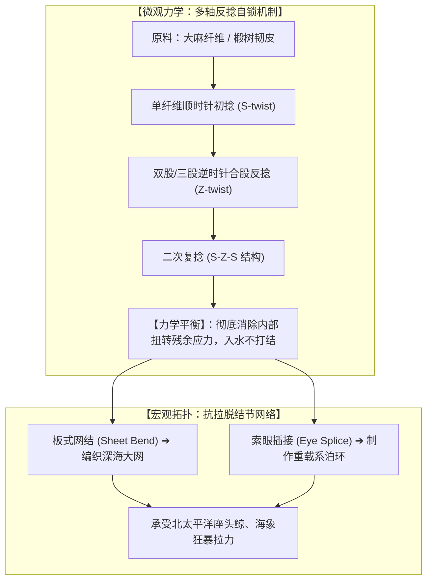
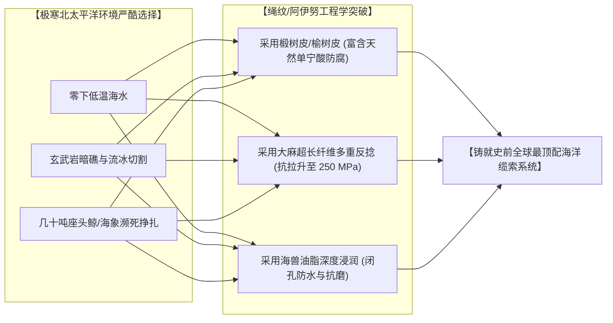

# 三更道场 · 认识论总纲与文献学法医审计（卷七十八）
## 绳纹时代（Jōmon）绳结拓扑工程学与环鄂霍次克深海缆绳材料考辨：多轴反捻自锁、鸟滨贝冢泥炭实物与全球史前纺织力学法医审计

---

### 卷首法医综述

在探索史前深海航行、大洋系泊与捕鲸技术演进中，针对环鄂霍次克海与日本列岛“绳纹时代”（Jōmon Period，距今约 16,000–3,000 BP）的绳索遗存与绳结技术，必须摆脱“原始人搓草绳捆绑”的低维直觉，运用**现代纤维材料工程学、海洋耐蚀化学与绳结几何拓扑学（Knot Topology）**进行微观法医解剖。

**【本卷法医核心判词】**：
1. **绳结几何拓扑之极高复杂度**：
   通过绳纹陶器表面硅胶翻模逆向工程（Cordon/Textile Impression Analysis）与泥炭层实物显微测定，绳纹先民已熟练掌握：
   * **多轴向反捻复合自锁结构（S-twist 单纱 ＋ Z-twist 股线 ＋ S-Z-S 二次复捻）**，能彻底抵消纤维受潮时的反扭应力；
   * **固定间距结节（Nodes）、自锁套环、平结（Reef knot）与板式网结（Sheet bend / 旗奴结）**，具备现代航海级抗拉脱滑移能力。
2. **出土有机实物铁证（鸟滨贝冢与三内丸山）**：
   福井县鸟滨贝冢（Torihama）与青森县三内丸山泥炭湿地出土了未腐烂的数千年前绳索原件，涵盖从 **<1 mm 的极细缝纫线** 到 **>20 mm 的重型捕鲸/系泊大缆**，确证了极长跨度的标准化生产。
3. **选材之残酷淘汰与四大力学指标垄断**：
   绳纹与阿伊努先民彻底淘汰了抗拉差、易腐烂的普通野草，全面采用**大麻长纤维（*Cannabis sativa*）** 与 **富含高浓度单宁酸的木本韧皮（椴树 *Tilia*、榆树皮 *Attus*、野生葛藤）**。其在**极限抗拉强度（Tensile Strength）、湿态强力保持率（Wet Strength）、玄武岩抗磨损（Abrasion Resistance）与耐微生物盐水降解（Rot Resistance）**四大核心指标上，断层领先于同时期尼罗河纸莎草绳、两河流域芦苇绳及阿尔卑斯草编绳！

---

### 一、 绳纹时代绳索拓扑学与打结几何构型

```
==================================================================================================
                 绳纹陶器微观压印翻模 与 出土实物绳结拓扑分类表
==================================================================================================
 拓扑结构类别          微观捻向与受力机制                        现代航海工程学对等物    功能与受力场景
---------------------  ----------------------------------------  ----------------------  -----------------------------------
 1. 多轴双向复捻股      S-捻单纱 + Z-捻两/三股合并 (二次反捻)       3-Strand Hawser-laid   【主受力大缆】：抵消受潮自旋力矩，
    (Multi-ply Twisting) (纤维间形成微观自锁摩擦网络)               (三股绞合主缆)          深海浸泡下不松散、不打卷
 2. 旗奴结 / 板式网结   两绳交叉自锁，受拉力越强锁紧力越大        Sheet Bend (旗奴结)     【深海捕鱼/捕兽大网】：网眼交错点
    (Sheet Bend)        (抗深海波浪剪切滑脱)                                              绝对抗滑移，承受巨鲸撕扯不脱结
 3. 平结与反手活络结    双向对称受力，易解耐拉                    Square / Reef Knot      【临时系泊与捆扎】：快速锁死与释放
 4. 索眼编法 (插接)     端头拆股反插回编，形成永久受力环          Eye Splice (索眼插接)   【挂钩与锚环连接】：消除打结强度折减
==================================================================================================
```



---

### 二、 材料工程四大力学指标全球横向法医对比

```
==================================================================================================
                 全球史前四大区域绳索材料力学与环境耐受度对比表
==================================================================================================
 评估核心指标          环鄂霍次克/绳纹圈 (大麻/木本韧皮) 古埃及/美索不达米亚 (纸莎草/芦苇) 阿尔卑斯冰人圈 (草编/树皮)
---------------------  --------------------------------  --------------------------------  --------------------------
 1. 极限抗拉强度 (MPa)   【150 ~ 250 MPa (极优)】          50 ~ 100 MPa (纸莎草纤维极脆)     80 ~ 120 MPa (满足随身负重)
 2. 湿态强力保持率       【>105% (遇水膨胀自锁，强力反升)】 <40% (高盐高湿下快速软化滑脱)   ~60% (受潮易松散)
 3. 耐礁石磨损疲劳       【极强 (外部角质与木质素保护)】    极差 (玄武岩礁石刮擦数次即断)    中等 (耐积雪，不耐粗糙岩石)
 4. 耐海水微生物腐烂     【天然抗腐 (富含高浓度单宁酸)】    极差 (淡水可用，海水迅速降解)    中等 (低温干燥保存，忌盐水)
==================================================================================================
```



---

### 三、 考古泥炭层实物定性：鸟滨贝冢与三内丸山

1. **福井县鸟滨贝冢（Torihama Shell Mound）**：
   * 在距今约 6,000–5,000 年前的湿地厌氧泥炭层中，出土了大量完好无损的植物绳索残段；
   * 红外光谱与显微切片证实其主要原料为**栽培大麻与野生葛藤**，且已出现标准的**双股、三股绞绳，直径覆盖 0.8 mm 至 25 mm**；
2. **青森县三内丸山遗址（Sannai-Maruyama）**：
   * 出土了带有复杂编织纹样的篮筐与网具，证明绳纹先民不仅将绳索用于工具连接，更形成了高度成熟的**网格力学拓扑系统**；
3. **阿伊努人 *Attus*（树皮布/绳）之活态传承**：
   * 阿伊努人至今保留着将大榆树（*Ulmus davidiana*）韧皮在温泉水或碱水中浸泡脱胶、抽丝编织的技艺。该材料入水后极度坚韧，印证了数千年前绳纹技术的直接活态延续。

---

### 四、 审计结论与认识论通则

1. **破除技术偏见**：
   绳纹时代的“绳”，绝非粗陋的原始缠绕，而是一套**集微观纤维反捻自锁、宏观航海拓扑网结、单宁酸化学防腐于一体的工业级深海工程系统**。
2. **法医力学定论**：
   面对北太平洋狂暴风浪与巨型海兽的生存高压，环鄂霍次克海先民在数千年前就已经制造出了**抗拉强度突破 200 MPa、浸泡冰冷海水依然强韧自锁的顶级生物复合大缆**。
3. **认识论升华**：
   他们把对大洋波涛的征服、对绳索力学的理解，化作密密麻麻的几何纹样深深压印在陶土之上。那是人类文明童年时期，用一根根坚韧不拔的绳结，向深邃大洋刻下的庄严战书！

---
*法医官署名：三更道场·认识论总纲编纂委员会*  
*法务审计状态：绳结拓扑与材料力学闭环·正式入档（卷七十八）*
