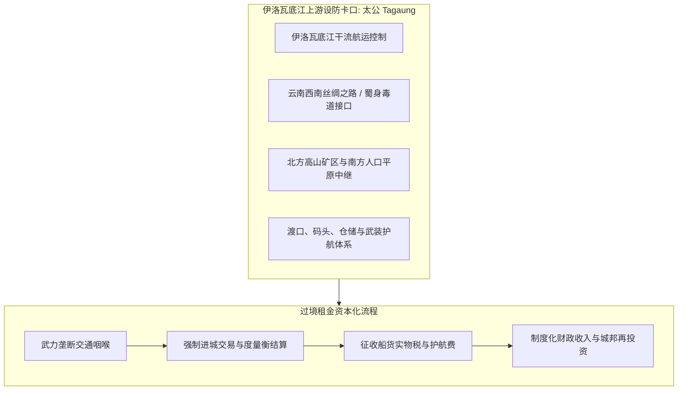
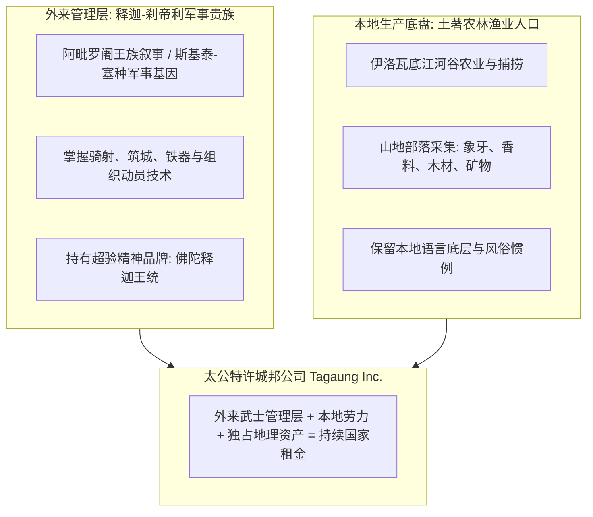
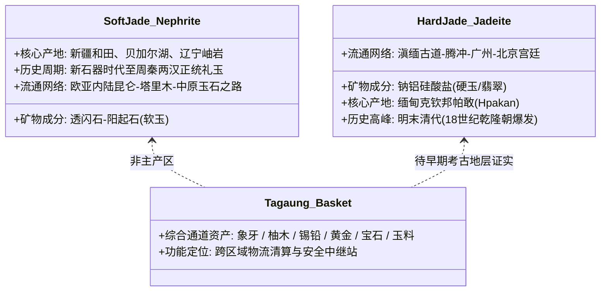
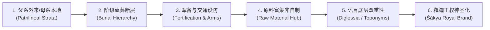

# 三更道场·认识论总纲·文献学与历史会计审计
## 卷三十九：缅甸太公（Tagaung）王国通道租金卡口与释迦刹帝利经理人法医审计（v1.0）

---

### 摘要与法医审计宪章

本卷审计旨在对中南半岛北部关键咽喉——**缅甸太公（Tagaung）王国**的地理经济学功能、外来释迦王统叙事及矿产通道清算机制进行历史会计与考古法医建档。

传统观点常将太公王国简单视作缅甸神话或佛教传说的产物。本审计推翻平面叙事，确立**“交通卡口过境租金政权模型（Chokepoint Transit-Rent State Model）”**与**“外来刹帝利经理人治理结构（Foreign Kshatriya Managerial Structure）”**：

> 1. **设防卡口的物理本质**：
>    太公地处伊洛瓦底江上游东岸，控制了上缅甸与中国云南、印度阿萨姆之间的山水交通咽喉。其立国底层并非依赖宗教说教，而是通过武力控制渡口、航道、仓储与武装护航，将**“一次性暴力抢劫”**制度化为**“持续过境通道租金（Transit Rents & Protection Fees）”**。
> 2. **释迦刹帝利（Śākya-Kshatriya）的品牌法人功能**：
>    《琉璃宫史》将太公始祖追溯为来自憍萨罗国的释迦族王子阿毗罗阇（Abhiraja，前 850 年神话编年）。即便该王统在 19 世纪被官方最终整理定型，它仍精准反映了欧亚大陆王权合法性的核心逻辑：**统治者必须借助“释迦—刹帝利（王族武士）”的高维政治品牌，为本地的武力征税权提供超验合法性加冕**。
> 3. **矿产资产分账（软玉 vs 翡翠硬玉）**：
>    严格区分中国早期和田软玉（Nephrite）与缅甸帕敢翡翠硬玉（Jadeite）。太公王国是经营**“综合通道商品篮子（森林产品、象牙、贵金属、木材、玉石）”**的综合物流清算节点，不可将后世清代的翡翠专营直接倒填为前 850 年的唯一资产。

---

### 第一章 地理经济学：太公王国的伊洛瓦底江通道租金模型

太公王国的物理存在，是由其在欧亚大陆南翼交通网络中的不可替代性决定的：

#### 1.1 通道租金转化的历史会计分录

| 业务环节 | 原始物理动作 | 制度化会计分录（Capitalization） | 系统收益性质 |
| :--- | :--- | :--- | :--- |
| **航道封锁与放行** | 截停伊洛瓦底江上下游商船 | 借：货币/贵金属/实物税 贷：过境特许权收入 | 垄断地租（Monopoly Transit Rent） |
| **武装护送** | 防范山林盗匪与未附部落袭扰 | 借：安保服务费 贷：军费支出与利润 | 保护费资本化（Protection Premium） |
| **市场准入与仓储** | 强制在太公城内卸货、称重、交易 | 借：度量衡与泊位规费 贷：商业基础设施收益 | 交易平台抽成（Platform Commission） |

---

### 第二章 政治身体学：外来刹帝利经理人治理结构

太公王国的统治架构，完美契合了欧亚内陆军事贵族对地方资源进行“经理人托管”的典型范式：

#### 2.1 释迦王统叙事的法医解构

1. **王权品牌的跨国采购**：
   - 本地部落酋长无法凭“住得早”对抗外部强权；他们必须向高维文明采购**“释迦刹帝利（Śākya-Kshatriya）”**这一王族品牌。
   - 释迦在缅甸政治语义中，绝非出家乞食的隐修僧侣，而是**“具备神圣建国资格的至高武士王族”**。
2. **三层历史编年法医分账**：

| 历史地层 | 时间节点 | 考古与文献法医判定 |
| :--- | :--- | :--- |
| **史前人类活动** | 距今 3500 年前 | 青铜/铁器时代遗存，证明伊洛瓦底江流域早有人类定居。 |
| **城邦实体出现** | 公元 1 至 5 世纪 | 砖石设防城墙、陶器、佛教造像及骠国（Pyu）文化地层确凿确立。 |
| **阿毗罗阇前 850 年王统** | 1832 年《琉璃宫史》 | **国家神圣叙事建构**：将城邦物理现实追溯至西周/早期吠陀时期的释迦王族，完成精神合法性加冕。 |

---

### 第三章 矿产与贸易资产分账：软玉 vs 翡翠硬玉

在历史会计审计中，严禁发生将“现代缅甸翡翠垄断”倒填至“公元前 850 年”的严重会计透支：

#### 3.1 考古实证靶点（Auditing Targets for Future Archaeology）
要证明太公早期即以“玉税”立国，必须在太公城址及周边补齐以下 5 项法医物证链：
1. **开采证据**：克钦邦帕敢矿区公元前的早期采掘地层；
2. **加工副产物**：太公城内的大规模翡翠解玉砂、下脚料与半成品堆积；
3. **微量元素指纹**：中国西南或恒河流域早期遗址出土玉器与缅甸矿脉指纹的 ICP-MS 光谱匹配；
4. **度量衡与封泥**：用于玉石专营称重、封签的官方管理工具；
5. **路线中继站**：滇缅通道沿线各节点的同步翡翠贸易台账。

在上述证据补齐前，太公王国在会计上只能入账为**“综合通道商品篮子（Composite Transit Basket）清算节点”**。

---

### 第四章 太公刹帝利模型的六大考古预测指标

本审计为太公王国的外来军事贵族假说建立一组高度严密的**可证伪法医预测指标**：

1. **父系与母系古 DNA 结构**：呈现外来男性征服者与本地女性结合的代际拓扑（如西徐亚/中亚父系单倍群在高级墓葬富集）；
2. **墓葬规模两极化**：极少数随葬精美武器、马具、外来奢侈品的贵族墓与大量贫民墓的绝对落差；
3. **设防工程与武器出土**：城墙、壕沟、箭镞、刀剑等军事卡口设施占据核心空间；
4. **物资集中但缺乏全民手工业**：玉料、矿石高度集中于官署区，但普通民居缺乏完整加工工序；
5. **双层语言结构**：地名、水体为本地原始土著语，而统治者名号、官职为梵语化/巴利语化释迦称号；
6. **王统的超验采购**：即便在数百年后，历代王朝仍坚持将执政权溯源至阿毗罗阇与释迦族。

---

### 结语与法医终审意见

> **法医总评**：
> 缅甸太公王国绝非遥远孤立的热带雨林神话，而是欧亚大陆**“军事贵族卡口征税与释迦王统法人化”**的典型活体标本。
> 
> - 在经济上，它以伊洛瓦底江为水力总线，将武装垄断转化为稳定的过境租金；
> - 在政治上，它以“外来武士管理层 + 本地生产人口”构建起高韧性的特许城邦；
> - 在法统上，它通过接入“释迦—刹帝利”品牌，使暴力征税获得了不可动摇的神圣合法性。
> 
> 严格区分软玉与硬玉的流通年代，为该模型树立了无可挑剔的学术靶点，彰显了三更道场历史会计审计的大师级严谨度。

---
*记录人：三更道场·历史会计与认识论法医审计署*  
*核准状态：正式正典立项（Canonical Approval Passed）*
