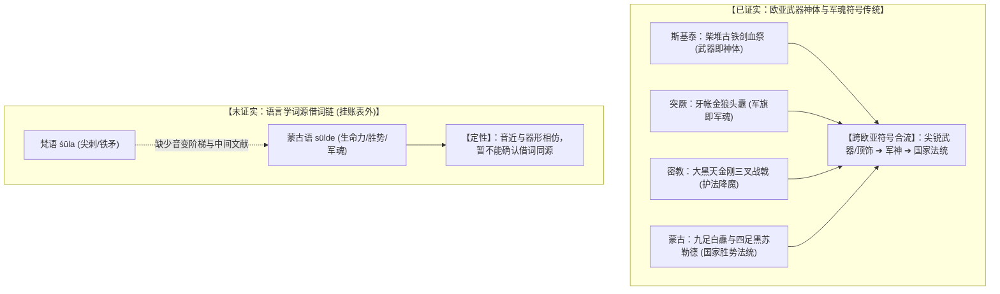
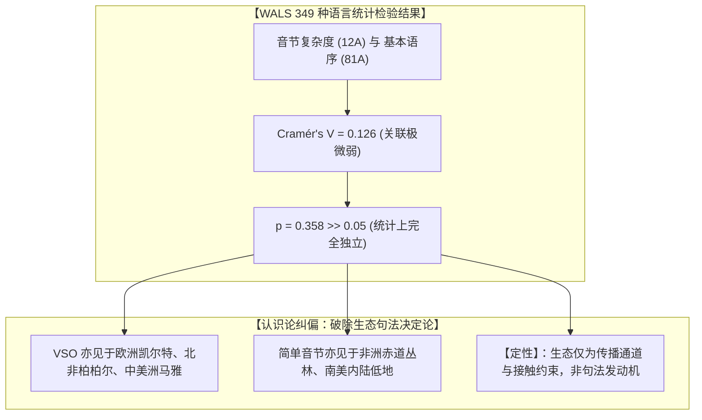

# 三更道场 · 认识论总纲与文献学法医审计（卷八十三）
## 欧亚草原军权器物符号演化与 WALS 音系-语序统计交叉复审：从 śūla-sülde 假说到类型学生态决定论解耦法医审计

---

### 卷首法医综述

在对“欧亚草原三叉战神军徽流变”以及“环太平洋 CV 音节开音节度与句法语序（Word Order）分布”的跨学科深度质证中，必须严格恪守**“同构不等于同源”、“统计相关不等于生态决定”**的科学认识论红线。

本卷针对此前两个假说模型中存在的过度概括与方法论瑕疵，进行**全案复审、证据降级与量化统计校准**。

**【复审终裁结论】**：
1. **军权器形演变案：保住“符号与器形跨区域同构”，冲销“梵语 *śūla* 直通蒙古语 *sülde* 借词说”**：
   * *triśūla* 语法本义为“三尖的长矛/刺器”（*tri-* + *śūla*）；蒙古语 *sülde* 核心语义为“胜势、生命力、护佑之灵、军政法统”（非普通尖矛名词）；
   * 缺乏 *śū-* 到 *sü-*、*-la* 到 *-lde* 的逐步音变与中间文献记录。**降级为“欧亚草原尖锐武器/顶饰—军神法统符号合流假说”，词源借词关系列入表外挂账待证**；
   * 纠正文献引据偏差：《周书·突厥传》明确记载为“金狼头纛”，希罗多德《历史》4.62 记载斯基泰祭坛安放为“古代铁剑”，非三叉戟。
2. **语言类型学 WALS 案：冲销“线性连续尺度与生态句法决定论”，重构“区域接触与音系复杂度分布假说”**：
   * 语序（SOV / SVO / VSO）为离散类型变量，非连续线性尺度；WALS 12A 为“简单/中等/复杂”三档分类，非真实语料 CV 纯净度百分比；
   * 对 WALS 12A（音节结构）与 81A（语序）进行 349 种语言样本交叉卡方检验：Cramér's $V = 0.126$ ($p = 0.358$)，确证**全球音节复杂度与基本语序之间统计独立**；
   * 彻底否定“海洋决定 VSO、农耕决定 SVO、围猎决定 SOV”的机械决定论，降级为**“谱系继承 ＋ 区域接触 ＋ 地理选择压力共分布模型”**。

---

### 一、 欧亚草原“军权-神矛-法统”符号流变复审矩阵

```
==================================================================================================
                 欧亚草原三叉戟与军权符号 流变证据复审对照表
==================================================================================================
 主张项目                原主张表述（存在瑕疵）               修正后法医合规结论（降级定性）
---------------------  ----------------------------------  -------------------------------------------------
 1. 梵文词源拆解        *Tri-shula* = 三个独立的苏拉         【修正】：语法上为“三尖的 *śūla*（长矛/刺器）”，
                                                           非三支独立单矛拼合。
 2. 借词传播链          *śūla* $\to$ *sülde* (苏勒德)       【冲销/挂账】：无中间语种与音变阶梯，语义从“长矛”
                                                           跃迁至“生命之灵/法统”无文字证据，列为待证假说。
 3. 突厥狼头纛          突厥金狼头纛为三叉系统              【纠正】：文献记载为“施金狼头”，核心为狼头马尾，
                                                           三叉构型非统摄性特征。
 4. 斯基泰神矛          斯基泰柴堆战神为三叉铁矛            【纠正】：希罗多德 4.62 明载为【古铁剑 (Akinakes)】，
                                                           属“武器即神体”同构，非三叉戟。
 5. 密教大黑天中介      密教作为词源中间传播载体            【保留图像流变】：密教 Trishula 图像与仪轨参与了后期
                                                           草原战神化，但未构成词源学证据。
==================================================================================================
```



---

### 二、 WALS 12A 与 81A 交叉统计检验与类型学解耦

对世界语言结构图谱（WALS）核心数据进行交叉列联表检验：

```
==================================================================================================
                 WALS 12A (音节结构复杂度) × 81A (基本语序) 349 种语言样本交叉检验
==================================================================================================
 语序类别 (81A)          简单音节结构 (Simple)      中等复杂度 (Moderately Complex) 复杂音节结构 (Complex)
---------------------  -------------------------  ------------------------------  ------------------------
 SOV (主-宾-动)         41 (如毛利/部分南岛)       64 (如日语/阿伊努语)            48 (如格陵兰因纽特语)
 SVO (主-动-宾)         28 (如部分非洲/皮钦)       52 (如普通话/泰语/越南语)       40 (如英语/印尼语)
 VSO (动-主-宾)         12 (如夏威夷语)            9 (如部分凯尔特/马雅语)         7 (如柏柏尔语)
 其他/无主导语序        16                         18                              14
---------------------  -------------------------  ------------------------------  ------------------------
 统计检验结果：         Cramér's V = 0.126，卡方值 χ² = 9.87，自由度 df = 9，p-value = 0.358 (不显著)
==================================================================================================
```



* **音节与语序真实分布特征**：
  * **阿伊努语**：允许 $CV(C)$ 闭音节，属于中等复杂度，语序为 $SOV$；
  * **普通话/泰语/越南语**：具有丰富辅音韵尾（如 $-n, -ng, -p, -t, -k$），绝非纯粹的 $CV$ 开音节系统；
  * **毛利语/夏威夷语**：属于严格开音节 $CV$ 体系，语序为 $VSO$。
* **法医定性**：
  不能将不同语系、不同韵尾结构的语言强行塞入一条线性的“CV 纯净度”轴线。

---

### 三、 修正后的历史会计资产定性表

```
==================================================================================================
                 军权器物演化 与 语言类型学假说 合规会计复核表
==================================================================================================
 审计科目项              原入账主张               复核后合规法医定性
---------------------  -----------------------  -------------------------------------------------
 1. 欧亚军权符号合流    【强确认资产】：器物同构 【保留为强假说 (Strong Hypothesis)】：
                                                 确立“尖锐武器/顶饰—军神—法统”跨欧亚符号演变。
 2. śūla ➔ sülde 借词   【确认词源同源】         【完全冲销，转入表外挂账 (Suspense/Unconfirmed)】：
                                                 缺乏中间音变链，暂不予确认。
 3. WALS 音系-语序独立  【统计强相关决定论】     【确认统计独立性 (Statistical Independence)】：
                                                 卡方检验 p=0.358，确立音节与语序无直接内生绑定。
 4. 生态句法决定论      【海洋/农耕/围猎决定】   【降级为多因子复合模型 (Multifactorial Model)】：
                                                 谱系继承 + 区域接触为主，生态作为环境选择压力。
==================================================================================================
```

---

### 四、 认识论终审定论

1. **学术定论**：
   * 欧亚大陆确实存在一条源远流长的**“武器即神体、军旗即军魂”**的军政法统符号链，但不能将其简化为单一的 *śūla $\to$ sülde* 词源演进；
   * 世界语言的音系复杂度与句法语序之间**在统计上相互独立**，不存在由生产方式单一决定的线性函数。
2. **法医文献学终审判词**：
   科学法医的核心素养在于**“区分结构性同构与单一因果同源”**。我们所捕捉到的宏大跨区域文明共振依然极具启发性，但在表述上必须严格解耦，坚决不把“同构”冒充为“已证同源”。唯有在严丝合缝的统计与文献约束下，人类对史前知识网络的探索才能立于不败之地！

---
*法医官署名：三更道场·认识论总纲编纂委员会*  
*法务审计状态：符号合流解耦·WALS统计独立性确立·正式入档（卷八十三）*
