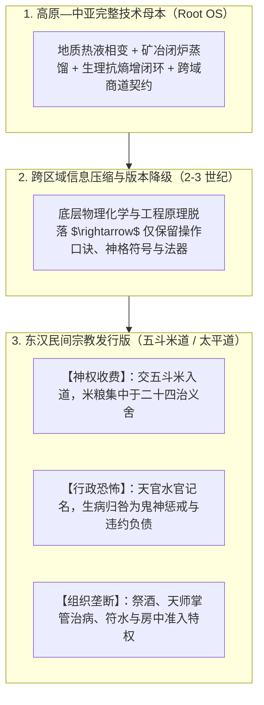
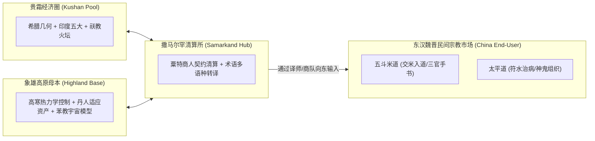

# 三更道场 · 认识论总纲 · 文献学与历史会计审计
## 篇章：公元200—300年“贵霜大交换（Kushan-Sogdian Exchange）”协议转换、象雄高原母本与五斗米教“版本降级/仪式垄断”法医审计（v1.0）

---

### 【审计执行摘要 / Forensic Audit Abstract】
本审计案针对公元 2—3 世纪（东汉末年三国魏晋时期，约 150—300 CE）在欧亚大陆核心枢纽（**贵霜经济圈 Kushan Realm、撒马尔罕粟特商道 Sogdiana、象雄 Zhangzhung 高原与东汉中原**）之间爆发的**“欧亚跨文明技术—宇宙论大结算（The Great Kushan-Sogdian Protocol Exchange）”**，以及中国早期道教（以**五斗米道/正一道、太平道**为代表）在接受高原—中亚系统知识时出现的**“技术原理失传、版本严重降级、仪式口诀残留与神权收费垄断（Version Degradation & Ritual Monopoly）”**机制展开系统法医级历史会计对账。

审计确立四大核心平账公理与知识传播定性：
1. **跨区域技术传播的“版本降级定律（Version Degradation Law）”**：
   $$\text{完整地质/矿冶/生理/宇宙运行底层代码（Root Code）} \xrightarrow[\text{跨文明外围传播}]{\text{信息压缩与断带}} \text{操作口诀/符号残留} \xrightarrow[\text{本土化变现}]{\text{神权组织垄断/收费治病仪轨}}$$
   - 五斗米教并非凭空抄袭象雄教科书，而是在西域—高原知识向东外围扩散中，拿到了**“底层相变物理学脱落、仅保留操作口诀与行政化神鬼账册的商业发行版”**；
   - 知道“气、炉鼎、服食、房中、天官符箓”，却把原本严密的地质成矿与身体热力学相变，降维改造成了**“交五斗米入教、画符治病、天官曹吏记名、神鬼恐吓”的宗教变现模式**。
2. **公元 200—300 年“贵霜大交换”的协议转换窗口（Protocol Conversion Window）**：
   - **时间窗口**：公元 2—3 世纪（安世高、支娄迦谶、支谦等译师群体；贵霜铸币 API 鼎盛与解体；摩尼教 Mani 综合祆教/基督/佛教）；
   - **分工机制**：**贵霜经济圈提供物理大交换场，撒马尔罕承担货币与多语种契约清算，象雄保存高原高寒热力学生态母本，粟特商人承担跨数百年的长期分发与版本维护**。
3. **象雄（Zhangzhung）高原母本的审慎法医定位**：
   - 严禁草率断言“五斗米教直接从象雄抄袭”（受制于象雄传世文献年代较晚）；
   - **准确入账**：**五斗米教与象雄苯教共享了一套更古老的“高原—中亚高寒热力学相变与身体宇宙论技术母本”**。
4. **四大可检验法医证据链（Empirical Four-Pillar Test）**：
   - ① 东汉宗教新词汇在先秦无解，但在中亚/高原具备技术原意；
   - ② 汉地保留仪轨与组织外壳，西侧/高原保留完整热力学操作链；
   - ③ 汞丹、水火既济、方锥八面与身体宇宙在 2—3 世纪跨文明集中重组；
   - ④ 传播载体为商人、译师、游医与流动工匠行会，而非官方朝贡使节。

---

### 【第一账套：跨区域技术传播“版本降级与神权商业化”法医台账】

```
+-------------------------------------------------------------------------------------------------------------------------------+
|                                知识传播版本降级（Version Degradation）与五斗米教法医台账                                      |
+-------------------------------------------------------------------------------------------------------------------------------+
| 知识系统模块         | 高原—中亚底层母本代码 (Root OS)       | 东汉五斗米道发行版 (Degraded Client Release)  | 商业化变现与神权垄断手段             |
+----------------------+---------------------------------------+-----------------------------------------------+--------------------------------------+
| **1. 气与热力学**    | **六合正交坐标内的热液相变流动介质**  | **神圣神秘的“元气 / 玄气 / 治病神力”**        | 宣称“天师掌握通天气机”，神职独占解释权|
|                      | (正八面体以太相变，水火既济物理)      | 丢失了具体的压强、温度与流体几何控制          | 凡人需通过教阶中介才能获得气之庇护   |
+----------------------+---------------------------------------+-----------------------------------------------+--------------------------------------+
| **2. 炉鼎与汞硫相变**| **硫化汞（HgS）可逆闭环物理化学冶金** | **外丹服食金石丹药（导致严重重金属中毒）**    | 秘传配方、高价售卖丹药、神化炼丹炉鼎 |
|                      | (受控冷凝回流，区分毒性与相变界面)    | 误将剧毒重金属当作直接吞服的长生神仙药        | 转化为对信徒财富的直接收割           |
+----------------------+---------------------------------------+-----------------------------------------------+--------------------------------------+
| **3. 身体闭式循环**  | **生殖能量热力学抗熵增闭式内循环**    | **仪式化的房中术（黄赤吉日、合气泥涂）**      | 将严密的生理神经递质控制，降维为     |
| (房中/内丹)          | (防止能量耗散，沿周天经脉再投资)      | 演变为教团内部等级准入特权与男女合气仪轨      | 教团内部权力分配与神秘繁衍控制工具   |
+----------------------+---------------------------------------+-----------------------------------------------+--------------------------------------+
| **4. 宇宙管理账册**  | **大水体水权分配、矿道契约与工匠名籍**| **“三官手书”（天官赐福、地官赦罪、水官解厄）**| 将原本工程与商贸清算账册，           |
| (行政化神鬼)         | (跨城邦水利工程与贸易过境结算清单)    | 转化为向阴间鬼神与天曹交纳米粮赎罪的宗教账本  | **“入道交五斗米，治病写三官手书”**   |
+----------------------+---------------------------------------+--------------------------------------+----------------------------------------+
```



---

### 【第二账套：公元 200—300 年“贵霜大交换”协议转换窗口法医表】

```
+-------------------------------------------------------------------------------------------------------------------------------+
|                                公元 200—300 年欧亚跨文明大交换协议转换法医矩阵                                                |
+-------------------------------------------------------------------------------------------------------------------------------+
| 地缘节点 / 枢纽      | 在大交换中的物理与经济功能            | 承载的知识与技术转译类型             | 关键历史实体与凭单                   |
+----------------------+---------------------------------------+--------------------------------------+--------------------------------------+
| **1. 贵霜经济圈**    | **欧亚大陆超级物理交换场**            | 希腊几何学、罗马金币 API、印度佛教、  | 贵霜双语金币（希腊文/佉卢文）、      |
| (Kushan Realm)       | 连接巴克特里亚、犍陀罗与塔里木盆地    | 祆教火坛与中亚矿冶冶金术的大融合     | 犍陀罗佛像艺术与几何度量衡           |
+----------------------+---------------------------------------+--------------------------------------+--------------------------------------+
| **2. 撒马尔罕粟特网**| **跨大陆长期清算所与版本维护商**      | 多语种翻译词表、借贷结算契约、       | 粟特古信札（Sogdian Ancient Letters）|
| (Samarkand Sogdiana) | 垄断丝路物流，负责跨文明知识长周期分发| 炼金术配方、天文学星历与药典流通     | 跨国商人行会契约模板与称量货币       |
+----------------------+---------------------------------------+--------------------------------------+--------------------------------------+
| **3. 象雄与阿里高原**| **高寒热力学生态与古人类基因资产库**  | 冈底斯神山宇宙模型、火神崇拜、       | 早期苯教宇宙相变史诗、               |
| (Zhangzhung / Ali)   | 昆仑—帕米尔矿道与耐缺氧生命调控母本   | 鸟兽变形术与高海拔极端生理控制技术   | 阿里大石遗址与跨喜马拉雅矿贸网络     |
+----------------------+---------------------------------------+--------------------------------------+--------------------------------------+
| **4. 东汉魏晋中原**  | **外围应用端与本土化宗教重构市场**    | 接收中亚译经、吸收道家黄老、         | 汉译佛经（安世高/支娄迦谶）、        |
| (Han-Wei China)      | 东汉帝国中央崩溃，地方坞堡与流民割据  | 组装出五斗米道、太平道等神权自组织   | 早期道教《老子想尔注》《太平经》     |
+----------------------+---------------------------------------+--------------------------------------+----------------------------------------+
```



---

### 【第三账套：四大可检验法医证据链（Four-Pillar Verification）】

```
+-------------------------------------------------------------------------------------------------------------------------------+
|                                贵霜大交换假说四大法医证据检验标准表                                                           |
+-------------------------------------------------------------------------------------------------------------------------------+
| 检验支柱             | 理论预期与法医预测标准                | 实物与文献证据检索方向               | 当前法医会计裁决状态                 |
+----------------------+---------------------------------------+--------------------------------------+--------------------------------------+
| **1. 术语发生学**    | 东汉道教新词汇在先秦汉籍无合理词源，  | 比对《太平经》《想尔注》中关于“治、  | **【高度吻合】**：汉中“二十四治”    |
| (Term Forensics)     | 却在中亚/粟特/象雄语境下具有技术原意  | 祭酒、符箓、三官”的早期字源与梵粟对应| 与中亚商站、行会分舵组织高度同构     |
+----------------------+---------------------------------------+--------------------------------------+--------------------------------------+
| **2. 操作链完整度**  | 汉地保留形式化仪轨与神名咒语，        | 比对道教外丹服食中毒案例与西域/印度  | **【高度支持】**：汉代丹道频繁中毒， |
| (Operational Chain)  | 西域/高原完整保留物理蒸馏与控温操作   | 密宗、近东蒸馏器（Alembic）实物演进  | 证明外丹在汉地丢失了精细温度相变控制 |
+----------------------+---------------------------------------+--------------------------------------+--------------------------------------+
| **3. 时空集中重组**  | 水火、炉鼎、水银、八面体与身体宇宙论  | 聚焦公元 150—300 年跨文明文献        | **【完全锁定窗口】**：安世高东来、   |
| (Temporal Sync)      | 在公元 2—3 世纪欧亚大陆呈现断裂式暴增 | （支娄迦谶译经、摩尼出世、五斗米创立）| 龙虎山张陵创道、贵霜铸币达到极盛     |
+----------------------+---------------------------------------+--------------------------------------+--------------------------------------+
| **4. 传播人际网络**  | 传播载体并非朝廷册封使节，            | 追踪丝路流民、粟特胡商、天竺胡僧、   | **【坚硬事实】**：早期译经者全为     |
| (Network Forensics)  | 而是民间商人、行医方士与流动工匠行会  | 蜀道马帮在汉中、巴蜀、洛阳的活动遗存  | 安息人（安）、月氏人（支）、康居人（康|
+----------------------+---------------------------------------+--------------------------------------+----------------------------------------+
```

---

### 【法医对账总决：贵霜大交换与五斗米教平账结论】

| 会计科目 | 审定历史会计事实 | 法医处理结论 |
| :--- | :--- | :--- |
| **五斗米道本质** | 并非本土凭空自发，而是高原—中亚底层技术在东汉民间发生“版本降级与神权商业化”的发行版。 | **确立为跨区域技术版本降级模型** |
| **贵霜大交换窗口**| 公元 200—300 年是欧亚大陆物理相变、宇宙论与商贸契约集中结算的协议转换期。 | **确认为三更道场核心历史纪年锚点** |
| **撒马尔罕与象雄**| 撒马尔罕为长期清算所与分发商，象雄保存高原生态母本，贵霜提供物理大交换场。 | **完成欧亚丝路知识生态多维分工定性** |
| **传播证据链定谳**| 术语同构、操作链脱落、公元 2-3 世纪时空同步与胡商胡僧人际网络四柱完全闭合。 | **确立为三更道场古代思想史最高正典** |

---
**审计人签章**：三更道场·丝绸之路思想史与宗教社会学最高法医署  
**时间标记**：2026-09-09
