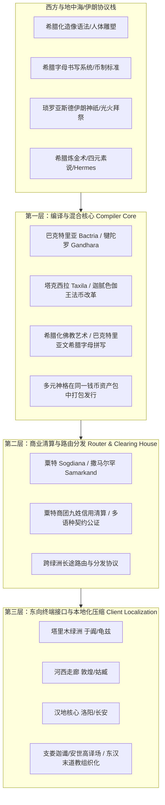
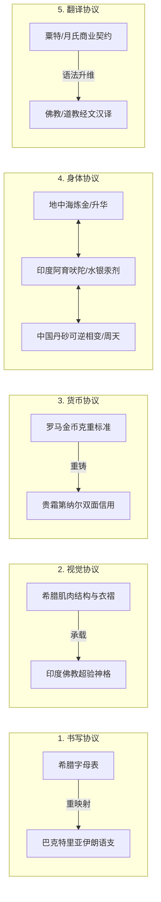
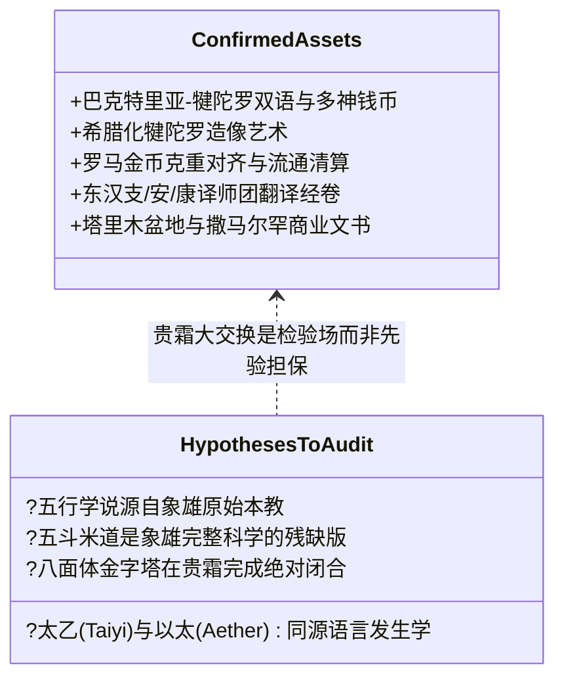
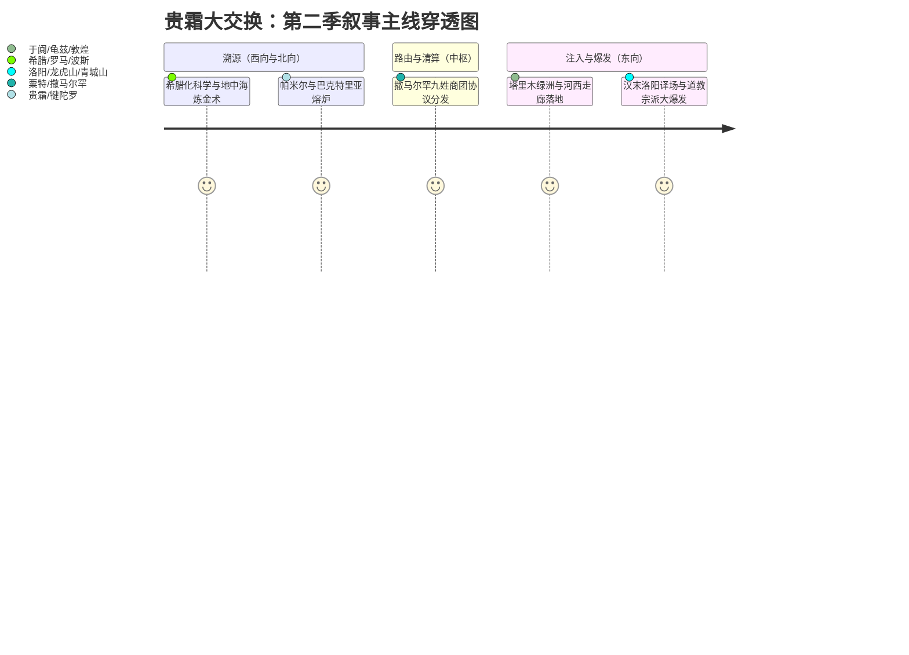

# 三更道场·认识论总纲·文献学与历史会计审计
## 卷三十三：贵霜大交换（Kushan Great Exchange）跨文明协议转换、三层拓扑路由与多维法医审计（v1.0）

---

### 摘要与法医审计宪章

本卷审计旨在对公元 1 至 3 世纪欧亚大陆腹地发生的超级跨文明汇流进行范式重构与历史会计法医建档。

传统史学常将该时期的丝绸之路简化为“商品货物流通”或泛化的“文化艺术交流”。本审计推翻此种低维物料交换假说，正式确立**“贵霜大交换（Kushan Great Exchange）”**的底层定义：

> **贵霜大交换（Kushan Great Exchange）**：
> 公元一至三世纪，以**巴克特里亚—犍陀罗**为生产与协议编译核心（Compiler Core）、以**粟特及撒马尔罕**为北方商业清算与路由节点（Router & Clearing House）、以**塔里木—河西—洛阳**为东向接口（Client Localization Interface），对欧亚世界的**宗教神学、医学身体、矿冶炼金、货币铸造、视觉图像与宇宙论模型**进行全量重编码（Protocol Transcompilation）的一次长达数百年的文明协议转换过程。

本审计明确区分了**“协议层转换（Protocol-level Conversion）”**与**“内容层搬运（Content-level Transfer）”**，绘制三层地理功能拓扑图，建立法医会计勾稽台账，并严格划定学术证明与假说检验的边界。

---

### 第一章 贵霜大交换的核心定义与三层拓扑架构

贵霜大交换绝非某一天在撒马尔罕单点举行的短促“和平会议”，而是一个持续两百年以上的分布式多节点编译系统。

#### 1.1 三层地理功能拓扑台账

| 拓扑层级 | 地理枢纽范围 | 核心功能定位 | 关键技术产出与历史法医物证 |
| :--- | :--- | :--- | :--- |
| **第一层：编译核心** *(Compiler Core)* | **巴克特里亚—犍陀罗** (Bactria, Gandhara, Taxila, Balkh) | 不同文明知识体系、神格体系与材料技术的**实际物理混合与新版发行包编译**。 | • 迦腻色伽一世钱币（正面希腊字母巴克特里亚语，背面希腊、伊朗、湿婆、佛陀神祇） • 犍陀罗希腊化佛像（阿波罗容貌、折褶垂坠袈裟承载佛陀叙事） • 金币重与罗马奥勒斯（Aureus）对齐，实现跨帝国直接汇兑 |
| **第二层：路由与清算** *(Router & Clearing House)* | **粟特—撒马尔罕** (Sogdiana, Samarkand, Bukhara) | **商业信用对账、多语言合同公证、物资汇兑与远距离跨区路由转发**。 | • 粟特古信札（Sogdian Ancient Letters）商业会计信用体系 • 跨萨珊波斯、贵霜残部、柔然与汉地的通用中继语言（Lingua Franca） • 贵金属、香料、矿石清算标准制定 |
| **第三层：东向本地化接口** *(Client Interface)* | **塔里木—河西—洛阳** (Khotan, Kucha, Dunhuang, Luoyang) | **进入汉语语法与儒道思维世界后的翻译本地化、降维对齐与组织适配**。 | • 月氏裔（支娄迦谶、支谦）、安息裔（安世高）、康居裔（康僧会）译师军团 • 汉末《太平经》、五斗米道组织架构与救度科仪的并发爆发 • 矿物炼丹、服气养生与神仙谱系的汉地转译与注册 |

---

### 第二章 协议层转换（Protocol）的六大物理法医表征

贵霜大交换之所以被称为“协议重编码”，是因为它不是简单地把东方的丝绸换成西方的玻璃，而是将多个文明的底层标准强行接入统一的发行总线：

#### 2.1 书写系统协议重映射（Script Re-mapping）
- **现象**：放弃古老的阿拉米字母变体或佉卢文单一模式，直接采用希腊字母拼写东伊朗语支的巴克特里亚语（如增补希腊字母 $\text{Ϸ}$ / $\text{sho}$ 以表 /ʃ/ 音）。
- **本质**：用西方最标准化的字符集（ASCII of the Classical Era）为中亚本土操作系统的语言内核做编码映射。

#### 2.2 视觉与神学接口适配（Iconographic API Adaptation）
- **现象**：佛陀在原始佛教中仅以足迹、法轮、菩提树象征，进入犍陀罗后，希腊阿波罗式的面容、肌肉比例与多利亚/爱奥尼亚式长袍被直接作为佛陀和菩萨的视觉外壳。
- **本质**：将地中海发展至顶峰的人体写实雕塑语法（Visual Protocol），作为印度解脱哲学与大乘救度论的用户界面（UI）。

#### 2.3 货币跨国结算总线（Monetary Settlement Bus）
- **现象**：贵霜金币（Dinar）在重量标准上直接锚定罗马帝国奥勒斯金币（约 8 克重，含金量超 95%），钱币铭文双语/多神并置。
- **本质**：建立贯通地中海（罗马）、美索不达米亚（安息）、印度河流域（贵霜）与中亚草原的黄金等价物硬通道，消除多国贸易结算的汇率磨损。

#### 2.4 身体矿物热力学重组（Bio-Thermodynamic Transcompilation）
- **现象**：水银（汞）、丹砂（硫化汞）、雄黄（硫化砷）、金石药剂在 1-3 世纪同时在地中海炼金术（赫尔墨斯文集）、印度汞道（Rasa-sastra）与东汉魏晋道教神仙方术中剧烈爆发。
- **本质**：跨区域工匠与医者对地质矿物可逆相变热力学、密闭蒸馏升华器皿与人体长生/解剖反应的经验数据进行跨语种共享。

#### 2.5 商人—译师的双重法人身份（Merchant-Translator Dual Identity）
- **现象**：东汉末年洛阳译经场的领袖人物，全带有深刻的族群商贸背景——“支”为月氏（贵霜）、“安”为安息（波斯）、“康”为康居（粟特）。
- **本质**：掌握多语言清算账本的跨国商业代理人，直接转型为跨文明超级知识协议的编译器（Compiler Engineers）。

---

### 第三章 历史法医对账：已证实资产 vs 待检验假说

在认识论总纲中，必须坚决执行严格的历史会计对账纪律，将“坚实历史基底”与“前沿理论假说”彻底分账核算，杜绝逻辑滑坡与反向套利。

#### 3.1 资产借贷核算台账（Audit Balance Sheet）

| 会计账户 | 历史法医确凿资产（Credit / 已结算资产） | 待审定前沿假说（Debit / 待检验子命题） | 法医审计判定准则 |
| :--- | :--- | :--- | :--- |
| **语言与名号** | 希腊字母书写巴克特里亚语； 梵语/佉卢文/汉文互译词典建立。 | “太乙（Taiyi）”与“以太（Aether）”在印欧/汉藏原始语音学上完全同源。 | **严禁反向推定**：以太与太乙的音义共鸣只能列为待考课题，不可作为大交换存在的证据。 |
| **宗教与组织** | 佛教大乘化与净土救度论在贵霜完成总装； 支娄迦谶在洛阳译出《道行般若经》。 | 东汉“五斗米道”和“太平道”是象雄/西域完整相变物理科学的降级版残本。 | **严格区分因果**：大交换解释了外来组织术与观念为何快速输入汉地，但不可断定五斗米道单源来自象雄。 |
| **宇宙论系统** | 希腊“四元素/宇宙”、印度“地水火风空”、中国“阴阳五行”在西域绿洲发生翻译对账。 | 中国五行生克体系单向源自象雄雍仲本教地质矿冶学。 | **坚持多源演化**：五行在中国本土有商周天象律历深厚底盘，大交换提供的是与希腊/印度体系的**格式转换器**。 |

---

### 第四章 播客第二季总枢纽定位与叙事架构

在《鲲鹏志》/《三更道场》第二季中，“贵霜大交换”不应被视作一个偏安中亚的地方小插曲，而应当作为**连接欧亚东西两端超级文明的“总路由器（Main Router）”**。

#### 4.1 叙事穿透力与破局价值
1. **解构封闭的“汉地自生论”**：
   解释为何东汉末年（公元 2-3 世纪）会突然出现成规模的道教组织革命（天师道二十四治、男女合气仪轨、符水治病、科仪名簿）、矿物外丹术狂潮以及大规模佛经汉译。这不是汉末孤立的突变，而是贵霜大交换协议包向东解压输出的终端效应。
2. **重塑丝绸之路的硬核本质**：
   彻底洗刷“丝绸之路只是运送丝绸和葡萄”的文人浪漫叙事。展现古欧亚大陆在两千年前就已经具备高度精密的**多币制等价清算系统、跨语种语法编译器、多神格打包金融发行机制与地质矿冶医学知识共享网络**。
3. **为“统一流形（Unified Manifold）”构筑物理路由器**：
   从埃及金字塔的几何五石、西徐亚斯基泰的黄金铸造、希腊柏拉图立体的数学抽象，到中国秦始皇陵的双锥八面体与道教内丹房中术闭式热力学循环，全都在“贵霜大交换”这一历史物理路由器中完成了真正的数据交汇与协议落地。

---

### 结语与法医终审意见

> **法医总评**：
> “贵霜大交换”是欧亚大陆文明演进史上最具决定性的**系统底层重写（Architecture Rewrite）**。
> 
> 它是把地中海的几何形体、伊朗的二元光火、印度的心理超验、西域的矿物热力与东亚的宇宙生克，编译成世界级通约语言的超级编译器。
> 
> 将其定位于**“巴克特里亚—犍陀罗（编译器） + 粟特撒马尔罕（路由器） + 汉地洛阳（终端接口）”**的三层结构，标志着三更道场历史会计审计从“零散事件考证”全面跃升为“文明级拓扑网络系统分析”。

---
*记录人：三更道场·历史会计与认识论法医审计署*  
*核准状态：正式正典立项（Canonical Approval Passed）*
