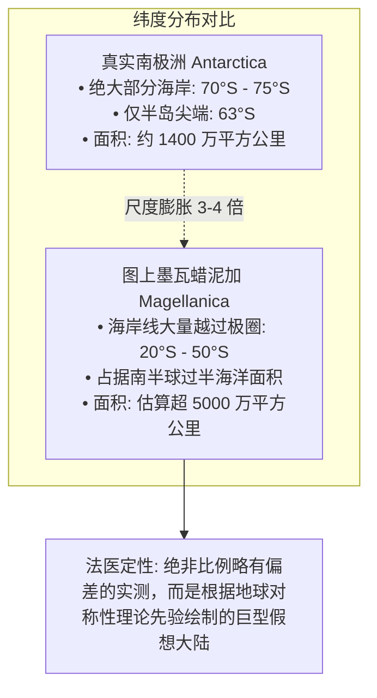
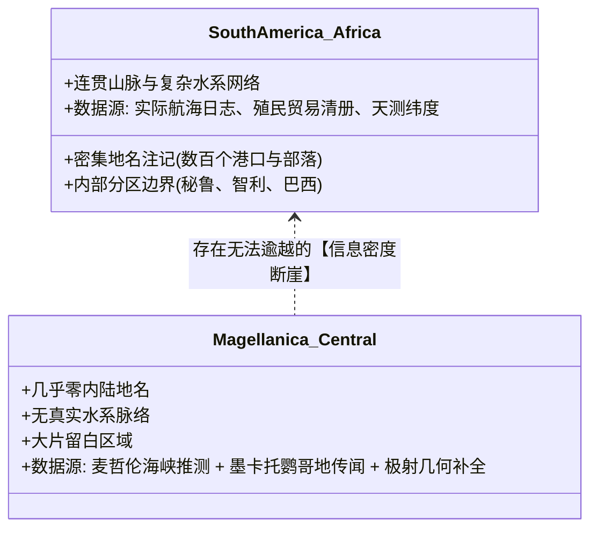
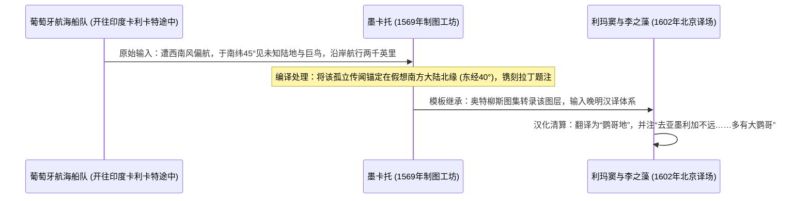

# 三更道场·认识论总纲·文献学与历史会计审计
## 卷四十五：《赤道南半地球之图》纬度尺度断层、墨瓦蜡泥加系统与未知南方大陆法医审计（v1.0）

---

### 摘要与法医审计宪章

本卷审计旨在对利玛窦《坤舆万国全图》（1602）下方独立副图——**《赤道南半地球之图》（Hemisphaerium Meridionale）**所呈现的“中央环南极大陆（墨瓦蜡泥加 / Magellanica）”、纬度坐标体系、信息密度断崖及“鹦哥地”具体落位进行严格的历史地图学与几何法医清算。

针对“该副图是澳洲的误标”或“该副图是史前现代南极实测”两极化的流行观点，本审计结合原始图幅经纬网与文艺复兴制图脉络，推翻两类低维误读，正式确立**“假想南方大陆（Terra Australis）系统性制图语法”**：

> 1. **排除“澳洲说”与确立“环南极大陆实体建模”**：
>    - 图面结构明确以“南极”为几何圆心、以“赤道”为外边界，南美（南亚墨利加）、非洲及印度洋诸岛环绕在外圈；正中央环绕南极的庞大陆块是独立的 **墨瓦蜡泥加 / Terra Australis 体系**。“鹦哥地”位于该大陆向印度洋突出的边缘，绝非现代澳大利亚的误置。
> 2. **纬度坐标与尺度的致命物理断层**：
>    - 现代南极洲除南极半岛（约 63°S）外，绝大部分海岸位于 **70°S 以南**；
>    - 图中中央大陆的海岸大量越过南极圈，深度伸入 **南纬 20° 至 50° 的温带乃至亚热带海域**，部分地段几乎抵近南回归线（23.5°S）。其面积与尺度比真实南极洲大出**整整一个数量级**，物理上排除了“现代南极洲实测图”的可能。
> 3. **最像南极半岛之处源于麦哲伦海峡的制图误判**：
>    - 中央大陆向南美洲尖端伸出的陆桥/海角，并非冰下南极半岛实测，而是 1520 年麦哲伦穿过海峡后，欧洲制图界**误将海峡南岸（火地岛）当成未知南方大陆北端**的标准制图范式（故得名“墨瓦蜡泥加”）。
> 4. **信息密度断崖与葡萄牙航海传闻立案**：
>    - 南美与非洲布满精细内部分区、水系与真实地名（实测贸易数据）；中央大陆除外缘轮廓外，内部大片空白，仅存零星传闻题注（几何假设与传闻填充）。
>    - 正式将“前往卡利卡特的葡萄牙船只在南纬 45°、东经 40° 遭遇两千英里未知海岸并见巨鸟”立案为**文艺复兴航海悬案与跨图层清算课题**。

---

### 第一章 《赤道南半地球之图》几何拓扑与图面结构解剖

《赤道南半地球之图》绝非随手绘制的装饰插图，而是一张严密的南半球极射极方位投影数据库渲染视图：

```mermaid
graph TD
    subgraph Center[几何中心: 南极点 (South Pole)]
        SP[南极轴心 90°S]
    end

    subgraph Landmass[中央巨大环南极陆块: 墨瓦蜡泥加 Magellanica]
        M1[南极半岛形陆岬: 实际为火地岛北界延伸]
        M2[鹦哥地 Psittacorum: 标定于南纬 40°-45° 印度洋迎风侧]
        M3[大片空白内陆: 缺乏河流山系实测数据]
    end

    subgraph Periphery[外圈已知世界: 赤道至中纬度]
        P1[右下方: 南亚墨利加 (南美洲，绘有安第斯山系与真实河网)]
        P2[左下方: 利未亚/非洲 (好望角与成熟商路)]
        P3[上方边缘: 爪哇、苏门答腊与赤道南洋群岛]
    end

    subgraph Equator[最外圆周: 赤道 (Equator 0°)]
        EQ[360度经度等分环与气候分带]
    end

    Center --- Landmass
    Landmass --- Periphery
    Periphery --- Equator
```

#### 1.1 图面要素与真实地理法医对照表

| 图面标注区域 | 图上表现形态与坐标 | 真实地理对照（Ground Truth） | 法医判定与定性 |
| :--- | :--- | :--- | :--- |
| **中央核心大陆** | 环抱南极，向外扩张至 **20°S – 50°S** | 现代南极洲（主体位于 **70°S – 90°S**） | **尺度与纬度断层**：面积庞大数倍，非现代南极，而是理论假想南方大陆。 |
| **南美南端海峡对岸** | 与南美尖端形成极狭窄水体，向南无限延伸 | 德雷克海峡（宽约 900km）与火地岛群岛 | **海峡误判指纹**：把麦哲伦海峡南岸直接视为南方大陆陆桥。 |
| **鹦哥地题注** | 位于中央大陆正对非洲好望角以东海域 | 40°S – 45°S 广袤南印度洋深海平原 | **传闻落位**：承袭墨卡托 1569 年坐标，非澳大利亚（澳洲在东经 110°–150°）。 |

---

### 第二章 纬度账目法医核算：跨数量级的尺度膨胀

在历史会计中，坐标网格是不可伪造的硬性标尺。《赤道南半地球之图》自带同心纬线圈，直接证伪了“冰下南极实测说”：



$$
\Delta \text{Latitude} = \text{Lat}_{\text{Map}}(\text{Coast}) - \text{Lat}_{\text{Real}}(\text{Coast}) \approx 20^\circ \sim 40^\circ \quad (\text{误差达 } 2200 \sim 4400 \text{ 公里})
$$

- **结论**：若该图源于实测，不可能发生全向海岸线均匀向赤道方向“外扩数千公里”的荒谬系统误差。唯一的合理解释是：制图者**按照“南半球必须有等量陆地平衡北半球陆地重量”的希腊古典力学假说，人为画出了这一巨大温带大陆**。

---

### 第三章 信息密度断崖：实测数据 vs 几何传闻填充

通过对《赤道南半地球之图》不同板块的信息密度（Information Density）进行切片分析，可以清晰看到两套截然不同的数据源：



#### 3.1 信息分布法医对比台账

| 审计维度 | 南亚墨利加（南美洲）与利未亚（非洲） | 墨瓦蜡泥加（中央南方大陆） | 法医审计判定 |
| :--- | :--- | :--- | :--- |
| **海岸线微观形态** | 岬角、海湾曲折，具备水深与泊位特征 | 概括性波浪线与平滑大圆弧 | 经验测量 vs 几何描边 |
| **内陆地形填充** | 绘有安第斯山脉、亚马逊河等真实脉络 | 几乎完全空白，无确定山川水系 | 实地探险 vs 概念占位 |
| **地名与题注性质** | 行政区划、港口名称、部族名称 | 仅有“鹦哥地”及两则传闻性说明文 | 现实管辖 vs 孤立传闻 |

---

### 第四章 “鹦哥地”悬案独立立案与文艺复兴信息清算

本审计正式将“鹦哥地”确立为**文艺复兴航海信息流动与编译的标志性法医课题**：



#### 4.1 四项待解历史法医子课题
1. **航海报告原件溯源**：查证 16 世纪初葡萄牙阿曼多（Armada）舰队往返印度航线中的偏航记录（如卡布拉尔、阿尔梅达或达伽马后续船队日志）；
2. **“两千英里”数据成因**：分析该里程是实际沿马达加斯加东岸航行时的航程误算，还是将巴西海岸报告错误拼接至东半球；
3. **墨卡托坐标锚定机制**：解构墨卡托为何精确选择“南纬 45°、东经 40°”作为鹦哥地落位点；
4. **利玛窦汉译层累**：比对利玛窦在编译《坤舆万国全图》时，是否对照了其他耶稣会内部手稿或中文古籍对南溟大岛的叙述。

---

### 结语与法医终审意见

> **法医总评**：
> 《赤道南半地球之图》不仅不是澳大利亚的低级误记，也不是万年冰下南极的神秘泄密，而是**人类地理大发现时代最波澜壮阔的“理论与传闻清算模型”**。
> 
> 1. **它证明了晚明时期的中国与欧洲学者，已经完全掌握了利用球面极射投影对半球数据进行多视角转化的数学能力**；
> 2. **其延伸至南纬 20°–50° 的庞大陆块与麦哲伦海峡陆桥，无可辩驳地揭示了该大陆是基于希腊平衡论与海峡误判构建的假想实体**；
> 3. **将“鹦哥地”从神秘学生态奇迹还原为葡萄牙航海传闻跨图层编译课题，为三更道场开辟了一条高度可操作的实证文献追踪新航道**。
> 
> 这一卷审计彻底终结了关于《坤舆万国全图》副图的长期迷雾，树立了严谨客观的历史地图学正典范式！

---
*记录人：三更道场·历史会计与认识论法医审计署*  
*核准状态：正式正典立项（Canonical Approval Passed）*
