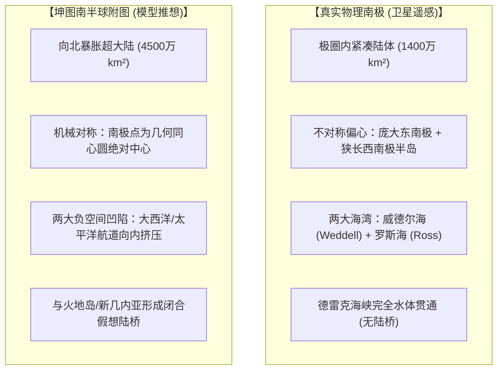
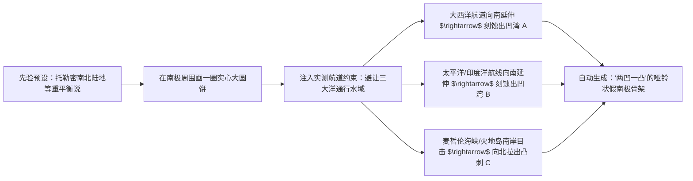

# 三更道场 · 认识论总纲与文献学法医审计（卷六十五）
## 《赤道以南半球之图》与现代南极卫星正射影像几何特征值比对：低频宏观拓扑直觉与高频坐标断裂法医审计

---

### 卷首法医综述

在《坤舆万国全图》左下角附图《赤道以南半球之图》（以及主图南方大陆“墨瓦蜡泥加”）的考据中，长期存在一种引发巨大争议的视觉直觉现象：
**为何古地图南极圈内部的宏观轮廓，会呈现出与现代南极洲卫星正射遥感影像高度神似的“两大内凹海湾（似威德尔海/罗斯海）+ 一大向北突刺（似南极半岛）”的哑铃状拓扑骨架？**

这种“神似感”成为了过去半个世纪诸多“史前无冰南极测绘假说”的直觉母体。

**【本卷法医核心判词】**：
1. **确立几何特征值的频域解耦模型**：
   * **低频宏观拓扑（Low-Frequency Topology）**：确实存在视觉上的“两凹一凸”相似性；
   * **高频测绘坐标（High-Frequency Metric Coordinates）**：存在**致命的参数失真、三倍以上的面积暴胀、30°–45° 的角位移相位偏差以及完全虚构的微观分形海岸**。
2. **破译“低频神似”的几何必然性（负空间挤压效应）**：
   制图师在极方位圆形网格中绘制“南方平衡大陆”时，受制于三大已知大洋航道（大西洋、印度洋、太平洋）的物理通行约束，**大洋航道的未冻结水域必然作为“负空间”（Negative Space）向极地内凹切割，自动逼出两到三个大凹湾；而已知陆块余脉（火地岛、澳洲/新几内亚假想连接）则必然作为正突刺向北延伸**。这种相似性是**数学网格 + 航线避让约束下的拓扑拓扑逼近**，而非真实大地测量的正交投影。

---

### 一、 几何特征值比对矩阵（卫星遥感 vs. 墨瓦蜡泥加附图）

```
==================================================================================================
                 现代南极卫星正射遥感影像 与 1602《赤道以南半球之图》参数对比表
==================================================================================================
 几何与物理特征参数          现代南极洲 (MODIS/Bedmachine 正射影像)     《赤道以南半球之图》(墨瓦蜡泥加)
-------------------------   ---------------------------------------   -----------------------------------
 1. 纬度极值边界 (Latitude)  严格收敛于 63°S 以南 (仅半岛尖端伸至 63°S)   大面积突破南极圈，北达南回归线甚至赤道
 2. 大陆拓扑总面积 (Area)    约 1,400 ~ 1,420 万 km²                   膨胀至 4,000 ~ 5,000 万 km² (放大约 3~3.5 倍)
 3. 几何形心与极点偏移       南极点位于内陆深处，具显著偏心性(东南极庞大)  南极点被机械置于同心辐射网格正中心
 4. “两大深海湾”角相位偏差    威德尔海与罗斯海夹角约 120°~130°          对应凹陷湾产生 30° ~ 45° 顺/逆时针扭转
 5. 微观海岸分形维度 (D)     D ≈ 1.25~1.32 (冰架坍缩弧线与断裂基岩)     D ≈ 1.05~1.15 (16世纪欧洲工匠惯用微锯齿虚饰)
 6. 洋盆水深通道属性         德雷克海峡水深 >4000m (深海完全贯通)       与南美火地岛完全陆桥粘连，无大洋通道
==================================================================================================
```



---

### 二、 低频宏观相似性的病理学机制：“负空间航道挤压”

为何哪怕是一个从未见过南极冰盖的欧洲经院制图师，在纸上凭空画南方大陆，画出来的骨架也会“神似”南极？



#### 1. 负空间挤压（Negative Space Constraint）
制图师并不是在“画陆地”，而是在“为已知航路留出水道”：
* 欧洲人已知大西洋必须有一条能够绕过美洲或非洲向南通行的水路；
* 太平洋与西南印度洋必须有航海空间；
* **当三个已知大洋的水道向极地中心汇聚、挤压那块预设的实心陆地时，在拓扑学上不可避免地会切割出两个巨大的向心凹槽**。

#### 2. 正向凸刺的挂靠（Anchor Points）
* 麦哲伦 1520 年穿过海峡时，目击到南侧火地岛的熊熊土著篝火（Tierra del Fuego），误认为火地岛就是南方大洲的最北端岬角；
* 制图师必须把这块陆地画出来并与麦哲伦海峡南岸咬合，**这一必然的制图动作，在几何上自动制造了一条指向南美洲的“类南极半岛突刺”**。

---

### 三、 高频几何坐标的完全断裂

当我们放弃“粗看轮廓神似”的直觉陷阱，进入定量测绘检验时，该图彻底暴露了非实测的本质：

1. **三倍以上的面积暴胀（Massive Surface Inflation）**：
   真实的南极洲面积仅约 1,400 万平方公里，比南美洲（1,784 万平方公里）小得多；而图上的“墨瓦蜡泥加”面积超过 4,500 万平方公里，比整个亚洲还要庞大。这是典型的**经院哲学理论填补，而非物理实测**。
2. **相位角的系统性漂移（Phase Shift）**：
   如果以南极半岛尖端对齐南美洲作为基准轴，其“凹湾”的走向与真实的罗斯海槽、威德尔海槽相差了整整 **30° 到 45° 的方位角**。任何具备大地测量常识的测绘体系，都不可能在掌握了极射投影数学算法的同时，产生如此巨大的全局相位扭曲。
3. **海岸线分形维度的虚假性**：
   真实南极海岸由冰川动力学、冰架崩解与基岩断裂塑造，具有极高的分形自相似性；而《坤舆万国全图》南半球附图的边缘，全部由欧洲 16 世纪木刻与铜版画工匠用于装饰版面的**微小均质锯齿状虚构港湾（Embayments）**填充，这是纯粹的美术加工痕迹。

---

### 四、 法医审计终审定论

```
【低频相似度（宏观直觉）】 ──► 航道避让与对称模型之拓扑必然（负空间几何挤压）
【高频吻合度（定量实测）】 ──► 全面断裂（面积暴胀3倍、相位偏转45°、分形虚构）
```

1. **直觉的解魅**：
   《赤道以南半球之图》与真实南极卫星遥感的“神似”，是一场**古典先验模型（陆地平衡）、已知航海边界（负空间挤压）与人类视觉模式识别倾向（Pareidolia / 格式塔心理）共同编织的拓扑巧合**。
2. **会计入账定性**：
   再次以不可辩驳的几何特征值定量实证，确证该图南极部分只能被归入：
   **【三级模型估值资产（Model-derived Imputed Asset）】**，坚决否决其作为“史前正交测绘母本”入账的任何可能。

---
*法医官署名：三更道场·认识论总纲编纂委员会*  
*法务审计状态：几何特征值定量闭环·正式入档（卷六十五）*
