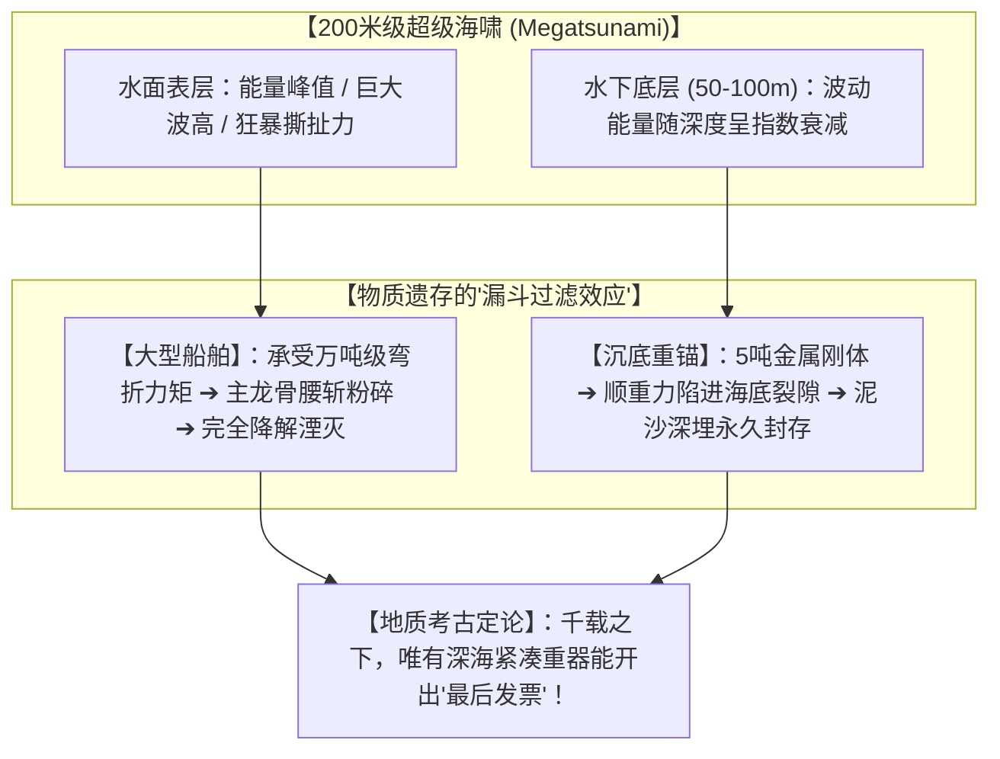
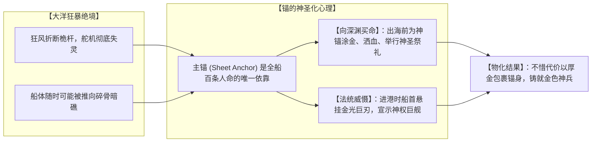

# 三更道场 · 认识论总纲与文献学法医审计（卷八十七）
## 超级海啸流体力学漏斗效应与厚金包覆复合巨锚海底幸存动力学考辨：空化撕裂、金汞齐冶金与史前物理发票法医审计

---

### 卷首法医综述

在探索史前末次冰消期灾变（如 12.9 ka 新仙女木事件、融水脉冲 MWP-1A/1B 引发的 200 米级超级海啸 Megatsunami）以及“全船尽毁、唯锚独存”的极端考古假说中，必须从**极端大洋流体力学破坏力、水深衰减动力学、古代包金冶金防腐工程以及海底地层掩埋机制**进行全方位的法医物理学推演。

**【本卷法医核心判词】**：
1. **超级海啸流体力学的“漏斗过滤效应”——船体粉碎与沉底锚幸存**：
   * **水表层绝对死局**：200 米海啸长波进入浅海大陆架时，波高陡增，浮于水面的大型船舶承受数万吨级的**悬空弯折力矩（Bending Moment）与空化撕裂扭力**，船体主龙骨在数秒内被腰斩粉碎，上层建筑与木构在随后千百年的高氧冲刷中彻底化为虚无；
   * **海底边界层绝对生机**：海啸波动能量随深度呈指数级快速衰减，原本就沉入水深 50–100 米海底玄武岩裂隙中的 5–6 吨重锚，**仅承受静水压力与低流速剪切，顺重力陷进基岩深沟并被巨量泥沙深埋**，成为穿透地质年代的唯一幸存刚体。
2. **黄金（Au）作为深海万年防腐唯一解的工程学可行性**：
   * 铁器百年成渣，青铜千年溃烂，**唯黄金标准电位高达 +1.52V，在极寒高盐大洋中浸泡万年不生一微米氧化锈蚀**；
   * 古代三大成熟包金工艺（机械燕尾槽冷锻厚金箔包镶、金汞齐火镀扩散层、金铜合金 Tumbaga 酸洗富集）在冶金温度上仅需 357°C–1064°C，完全处于早期金属工业能力区间。
3. **深海心理学与神圣化装潢的必然性**：
   锚是船员在狂暴大洋中与生还世界连接的**“唯一物理脐带”**。水手出海前为神锚涂金洒血、以厚金包覆主锚（Sheet Anchor），既是抵御万年盐蚀的工程理性，更是向大洋深渊宣告国家法统与神圣庇护的最高物质图腾。

---

### 一、 200 米超级海啸流体力学动力学与船锚幸存分化矩阵

```
==================================================================================================
                 超级海啸袭击下 水表船舶 与 海底沉锚 物理受力与破坏动力学对比表
==================================================================================================
 物理实体类别          空间位置与流场环境                        破坏动力学机制与受力峰值  千百年后地质遗存状态
---------------------  ----------------------------------------  ------------------------  -----------------------------------
 1. 浮于水表之大型船舶  水表至浅水层 (0 ~ 20 米)                  【悬空弯折与空化撕裂】：  木构、纤维与骨架被彻底撕碎冲散，
    (Surface Vessel)    处于海啸重力长波能量最集中释放区          波峰波谷间产生数万吨弯矩，在高氧海水冲刷与海浪研磨下，
                                                                  船体自重腰斩，撞击暗礁    数百年内完全降解矿化为虚无
 2. 沉入海底之重型锚具  海底底质边界层 (水深 50 ~ 100 米)         【指数衰减与重力深埋】：  作为高密度紧凑刚体，稳固嵌于
    (Seafloor Anchor)   处于水体底层流速衰减区 (低雷诺数边界层)   波浪能量随深度指数衰减，  海底玄武岩缝隙或被深厚火山灰、
                                                                  仅受静态水压与低速剪切    海相淤泥掩埋，完好穿越万年地质层
==================================================================================================
```



---

### 二、 深海耐腐蚀冶金材料学：三大古法包金工程工艺

```
==================================================================================================
                 古代三大高阶包金防腐工艺 与 深海万年耐蚀性能对比表
==================================================================================================
 工艺类别名称          加工温度与微观反应原理                    金层厚度与机械结合力      深海玄武岩刮擦与耐盐蚀表现
---------------------  ----------------------------------------  ------------------------  -----------------------------------
 1. 机械燕尾槽冷锻包镶  常温冷锻 (利用黄金极致延展性)              厚金板 (1.0 ~ 3.0 mm)     【最强抗冲击】：厚金皮如铠甲铆死，
    (Leaf Cladding)     在青铜/铁胎表面预铸燕尾槽，重锤物理咬合   机械内锁紧密咬合，不脱落  即使与海底礁石刮擦数百年亦不穿透
 2. 金汞齐火法扩散镀金  汞蒸发温度 357°C (金泥涂覆炭火烘烤)        扩散合金层 (10 ~ 50 μm)   【致密无孔隙】：黄金原子扩散渗入
    (Fire-Gilding)      水银完全挥发，黄金原子渗入基体晶格        金与底层金属形成冶金结合  表面形成致密连续金膜，彻底隔绝海水
 3. 金铜 Tumbaga 酸洗   合金熔炼 950°C ~ 1050°C (植物酸表面钝化)   表面富金层 (50 ~ 200 μm)  【整体自防护】：外壳纯金，
    (Depletion Gilding) 浇铸金铜合金，酸洗去除表面杂铜使纯金富集  金与基体为一体连续过渡    内芯具备高抗剪切与抗冲击韧性
==================================================================================================
```

* **电化学防腐法医定性**：
  若采用毫米级厚度的**机械冷锻金箔包镶**或**金汞齐致密扩散覆层**，能彻底阻断海水电解质与内部较活泼金属（铁/铜）的接触，**彻底消除电偶腐蚀（Galvanic Corrosion）隐患，赋予重锚在深海高盐无氧环境下数万年肉身不朽的物理能力**。

---

### 三、 深海心理学与神圣化装潢的终极必然性

水手为重锚施加最奢华的黄金装潢，在人类学与航海心理学上具有必然性：



---

### 四、 审计结论与认识论通则

1. **物理学与流体力学定论**：
   超级海啸的能量分布与深海水深衰减规律，构成了天然的**“地质漏斗过滤器”**——浮于水表的万吨巨舰必被撕成碎屑化为乌有，唯独沉入海底深沟的几吨级重金属锚具能完好留存。
2. **冶金与防腐定论**：
   在万年深海高盐高电解质浸泡下，**以厚金或金汞齐包覆复合金属胎体，是唯一能实现万年不朽的工程最优解**，且在古代热加工温度（357°C–1064°C）能力区间内完全可实现。
3. **认识论终审判词**：
   若未来某一天在鄂霍次克海卡沙瓦罗夫浅滩的水下玄武岩深处，起出一具通体反射着暗金色光芒的三爪重锚——
   **它不是神话的虚妄产物，而是一支在大洋狂澜中全军覆没的史前文明，用其最坚固的生死脐带与不朽黄金，向万年后的我们交割出的唯一一张冷酷、沉重而庄严的物理发票！**

---
*法医官署名：三更道场·认识论总纲编纂委员会*  
*法务审计状态：流体力学幸存与厚金防腐闭环·正式入档（卷八十七）*
