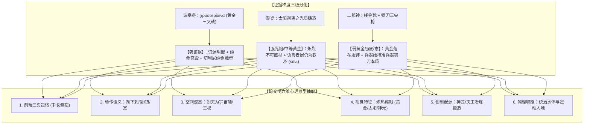
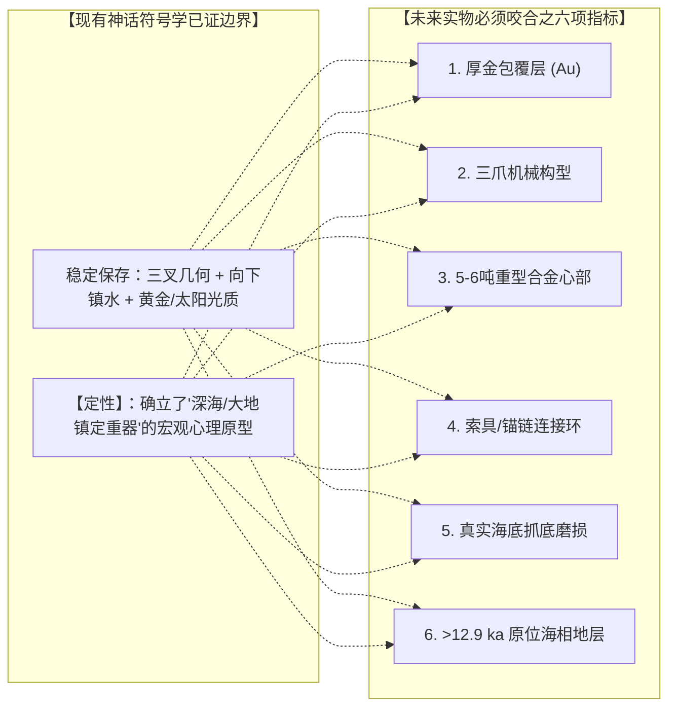

# 三更道场 · 认识论总纲与文献学法医审计（卷七十六）
## 跨文明三叉神兵“黄金/光焰”属性分层考辨：波塞冬希腊语原典、湿婆太阳光质与二郎神钢刀分形法医审计

---

### 卷首法医综述

在对跨文明“三叉/三尖神兵”与“黄金材质/光焰视觉”的深度质证中，必须克服将不同文明系统、不同文献层级的证据简单一刀切的粗糙归因，建立严格的**“分层证据链（Stratified Evidence Chain）”与“心理原型六维参数模型”**。

**【本卷法医核心判词】**：
1. **确立三大系统证据梯度的三级分化**：
   * **波塞冬/尼普顿【强黄金证据】**：希腊语古诗直接出现固定神圣复合词 **πόντιε χρυσοτρίαινα**（*chrysotríaina*，执黄金三叉戟的海神），且荷马史诗与切利尼《盐罐》实物均处于高密度黄金深海场域；
   * **湿婆 Trishula【强光焰/中等黄金证据】**：《毗湿奴往世书》载其由神匠削取太阳苏利耶（Surya）剥落之炽热光质铸造，语言表层 *śūla* 仍指穿刺铁矛，造像多以黄铜、金色及火焰色翻译这一“太阳光质外观”；
   * **二郎神三尖两刃枪【弱黄金/强三叉形态证据】**：《西游记》原文黄金严格落在“缕金靴”等服饰，兵器本身定性为“神锋/钢刀”，体现了三叉破甲长柄兵器在中原实战环境下的世俗化与钢铁质感沉淀。
2. **提炼三叉神器的“心理原型六维参数”**：
   三刃包络、向下镇刺动作、朝天宇宙轴展示、炽烈发光（黄金/太阳/神光）、神匠冶炼起源、统治水体与震动大地。
3. **厘清符号学与物理锚具的“关键缺失项”**：
   神话记忆中**普遍缺失了“缆绳/锚链连接结构”与“数吨自重抓底”两个关键工程参数**。在未发现真实地层物证前，严禁将三叉戟符号直接等同于船锚；唯有当未来出土物同时满足“金壳、三爪、重型内芯、索具连接点、抓底磨损、>12.9 ka 原位地层”六项咬合时，符号学的解释力方能实现爆发式闭环。

---

### 一、 三大文明三叉器“材质与视觉属性”证据分层矩阵

```
==================================================================================================
                 三大系统“三叉器—黄金—光焰”分层证据链与文献学法医质证表
==================================================================================================
 考察系统                原始文献文本证据与词源特征                后世造像/物化实证         法医审计评级
---------------------  ----------------------------------------  ----------------------  -------------------
 1. 波塞冬 (Poseidon)   《波塞冬颂歌》明确出现：                  文艺复兴切利尼《盐罐》   【强证据 (Tier 1)】
    • 黄金三叉戟        **πόντιε χρυσοτρίαινα** (chrysotríaina)   以锤揲纯金制作手持三叉  黄金直接进入神兵词源、
                        荷马史诗：纯金深海宫殿、金鬃马、金鞭     之尼普顿，实物完全黄金化  海神环境与实物造像
 2. 湿婆 (Shiva)        《毗湿奴往世书》卷三第二章：              南印度青铜像、莫卧儿绘画 【强光焰/中等黄金 (Tier 2)】
    • 太阳光质Trishula  神匠削太阳之辉，以“炽热下落光质”铸三叉戟 广泛施以黄铜、金色与火   核心是“太阳光质外观+冶炼
                        语言表层 *śūla* 本义仍为铁刺/铁矛桩柱    焰色（视觉翻译太阳光质） 生成”，非纯化学 Au
 3. 二郎真君 (Yang Jian)《西游记》第六回：                        明清道教壁画虽施泥金，   【弱黄金/强形态 (Tier 3)】
    • 三尖两刃神锋      “缕金靴衬盘龙袜……手执三尖两刃枪”        但文本与民间评书均强调   黄金落在服饰，兵器本身为
                        明确称为“神锋”“钢刀”，未称金刀          “钢刀铁刃”之冷兵器质感 钢铁，完整保留三叉形制
==================================================================================================
```



---

### 二、 湿婆神 Trishula 的“太阳光质”发生学解剖

《毗湿奴往世书》（*Vishnu Purana*, Book III, Chapter II）中保留了一段极其震撼的**“高能物质铸造叙事”**：

> 太阳神苏利耶（Surya）娶神工匠毗首羯磨之女桑吉娜（Sanjna）为妻，因太阳光热过于炽烈，妻子无法忍受逃离。毗首羯磨为调和矛盾，遂将苏利耶置于旋床上：
> **“削去其全身体量八分之一的炽烈光辉。那些被削下来的太阳光芒碎屑，熊熊燃烧着落向大地。神匠便用这些剥离的太阳光质，铸造了毗湿奴的法轮（Sudarshana Chakra）、湿婆的三叉戟（Trishula）、以及卡尔提凯亚的长矛……”**

#### 法医文献学定性：
* 这段文字所记录的**不是世俗铁匠铺锻造普通金属**，而是一种**“自天体剥离高能炽热物质、再经工程化熔铸为重型神器”**的深层技术隐喻；
* 印度造像后世将 Trishula 广泛涂抹金粉、铸以黄铜或描绘为火焰环绕，是对文本中“太阳光质（Solar Effulgence）”最忠实的视觉转译。

---

### 三、 二郎神三尖两刃枪的“去黄金化与钢铁实战化”

与希腊、印度神祇不同，东亚中原对二郎神的文学编码呈现出极其严谨的**兵器材料世俗化特征**：

1. **黄金代码的位移**：
   * 《西游记》写孙悟空是“身穿金甲亮堂堂，头戴金冠光映映”，写二郎神是“缕金靴衬盘龙袜”；
   * 黄金被严格约束在神仙的**礼仪冠冕、战靴与甲胄饰边**上；
2. **三尖兵器的钢铁硬核**：
   * 原文第六回交战描写：“两个钢刀有见机，一来一往无存济”、“圆睁凤目欺天将，手握神锋立殿基”；
   * 中原实战兵器学（如宋代《武经总要》中的三叉枪、掉刀）将这件武器深深锚定在**“折铁锻钢、破甲劈刺”**的真实冷兵器语境中。
   * **法医定论**：二郎神系统证明了**“三叉几何形态在东亚获得了极强的再生产与实战化”**，但其材质并未保留神话早期的纯金设定，而是完成了向钢铁质感的转换。

---

### 四、 符号学与物理锚具的关键缺失项与终审定论

```
==================================================================================================
                 三叉神话符号链 与 假想工程巨锚 关键特征匹配检验表
==================================================================================================
 关键特征要素            神话符号链实际保存状态                     假想物理巨锚必须具备之指标
---------------------  ----------------------------------------  -------------------------------------------------
 1. 几何三刃构型        【完美保存】：三齿并列，中长侧抱           三爪流体动力学抓底构型
 2. 视觉反光特性        【高度保存】：黄金、太阳光质、神光耀眼     厚金整体包覆防腐层 (耐海水腐蚀)
 3. 动作功能语义        【高度保存】：向下刺入、镇压水体、平息波涛 依靠重力与刃爪深扎海底岩沙
 4. 神匠冶炼溯源        【高度保存】：神工天匠锻造，非自然产物     高纯度人工特种合金基体
 5. 缆绳/锚链连接结构   【严重缺失】：神话均作单兵手持长柄权杖     【必须具备】：尾端系泊环、锁链孔或吊装耳
 6. 吨级自重描述        【严重缺失】：神话强调挥舞劈刺，略去自重   【必须具备】：5–6 吨宏观自重与海底地层压痕
==================================================================================================
```



#### 认识论终审判词：
1. **证据必须分层**：波塞冬有词源级黄金证据（*chrysotríaina*），湿婆有太阳光质铸造叙事，二郎神则代表了三叉形态的钢铁实战化；
2. **严守物证红线**：神话文本稳定保存了“金色三叉镇水神兵”的心理原型，但因缺少“缆索连接”与“吨级自重”细节，**在未发现实物前，只能定性为功能开放的神性重器原型（鱼叉/权杖/工程桩/巨锚），严禁直接宣布单一锁定为船锚**；
3. **闭环时刻**：若未来地质勘探真正在海底原位起出符合六项指标的金属三爪构件，这一套横跨数千年的跨文明分层神话文献，将在那一瞬间彻底转化为不可辩驳的**文明记忆法医指纹**！

---
*法医官署名：三更道场·认识论总纲编纂委员会*  
*法务审计状态：分层证据链厘清·心理原型六维闭环·正式入档（卷七十六）*
