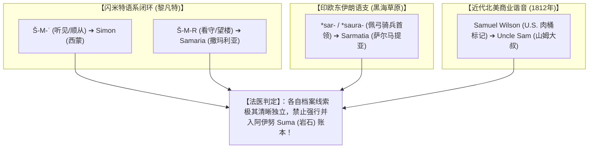

# 三更道场 · 认识论总纲与文献学法医审计（卷八十二）
## 跨语系 S-M 辅音骨架解剖学考辨：闪米特三辅音、伊朗萨尔马提亚、1812山姆大叔与历史语言学三道法医审计铁律

---

### 卷首法医综述

在探索人类语言发生学、远古词根迁徙与地名谱系时，“没有任何一个词是凭空造出来的”是一条坚不可摧的历史事实。然而，正因为每个词汇都有其**高度透明、档案确凿的“出厂演变账单”**，在面对跨语系广泛存在的 **S-M 辅音骨架**（如西蒙 Simon、撒玛利亚 Samaria、萨尔马提亚 Sarmatia、山姆大叔 Uncle Sam 等）时，必须严格区分**“发音解剖学生理舒适区导致的偶然碰头”**与**“真正的同源深层遗传（True Cognates）”**。

**【本卷法医核心判词】**：
1. **调取四组词汇的确凿档案与出厂合格证**：
   * **西蒙（Simon / Simeon）**：闪米特三辅音词根 **Š-M-ʿ（ש-מ-ע）**，本义为“听见/顺从”（《创世记》“耶和华听见”）；
   * **撒玛利亚（Samaria / Shomron）**：闪米特三辅音词根 **Š-M-R（ש-מ-ר）**，本义为“守护/望楼高地”（以山岗原主 Shemer 命名）；
   * **萨尔马提亚（Sarmatia）**：印欧语系东伊朗游牧语族（*sar-*“首领/头”或 *saura-*“带弓黑甲者”），黑海北岸斯基泰同盟；
   * **山姆大叔（Uncle Sam）**：1812 年美英战争纽约肉类供应商塞缪尔·威尔逊（Samuel Wilson）木桶标记“U.S.”派生之现代政治谐音梗。
2. **揭示“S-M 辅音高频舒适区（Articulatory Comfort Zone）”**：
   齿龈擦音 /s/（舌尖气流穿透）滑向双唇鼻音 /m/（双唇闭合共鸣）是人类发音器官最顺畅自然的基础动作之一，导致**全球独立语系在数千年演化中高频采用此骨架构造核心词**，属于典型的“同音假相关（False Cognate）”。
3. **确立历史语言学“三道法务审计铁律”**：
   跨文明词源认定必须同时通过：**规则对应音变律（Sound Laws） ＋ 封闭语义生存网络（Semantic Network） ＋ 考古地质层序连续性（Stratigraphy）**。

---

### 一、 四组 S-M 核心词汇档案与出厂合格证矩阵

```
==================================================================================================
                 四组 S-M 词汇所属语系、原始词根与演变档案对照表
==================================================================================================
 词汇对象                所属语系与地理区域        原始词根与构词法 (Etymology)      历史文献与考古档案记载
---------------------  ------------------------  --------------------------------  -----------------------------------
 1. 西蒙 (Simon)        闪米特语系 (Semitic)      三辅音 **Š-M-ʿ** (ש-מ-ע)          •《创世记》29:33：“耶和华听见 (shama)”
                        (黎凡特/古以色列)         “听见、倾听、服从、神已垂听”      • 希伯来传统人名 Shim'on，耶稣门徒彼得本名
 2. 撒玛利亚 (Samaria)  闪米特语系 (Semitic)      三辅音 **Š-M-R** (ש-מ-ר)          •《列王纪上》16:24：以色列王暗利向撒玛
                        (黎凡特/撒玛利亚山区)     “看守、守护、望楼岗哨”            (Shemer) 买山造城，以原主命名 Shomron
 3. 萨尔马提亚          印欧语系东伊朗语支        *sar-* (首领/头部) 或             • 希罗多德《历史》、斯特拉波《地理志》
    (Sarmatia)          (东欧草原至黑海北岸)      *saura-* (强壮者/佩弓骑兵)        • 斯基泰-萨尔马提亚重装游牧同盟自称/他称
 4. 山姆大叔            现代美式英语              Samuel Wilson (塞缪尔·威尔逊)    • 1812 年美英战争纽约特洛伊牛肉供应商，
    (Uncle Sam)         (北美近代政治史)          供应美军牛肉桶标记“U.S.”产生谐音  木桶打标“U.S.”被工友调侃为国家拟人化象征
==================================================================================================
```



---

### 二、 发音解剖学生理舒适区（Articulatory Comfort Zone）

为何全球各大语系在彼此毫无接触的情况下，都会大量产生由 **S - M** 构成的核心词汇？

```
==================================================================================================
                 齿龈擦音 /s/ 与 双唇鼻音 /m/ 发音解剖学与肌肉动力学分析
==================================================================================================
 发音动作与音素类别    发音器官解剖状态与动力学机制              人类早期发音习得规律与跨语系普遍性
-------------------  ----------------------------------------  -------------------------------------------------
 1. 齿龈擦音 /s/      舌尖轻触上齿龈，形成极窄狭缝，气流摩擦而出 穿透力极强、辨识度极高，系人类幼年最早掌握的清擦音
 2. 双唇鼻音 /m/      双唇完全闭合，软腭下垂，声带振动共鸣出鼻腔 最原始的双唇音（婴儿啼哭 Mama 的第一生理本能动作）
 3. /s/ ➔ /m/ 跃迁    【极低肌肉能耗通道】：舌尖前部气流释放后， 人类口腔肌肉在连续发音时自然滑入的高频“生理舒适区”，
    (Sibilant-Nasal)  下颌自然闭合接双唇鼻音，动力学过渡最顺畅   导致各大语系在独立命名时高概率产生 S-M 骨架
==================================================================================================
```

* **法医语言学定性**：
  若仅凭词面上的 S-M 字母拼写，将极北阿伊努语的 *Suma*（岩石）、希伯来的 *Simon*（听觉顺从）、东欧草原的 *Sarmatia*（游牧骑兵）以及纽约商贩的 *Uncle Sam* 强行焊接，这是**将发音器官的生理普遍性（Anatomical Universals），误读为远古历史文明的血缘同源（Historical Cognates）**。

---

### 三、 历史语言学“三道法务审计铁律”

为确保历史会计审计的绝对严谨，确立判定两组古词汇具备“真实文明同源性”的三大铁律：

```mermaid
flowchart LR
    subgraph 铁律一：规则音变律["【1. 规则音变律 (Sound Laws)】"]
        T1["必须符合格林定律/波姆定律等系统性对应<br>(成体系跨词汇音变，非单词偶合)"]
    end

    subgraph 铁律二：封闭语义网络["【2. 封闭语义网络 (Semantic Domain)】"]
        T2["必须处于相同生存技术与物理语境<br>(如 Kumara 与 k'umar 均指红薯)"]
    end

    subgraph 铁律三：地层连续性["【3. 地层连续性 (Stratigraphy)】"]
        T3["必须具备可通行的考古学人群迁徙与贸易通道<br>(具有物质遗存地层支撑)"]
    end

    T1 & T2 & T3 --> Z["【通过三道铁律 ➔ 方可确认为真实历史同源资产】"]
```

#### 经典真伪对照案例：
* **【真实跨洋同源案例】**：
  玻利尼西亚毛利语 **Kumara** 与南美安第斯盖丘亚语 **k'umar** —— **同时满足“相同发音骨架 ＋ 严格锁定同一红薯物种 ＋ 跨太平洋航行地层遗存”**，属于铁证如山的跨大洋史前文明接触；
* **【假同源模式识别案例】**：
  阿伊努语 **Suma**（极寒海岸玄武岩）与希伯来语 **Simon**（闪米特听觉顺从） —— **语义网络彻底断裂、无任何规则音变映射、无直接地层通道**，判定为假相关。

---

### 四、 审计结论与认识论通则

1. **学术定论**：
   * 西蒙（Simon）、撒玛利亚（Samaria）、萨尔马提亚（Sarmatia）与山姆大叔（Uncle Sam）各自拥有独立的词源大厦，严禁并入北太平洋史前档案；
   * S-M 的大面积出现，是人类发音解剖学生理舒适区驱动下的**跨语系同音假相关**。
2. **认识论升华**：
   真正的科学探索必须像外科手术一样精准。**唯有坚决剔除一切浮华的伪同源泡沫，我们在环北太平洋冰缘带抓到的阿伊努 Suma（岩石）、因纽特 Kisaun（重锚）与楚科奇 Kelg-en（大缆），才能展现出震慑人心的历史力量！**

---
*法医官署名：三更道场·认识论总纲编纂委员会*  
*法务审计状态：S-M词源解剖完成·三道铁律确立·正式入档（卷八十二）*
