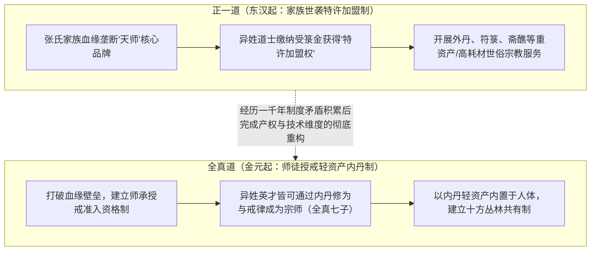
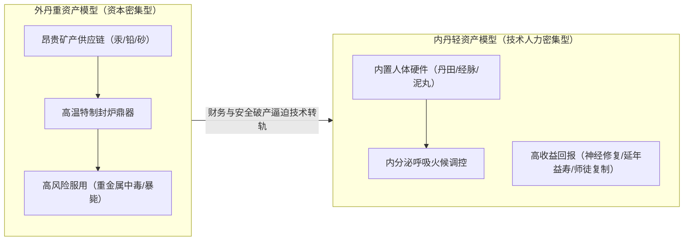

# 三更道场 · 认识论总纲 · 文献学与历史会计审计
## 篇章：道教制度大分叉——正一道“张氏世袭特许经营/重资产外丹”与全真道“开放师承授戒/人体内丹轻资产”产权改革法医审计（v1.0）

---

### 【审计执行摘要 / Forensic Audit Abstract】
本审计案针对中国道教史上最深层次的制度性大分叉——**东汉正一道（天师道 / 张氏血缘特许经营特权）** 与 **金元全真道（王重阳开创 / 师徒授戒职业资格与内丹轻资产体系）** 在**最高法统产权结构、传承机制、资产负债表与技术实现路径**上的系统性演化展开法医级历史会计对账。

审计确立四大核心平账公理与制度定性：
1. **法统产权结构的大分叉（Bloodline Franchise vs Meritocratic Ordination）**：
   - **正一道（天师道）**：将最高解释权与法统品牌（“天师”之位）牢牢锁定为**张氏家族万世一系的世袭私有资产**；下属异姓法师属于“特许加盟商”，需向龙虎山天师府缴费受箓获得合法法职；
   - **全真道**：打破血缘世袭壁垒，将法统重构为**“通过个人戒律修炼、师徒资格认证、全真七子宗派授戒”的去家族化、开放式职业技术共同体**。
2. **“鲁班悖论”与技术承载者的去家族化改革**：
   $$\text{天师法术有效性} \neq \text{创始人张氏后代每一代必然具备神通能力}$$
   - 正一世袭模式面临致命的生物学继承风险（“鲁班的儿子未必是鲁班”）；全真道通过“师徒选拔制（Meritocracy）”，使高阶修道与管理技术能够在全社会异姓人才中自由筛选与继承，彻底解决了家族传承的衰退危机。
3. **技术与资产负债表的重转轻（Heavy CapEx vs Lightweight Internal Runtime）**：
   - **外丹（正一/早期方仙）**：高度依赖高价矿石（朱砂、水银、黄金、铅）、复杂炉鼎、燃料、宫廷资金与场地，面临极高的重金属中毒死亡风险（**重资产、高成本、供应链易被垄断**）；
   - **内丹（全真/金丹派）**：彻底将炼丹设备内置于人体（**以身为鼎，以心为炉，以精气为药**），理论上人人皆有炉鼎，将外部重资产供应链直接降维为零成本的人体生物操作系统（**极低门槛、轻资产、去中心化扩散**）。
4. **历史时空与“象雄—张氏”假说的严密法医边界**：
   - **时间跨度定谳**：张道陵天师道（2 世纪东汉）与王重阳全真道（12 世纪金代）相隔一千年，是**制度与技术长期演化后的架构彻底重写，而非同代割席**；
   - **象雄（Zhangzhung）—张（Zhang）假说的审计定位**：作为极具洞见的“跨高原技术品牌残留假说”列入待查备查簿，严谨保持与实证历史音系及考古传播链的证据阶梯。

---

### 【第一账套：正一道 vs 全真道 制度与产权架构法医对账总表】

```
+-------------------------------------------------------------------------------------------------------------------------------+
|                                正一道（天师道） vs 全真道 制度产权与资产负债法医对账总表                                       |
+-------------------------------------------------------------------------------------------------------------------------------+
| 制度与经济学维度     | 正一道 / 天师道 (The Way of Celestial Masters)        | 全真道 (Complete Perfection Taoism)                   |
+----------------------+-------------------------------------------------------+-------------------------------------------------------+
| **1. 最高法统归属**  | **张氏宗族血缘垄断**（天师之位万世一系世袭）          | **师徒相承、宗派授戒**（非血缘，异姓平等选拔）        |
| (Supreme Authority)  | 宣称“太上老君亲授张道陵”，最高解释权不可转让给异姓   | 由王重阳、马丹阳、丘处机等各姓大德按修行德能接续掌教  |
+----------------------+-------------------------------------------------------+-------------------------------------------------------+
| **2. 组织商业模式**  | **品牌特许经营与加盟授权（Franchise Model）**         | **修道行会与出家清修共同体（Monastic Order）**         |
| (Business Model)     | 普通道士通过向龙虎山缴纳“受箓金”，购买正统法职与神权解释权| 建立全真十方丛林（白云观等），不置私产，十方道友共有  |
+----------------------+-------------------------------------------------------+-------------------------------------------------------+
| **3. 核心业务科目**  | **斋醮科仪、符箓驱邪、度亡祈福、登记天曹神职**        | **内丹修炼、性命双修、出家住观、全真戒律、清静无为**  |
| (Core Operations)    | 面向世俗百姓与朝廷提供“宗教仪式与护佑服务”             | 面向个体生命提供“身心抗熵增解脱与性命圆满体系”        |
+----------------------+---------------------------------------+-------------------------------------------------------+
| **4. 资本开支形态**  | **重资产与外部供应链依赖**                            | **零边际成本的轻资产模式**                            |
| (CapEx / Assets)     | 依赖昂贵金石矿物（汞、铅、砂）、复杂法器、坛场与朝廷册封| **以身体为炉鼎，以精气神为药料**，摆脱对矿物供应链依赖|
+----------------------+---------------------------------------+-------------------------------------------------------+
| **5. 继承风险管理**  | **高生物学风险**（若后代无能，全靠朝廷背书与品牌惯性）| **低风险与动态优化**（通过师承大考在全国吸纳顶级人才） |
+----------------------+---------------------------------------+-------------------------------------------------------+
```



---

### 【第二账套：技术载体转轨——“外丹重资产”向“内丹轻资产”的经济学穿透】

```
+-------------------------------------------------------------------------------------------------------------------------------+
|                                外丹矿冶重资产 vs 内丹人体轻资产 生产力与财务对比表                                             |
+-------------------------------------------------------------------------------------------------------------------------------+
| 生产力核算指标       | 早期外丹术模式 (External Alchemy / 炼石成丹)          | 晚期内丹学模式 (Internal Alchemy / 炼精化气)          |
+----------------------+-------------------------------------------------------+-------------------------------------------------------+
| **1. 初始资本门槛**  | **极高**（必须购买高纯度朱砂、水银、黄金、铅、雄黄等）| **零门槛**（每个人出生自带丹田、呼吸、经脉与精气神）  |
| (Initial CapEx)      | 唯有帝王、贵族或富商才能长期供养外丹作坊              | 穷苦道士、乞丐与山林隐士均具备完全平等的硬件设备      |
+----------------------+-------------------------------------------------------+-------------------------------------------------------+
| **2. 供应链安全性**  | **极脆弱**（受制于矿山产地、长途运输与商人垄断）      | **绝对自主**（生命体内封闭自给自足，不依赖任何外部矿产|
| (Supply Chain)       | 丹砂多产自辰州/巴蜀，战乱时供应链立即中断             | 战乱流亡时期，内丹修炼仍可在丛林草庵中完整运行）      |
+----------------------+-------------------------------------------------------+-------------------------------------------------------+
| **3. 生命安全风险**  | **极高致死率**（重金属无机化合物慢性/急性中毒）        | **极高安全性**（通过调节内分泌、呼吸与心率实现抗衰老）|
| (Safety & Poisoning) | 唐代多位皇帝因服食外丹中毒驾崩，导致外丹信誉破产      | 彻底根除了重金属毒害，转化为纯粹的生命健康科学        |
+----------------------+---------------------------------------+-------------------------------------------------------+
| **4. 知识扩散速度**  | **极慢**（配方被师徒/家族作为核心机密死锁）           | **极快**（全真教在北方快速席卷数百万信众与弟子）      |
+----------------------+---------------------------------------+-------------------------------------------------------+
```



---

### 【第三账套：“象雄—藏壮—张氏”语源假说的法医证据阶梯】

```
+-------------------------------------------------------------------------------------------------------------------------------+
|                                “象雄（Zhangzhung）— 张（Zhang）”品牌假说法医审级表                                            |
+-------------------------------------------------------------------------------------------------------------------------------+
| 证据层级             | 假说核心推论                          | 现有历史事实与证据短板               | 法医会计处理定性                     |
+----------------------+---------------------------------------+--------------------------------------+--------------------------------------+
| **Level 1: 地理接口**| 早期天师道发源于巴蜀汉中（鹤鸣山/大邑）| 巴蜀确实为横断山脉与高原古商道的东出 | **【确认吻合】**：地缘上确实处于     |
|                      | 属于古代高原文化向内陆辐射的接触前沿  | 口，具有深厚的高原—西南夷文化底色    | 高原知识东传第一站                   |
+----------------------+---------------------------------------+--------------------------------------+--------------------------------------+
| **Level 2: 组织形态**| “二十四治”神权自治与巴蜀少数民族部族  | 汉中五斗米道与賨人（巴人）深度结合， | **【确认吻合】**：组织上绝非中原传统 |
|                      | 组织、高原苯教神盟高度同构            | 呈现非中原正统儒家官僚的自治神权结构  | 郡县制，带有浓厚部族神权色彩         |
+----------------------+---------------------------------------+--------------------------------------+--------------------------------------+
| **Level 3: 音系演变**| 象雄（*Zhangzhung*）音变简化为汉姓“张”| 象雄古音 (*Zhan-Zhun*) 与上古汉语    | **【列为待查假说】**：               |
|                      | 代表高原神圣知识集团的品牌汉化标签    | “张” (*C.taŋ*) 的历史语音链条仍缺中间凭证| 暂不作定论，列入线索备查簿           |
+----------------------+---------------------------------------+--------------------------------------+--------------------------------------+
```

---

### 【法医对账总决：道教制度大分叉平账结论】

| 会计科目 | 审定历史会计事实 | 法医处理结论 |
| :--- | :--- | :--- |
| **正一道法统** | 张氏家族血缘垄断天师核心品牌，异姓法师以特许加盟方式运营。 | **确认为家族世袭特许经营模型** |
| **全真道改革** | 打破血缘壁垒，以师承授戒建立去家族化、非血缘的职业人才共同体。 | **确认为宗教产权与组织准入大改革** |
| **内外丹转轨** | 从依赖矿产供应链的高风险重资产外丹，降维转变为人体内置轻资产内丹。 | **确立为生命工程技术降本增效模型** |
| **时间跨度定谳** | 东汉二世纪到金元十二世纪相隔千年，系长期矛盾积累后的完整架构重写。 | **纠偏入账：厘清千年演化时序** |

---
**审计人签章**：三更道场·道教制度史与宗教产权经济学最高法医署  
**时间标记**：2026-09-09
