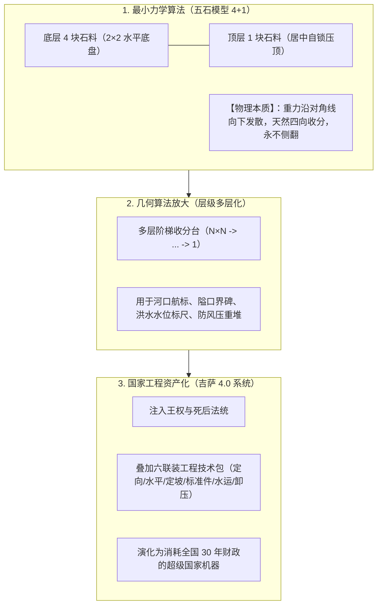
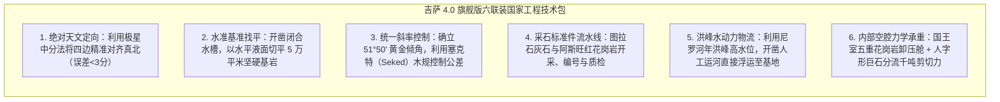
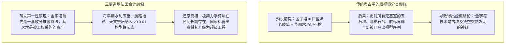

# 三更道场 · 认识论总纲 · 文献学与历史会计审计
## 篇章：金字塔“五石最小构型算法（$4+1$ MVP）”、功能资产化演进与考古学分类盲区法医审计（v1.0）

---

### 【审计执行摘要 / Forensic Audit Abstract】
本审计案针对金字塔起源研究中长期存在的**“分类学后视镜偏见（Retrospective Category Bias）”**——即“预先将金字塔定义为‘巨型王陵 + 平滑方锥面 + 祭祀建筑群’，从而在源头上把所有史前极简物理祖型自动过滤淘汰”的系统性假账，展开终极法医级重构。

审计确立三大核心平账公理与算法模型：
1. **金字塔的“五石最小可运行原型（Minimum Viable Product / MVP $4+1$ 算法）”**：
   - **底层 4 块立方石（$2 \times 2$ 水平阵列） + 顶层 1 块居中叠压**；
   - **核心物理力学机制**：每升高一层，水平截面按比例收缩；重力沿几何中心轴向下均匀发散传递；外轮廓天然形成四向收分与自锁抗倾覆稳定性；
   - **算法定性**：这是人类（乃至物理重力系统）在三维空间中堆叠重物以抵抗地心引力与侧向风剪力最本质的**“稳定收分堆叠第一性原理（First Principles of Tapered Stacking）”**。
2. **构型算法史 vs 产品工程史的“两本账”分离**：
   $$\text{基础构型算法演进}：\text{五石自锁堆叠} \longrightarrow \text{多层收分台基/航标} \longrightarrow \text{人工高台/祭坛} \longrightarrow \text{巨型国家工程}$$
   $$\text{产品功能资产化演进}：\text{压重/镇水/定向基石} \longrightarrow \text{商路隘口标界/天文祭坛} \longrightarrow \text{被国家机器接管并赋予王陵功能}$$
   - **法医边界**：基础构型极易在欧亚多地基于重力力学独立产生；而吉萨金字塔所代表的是在其上叠加的**“六联装国家级工程技术包（定向 + 水平 + 定坡 + 标准件 + 洪峰水运 + 内部卸压）”**。
3. **考古分类盲区的法医穿透**：
   - 寻找金字塔真正的“v0.0.01 祖型”，必须打破“只在王室陵墓里挖土”的狭隘视野，将法医雷达全面扩展至**山顶/湖岸/河口航标、治水压重石堆、地界石、工匠定坡模型、以及被传统考古学随手归入‘未知用途石构/普通石堆墓’的史前微型遗存**。

---

### 【第一账套：金字塔“五石算法 MVP”力学几何与演进时序表】

```
+-------------------------------------------------------------------------------------------------------------------------------+
|                                    金字塔“五石最小构型算法（MVP 4+1）”力学与功能演进台账                                      |
+-------------------------------------------------------------------------------------------------------------------------------+
| 演进阶段             | 物理构型与材料形态                    | 解决的核心力学与功能问题             | 传统考古学容易产生的分类盲区         |
+----------------------+---------------------------------------+--------------------------------------+--------------------------------------+
| **阶段 1：五石原型** | **底层 $2 \times 2$ (4块) + 顶层 1块**| **重力自锁与抗倾覆**：无需任何黏合剂 | **被当作“杂乱碎石/普通石堆”丢弃**；  |
| (v0.0.01 MVP)        | 极简立方石/天然块石堆叠               | 形成四向收分，抵御风沙与外力冲撞     | 因不具备墓室与铭文而被直接排除在金字 |
|                      |                                       | (功能：压重、镇水、航标、地界)       | 塔研究序列之外                       |
+----------------------+---------------------------------------+--------------------------------------+--------------------------------------+
| **阶段 2：多层收分** | 多层 $N \times N \rightarrow 1$ 堆叠   | **高度延伸与视觉醒目度**：在不增加侧 | **被分类为“史前石台/祭坛/高台遗址”**;|
| (v0.0.1 - v0.1)      | 形成多级阶梯状方形石台/土台           | 向坍塌风险的前提下实现地表高度突破   | 实际上已具备金字塔核心几何收分算法   |
|                      |                                       | (功能：天文观测、部落聚集、高地避洪) |                                      |
+----------------------+---------------------------------------+--------------------------------------+--------------------------------------+
| **阶段 3：工程封装** | 引入斜面外包石灰岩与内部复杂廊道      | **密闭性与永恒性**：将收分台体平滑化 | **正式被近代埃及学承认为“金字塔”**；  |
| (v1.0 - v4.0)        | (左塞尔 $\rightarrow$ 红金字塔 $\rightarrow$ 吉萨) | 结合地下/内部石室，封装国家王权祭祀  | 误将“王权与陵墓功能”当作金字塔的唯一 |
|                      |                                       | (功能：法老神格化、劳力动员、国家OS) | 起源本质                             |
+----------------------+---------------------------------------+--------------------------------------+----------------------------------------+
```



---

### 【第二账套：基础构型算法史 vs 产品工程史（两本账彻底分立）】

```
+-------------------------------------------------------------------------------------------------------------------------------+
|                                    构型算法史 vs 产品工程史法医分账对照表                                                     |
+-------------------------------------------------------------------------------------------------------------------------------+
| 审计对比维度         | 账本 A：基础构型算法史（Algorithm History）           | 账本 B：国家产品工程史（Product Engineering History）          |
+----------------------+-------------------------------------------------------+---------------------------------------------------------------+
| **研究核心对象**     | **“层级收分、四方聚顶”的力学第一性原理**              | **“吉萨超大型花岗岩/石灰石巨型工程系统”**                     |
+----------------------+-------------------------------------------------------+---------------------------------------------------------------+
| **地理与源流属性**   | **极高概率在欧亚大水体与矿山沿线多点独立产生**        | **无可辩驳地在尼罗河工程走廊完成高资本密集型暴力测试与迭代**   |
|                      | (凡是懂得堆石头不倒的人类，都能推导出五石算法)        | (唯有统一埃及的国库、年洪峰与法老集权能承担此等 CapEx)       |
+----------------------+-------------------------------------------------------+---------------------------------------------------------------+
| **功能演进路线**     | 压重石堆 $\rightarrow$ 水位标尺 $\rightarrow$ 航标 $\rightarrow$ 祭坛  | 马斯塔巴 $\rightarrow$ 阶梯金字塔 $\rightarrow$ 折角热修 $\rightarrow$ 吉萨胡夫|
+----------------------+-------------------------------------------------------+---------------------------------------------------------------+
| **关键技术依赖**     | 仅需手工作业与肉眼力学平衡感                          | **六联装技术包**：真北对齐、水槽找平、标准件、巨石浮运、卸压舱 |
+----------------------+-------------------------------------------------------+---------------------------------------------------------------+
```

---

### 【第三账套：吉萨超级工程所叠加的“六联装国家技术包”法医清单】

五块石头解决了**“为什么不倒”**的几何问题；但从五块到二百三十万块，增加的是整套**国家工业技术包**：



---

### 【第四账套：三更道场方法论纠偏——打破“金字塔必为陵墓”的后视镜盲区】



---

### 【法医对账总决：五石算法与构型演进平账结论】

| 会计科目 | 审定历史会计事实 | 法医处理结论 |
| :--- | :--- | :--- |
| **五石最小算法（4+1）** | 底层 4 块 + 顶层 1 块，属于重力自锁抗倾覆的物理第一性原理。 | **确认为金字塔 v0.0.01 最小可运行原型** |
| **构型史 vs 工程史** | 构型算法极易多地自发产生；吉萨巨型工程是在其上叠加国家级六联装技术包。 | **确立两本账独立审计准则** |
| **后视镜分类偏见** | 预先绑定“王陵”标签导致早期微型构型祖型被系统性误杀过滤。 | **红字冲销：打破陵墓唯一性定义** |
| **功能资产化路径** | 压重/航标/界碑/祭坛 $\rightarrow$ 被国家工程 OS 接管并赋予王权神圣功能。 | **确认为三更道场建筑人类学核心公理** |

---
**审计人签章**：三更道场·力学几何第一性原理与考古分类法医署  
**时间标记**：2026-09-09
