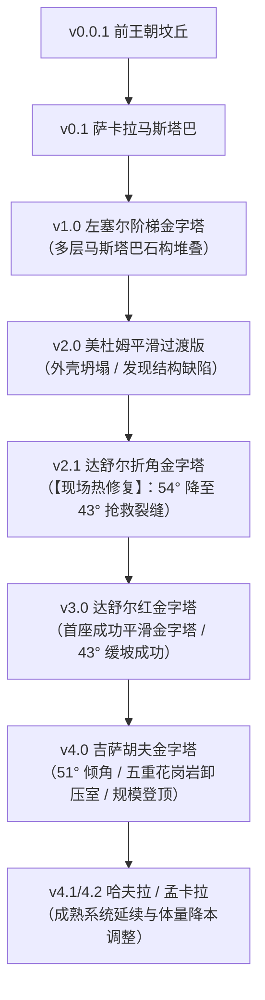
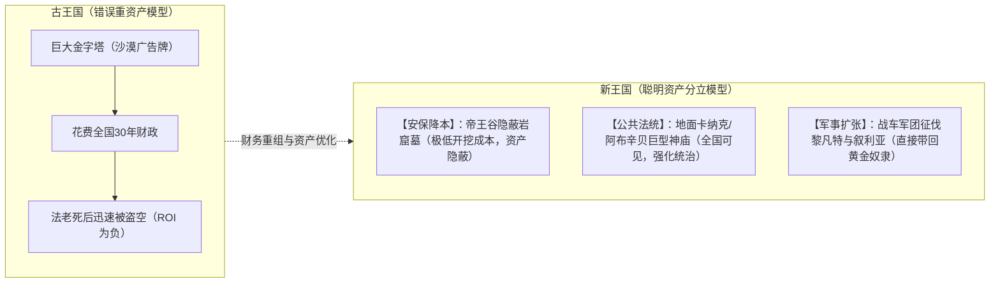

# 三更道场 · 认识论总纲 · 文献学与历史会计审计
## 篇章：金字塔版本迭代日志（0.0.1 $\rightarrow$ 4.2）、国家工程操作系统（OS）与资本开支转移法医审计（v1.0）

---

### 【审计执行摘要 / Forensic Audit Abstract】
本审计案针对古埃及金字塔建筑群的“技术突变神话”、第四王朝连续批准超级重资产项目的真实财政动力，以及后代为何“金字塔越建越小/不耐久”的资本开支（CapEx）转移机制展开终极法医级会计对账。

审计确立三大核心平账公理与工程定性：
1. **完整的工程版本迭代日志（Git Commit-like Version History）**：
   - 彻底击穿“胡夫金字塔是从沙漠凭空蹦出的神迹”这一伪史叙事；
   - 完整复原从 **前王朝地下土坑（v0.0.1） $\rightarrow$ 萨卡拉马斯塔巴（v0.1） $\rightarrow$ 左塞尔阶梯金字塔（v1.0） $\rightarrow$ 美杜姆坍塌/过渡版（v2.0） $\rightarrow$ 达舒尔折角金字塔“线上热修复”（v2.1） $\rightarrow$ 达舒尔红金字塔平滑稳定版（v3.0） $\rightarrow$ 吉萨胡夫超级发行版（v4.0）** 的清晰工业级试错链条。
2. **金字塔作为“国家工程操作系统（State Engineering OS）”的升级载体**：
   - 第四王朝斯尼夫鲁与胡夫连续承担超级工程，优化的绝非单纯的“尸体安葬”，而是在短时间内将**“全国人口户籍登记、尼罗河洪峰重力浮运、标准件采石场开采、工班工分与粮食配给、几何定坡与卸压测绘”**这套国家级操作系统强行升级至最高版本。
3. **后代“金字塔缩水与降本”的财务会计真相**：
   - **成本立方级暴增**：金字塔高度线性增加，其石料与组织成本呈近似立方级暴增（$\text{Cost} \propto h^3$）；
   - **防盗收益为负的“超级沙漠广告牌”**：巨型金字塔在沙漠中公开暴露王室全部资产，极易被盗，经济回报为负；
   - **资本开支（CapEx）科目转移**：新王国并非丧失巨型施工能力，而是将资本开支从“单一高风险金字塔”，转向**“帝王谷隐蔽岩窟墓（安保降本） + 地面卡纳克/卢克索神庙与对外军事征服（公共资产与法统收益）”**。

---

### 【第一账套：金字塔建筑技术版本迭代日志表（v0.0.1 $\rightarrow$ v4.2）】

```
+-------------------------------------------------------------------------------------------------------------------------------+
|                                    古埃及金字塔工程版本迭代日志（Version Commit History）法医台账                             |
+-------------------------------------------------------------------------------------------------------------------------------+
| 版本号 / 代号        | 代表建筑与遗址                        | 建筑年代 (BCE)                        | 核心工程突破与“Bug 修复 / 热修复”记录         |
+----------------------+---------------------------------------+--------------------------------------+--------------------------------------+
| **v0.0.1 (Alpha)**   | 前王朝地下墓穴、土覆坟丘 (Tumulus)   | 约 3500 - 3100 BCE                   | 地下挖坑埋葬 + 地表小土堆标记，易被风沙剥蚀  |
+----------------------+---------------------------------------+--------------------------------------+--------------------------------------+
| **v0.1 (Beta)**      | 第一、二王朝萨卡拉/阿拜多斯马斯塔巴   | 约 3100 - 2700 BCE                   | 长方形平顶泥砖/石砌地上墓室，分室储藏随葬品  |
+----------------------+---------------------------------------+--------------------------------------+--------------------------------------+
| **v1.0 (Release)**   | 第三王朝左塞尔阶梯金字塔 (萨卡拉)     | 约 2670 BCE                          | **首次石构化**：将6层马斯塔巴逐级叠高，由伊姆|
|                      |                                       |                                      | 霍特普设计，形成最初的巨型几何天梯           |
+----------------------+---------------------------------------+--------------------------------------+--------------------------------------+
| **v2.0 (Unstable)**  | 斯尼夫鲁·美杜姆金字塔 (Meidum)        | 约 2610 BCE                          | **向平滑斜面过渡失败**：外包石灰岩发生滑移坍 |
|                      |                                       |                                      | 塌，核心暴露，暴露了斜率与基础沉降的设计缺陷 |
+----------------------+---------------------------------------+--------------------------------------+--------------------------------------+
| **v2.1 (Hotfix)**    | 斯尼夫鲁·达舒尔折角金字塔 (Bent)      | 约 2600 BCE                          | **“现场线上热修复”**：下部 54° 出现严重裂隙，|
|                      |                                       |                                      | 结构面临崩塌，施工中途强行改为 43° 完工      |
+----------------------+---------------------------------------+--------------------------------------+--------------------------------------+
| **v3.0 (Stable)**    | 斯尼夫鲁·达舒尔红金字塔 (Red)         | 约 2590 BCE                          | **首座成功平滑金字塔**：吸取教训采用 43° 缓坡|
|                      |                                       |                                      | 内部采用叠涩拱顶（Corbelled Vault）完美承重  |
+----------------------+---------------------------------------+--------------------------------------+--------------------------------------+
| **v4.0 (LTS 旗舰版)**| 第四王朝胡夫大金字塔 (吉萨)           | 约 2580 - 2560 BCE                   | **全面扩大规模**：精准 51°50' 倾角，引入五重 |
|                      |                                       |                                      | 花岗岩卸压舱（Relieving Chambers）与巨型上升道|
+----------------------+---------------------------------------+--------------------------------------+--------------------------------------+
| **v4.1 / v4.2**      | 哈夫拉、孟卡拉金字塔 (吉萨)           | 约 2550 - 2500 BCE                   | 延续成熟系统，哈夫拉利用地势增高，孟卡拉大幅 |
|                      |                                       |                                      | 削减体量至三分之一（启动初步财政降本）       |
+----------------------+---------------------------------------+--------------------------------------+--------------------------------------+
```



---

### 【第二账套：第四王朝“国家工程操作系统（OS）”强行升级的真实收益】

为什么斯尼夫鲁与胡夫在短短几十年内连续批准如此离谱的超大项目？

```
+-------------------------------------------------------------------------------------------------------------------------------+
|                                国家工程操作系统（State Engineering OS）功能模块升级对账表                                     |
+-------------------------------------------------------------------------------------------------------------------------------+
| 操作系统核心模块     | 传统陵墓解释（伪狭隘视角）            | 国家工程 OS 升级实质（三更道场法医会计真相）                         |
+----------------------+---------------------------------------+----------------------------------------------------------------------+
| **1. 财政汲取与户籍**| 仅仅为了搜罗民脂民膏                  | **建立全国劳动力与农产统一登记系统**：精准统计各州（诺姆）余粮与闲置人口 |
+----------------------+---------------------------------------+----------------------------------------------------------------------+
| **2. 物流与重力水运**| 奴隶拉绳子硬搬                        | **重力流与洪峰船运标准化**：利用尼罗河年洪峰高水位，开凿人工运河浮运石材 |
+----------------------+---------------------------------------+----------------------------------------------------------------------+
| **3. 工班与标准化分配| 无休止残酷皮鞭抽打                    | **标准件流水线与工分口粮制**：分发面包、啤酒、牛肉与医疗，建立熟练工行会|
+----------------------+---------------------------------------+----------------------------------------------------------------------+
| **4. 测量与工程公差**| 神秘外星几何学                        | **现场测量法与公差控制**：利用水准槽找平地基、利用北极星定真北（误差<3分）|
+----------------------+---------------------------------------+----------------------------------------------------------------------+
```

- **会计定性**：**金字塔是这台国家机器打印出来的“硬件测试页”；真正完成跨代升级的，是背后的中央集权财政、物流、测绘与动员操作系统。**

---

### 【第三账套：资本开支（CapEx）转移与金字塔“降本/退役”财务模型】

```
+-------------------------------------------------------------------------------------------------------------------------------+
|                                    古埃及国家资本开支（CapEx）科目转移对比法医台账                                            |
+-------------------------------------------------------------------------------------------------------------------------------+
| 财务与安全评估变量   | 古王国吉萨高峰期 (第四王朝)           | 中王国过渡期 (第十二王朝)            | 新王国帝国极盛期 (第十八/十九王朝)   |
+----------------------+---------------------------------------+--------------------------------------+--------------------------------------+
| **固定资产形态**     | **单一超级金字塔** (胡夫 146 米)      | 泥砖/碎石核心 + 外包石灰岩（轻型金字塔| **彻底废弃金字塔** $\rightarrow$ 帝王谷岩窟墓|
+----------------------+---------------------------------------+--------------------------------------+--------------------------------------+
| **边际成本构成**     | 极高（全实心优质石材，成本呈立方级）  | 中等（内部使用泥砖降本，外层充门面） | 极低（直接在石灰岩山体中开凿墓道）   |
+----------------------+---------------------------------------+--------------------------------------+--------------------------------------+
| **防盗与安保收益**   | **极差**（沙漠中的巨大广告牌，必被盗）| **极差**（外层被拆毁后，内部迅速风化）| **极佳**（隐蔽山谷 + 巡逻守卫，防盗性高） |
+----------------------+---------------------------------------+--------------------------------------+--------------------------------------+
| **王权公共展示场所** | 陵墓与纪念碑完全一体绑定              | 陵墓与地方神庙开始分立               | **彻底剥离**：地面建卡纳克/卢克索巨庙|
+----------------------+---------------------------------------+--------------------------------------+--------------------------------------+
| **资本开支主科目**   | **100% 砸入法老单一死后几何建筑**     | 边防要塞（努比亚关隘）+ 地方水利开发 | **帝国神庙群 + 亚非对外征伐 + 边疆驻军**|
+----------------------+---------------------------------------+--------------------------------------+--------------------------------------+
```



---

### 【法医对账总决：金字塔版本与资本开支平账结论】

| 会计科目 | 审定历史会计事实 | 法医处理结论 |
| :--- | :--- | :--- |
| **金字塔技术突变论** | 存在从马斯塔巴到美杜姆、折角、红金字塔到吉萨的完整工业级版本迭代。 | **全额红字冲销神迹说，确立工程迭代史** |
| **折角金字塔本质** | 54° 出现裂隙后现场改为 43° 的“线上工程热修复”。 | **确认入账：古代工程实物修正标本** |
| **国家 OS 升级模型** | 连续超大型工程是为了在极短时间内拉升全国财税、水运、测绘与动员能力。 | **确认为三更道场核心国家工程公理** |
| **后代缩水之谜** | 并非技术失传，而是巨型金字塔防盗 ROI 为负，资本开支转向神庙与军事。 | **确认入账：国家资本开支科目转移模型** |

---
**审计人签章**：三更道场·国家工程力学与财政历史会计调查署  
**时间标记**：2026-09-09
