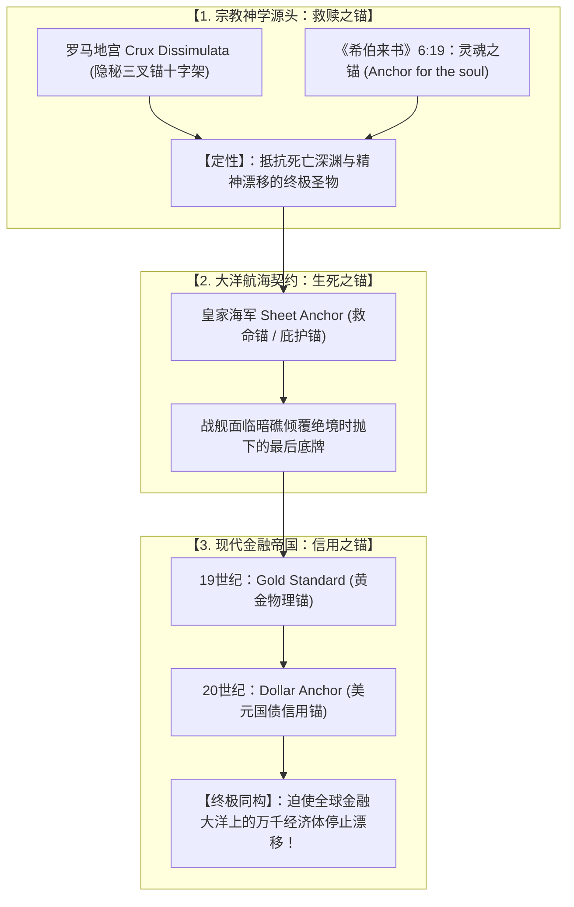
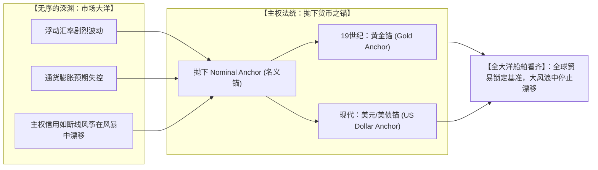

# 三更道场 · 认识论总纲与文献学法医审计（卷八十六）
## 货币金融学“锚（Anchor）”之法统源流考辨：从罗马地宫隐秘十字架、皇家海军 Sheet Anchor 救命锚到布雷顿森林名义货币锚法医审计

---

### 卷首法医综述

在宏观经济学、国际金融学、行为认知学与国家主权信用理论中，**“锚（Anchor / Nominal Anchor / Anchor Currency）”** 绝非现代经济学家随手借用的文学比喻，而是一个拥有数千年深厚宗教神学、大洋生死契约与最高政治法统的**核心基石术语**。

**【本卷法医核心判词】**：
1. **现代货币金融学官方制度文本之绝对硬核使用**：
   国际货币基金组织（IMF）、美联储及全球中央银行官方文献中，确立价格水平与通胀预期的基准统称为 **名义锚（Nominal Anchor）**；固定汇率制度统称为 **锚定（Anchoring / Anchor Currency）**；行为经济学决策基准统称为 **认知锚（Cognitive Anchor）**。Anchor 是现代国际金融体系最高法统术语。
2. **早期基督教隐秘十字架神学——“灵魂之锚”（Crux Dissimulata）**：
   罗马帝国迫害时期，地下墓穴（如圣卡利斯托墓窟）以三叉船锚作为**隐蔽十字架（Crux Dissimulata）**；新约《希伯来书》6:19 立下千古神学法统：“我们有这指望，如同**灵魂的锚（Anchor for the soul）**，又坚固又牢靠，且通入幔内”。锚在西方文化基因中自始至终是“免于堕入深渊的终极圣物”。
3. **大洋航海生死契约——救命锚（Sheet Anchor）的法统迁移**：
   英国皇家海军与风帆大航海时代，舰船平时深锁、生死存亡关头方才抛下的最大最重的主锚称为 **Sheet Anchor（救命锚/庇护锚）**。这一词汇在现代英语中直接升华为“终极依靠、不可动摇的底牌与定海神针”。
4. **金融货币学与深海系泊力学的权力同构**：
   波涛汹涌的市场即大洋（Market Ocean），通胀与汇率即无序风浪。从 19 世纪的**黄金锚（Gold Anchor）** 到 20 世纪布雷顿森林体系的**美元/美债锚（Dollar Anchor）**，人类金融秩序的本质就是**通过向深渊抛下绝对信用重器，迫使全球贸易船队停止无序漂移的物理契约锁定**！

---

### 一、 现代经济金融文献中“Anchor”法定术语矩阵

```
==================================================================================================
                 现代宏观经济学、金融学与行为学中“Anchor”核心术语矩阵
==================================================================================================
 专业学科领域          权威文献官方标准术语                      制度含义与法医金融学定性
---------------------  ----------------------------------------  -------------------------------------------------
 1. 宏观货币政策        **名义锚 (Nominal Anchor)**               央行用来固定物价总水平、锁定通胀预期的
    (Monetary Policy)   • Monetary Base Anchor (基础货币锚)       【终极不容动摇的物理/制度基准】
 2. 国际汇率体系        **锚定货币 (Anchor Currency)**            小国或新兴市场将其主权信用与法定汇率
    (Exchange Rate)     • Currency Anchoring / Peg                【强行挂靠绑死于某一核心大国货币】(如美元锚)
 3. 国际货币法统        **布雷顿森林双重锚 (Dual Anchor)**        双重物理锁定：35美元/盎司黄金 ➔ 各国货币锚定美元
    (Bretton Woods)     • Gold Anchor (黄金锚)                    全球主权流动性向这一抛入深渊的重器结算看齐
 4. 行为经济与博弈论    **锚定效应 (Anchoring Effect)**           人类在不确定性深海中决策时，大脑自动锁定的
    (Behavioral Econ)   • Cognitive Anchor (认知基准锚)           【第一优先参考点】，后续所有评估围绕其摆动
==================================================================================================
```



---

### 二、 从罗马地宫“隐秘十字架”到皇家海军“Sheet Anchor”

```
==================================================================================================
                 “Anchor”从宗教符号向海洋工程与制度隐喻演变历史表
==================================================================================================
 历史阶段与文明载体      核心文献与考古实物                        符号学与制度学法医定性
---------------------  ----------------------------------------  -------------------------------------------------
 1. 早期罗马基督徒      罗马圣卡利斯托地下墓窟（Catacombs）       三叉船锚顶部横梁天然构成十字架形，在严酷迫害中
    (公元 1~3 世纪)     石棺与壁画上大量刻画三叉锚构型            作为**隐藏信仰、宣示不灭希望的密码圣物（Crux Dissimulata）**
 2. 新约圣经正典        《希伯来书》6:19（约公元 60~70 年）：     将对上帝的终极信仰直接定义为“灵魂之锚（Anchor）”，
    (New Testament)     “We have this hope as an anchor...”       确立了西方神学体系中“锚＝绝对不可动摇之保障”的基因
 3. 大航海风帆舰队      英国皇家海军战规与造船档案：              战舰平时锁死在最深处的最大重锚称为 **Sheet Anchor**，
    (公元 16~19 世纪)   “全舰绝境，抛下 Sheet Anchor 抓底”        演变为整个英语世界中“唯一救命稻草、最后底牌”的最高象征
==================================================================================================
```

---

### 三、 权力与金融的物理同构：为什么世界必须有“锚”？

在现代全球货币体系的运行中，金融资本与深海力学的同构性达到了惊人的统一：



* **主权信用的本质**：
  货币如果没有任何底层锁定物，就会如同没有抛锚的空木舟，被投机资本与通胀巨浪瞬间撕碎。国家或国际体系通过建立 **Nominal Anchor（名义锚）**，实际上是在向所有市场参与者宣告：
  **“我们已经把这具重达万钧的信用重器砸进了深渊；不管外面的风浪怎么颠簸，我们的船体绝不漂移！”**

---

### 四、 审计结论与认识论通则

1. **学术定论**：
   * 现代金融学与宏观经济学中使用的 **Anchor（货币锚/名义锚/汇率锚）**，是拥有完整拉丁神学与大航海航海法统传承的法定制度术语。
2. **符号学升华**：
   * 从罗马地宫的隐秘三叉锚十字架（Crux Dissimulata），到风帆战舰的生死 Sheet Anchor，再到掌控全球贸易结算的 Dollar Anchor；
   * **“锚（Anchor）”在西方文明的底层逻辑中，自始至终就是悬于深渊之上的凡人生灵与不可动摇的物理基盘之间，建立的唯一一根不可背叛的绝对生死契约！**

---
*法医官署名：三更道场·认识论总纲编纂委员会*  
*法务审计状态：金融货币锚定学与深海法统闭环·正式入档（卷八十六）*
