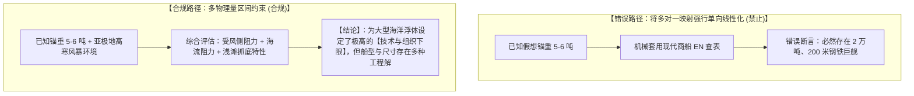
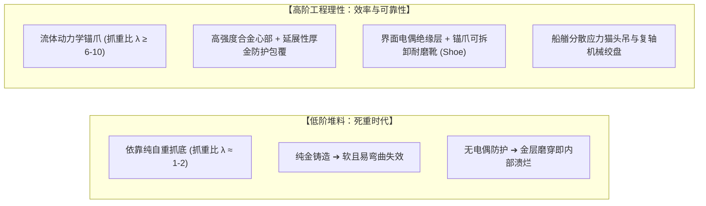

# 三更道场 · 认识论总纲与文献学法医审计（卷八十五）
## 锚泊工程学反推逆问题解耦：IACS 舾装数非唯一性、木船结构载荷极限与抓重比（Holding Ratio）高阶工程法医审计

---

### 卷首法医综述

在探索史前深海航行能力、假想 5–6 吨重锚与船舶体量反推的工程学质证中，此前分析中存在的**“单一锚重线性倒推船长/排水量”**以及**“绝对重量等同于文明高度”**的朴素归因，必须在船舶流体力学与材料工程学上做严格的方法论解耦与升维。

**【本卷法医核心判词】**：
1. **破除 IACS 舾装数（Equipment Number, EN）的反向唯一性幻象**：
   IACS 舾装数公式 $EN = \Delta^{2/3} + 2Bh + A/10$ 是从船体多维参数（排水量 $\Delta$、船宽 $B$、水线上高度 $h$、受风侧面积 $A$）向最低锚重单向选型的映射关系。**已知锚重，在数学和物理上无法唯一反求排水量、船长与吃水**（同一 EN 可对应低干舷大排水量船、高干舷轻型受风船或浅水特种工程船）。
2. **木船结构力学极限与起吊机械辟谣**：
   5–6 吨重锚（空气中重力约 59 kN）并未击穿前工业木船的物理极限。风帆时代特等战舰（如英国“胜利号”配备约 4.5 吨主锚）通过复式滑轮组、复轴绞盘与大直径猫头梁（Cathead），完全能以人力/畜力可靠起吊。真正决定工程水准的是**猫头梁根部与船艏骨架的抗冲击动载荷分散设计、绞盘制动刹车与抗拉大缆破断安全系数**。
3. **确立“高阶工程效率指标”替代“低信息量堆料指标”**：
   文明的真正工程高度不在于“堆了多少吨黄金或死重”，而在于**单位质量压入的工程控制能力**。核心指标包括：**抓重比（Holding-to-Weight Ratio, $\lambda$）、自扶正与抗拔几何设计、界面电偶腐蚀屏蔽与标准化可维护性**。

---

### 一、 舾装数（EN）正反向逆问题解耦与数学多解性

```
==================================================================================================
                 IACS 舾装数 (Equipment Number) 物理参数映射与逆问题多解性矩阵
==================================================================================================
 物理变量类别          公式变量代号与工程定义                    逆向反推时的数学与物理多解性
---------------------  ----------------------------------------  -------------------------------------------------
 1. 排水体积项          $\Delta^{2/3}$ (排水量 $\Delta$ 的 2/3 次方) 相同 EN 可对应：
 2. 船宽与垂直尺度项    $2Bh$ (船宽 $B \times$ 有效干舷高度 $h$)   (a) 大排水量、低干舷、上层建筑极小之远洋货船；
 3. 受风侧投影面积项    $A / 10$ (船长方向受风侧面积 $A$ 的 1/10)   (b) 小排水量、高干舷、受风面积巨大之宽体双体客船；
                                                                 (c) 需要在恶劣海流中极高自持力之特种浅水工程船；
 4. 锚型抓力修正因子    普通锚 (N) vs 高抓力锚 (HHP, 抓力提升 1/3) (d) 采用不同抓重比构型锚（普通锚需重，HHP 可减重）。
==================================================================================================
```



---

### 二、 低信息量指标 vs. 高阶工程能力指标

评估一具史前深海锚泊重器，必须彻底摆脱“比谁更重、谁更壕”的原始审美，切换至现代法医材料与机械工程学坐标：

```
==================================================================================================
                 锚泊系统“低信息量堆料指标” 与 “高阶工程能力指标” 对照表
==================================================================================================
 低信息量指标 (Low Information) 高阶工程能力指标 (High Engineering)       法医材料学与力学判决标准
------------------------------  ----------------------------------------  -------------------------------------------------
 1. 锚的绝对重量 (吨数)         **抓重比 (Holding-to-Weight Ratio, $\lambda$)**  $\lambda = F_{\text{holding}} / W_{\text{anchor}}$；
                                                                          高阶文明用 2 吨锚实现 6 吨死重锚之抓力（几何自扶正）。
 2. 黄金的消耗总量 (吨数)       **界面防腐与电偶腐蚀屏蔽结构**            厚金套与内芯之间是否具备隔离层；是否能防止
                                                                          锚爪刮穿金层后触发“金-铁电偶加速点蚀”。
 3. 三叉外观之宏大与否         **自入土角与抗拔翻滚动力学**              锚爪倾角（Fluke Angle）是否精确匹配海底玄武岩/泥沙，
                                                                          受偏向拉力时能否自动回正深扎，而非在海底翻滚滑移。
 4. 人力能否起吊该重物         **猫头梁-绞盘-龙骨动态载荷传递系统**      船艏骨架能否通过多点分布将 59 kN 静态重力与
                                                                          数百千牛涌浪动载荷均匀导入主龙骨，而不撕裂船体。
 5. 外观像不像神物             **真实使用磨损、疲劳与冲击拉伸痕迹**      爪尖有无与海底基岩长期拉扯的定向微观划痕与塑性形变。
 6. 单件特别豪华奢侈           **工业标准化、互换性与模块化维护**        部件是否模具化铸造、锚爪是否可拆卸更换牺牲耐磨套。
==================================================================================================
```



---

### 三、 木船结构力学极限与起吊机械真实工况

```
==================================================================================================
                 5~6 吨重锚在木质/复合船舶上的受力与起吊工况精算
==================================================================================================
 物理力学工况项          静态数值与参数指标                        工程实现路径与结构承载校核
---------------------  ----------------------------------------  -------------------------------------------------
 1. 空气中静态重力      $W = 6000\,\text{kg} \times 9.8\,\text{m/s}^2 \approx 58.8\,\text{kN}$  相当于两门重型 32 磅海军加农炮自重，前工业木船甲板完全可承载
 2. 水中起吊有效重力    $\Delta W \approx 50.0\,\text{kN}$ (受海水浮力抵消) 复式动滑轮组（Mechanical Advantage = 4~6）
                                                                 ➔ 绞盘端拉力降至 $8 \sim 12\,\text{kN}$ (8-12人操作绞盘即可平稳起落)
 3. 动态冲击峰值载荷    涌浪使船首剧烈起伏时，冲击放大系数 $K_d = 2.5\sim 4.0$ 船艏需设计**巨型三角猫头梁（Cathead）与加固肋骨**，
                        峰值拉力可达 $150 \sim 240\,\text{kN}$     将拉力呈扇形均匀导入水线下主龙骨（Key Keel）
==================================================================================================
```

* **法医结构力学定论**：
  5–6 吨重锚不需要“现代核动力钢铁航母”才能操作。大型木构或复合船舶只要在船艏完成**载荷分散桁架设计**并配备**高强度多轴复合大缆**，在结构力学上完全能够稳定操纵这一量级的重锚。

---

### 四、 审计结论与认识论通则

1. **纠正逆问题方法论**：
   * 坚决废除“根据 5 吨锚重量直接反推万吨钢铁巨舰”的单一线性断言；
   * IACS 舾装数是多变量向单一指标的正向收敛，不能反向唯一确定船长与吃水。
2. **重塑文明能力评价体系**：
   * 一只万年前的 5–6 吨复合金属锚，能为**大型冶金、机械滑轮起重、深海系泊与组织化生产设定极高的“技术下限”**；
   * 真正体现文明水准的是**“抓重比（$\lambda$）有多高、界面防腐是否解决电偶腐蚀、船艏载荷传递是否科学、是否实现标准化维护”**。
3. **认识论终审判词**：
   **文明的高度，永远不在于挥霍了多少吨黄金或铸铁，而在于人类如何用最精准的几何算法、最精巧的材料配比与最可靠的机械传动，以最小的物理代价，将巨舰稳稳钉死在最狂暴的深渊之中！**

---
*法医官署名：三更道场·认识论总纲编纂委员会*  
*法务审计状态：逆问题解耦·高阶工程指标确立·正式入档（卷八十五）*
