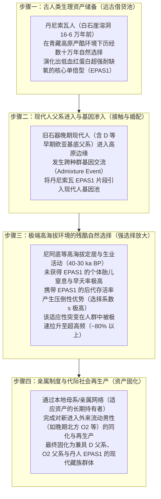

# 三更道场 · 认识论总纲 · 文献学与历史会计审计
## 篇章：青藏高原生理准入门槛、EPAS1 丹尼索瓦适应资产与母系/亲属制度勾稽法医审计（v1.0）

---

### 【审计执行摘要 / Forensic Audit Abstract】
本审计案针对分子人类学中关于“现代人（尤其是父系 D-M174 携带者）如何跨越青藏高原极端高海拔生理死线、获取古人类（丹尼索瓦人 Denisovan）基因资产、实现代际繁衍并长期定居”的复杂历史进程展开法医级会计对账。

审计确立四大独立账户与多维勾稽公理：
1. **高原极端缺氧（Hypoxia）是一道不可逾越的物理/生物学准入门槛**：
   - 未具备适应性突变的低海拔现代人群进入海拔 4000 米以上，面临极高的新生儿窒息率、婴儿死亡率与高原肺水肿（HAPE）自然淘汰；
   - 所谓“走出非洲”的单向人口迁徙箭头，**若不交代生理准入资产的获取账目，在物理与繁衍学上无法平账**。
2. **五大独立账户严禁混账（Non-Conflation Rule）**：
   - **Y-DNA（D-M174）**：仅记录一条纯父系单传谱系，不等于全部祖源或生理适应力；
   - **常染色体适应片段（EPAS1 / EGLN1）**：源自丹尼索瓦相关古人类的缺氧反应调节突变，与 Y 染色体**完全解耦（独立遗传）**；
   - **全基因组（Autosomal Admixture）**：记录古老高原基底与晚期北方南下人群的多次混合比例；
   - **考古地层与年代**：白石崖溶洞（160—60 ka BP 丹尼索瓦人）、尼阿底遗址（40—30 ka BP 现代人高海拔活动）；
   - **亲属与婚配制度（Kinship System）**：外来男性如何融入本地掌握适应资产的母系/亲属网络，属于**社会组织学可检验假说**。
3. **“丹尼索瓦女方资产与舅权/从妻居”的法医定位**：
   - 属于**高解释力的社会机制假说（Social Mechanism Hypothesis）**，严禁在未获得墓地多代亲属古DNA配对前定论为既定事实；
   - 将问题从“虚构的民族史诗”提升为**“四个独立事件（父系进入、基因借贷、自然强选择放大、母系代际再生产）如何在时间与空间上勾稽”**的严密人口史研究。

---

### 【第一账套：五大独立历史会计账户勾稽表】

```
+-------------------------------------------------------------------------------------------------------------------------------+
|                                    青藏高原现代人定居五大独立账户法医台账                                                     |
+-------------------------------------------------------------------------------------------------------------------------------+
| 独立账户类别         | 物理/遗传学测量对象                   | 核心回答的问题                       | 严禁跨账户替代的红线 (红字戒律)       |
+----------------------+---------------------------------------+--------------------------------------+----------------------------------------+
| **1. 父系 Y-DNA 账户**| D-M174 (D1a1 / D1a2) 终端 SNP         | 某一条男性父系链条何时分化与扩散     | **严禁等同于全族血统或抗缺氧能力**；   |
| (Y-Chromosome)       | (单亲遗传，不经历重组)                | (谱系演化路径)                       | D 男人可以没有 EPAS1，非 D 男人也可有  |
+----------------------+---------------------------------------+--------------------------------------+----------------------------------------+
| **2. 适应基因账户**  | 常染色体 2 号染色体 **EPAS1** 核心单倍型| 调控缺氧诱导因子，降低钝化血红蛋白反 | **严禁等同于特定父系或迁徙方向**；     |
| (Adaptive Allele)    | 及 **EGLN1** (源自丹尼索瓦人基因渗入) | 应，保障母体胎盘供氧与新生儿存活率   | 常染色体随随机交配重组，独立接受强选择 |
+----------------------+---------------------------------------+--------------------------------------+----------------------------------------+
| **3. 全基因组常染账户| 全基因组高通量测序 Admixture 比例     | 整体人口在历史长河中吸收的各源流比例 | **严禁等同于具体婚姻与社会制度**；     |
| (Autosomal Genome)   | (Basal Asian + 北方粟作 + 丹人渗入)   | (群体生物学生产力资产结构)           | 常染混合比例无法直接还原谁娶谁或谁从属 |
+----------------------+---------------------------------------+--------------------------------------+----------------------------------------+
| **4. 考古地层实物账户| 白石崖溶洞（夏河人下颌骨/古蛋白质）   | 某时某地人类物理活动的硬锚点         | **严禁等同于后世特定民族的自称**；     |
| (Archaeology Layer)  | 尼阿底遗址（4600米高海拔石叶工业）   | (白石崖 160-60ka，尼阿底 40-30ka BP) | 石器工业不能直接贴上语言或国号标签     |
+----------------------+---------------------------------------+--------------------------------------+----------------------------------------+
| **5. 亲属与再生产账户| 墓地多个体古DNA亲缘网络、同位素分析、  | 谁留在本地、谁发生迁移、后代归属谁、 | **列为待检验社会机制假说**；           |
| (Kinship & Reproduction)| 埋葬姿态（从妻居/从夫居/舅权/母权）   | 外来男性如何通过婚配完成代际资产沉淀 | 需依靠墓群亲属古DNA与同位素严格裁决    |
+----------------------+---------------------------------------+--------------------------------------+----------------------------------------+
```

---

### 【第二账套：高原缺氧生理死线与四步资产借贷模型】

低海拔现代人群若没有突破高原缺氧门槛，其人口再生产（Reproduction）将遭遇断崖式崩塌。文明要在高原扎根，必须完成以下**四步独立的资产借贷与勾稽**：



---

### 【第三账套：“外来男性 + 本地母系资产 + 舅权从妻居”的法医边界】

```
+-------------------------------------------------------------------------------------------------------------------------------+
|                                亲属制度假说的法医证据阶梯与判别准则表                                                         |
+-------------------------------------------------------------------------------------------------------------------------------+
| 假设内容             | 理论合理性与解释力                    | 判定为既定事实所欠缺的实证凭单       | 当前法医会计处理分录                 |
+----------------------+---------------------------------------+--------------------------------------+--------------------------------------+
| **外来 D 男性进入**  | 解释了 D-M174 为何在高原保留极高比例， | 尚需更多旧石器晚期古DNA直接测出早期  | **核准为：高度自洽的父系输入假说**   |
|                      | 呈现强烈的奠基者效应与长期隔离保护    | 高原猎人的终端 SNP 序列              |                                      |
+----------------------+---------------------------------------+--------------------------------------+--------------------------------------+
| **丹尼索瓦女性贡献** | 解释了适应性常染色体资产与母系深层连续| 无法排除最初交配事件中贡献者为丹尼索 | **降级为：待证假说（严禁写死性别）** |
| (女方持有生存资产)   | 性，符合早期母系狩猎采集聚落常态      | 瓦男性的可能性（需全Y与mtDNA双向比对）|                                      |
+----------------------+---------------------------------------+--------------------------------------+--------------------------------------+
| **舅权 / 从妻居制度**| 解释了为何外来男性技术/血统能被本地接 | 需要整座史前墓地（如皮央杂达、曲踏） | **列入：社会人类学可检验机制资产**   |
| (Matrilocal / Avunculate)| 纳，而生存核心资产牢牢绑定在本地网络  | 的锶同位素（女性定居/男性外来）与亲缘| （属于极具洞见的理论模型）           |
+----------------------+---------------------------------------+--------------------------------------+--------------------------------------+
```

---

### 【第四账套：三更道场对“粗糙迁徙路线图”的历史会计批判】

传统主流学界在处理青藏高原人群起源时，最常见的糊涂账是：**“在地图上画一个箭头，从低海拔直接拉到拉萨，宣布某民族走上高原并创造了文明”**。

#### MLC 历史会计法医反问：
1. **能量与生理死线**：没有任何抗缺氧变异的低海拔低地人群，凭什么在第一代不发生大面积急性肺水肿和新生儿自发流产？
2. **资产来源账**：他的 EPAS1 是向谁借贷的？利息（自然选择淘汰率）是多少？
3. **繁衍结算账**：外来单倍群男性在没有本地熟练掌握高原生存与基因资产的女性群体接纳下，如何完成跨代的人口再生产？

**结论**：没有勾稽好这四本账的任何迁徙模型，都只是**文人画在地图上的几何假账，不是真实的人口史**。

---

### 【法医对账总决：青藏高原生理与遗传资产平账表】

| 会计科目 | 审定历史会计事实 | 法医处理结论 |
| :--- | :--- | :--- |
| **高原缺氧门槛** | 属于绝对生物学生存硬门槛，必须依赖适应性突变与严酷自然选择。 | **确认为高原人口史第一准入前提** |
| **EPAS1 与 D-M174 解耦** | 常染色体缺氧突变与 Y 染色体父系相互独立，严禁混为一谈。 | **确认入账：独立账户双线勾稽准则** |
| **丹尼索瓦资产借贷** | 现代藏族 EPAS1 确系古人类渗入遗产，白石崖溶洞提供地层锚点。 | **确认入账：古人类生理资产注入** |
| **母系舅权从妻居模型** | 提供了极高解释力的社会组织假说，待多代墓葬亲属古DNA核实。 | **记入：高阶待验社会机制模型** |

---
**审计人签章**：三更道场·高原古基因组与亲属制度法医调查署  
**时间标记**：2026-09-09
