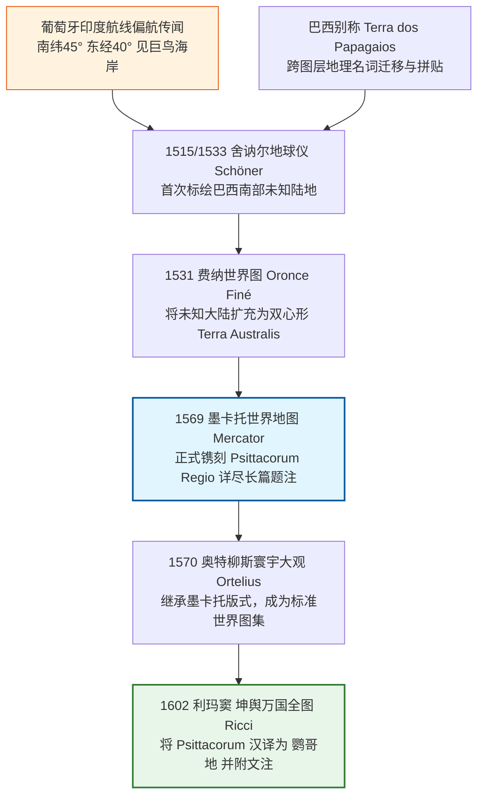
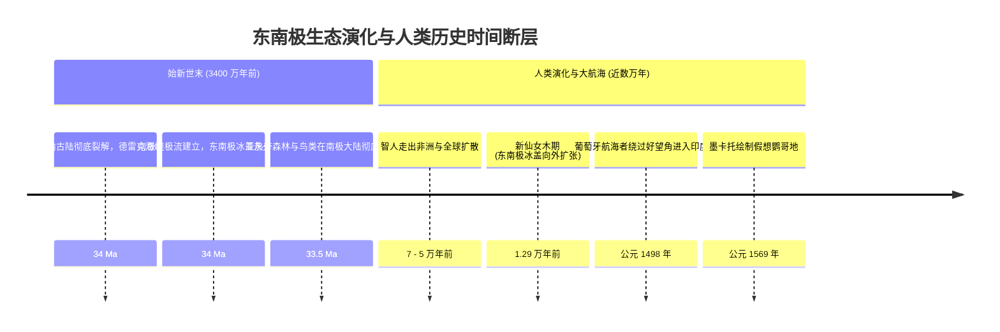
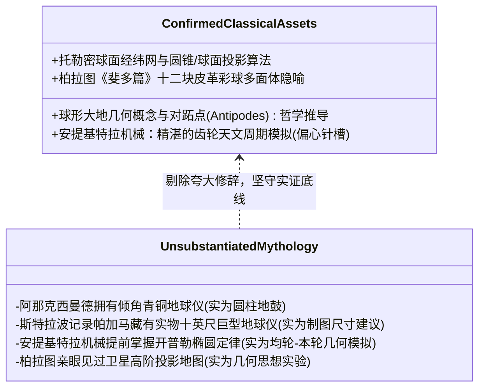

# 三更道场·认识论总纲·文献学与历史会计审计
## 卷四十四：鹦哥地（Psittacorum Regio）地图谱系、假想南方大陆与文艺复兴制图信息清算法医审计（v1.0）

---

### 摘要与法医审计宪章

本卷审计旨在对 16 至 17 世纪欧洲及汉译地图网络中频繁出现的**“鹦哥地（Psittacorum Regio / 鹦鹉之地）”**、**“假想南方大陆（Terra Australis Incognita）”**、极射附图生成机制以及古希腊地理学认知地层进行严格的历史文献学、古生态学、航海日志与计算制图学法医清算。

针对“南极存在万年前冈瓦纳古森林记忆、极射附图证明史前卫星视角、麦哲伦持有完美古航图”等跨账期浪漫想象，本审计推翻将“信息流动与传闻拼图”直接等同于“史前物理实测”的逻辑跳跃，正式确立**“制图信息清算网络模型（Cartographic Information Clearing Network）”**：

> 1. **“鹦哥地”的文献学与生态学硬账**：
>    - 墨卡托 1569 年图注明确标注其位于**南纬 45°、东经 40°**（温带假想大陆北缘，远离 66.5°S 南极圈）；
>    - 东南极冰盖主体在约 3400 万年前（渐新世初）已封冻成型，**“人类保留冰封前南极鹦鹉森林记忆”在古生物与地质年代学上绝不成立**；
>    - “鹦哥地”是一则源自葡萄牙航海者偏航报告、可能叠加巴西（*Terra dos Papagaios*）跨图层传闻、并在“南方大陆平衡论”先验下被制图家补全的**虚拟航海信息增生**。
> 2. **极射投影（Polar Stereographic）与麦哲伦航迹的物理去神话化**：
>    - 极区圆形附图是托勒密球面几何与天球仪网格变换的**纯数学投影产物**（无需肉身飞天或卫星视角）；
>    - 麦哲伦太平洋航线长达三个多月未遇补给岛屿、因严重低估大洋宽度导致饥饿减员，其惨烈实态反向确证其**绝未掌握标有群岛补给点的史前航海图**。
> 3. **古典希腊地理认知边界清算**：
>    - 斯特拉波所谓“十英尺地球仪”是制图尺寸建议而非帕加马实物馆藏；阿那克西曼德模型为圆柱地鼓而非倾角地球仪；安提基特拉机械代表卓越的天文周期模拟，但不能自动跨期记为全球海岸测绘资产。
> 4. **认识论范式升维**：
>    - 地图不是“实地抓拍照片”，而是**“航海商业情报、古典理论、传闻补全与制图模板相互清算的复杂衍生品”**。

---

### 第一章 “鹦哥地”文献谱系与跨图层流变台账

追查“鹦哥地”从 1515 年舍讷尔地球仪到 1602 年利玛窦《坤舆万国全图》的流变链条：

#### 1.1 鹦哥地文献题注与地理坐标法医对账表

| 制图节点与时代 | 地图文献标注名称 | 标称地理位置与经纬度 | 题注核心叙事内容 | 历史法医真实定性 |
| :--- | :--- | :--- | :--- | :--- |
| **墨卡托（1569）** | *Psittacorum regio* | **南纬 45°，东经 40°** （好望角以东之南印度洋） | 称葡萄牙人在开往卡利卡特途中遭西南风吹至此地；因见巨鸟而命名；沿岸两千英里不见尽头。 | **虚构温带陆缘**：远离南极圈，属于航海传闻与先验南方大陆的补全拼图。 |
| **奥特柳斯（1570）** | *Psittacorum regio* | 位于巨大 *Terra Australis* 向北突出的温带海角 | 沿袭墨卡托数据，作为畅销图集向全欧知识界定型发行。 | **模板复制**：制图工坊之间的版式继承，非独立新发现。 |
| **利玛窦（1602）** | **鹦哥地** | 位于“墨瓦蜡泥加”（Magellanica）巨大南方陆地北缘 | 汉译注：“此地去亚墨利加不远，故其人与亚墨利加无异……多有大鹦哥”。 | **知识中转与汉化**：将欧洲文艺复兴南方大陆假说全量编译输入晚明中国。 |

---

### 第二章 古态学与地质年代学硬账：三千万年时间断层

在历史会计中，严禁发生将“数千万年前的地质古生态”倒填为“人类目击记忆”的严重违规：

- **地质物理铁律**：东南极森林与鸟类的繁茂属于始新世（>34 Ma），此时远古灵长类尚未分化，现代智人根本不存在；
- **法医判定**：所谓“鹦鹉繁茂的温暖南极”纯粹是因为 16 世纪假想的 *Terra Australis* 是一块**延伸至南纬 20°–40° 的温带大陆**，制图者自然会为其赋予亚热带植被与巨鸟生态。生态悖论源于现代人将假想大陆强行套在 90°S 冰封南极点上产生的“关公战秦琼”式误会。

---

### 第三章 极射投影与麦哲伦航海实态法医去神话化

#### 3.1 极射附图与航海实况法医对照表

| 考察对象 | 浪漫主义神话断言 | 严格法医科学与航海档案还原 | 认识论判定 |
| :--- | :--- | :--- | :--- |
| **《坤舆万国全图》极射附图** | “展现了只有人造卫星才能拍摄到的极地冰盖与凹陷。” | **主图经纬数据的数学换算**：利用球面极射投影公式将假想南方大陆重置为极区视角，属同源数据二次渲染。 | **严禁重复计票**：换算后的附图与主图是同一份假想数据，不能算作两笔证据。 |
| **麦哲伦太平洋盲航航迹** | “精准避开所有危险暗礁，完美穿越大洋，证明手握古航图。” | **航海日志还原**：因缺少海图，完全无法预测距离；靠吃皮带、木屑与老鼠充饥，全队减员过半。 | **彻底推翻古图说**：灾难性的后勤规划是标准盲航特征，彻底否认先验地图存在。 |
| **Australia 名词流变** | “英国人从南极洲头上偷走了 Australia 这个古老名字。” | **概念债权合法清算**：*Terra Australis*（未知南方地）经马修·弗林德斯（1814）建议，被正式确权给新发现的独立澳洲大陆，极地大陆随后定名 Antarctica。 | **正常概念转移**：悬空地理债权在现实地理发现中的核销与重新指定。 |

---

### 第四章 古典希腊地理学资产地层法医核算

对古希腊哲学文献与机械工程遗存进行严格的资产界定与分账：

---

### 结语与法医终审意见

> **法医总评**：
> 地图学史是一部**人类在极其有限的视野与数据条件下，利用数学几何、商业传闻与理论信念，对未知世界进行拼图与清算的史诗**。
> 
> 1. **“鹦哥地”不是南极神迹，而是 16 世纪航海传闻跨图层迁移、并在温带假想南方大陆北缘完成逻辑自洽的制图产物**；
> 2. **极射投影是球面几何的数学胜利，麦哲伦的苦难航迹则是未名大洋盲航的血泪实证**；
> 3. **将这些伪断言从文本中剔除，不仅没有削弱三更道场的理论魅力，反而让“跨文明制图信息清算网络”展现出震撼人心的历史真实力量**。
> 
> 这一卷审计为全套《认识论总纲》树立了对待古代地图、文献与传闻的最高法医鉴证标杆！

---
*记录人：三更道场·历史会计与认识论法医审计署*  
*核准状态：正式正典立项（Canonical Approval Passed）*
