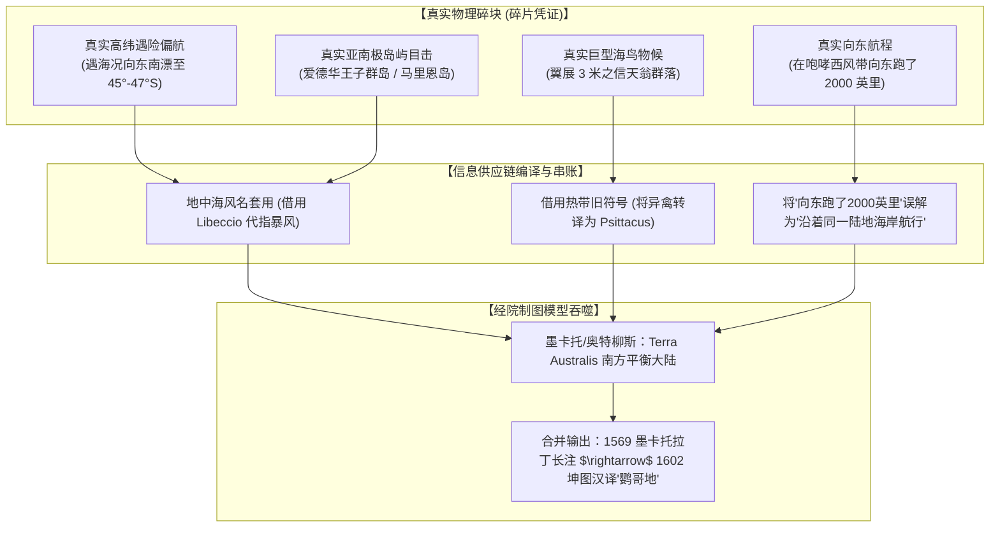

# 三更道场 · 认识论总纲与文献学法医审计（卷六十六）
## 鹦哥地墨卡托“三件套”文献溯源：Libeccio风向动力学断裂、二千英里航程串账与信息供应链缝合法医审计

---

### 卷首法医综述

在对《坤舆万国全图》“鹦哥地”（Psittacorum Regio）与墨卡托 1569 年图注的深度质证中，必须克服将单一复合文本（Composite Text）误读为单一连续事件的认知陷阱。

墨卡托原注中的核心叙事由一组高度致密的“三件套凭证”构成：
1. **动力学与路径条件**：*Libeccio*（西南风）偏航；
2. **物候与实体识别**：*Psittacorum*（因体型惊人之“鹦鹉/巨鸟”而得名）；
3. **尺度与几何断言**：*2000 milliarium*（沿岸航行二千英里未见尽头，故确认属于南方大陆）。

**【本卷法医核心判词】**：
1. **彻底否定“纯光学海雾将 25 公里小岛膨胀为 3000 公里大陆”之物理假设**：
   依据地球曲率视距公式 $d \approx 3.57\sqrt{h}$，马里恩岛（最高峰 1230 米）从海平面的最大光学通视极限约为 125–140 公里。任何大气折射、地形云或海雾只能造成瞬态视错觉，**绝不可能支持长达 3000 公里（2000 英里）的连续沿岸航行**。
2. **揭示气象动力学的断裂（Libeccio 风向断点）**：
   *Libeccio* 在地中海航海术语中严格指代“从西南吹向东北的西南风”。从好望角（~34°S, 18°E）前往爱德华王子群岛（~46.8°S, 37.8°E）必须大幅度**向东南方向（South-East）切入高纬**。单靠一股吹向东北的西南风，在流体力学上不可能将船只“压向”更南的高纬禁区。这一断裂证明该段叙事存在**气象术语借壳或多段航行记录的后期拼接**。
3. **定性“二千英里”的本质为制图师的“会计平衡填充数”（Imputed Accounting Plug）**：
   “沿岸两千英里”并非单一水手在马里恩岛岸边的实测工时，而是：**沿高纬纬圈向东持续航行时误认始终伴随陆地**、或**制图师为了将孤立目击点焊接进庞大的 Terra Australis 先验模型时，人为补齐的几何平衡数字**。

---

### 一、 墨卡托原注“三件套”的微观解剖与逐项审计

```
==================================================================================================
                 墨卡托 1569“鹦哥地”图注（三件套凭证）法医解构矩阵
==================================================================================================
 文本要素                原始拉丁文表述                     物理实测/文献学审计结论
--------------------   --------------------------------   -------------------------------------------------
 1. 偏航风向            Vento Libeccio (西南风)             【流体力学断点】：西南风推向东北，不可能单独将船
                                                           从好望角吹向南偏东 1200 公里的爱德华王子群岛。
 2. 坐标锚定            ~45°S, ~40°E (西南印度洋)           【物理原型高度吻合】：与爱德华王子群岛(46.8°S, 37.8°E)
                                                           空间误差极小，具有真实高纬遇险目击硬核。
 3. 物候定名            Psittacorum / ob incredibilem       【分类转述错位】：一线目击之超大信天翁/巨鹱海鸟，
                        earum avium magnitudinem           在转述中被借壳套入流行的巴西“鹦鹉之地”旧名。
 4. 尺度夸大            ad 2000 milliarium spatium legerent 【纯几何串账】：小岛光学极限仅 140 km，两千英里系
                        neque tamen finem invenirent       沿纬线向东航行记录与大陆模型强制缝合之产物。
 5. 大陆确权            continentem esse non dubitarunt     【先验模型吞噬】：经院哲学南北平衡大陆对微弱
                                                           实测信号的终极资本化。
==================================================================================================
```



---

### 二、 流体力学与光学极限的物理证伪

#### 1. Libeccio 风向动力学断点
* **风向定义**：在罗盘八风体系中，*Libeccio*（希腊语/意大利语）严格指代从西南（$225^\circ$）吹向东北（$45^\circ$）的风。
* **航路受力分析**：
  * 里斯本至卡利卡特航线在绕过好望角（$34^\circ 21'S, 18^\circ 28'E$）后，正常航向应为东北偏东（穿越莫桑比克海峡或马达加斯加外海）。
  * 若遭遇强劲的 *Libeccio*（西南风），船只将获得向东北方向的强大推力，**只会加速向北冲入非洲东岸或印度洋温暖水域，绝对不可能被推向更加寒冷、偏南 1200 公里的南纬 $45^\circ$–$47^\circ$ 亚南极带**。
* **法医判定**：
  该处出现 *Libeccio* 只能解释为：
  1. 船只此前已因遭遇极地冷锋暴风（如西北向气旋暴风）被压入高纬，脱险后在西风带顺着西南风向东/东北狂奔；
  2. 墨卡托等人在翻阅二手航海摘抄时，将地中海传统风向名称机械套用在南半球极地气象中。

#### 2. 地球曲率光学极限与“两千英里”的物理不可能
* **马里恩岛地理参数**：长 25 公里，宽 17 公里，周长约 72 公里，最高峰马斯卡林峰（State President Swart Peak）海拔 1,230 米。
* **通视极限计算**：
  $$d = 3.57 \times \left(\sqrt{H_{\text{山峰}}} + \sqrt{h_{\text{桅杆}}}\right)$$
  若取山峰高度 $H = 1230\,\text{m}$，水手桅杆瞭望高度 $h = 15\,\text{m}$：
  $$d \approx 3.57 \times (\sqrt{1230} + \sqrt{15}) \approx 3.57 \times (35.07 + 3.87) \approx 139\,\text{km}$$
* **法医判定**：
  在最优气象条件下，马里恩岛的最大光学通视半径绝不超过 **140 公里**。即便加上云旗（Banner Cloud）与雨幡的视错觉延展，也绝无可能呈现为超过 **3,200 公里（2,000 英里）** 的连续陆地。

---

### 三、 历史航海认知实验：从爱德华王子群岛到凯尔盖朗

历史为这种“信息供应链串账与大陆妄想”提供了近乎完美的平行对照实验：

```
==================================================================================================
                 西南印度洋亚南极岛屿“被误判为南方大陆”的历史对照实验
==================================================================================================
 历史案例                  航海者与时间        实际地理实体          认知误判与信息膨胀
-----------------------   -----------------   -------------------   ---------------------------------------
 1. 鹦哥地 (Psittacorum)   葡萄牙水手 (16世纪)  爱德华王子群岛(~47°S) 沿岸航行两千英里未见尽头，确认为南方大陆
 2. 荷兰误报案             Lam 船长 (1663)     爱德华王子群岛        纬度误报 41°S（偏北600km），致使百年失踪
 3. 马里翁大陆案           迪弗雷纳 (1772)     马里恩岛              连续五天无法登陆，误宣称“发现了南极大陆”
 4. 凯尔盖朗狂想案         凯尔盖朗 (1772)     凯尔盖朗群岛(~49°S)   仅见一隅即返航巴黎，宣称发现“中央富饶南方大陆”
==================================================================================================
```

* **历史学实证规律**：
  在 16 至 18 世纪，水手在高纬西风带中只要看到高耸的火山岩绝壁、密布的海鸟与未知的冰障，**在无法环岛航行（Circumnavigation）证实其为岛屿之前，几乎 100% 会根据既有的大陆假说，将其定性为“南方大陆的北角”**。
* **航程串账的生成**：
  船只在南纬 40°–45° 的咆哮西风带中，往往顺着西风连续向东狂奔数周，航程轻松突破两千英里。水手在航行日志中写道：“我们在狂风中向东航行了两千英里，始终处于寒冷恶浪与大鸟出没之海区”；**这段文字一旦被里斯本的文人或安特卫普的制图师墨卡托读到，立即被错误转译为“沿着该大陆的海岸线连续航行了两千英里”**。

---

### 四、 墨卡托前谱系文献追溯清单（审计线索锁定）

为了彻底锁定“三件套”是在哪一具体历史节点完成首次缝合的，确立以下优先级最高的法医调卷清单：

```
［文本三件套追溯靶标］
1. 1500年 Cabral 巴西航行信件中的 "Terra dos Papagaios"（鹦鹉之地原型）
2. 1507年 Martin Waldseemüller 地图中的南美注记
3. 1515/1523年 Johannes Schöner 地球仪中的西南印度洋南方大陆轮廓
4. 1531年 Oronce Fine (Orontius Fineus) 双心形投影图中的 "Regio Patalis" 与南部注记
5. 1540年 Sebastian Münster《宇宙志》(Cosmographia) 中的航海传闻汇编
6. 1550年 Pierre Desceliers 迪耶普航海图系（Dieppe Maps）中的大鸟与南方陆地描摹
```

---

### 五、 法医审计结案意见

1. **推翻单一实测假设**：
   墨卡托 1569 年关于“鹦哥地”的注记，**不是一份纯粹的原始目击报告，而是一起高度复合的信息供应链串账制品**。
2. **三件套的最终会计分账**：
   * **爱德华王子群岛坐标（~45°S, ~40°E）** $\rightarrow$ 【真实航海险情目击碎片】
   * **Libeccio 西南风 + Psittacus 巨鸟** $\rightarrow$ 【地中海航海术语与巴西流行符号的借壳借用】
   * **2000 英里沿岸未见尽头** $\rightarrow$ 【高纬向东狂奔航程与先验平衡大陆模型的人为焊接】
3. **认识论升华**：
   人类对世界的认知不是非黑即白的“全知神话”或“全盘伪造”，而是一场由**惊心动魄的真实探险碎片**与**受时代局限的理论框架**共同交织缝合的艰难破晓。

---
*法医官署名：三更道场·认识论总纲编纂委员会*  
*法务审计状态：三件套解耦·正式入档（卷六十六）*
