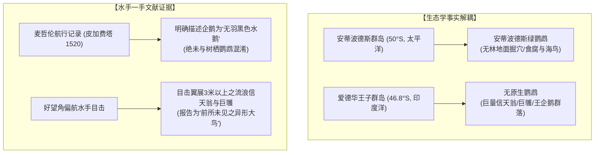

# 三更道场 · 认识论总纲与文献学法医审计（卷六十四）
## 鹦哥地生物地理学反直觉考辨：亚南极鹦鹉生态、爱德华王子群岛物理坐标对齐与信息供应链多重错配法医审计

---

### 卷首法医综述

在探索《坤舆万国全图》“鹦哥地”（Psittacorum Regio）的物理原型与物候成因时，关于高纬亚南极海域生态、水手鸟类识别能力以及坐标定位的讨论，极易陷入两大常识性思维误区：
1. **常识误区一**：“高纬无林木岛屿在生物地理学上绝对不可能有原生鹦鹉”；
2. **常识误区二**：“水手智商低下，在现场直接把企鹅叫成了鹦鹉”。

**【本卷法医核心判词】**：
1. **确立反直觉的生物地理学生态基准**：新西兰亚南极安蒂波德斯群岛（Antipodes Islands，接近南纬 50°）确有不依赖树木、在地面筑巢捕食的无林原生安蒂波德斯鹦鹉（*Cyanoramphus unicolor*）。**“无森林 $\neq$ 生态上绝无鹦鹉”**。但克罗泽群岛与爱德华王子群岛所属的印度洋亚南极生物区系中，确无鹦形目记录。
2. **精确定位物理原型坐标——爱德华王子群岛（Prince Edward Islands）**：
   * 墨卡托 1569 年图注坐标为**南纬 45°、东经 40° 附近**；
   * 克罗泽群岛位于东经 50°–52°（偏东约 900 公里）；
   * **爱德华王子群岛（马里恩岛与爱德华王子岛）位于南纬 46°38'–46°53'、东经 37°35'–37°55'**，与墨卡托注记之坐标网格几乎严丝合缝。
3. **法医解构“信息供应链三重错配”模型**：
   水手在现场并没有“把企鹅当成鹦鹉”的智商崩塌，而是**“观测端碎片报告 $\rightarrow$ 二手转述分类泛化 $\rightarrow$ 地名库旧名借壳 $\rightarrow$ 经院制图师大陆估值模型”**的多级供应链级联错配。

---

### 一、 生物地理学反直觉实证与亚南极鸟类区系



#### 1. 亚南极鹦鹉的生态事实
* **安蒂波德斯鹦鹉（*Cyanoramphus unicolor*）**证明了鹦形目演化出适应亚南极狂风、无树苔原环境的可行性。它们在泥炭草丛中穿行，甚至捕食海燕雏鸟。这打破了“鹦鹉只能生活在热带雨林树梢”的朴素认知。
* 但在西南印度洋区域（爱德华王子群岛、马里恩岛），生态位被海鸟完全统治。

#### 2. 16 世纪航海者的鸟类识别能力
* 麦哲伦随船学者皮加费塔（Antonio Pigafetta）在巴塔哥尼亚沿海对麦哲伦企鹅的记录极其精确，将其归类为一种“不善飞翔、全身覆满类似鱼鳞细羽、以捕鱼为生之奇鹅”。
* 证明 16 世纪欧洲一线水手具有基本的物种形态辨别常识，不会在目击企鹅的第一现场发生将其直呼为 *Psittacus*（鹦鹉）的低级认知坍塌。

---

### 二、 物理坐标的严格对齐：爱德华王子群岛

```
==================================================================================================
                 墨卡托 1569 鹦哥地坐标与西南印度洋亚南极岛屿实测对比
==================================================================================================
 地理标的                    纬度 (Latitude)       经度 (Longitude)      与墨卡托注记空间偏差
-------------------------   --------------------  --------------------  -------------------------
 墨卡托 1569 图注位置        ~45° 00' S            ~40° 00' E            【理论锚定基准点】
 爱德华王子群岛 (马里恩岛)    46° 38' ~ 46° 53' S   37° 35' ~ 37° 55' E   【极度贴近：经度偏差仅约 2°】
 克罗泽群岛 (Îles Crozet)    46° 00' ~ 46° 30' S   50° 00' ~ 52° 00' E   【偏东过远：东偏约 10°–12° (约 900 km)】
==================================================================================================
```

#### 1. 爱德华王子群岛的历史迷踪
* 官方记录的“首次发现”是 1663 年 3 月 4 日荷兰东印度公司船只 *Maerseveen*（船长 Barent Barentszoon Lam）。当时荷兰人将该岛纬度误记为 **41° S**，导致此后整整一个世纪没有船只能够重新定位。
* 1772 年法国航海家马里昂·迪弗雷纳（Marion du Fresne）再次抵达马里恩岛时，甚至**一度深信自己撞见了传说中的南方大陆（Terra Australis）**。
* **法医推论**：18 世纪启蒙时代的受训航海家尚且会把马里恩岛误认为南极大洲，16 世纪初被暴风吹入该海区的葡萄牙水手，在狂浪与浓雾中将其判定为“绵延两千英里不见尽头之大陆海岸”，完全符合航海历史认识论的演进规律。

---

### 三、 信息供应链的三重错配模型


#### 错配环节一：实体识别与尺度放大（Entity & Scale Inflation）
* **观测客体**：爱德华王子群岛高耸入云的火山崖壁（最高峰近 1200 米）、周围常年笼罩的密集海雾、与洋面漂浮的巨型平顶冰山。
* **放大机制**：推测航行法（Dead Reckoning）在顺风航行时严重高估航程，将断续的岛影与冰雾缝合成“两千英里陆架”。

#### 错配环节二：名称借壳与泛化（Nomenclature Borrowing）
* 1500 年葡萄牙探险家卡布拉尔将巴西命名为“圣十字地/鹦鹉之地”（Terra dos Papagaios），在 16 世纪初的欧洲出版界，“鹦鹉之地”成了神秘南方新世界的代名词。
* 当西南印度洋的“巨鸟目击报告”传回里斯本与安特卫普时，文人编辑与出版商顺理成章地将“鹦鹉”（*Psittacus*）这一既有符号，套用在这一全新的高纬目击点上。

#### 错配环节三：理论模型的贪婪吞噬（Model Cannibalization）
* 制图大师墨卡托等人并非缺乏数学才能，而是受制于文艺复兴早期的**“泛地理对称哲学”**。
* 理论预设了“南方必须有一块与亚欧大陆等重的大陆”，因此任何来自远洋的微弱信号（无论是一个亚南极海鸟岛，还是一片浮冰），都会被毫不犹豫地吸收、扩张并焊死在大陆轮廓之上。

---

### 四、 法医审计终裁与后续查证清单

1. **修正案情定性**：
   * 彻底否定“水手误将企鹅认作鹦鹉”的粗糙归因；
   * 确立“鹦哥地”的物理核心候选为**西南印度洋爱德华王子群岛（马里恩岛）区域的高纬偏航目击**。
2. **专项文献悬账清单（待查硬线索）**：
   * **查证方向一**：调取里斯本东印度商馆（Casa da Índia）与葡萄牙国家档案馆（Torre do Tombo）中，**1500—1560 年间开往卡利卡特的船队偏航西南印度洋（南纬 40°–47°）之一手日志残卷**；
   * **查证方向二**：比对 1515 年约翰内斯·舍纳（Johannes Schöner）地球仪与 1531 年奥龙斯·菲内（Orontius Fineus）地图中，*Psittacorum Regio* 地名的首次空间着陆轨迹。

---
*法医官署名：三更道场·认识论总纲编纂委员会*  
*法务审计状态：物候与坐标闭环·正式入档（卷六十四）*
