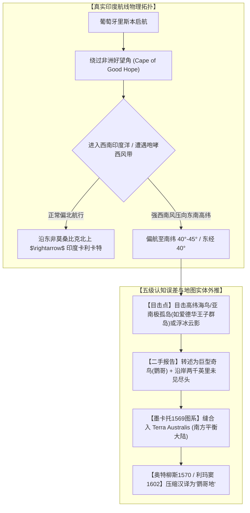

# 三更道场 · 认识论总纲与文献学法医审计（卷六十三）
## 鹦哥地考辨：西南印度洋航路幽灵目击、墨卡托图系谱系迁移与假想大陆外推法医审计

---

### 卷首法医综述

在 16 世纪世界地图编纂史与《坤舆万国全图》文献考证中，“鹦哥地”（Psittacorum Regio / Land of Parrots）的地理定性长期存在重大的认知混淆。

常见的一种推论预设了**“鹦哥地＝澳大利亚”**的前提，进而推导出“葡萄牙人混淆了菲律宾/印尼海域与好望角海域”、“在四千公里外肉眼遥望陆地”等错位假设。

**【本卷法医核心判词】**：
1. **彻底解耦“鹦哥地＝澳大利亚”的后验等式**：在 16 世纪欧洲制图学谱系中，鹦哥地自始至终被锚定在**好望角东南方、西南印度洋（约南纬 40°–45°、东经 40° 附近）**，属于葡萄牙人开往印度卡利卡特（Calicut）航线南侧的假想大陆北缘，绝非东南亚/澳洲海域的坐标错置。
2. **还原航海文本的句法与物理场景**：“佛郎机商曾驾船过此海，望见鹦哥地，未就舶”系指**“船只航行穿过该高纬海域过程中目击陆影，未曾靠岸”**，而非“站在非洲海岸极目远眺数千公里”。
3. **厘清五级连续认知误差与错误资本化链条**：从西南印度洋的高纬风暴偏航、海鸟/浮冰/云雾目击，到“沿岸航行两千英里不见尽头”的夸大报告，再到墨卡托“南方必有平衡大陆”的哲学模型缝合，最终由利玛窦压缩汉译入图。这是一起极其典型的**“孤立可疑目击 $\rightarrow$ 实体定性错误 $\rightarrow$ 理论模型几何外推 $\rightarrow$ 错误资本化为大陆资产”**的认知生成案。

---

### 一、 鹦哥地在 16 世纪地图谱系中的真实航路坐标



#### 1. 墨卡托 1569 年世界地图原注对照
墨卡托（Gerardus Mercator）在 1569 年大地图《Nova et Aucta Orbis Terrae Descriptio ad Usum Navigantium Emendata》中，于非洲东南方的南方大陆北突处明确标注拉丁文长注：

> *“Psittacorum regio a Lusitanis huc appulsis, cum Calicutium peterent, ob incredibilem earum avium ibidem magnitudinem dicta, qui cum littus ad 2000 milliarium spatium legerent, neque tamen finem invenirent, continentem esse non dubitarunt.”*
> 
> **［译文］**：“鹦哥地，系葡萄牙人前往卡利卡特途中被风驱驰至此，因当地此种鸟类体型惊人而得名。水手沿岸航行达两千英里之久，仍未寻得其尽头，故深信此地必属一大洲陆地无疑。”

#### 2. 文献学证据链质证
* **航线物理闭环**：葡萄牙船从里斯本绕过好望角前往印度西海岸卡利卡特，必经西南印度洋。若遭遇狂暴的西南大风（咆哮西风带 Roaring Forties），极易被吹向南纬 40°–45° 的亚南极高纬海域。
* **无坐标漂移**：墨卡托图上该标注与非洲南端清晰并列于同一经度扇区，没有任何证据表明此段记录是从菲律宾、马尼拉或摩鹿加群岛方向“误植”或“漂移”而来。

---

### 二、 语法场景与物理视界解耦

#### 1. 中文题跋语法误读之澄清
* **利玛窦《坤舆万国全图》注记**：
  > “佛郎机商曾驾船过此海，望见鹦哥地，但未就舶。其地广袤，莫知所穷。多有鹦哥，大如雀甖，因名焉。”
* **场景还原**：
  * “过此海”：指船队航行穿行于非洲以南至极南大陆之间的这片大洋海域（即图上标注的“利未亚海”与南方大陆之间的水域）；
  * “望见……未就舶”：指在波涛汹涌的高纬航道中，水手在甲板上瞭望到陆地或岛屿轮廓，但由于海况凶险、无天然锚地而未能靠岸登陆。
  * **结论**：不存在所谓“在非洲大陆本土隔着 4000 公里肉眼望见南极”的荒谬场景，这是完全符合 16 世纪航海日志表述规范的目击记录。

#### 2. 实体识别错误的病理剖析
在高纬大洋航行中，“坐标大体准确，实体识别完全错误”是航海早期的普遍常态：
1. **视错觉与气象物候**：南印度洋高纬海域常见冰山、层积云（造成假陆地海市蜃楼）以及亚南极海岛（如爱德华王子群岛 Prince Edward Islands、克罗泽群岛 Crozet Islands 区域）；
2. **海鸟误认**：高纬海域分布着巨型信天翁（Albatross）与巨鹱（Giant Petrel），翼展可达 3 米以上。经由缺乏动物分类学训练的水手口耳相传，被二手游记作者浪漫化为“大如雀甖”的巨型异鸟（鹦哥）；
3. **“两千英里未见尽头”的尺度放大效应**：在缺乏经度时钟的推测航行（Dead Reckoning）中，狂风恶浪下的顺风漂移往往导致船员对航程产生严重的高估；当沿途不断遭遇浮冰带或海雾障壁时，极易将其误判为“绵延数千英里的连续大陆海岸”。

---

### 三、 知识谱系的迁移与资本化流程

```
［谱系迁移脉络］
早期航海零散传闻（16世纪初葡萄牙好望角漂航记录）
   │
   ▼
约翰内斯·舍纳（Johannes Schöner, 1515/1523 地球仪）/ 奥龙斯·菲内（Orontius Fineus, 1531）
   │ ── 将南方假想陆块实体化
   ▼
格哈杜斯·墨卡托（Gerard Mercator, 1569 世界地图）
   │ ── 在西南印度洋正式落款拉丁文“Psittacorum Regio”及2000英里航行注记
   ▼
亚伯拉罕·奥特柳斯（Abraham Ortelius, 1570 《寰宇大观》）
   │ ── 继承墨卡托图式，普及至欧洲出版界
   ▼
利玛窦 & 李之藻（Matteo Ricci & Li Zhizao, 1602 《坤舆万国全图》）
   │ ── 汉译并压缩为“鹦哥地”小注，镶嵌于墨瓦蜡泥加大版块北缘
```

#### 会计审计学定性：
这笔资产在 1602 年的入账性质应当严格定义为：
**【外来二手航海传闻经多道编译、错置放大并强行缝合进预设理论模型的“严重失真资产”】**。

* 它不是为了迎合明朝宣纸留白而临时胡编的产物（有明确的欧洲上游谱系）；
* 它不是跨半球错位移植的澳大利亚（坐标自始至终在西南印度洋）；
* 它更不是史前高维测绘的南极基岩（完全是早期水手在西南风暴中的误认与哲学脑补）。

---

### 四、 审计结论与认识论通则

1. **纠正考据假定**：历史考据必须紧扣原始文本与当时制图学的真实坐标体系，严禁使用后世地名（如“鹦哥地＝澳洲”）强行倒推前人的航海意图。
2. **揭示制图学的“模型吞噬实测”机制**：
   16 世纪欧洲制图学最大的结构性弱点，不是“完全没有实测”，而是**“用强大的哲学先验模型（陆地对称平衡说），将一切微小、模糊、错误的实测碎片无限放大并吞噬进假想大洲”**。
3. **法医文献学终审**：
   “鹦哥地”之谜的破译，再次确证了《坤舆万国全图》南半球版块是人类近代航海在黑暗探索期所留下的**“经验泡沫与理论外推标本”**。它真实、粗糙、充满逻辑自洽的误解，而这恰恰是文明演进最真实的足印。

---
*法医官署名：三更道场·认识论总纲编纂委员会*  
*法务审计状态：考据闭环·正式入档（卷六十三）*
