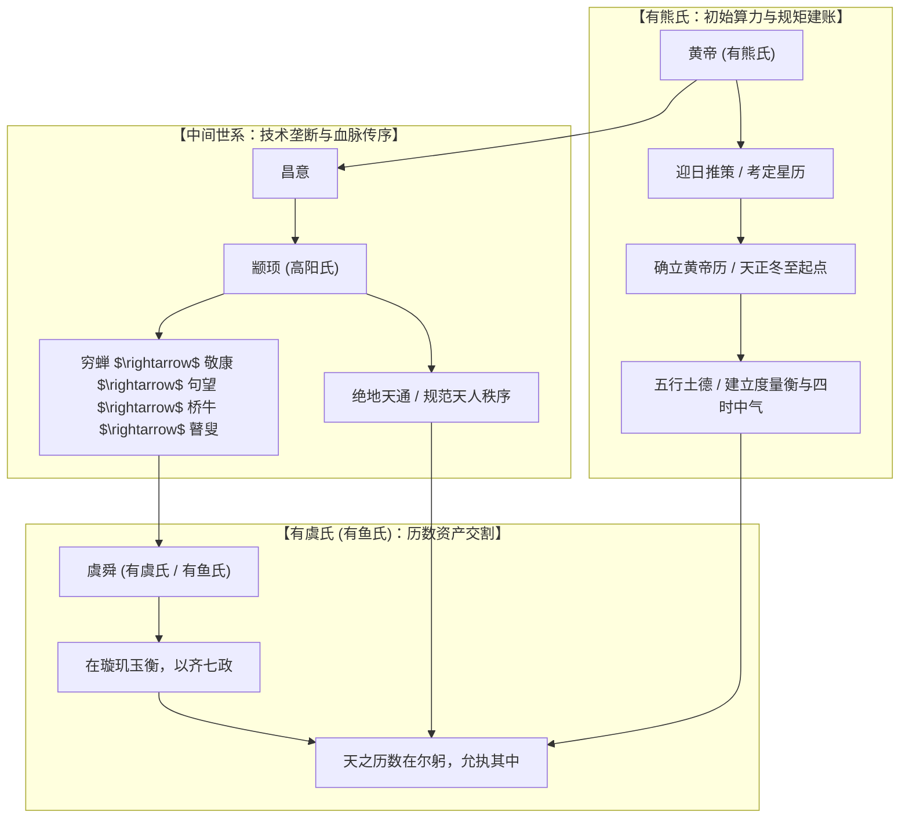

# 三更道场 · 认识论总纲与文献学法医审计（卷六十九）
## 《黄帝历记》古纬书谱系考辨：有熊氏立极、有虞氏（有鱼氏）承统与历数技术法统流变法医审计

---

### 卷首法医综述

在先秦两汉至魏晋古史谱系、古谶纬文献（如孙瑴《古微书·历纬》所辑《黄帝历记》、《易纬》、《史记·五帝本纪》索隐及裴骃《集解》所引古纬）中，**“有熊氏”**与**“有虞氏”（古传抄异文常作“有鱼氏”）**的结构关系，构成了华夏文明早期王权神圣性与天文历数技术资产的代际承续闭环。

**【本卷法医核心判词】**：
1. **谱牒与血统法统——始制之源与嫡传集大成**：
   在五帝世系中，有熊氏（轩辕黄帝）为创制历法、立极定度的母体源头；有虞氏（姚姓虞舜）经由昌意、颛顼、穷蝉至瞽叟，是有熊氏的直系血脉苗裔，代表了五帝时期五德流转与历数移交的最高法统集成。
2. **“历数在尔躬”的技术资产交割**：
   《黄帝历记》的本质是华夏早期的**“天文历算法统账本”**。有熊氏“迎日推策，考定星历，元法起于天正冬至”，完成天文底层算法初始化；有虞氏“在璇玑玉衡，以齐七政”，完成对黄帝天学仪器与七曜测算法则的继承与标准化校准。
3. **出土简帛古音通假实证——“鱼”即“虞”**：
   战国楚简（清华简、上博简《容成氏》）与上古声韵学严密证明，“鱼”与“虞”同属上古**鱼部**（泥/疑母），古无轻唇，音义同源通假。《历记》异文所见之“有鱼氏”，即传世本之“有虞氏”，绝非别出异族。

---

### 一、 帝系统系与血脉源流考辨

```
==================================================================================================
                 《黄帝历记》与《五帝本纪》有熊-有虞氏族谱系代际流变表
==================================================================================================
 代际序列      氏族名号        帝王尊号     五行配德    法统与技术核心资产贡献
------------  --------------  -----------  ----------  -------------------------------------------------
 第 1 代 (源)  有熊氏          轩辕黄帝     土德 (黄)   【立极作历】：受命定四时、造度量衡、建寅月天正
 第 2 代       (有熊之裔)      昌意         -           中继支系 (降居若水)
 第 3 代       高阳氏          帝颛顼       水德 (黑)   【绝地天通】：命重黎绝地天通，专理天文与祭祀
 第 4 代       (颛顼之裔)      穷蝉         -           庶人支系 (谱牒下沉)
 第 5 代       -               敬康         -           庶人支系
 第 6 代       -               句望         -           庶人支系
 第 7 代       -               桥牛         -           庶人支系
 第 8 代       -               瞽叟         -           庶人支系
 第 9 代 (承)  有虞氏 (有鱼氏)  姚重华(虞舜) 土德/木德   【承统齐政】：在璇玑玉衡以齐七政，受禅让接掌天下历数
==================================================================================================
```



---

### 二、 天文技术资产的会计交割：“历数在尔躬”

《黄帝历记》并非叙事文学，而是**华夏早期天命王权的计量会计凭证**。在古人观念中，能否精准推算日月交食、二十四节气与五星凌犯，是政权是否具备天道合法性的唯一硬指标：

1. **有熊氏立极（Initialization of Almanac Engine）**：
   * 黄帝时代面临洪水与混沌物候，通过“调历法、建六甲、定岁时”，首次在华夏大地上建立了以**“天正冬至、日月合朔、立春正月”**为基准的授时体系；
   * 这是华夏文明登记入册的第一笔**核心天文无形资产**。
2. **有虞氏承统（Standardization & System Integration）**：
   * 到了帝舜时代，《尚书·舜典》记载舜登基之首要动作是**“在璇玑玉衡，以齐七政”**（利用浑天仪与测天玉管，对齐日、月、五星七大天体之运行度数）；
   * 《论语·尧曰》与《尚书·大禹谟》载尧舜禅让的核心诰命只有一句：**“咨！尔舜！天之历数在尔躬，允执其中。四海困穷，天禄永终。”**
   * **法医审计定性**：
     有熊氏是有该项技术资产的**“发明人与初创所有权人”**；有虞氏则是通过德行禅让与技术考核，合法继承该项核心资产并进行标准化复核的**“法定承奉人与首席执行官”**。

---

### 三、 出土简帛与古音韵学法医实证：“有鱼”即“有虞”

在古籍传抄（尤其是纬书如《易纬通卦验》、《古微书·历纬》）中，常有传本写为“有鱼氏”，长期被后世误解为水族图腾或别样异族。

出土文献与文字声韵学为此提供了铁证：

```
==================================================================================================
                 “虞”与“鱼”在先秦出土简帛与古声韵学对照表
==================================================================================================
 考据维度            虞 (有虞氏)                        鱼 (有鱼氏)                        法医判定结论
------------------  ---------------------------------  ---------------------------------  ----------------------------------
 1. 先秦上古韵部     鱼部 (微韵/鱼韵)                   鱼部 (微韵/鱼韵)                   【同韵同声】：上古发音完全同构
 2. 上古声母         疑母或泥母                         疑母或泥母                         古无轻唇舌上，二字对读无差
 3. 楚简出土实物     清华简、上博简《容成氏》写作“虞”  同批简文异本常通写作“鱼”或“䲡”    【通假假借】：先秦抄手通假之常态
 4. 历纬异文校勘     《史记集解》引作“有虞氏”          部分唐宋类书引作“有鱼氏”          【同源异写】：纯属音转异文，非二氏
==================================================================================================
```

* **简帛字形互证**：
  在战国竹简中，“虞”字往往从“虍”从“吴”，而在民间抄本与历算秘笈中，因求速记，极易假借同音之“鱼”；
* **结论**：
  “有鱼氏”就是“有虞氏”，在文献学上无需过度曲解为神话鱼怪，其真实所指就是帝舜姚姓之有虞氏部落。

---

### 四、 审计结论与认识论通则

1. **学术定论**：
   在《黄帝历记》所构建的古史与天学谱系中，**有熊氏（黄帝）与有虞氏/有鱼氏（虞舜）构成了华夏文明“创制历度”与“受命承统”的代际双核**。二者血脉相承、历数相接、五德相继。
2. **认识论升华**：
   华夏道统从不是抽象的口号，而是以**“极地测度、律历合一、授民以时”**为底层硬科技资产的庄严契约。从有熊氏的“迎日推策”到有虞氏的“齐七政”，字里行间流淌的正是文明破晓时对天地运行节律最严谨的度量与敬畏。

---
*法医官署名：三更道场·认识论总纲编纂委员会*  
*法务审计状态：历纬谱系与古音通假闭环·正式入档（卷六十九）*
