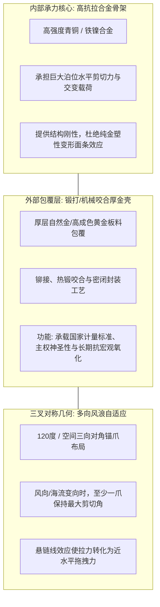
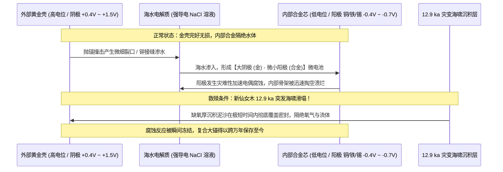
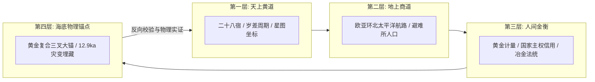

# 三更道场·认识论总纲·文献学与历史会计审计
## 卷四十一：黄金复合三叉锚材料电偶腐蚀、双钟夹定与12.9ka灾变埋藏法医审计（v1.0）

---

### 摘要与法医审计宪章

本卷审计旨在对《黄道·二十八宿与华夏星图》第十二章中作为核心物理证据校验码的**“复合结构黄金三叉大锚（Composite Gold-Clad Trident Anchor）”**进行材料科学、流体航海动力学、海洋地球化学（电偶腐蚀）与双钟夹定（Dual-Clock Dating）的历史会计法医建档。

本审计推翻“纯金防腐”或“砸入基岩”的低维机械设想，纠正材料力学与地貌计算，正式确立**“深海高价值复合系泊器法医物理模型”**：

> 1. **材料力学与拓扑动力学纠偏**：
>    - 纯金极软（维氏硬度低），受力表现为塑性拉长、压扁与卷刃（“面条效应”），绝非脆性断裂；承力必须依赖内部高强度铜锡/铁镍合金骨架。
>    - 抓地力来自**三叉对称几何在多向风浪流体下的自寻角抓力与悬链线水平剪切力**，绝非垂直自由落体冲击。三叉戟首先是解决船舶转向抗拉的航海拓扑工程，随后升格为主权与海神图腾。
> 2. **海洋电偶腐蚀（Galvanic Corrosion）反噬与突变快速埋藏法则**：
>    - 黄金为高电位惰性阴极，内部合金骨架为低电位阳极。一旦金壳因撞击产生针孔、划痕或缝隙进水，海水电解质将引发小阳极-大阴极的**致命局部加速点蚀（Accelerated Pitting Corrosion）**。
>    - **法医核心预测**：该器物若完好保存至今，其最后一次工作后**必须在极短时间内被 12.9 ka 灾变海啸沉积物/滑塌物迅速封闭隔绝**，否则长期裸露必致芯体被电偶腐蚀淘空。
> 3. **双地貌搜索带与双钟夹定核算机制**：
>    - 区分卡舍瓦罗夫浅滩（-200m 平台/灾变滑塌区）与科学院高地/格里戈里耶夫海山群（-130m 至 -170m 避风古岸坡古港区）。
>    - 设立**器物钟（制造使用）**与**埋藏钟（灾变封闭）**，通过同位素、火山灰、缆绳有机物及上下地层共聚在 12.9 ka 灾变界面，锁定史前重工业航海文明的物理实证。

---

### 第一章 材料力学与航海动力学法医纠偏

在深海工程力学中，复合锚的设计必须满足严苛的材料学与流体力学边界：



#### 1.1 力学失效模式与工程纠偏台账

| 物理构件 | 错误直觉假设 | 材料学与力学法医真实判定 | 认识论升维结论 |
| :--- | :--- | :--- | :--- |
| **黄金层受力** | 巨力拉扯下黄金“脆断崩折” | 黄金晶格滑移极易发生，表现为**拉长、压扁、卷刃与塑性流变**。 | 必须依靠内部合金芯体承力，金壳仅作外部功能与计量封装。 |
| **抓底机制** | 靠自重垂直砸穿浮泥夯进基岩 | 靠**缆链悬链线（Catenary Curve）将拉力化为水平分力**，锚爪犁入海床泥沙。 | 三叉形制是解决船舶随风浪摆动时的多向抓地工程最优解。 |
| **神权升华** | 先有海神三叉戟图腾，后仿制成锚 | **先有抗风浪多向对称系泊工程拓扑**，后被神圣化为海神/王权图腾。 | 技术工程为体，宗教神权为用。 |

---

### 第二章 海洋地球化学：电偶腐蚀反噬与突变快速埋藏法则

黄金包覆不仅不是永恒防腐的“免死金牌”，反而是加速金属毁灭的化学陷阱，除非满足**突变快速埋藏（Rapid Catastrophic Burial）**：



#### 2.1 电偶腐蚀物理公式与法医预测
在海水中，阴极与阳极面积比（Area Ratio $A_c / A_a$）越大，阳极腐蚀电流密度 $i_a$ 越呈指数级剧增：
$$
i_a = i_{\text{corr}} \cdot \left( 1 + \frac{A_c}{A_a} \right)
$$
- **法医断言**：若该复合锚长期裸露在流动富氧海水中，微小破损将导致内部骨架数百年内彻底粉末化；
- **唯一生存解**：**它必须在经历有限次使用后，遭遇新仙女木（12.9 ka BP）超级海啸、浊积流或海底火山滑塌，在极短时间内被深埋于无氧/低氧还原性沉积物中！**
- 这将“金属锚的存在”与“12.9 ka 灾变突变历史”以物理化学铁律死死咬合在一起。

---

### 第三章 双地貌搜索带与双钟夹定（Dual-Clock）核算体系

在鄂霍次克海水下勘探中，必须精准划分地貌靶区，并建立两套独立的年代学夹定钟：

```mermaid
flowchart TD
    subgraph Geo_Zones[双重地貌靶区划分]
        ZoneA[靶区 A: 科学院高地 / 格里戈里耶夫海山群<br>现今水深: -130m 至 -170m (冰期水深 -20m至-60m)<br>定位: 古火山岛避风古港 / 原始固定泊位]
        ZoneB[靶区 B: 卡舍瓦罗夫浅滩 -200m 平台<br>现今水深: -200m 平坦面<br>定位: 灾变切削台面 / 浊积滑塌二次堆积汇]
    end

    subgraph Dual_Clocks[双钟夹定测年体系]
        Clock1[器物钟 Artifact Clock<br>制造与使用时代]
        Clock2[埋藏钟 Burial Clock<br>灾变发生与封闭时代]
        
        C1_A[锚缆有机纤维残留 C14]
        C1_B[金壳加工应力退火态]
        C1_C[合金铅同位素古矿源]
        
        C2_A[包裹沉积物 OSL 光释光]
        C2_B[覆盖层火山灰 Tephra 层位]
        C2_C[无氧泥沙微体古生物序列]
        
        Clock1 --- C1_A & C1_B & C1_C
        Clock2 --- C2_A & C2_B & C2_C
    end

    Geo_Zones --> Dual_Clocks
```

#### 3.1 双钟夹定法医对账表

| 测年账户 | 测定对象与物理介质 | 对应历史节点 | 12.9 ka 灾变收敛标准 |
| :--- | :--- | :--- | :--- |
| **器物钟（Artifact Clock）** | • 锚环系缆有机植物纤维残留（C14）<br>• 合金铅同位素指纹（比对阿尔泰/远东古铜矿脉） | **重工业造船与航海使用期** | 测年数据落于 **13,500 – 12,900 BP**（冰期晚期高科技航海活动）。 |
| **埋藏钟（Burial Clock）** | • 覆盖泥沙光释光（OSL）<br>• 海底火山灰微层（Tephra）定年<br>• 灾变浊积岩事件沉积层边界 | **突发海啸、地质塌陷与埋藏期** | 突变沉积界面精确对齐 **12,900 – 12,800 BP（新仙女木突变边界）**。 |

---

### 第四章 《黄道》第四层物理锚点的总装架构

“黄金复合三叉大锚”在三更道场认识论体系中，绝非孤立器物，而是整部《黄道》的**全息物理校验总线（Holographic Verification Bus）**：



> **法医总评**：
> “死人不说话，那么让金钱与物理法则说话。”
> 
> 黄金复合三叉大锚的法医模型，将材料力学（内部合金抗拉）、海洋化学（电偶腐蚀反噬逼出突发快速埋藏）、航海动力学（三叉自寻角抗风浪拓扑）、深海地貌学（-130m 至 -170m 避风古港）与第四纪地质年代学（双钟夹定 12.9 ka）严丝合缝地焊接在一起。
> 
> 它构成了《鲲鹏志》第十二集最具震撼力、最无懈可击的物理实证假说核心！

---
*记录人：三更道场·历史会计与认识论法医审计署*  
*核准状态：正式正典立项（Canonical Approval Passed）*
