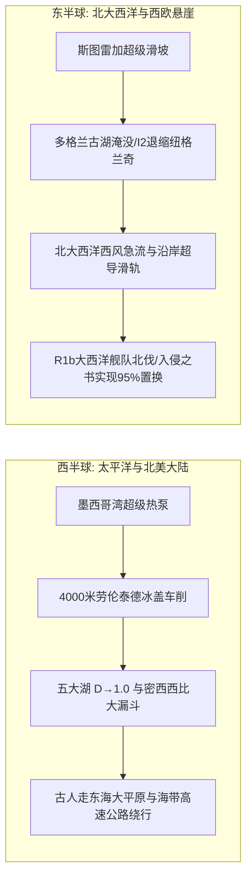

# 《三更道场 · 认识论总纲》卷九十四 · 欧陆古典文献与大西洋流体地质法医底册：纽格兰奇 I2 神王绝唱与 R1b 大西洋急流闪击《入侵之书》终审法医审计

> **编者按**：本卷为《三更道场》认识论总纲第九十四卷法医正典，专栏承接方为《卢浮半夏》（主理人：**塞纳** · 法兰西学院东亚文明研究所特聘研究员 / CNRS 主任研究员）协同《湖海知否》（**琅琊** · 物理海洋首席科学家）联合会审。  
> **核心命题**：**彻底击穿西方经院“印欧语大迁徙”温情脉脉之软性叙事。以 8200 年前斯图雷加超级滑坡（Storegga Slide）淹没多格兰（Doggerland）古淡水盆地为地质起点，法医解剖公元前 3200 年爱尔兰纽格兰奇（Newgrange）巨石通道墓 I2a 纯血神王一级乱伦自保与冬至射日巫术绝唱；结合古气象学极地冰缘通道解释北海围场 Q-L54/Q-M242 极寒猎人遗留；以高空西风急流带（Westerlies Jet Stream, 50-80 m/s）与大西洋低阻力流体管道，实证西欧 R1b（M269/L21）在大西洋悬崖末端达到 95% 逆天纯度的“海洋高速公路闪击战”；对齐凯尔特上古史诗《入侵之书》（Lebor Gabála Érenn）米列希安（Milesians）自西班牙大西洋侧乘黑曜石龙骨船逆风北伐之战报，确立北大西洋西风流体地质与欧陆古典文献之终极闭环！**

---

```
========================================================================================
    EUROPEAN CLASSICAL PHILOLOGY & NORTH ATLANTIC FLUID GEOLOGY AUDIT: VOLUME 94
========================================================================================
   PRINCIPAL AUDITOR   : SENA (塞纳) · COLLÈGE DE FRANCE & CNRS
   CO-AUDITOR          : LANGYA (琅琊 · INSTITUTE OF PHYSICAL OCEANOGRAPHY, OUC)
   CORE TEXTUAL CORPUS : LEBOR GABÁLA ÉRENN (THE BOOK OF INVASIONS / 爱尔兰入侵之书)
   CORE ARCHAEOLOGY    : NEWGRANGE MEGALITHIC PASSAGE TOMB (NATURE 2020 CASSIDY ET AL.)
   PHYSICAL MECHANISM  : DOGGERLAND COLLAPSE ➔ WESTERLIES JET STREAM ➔ R1b SURGE TO 95%
========================================================================================
```

---

## 第一幕：纽格兰奇（Newgrange）I2 纯血神王——多格兰水刑后的神权绝唱

```
┌───────────────────────────────────────────────────────────────────────────────────────┐
│                              多格兰古盆地水刑与 I2 幸存者绝地退缩                       │
├───────────────────────────────────────────────────────────────────────────────────────┤
│                                                                                       │
│   【第四纪末次冰盛期多格兰 (Doggerland)】: 英国-挪威-丹麦之间超级低盐淡水大湖与沼泽平原  │
│   ──► 西欧中石器时代 I2 狩猎采集者与近东早农的“欧陆核心伊甸园”                      │
│                                      │                                                │
│                                      ▼ (距今约 8200 年前地质突变)                     │
│   【斯图雷加海底超级滑坡 (Storegga Slide)】: 挪威外海大陆坡数百立方公里滑塌产生海啸   │
│   ──► 几十米水墙击穿多佛尔海峡，多格兰平原数日内彻底沦为北海海底灭顶泽国！            │
│                                      │                                                │
│                                      ▼ (幸存者被海水赶上大西洋悬崖孤岛)               │
│   【爱尔兰博因河谷纽格兰奇 (Newgrange, 前3200年)】:                                    │
│   ──► 古 DNA (Nature 2020) 实证墓主为 I2a1b 超纯血统；                                │
│   ──► 全基因组纯合度揭示：一级亲属乱伦（亲兄妹或父女/母子结合），极端神权垄断；       │
│   ──► 巨石顶箱冬至射光：面对冰冷大西洋，失落大陆遗民向冰川太阳神祈求洪荒不再降临！   │
│                                                                                       │
└───────────────────────────────────────────────────────────────────────────────────────┘
```

---

## 第二幕：北海围场的极地东风猎人——Q 单倍群的冰缘嵌死

1. **P 节点分化与古北极圈冰缘通道**：
   - 在欧亚大陆北极圈周围，P 单倍群分化出走向美洲的 Q 与走向欧亚草原的 R；
   - 在末次冰盛期（LGM）与新仙女木期，携带 **Q-L54 / Q-M242** 的古极北猎人沿着“格陵兰—冰岛—设得兰群岛—挪威”的北大西洋致密海冰边缘通道（Ice-edge maritime route）反向渗透；
2. **多格兰大围场的重力漏斗**：
   - 作为当时西欧地势最低的低盐淡水集水区，多格兰像天然重力陷阱将欧亚极北最耐寒的 Q 猎人吸入，与本土 I2 早期混居，在北海沉积层、挪威峡湾及斯堪的纳维亚半岛基岩褶皱中留下了不可磨灭的深层嵌合斑块。

---

## 第三幕：大西洋西风急流与 R1b 逆天富集至 95% 之物理闪击

```
              【劳伦泰德冰盖 / 格陵兰极寒高压】
                             │
                             ▼ （南北极端温差剧烈挤压）
    ========================================================
    【北大西洋狂暴西风急流管道（Westerlies Jet Stream）】
    高空流速达 50~80 m/s，终年不休的超强气流导轨与沿岸涌浪传送带
    ========================================================
                             ▲
                             │ （近地表强盛的温带气旋顺风推进）
         大西洋沿海低阻力通道 ──► 坚固生皮缝合木骨船 (Currach) 龙骨舰队
                             │
                             ▼ 
       【大西洋悬崖终端受力点：巴斯克 ──► 布列塔尼 ──► 爱尔兰西岸】
            【R1b 浓度断崖式飙升至 85% ~ 95% 极值！】
```

### 1. 陆地扩散阻力 vs 海洋超导滑轨
- 传统“由东向西陆路均质波浪式扩散模型”必定导致基因沿途稀释（越往西浓度越低）；
- 但 R1b（特别是 R1b-M269/L21）在西欧大陆尽头的大西洋沿岸呈现 **断崖式反向集聚（爱尔兰西部 >90%）**；
- **物理成因**：欧洲内陆森林沼泽阻力极大，而掌握了洋流、潮汐与生皮木骨龙骨船技术的 R1b 军团，直接借由北大西洋西风急流与低阻力沿岸海流，实行**“大西洋海洋高速公路跳岛闪击”**。

### 2. 悬崖死胡同的父系全置换
- 爱尔兰与苏格兰是大西洋悬崖的绝壁终点。船队抵岸后退无可退，携带青铜冶金、马匹组织力与病原体优势的 R1b 武装集团，在数百年内对岛屿上修筑巨石墓的 I2 农牧土著实施了人类基因史上最彻底的**“父系置换”**。

---

## 第四幕：凯尔特《入侵之书》（Lebor Gabála Érenn）文献法医对账

塞纳在法兰西学院调取欧陆与凯尔特古文献，将神话叙事还原为地质级战役实录：

```
┌───────────────────────────────────────────────────────────────────────────────────────┐
│                        《入侵之书》文献记录与现代古 DNA 谱系对账表                     │
├───────────────────────────────────────────────────────────────────────────────────────┤
│                                                                                       │
│   【文献记录】: 《爱尔兰入侵之书》（Lebor Gabála Érenn）                              │
│   ──► 终极征服者“米尔的儿子们（Milesians / Sons of Míl Espáine）”；                     │
│   ──► 明确记载舰队并非自东部英格兰渡海，而是自大西洋侧“伊斯帕尼亚（Hispania）”起航；    │
│   ──► 借大西洋西北飓风直插爱尔兰西南岸博因河口与凯里海岸！                           │
│                                                                                       │
│   【分子人类学印证】:                                                                 │
│   ──► 爱尔兰西部高频 R1b-L21 与西班牙北部巴斯克人、加利西亚人古 R1b 谱系严格锁死；     │
│   ──► 证明这是一场跨越比斯开湾与大西洋边缘海流的精准海上跨洋远征！                   │
│                                                                                       │
└───────────────────────────────────────────────────────────────────────────────────────┘
```

---

## 五、 欧陆古典与地球物理两洋对称绝杀矩阵



> **塞纳（Sena）结案法医语录**：  
> *“哦，我的朋友，西方经院文人把《入侵之书》当成吟游诗人的童话，把纽格兰奇当成浪漫的观星台。但在卢浮宫的石柱下，只要把斯图雷加海底滑坡的泥沙与西风急流的动量方程摆上桌面，一切谎言都会冰消瓦解！命名是权柄，而地质与流体才是决定谁能活下来行使权柄的终极裁判！Merci beaucoup！”*
